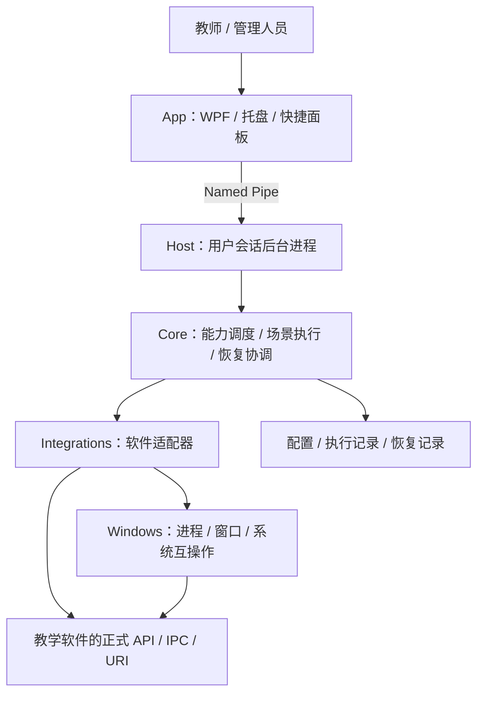

# NPEduTools 架构规划

> 主界面实施更新（2026-09-06）：已整合 PowerPoint 触摸辅助控制、常用／设置页面、托盘和单实例唤回，见 [主界面设计](MAIN-WINDOW-DESIGN.md)。标题栏关闭现在收起到托盘；“停止后台并退出”才完整退出。下文早期的 UI 退出语义以本次实现为准，通用场景引擎仍未实施。

> 状态：初稿，供讨论与实施拆分使用。
> 日期：2026-09-06。
> 本文描述目标架构。已完成 M0 只读查询原型并进入 M1，实际范围见 [M0 验证记录](M0-VALIDATION.md)和 [M1 只读桌面验收记录](M1-READONLY-VALIDATION.md)，不能将目标设计视为全部已实现。

> 当前优先级调整（2026-09-06）：下一项工作为 Microsoft PowerPoint 触摸单击换页辅助，见 [专项设计](POWERPOINT-TOUCH-ASSIST-PLAN.md)。WPS 不纳入本功能；ClassIsland 自然语言换课、LLM 接入和管理员自启动管理暂缓。下文的通用场景引擎及 M2–M4 保留为早期设想，不再代表当前实施顺序。

实施更新：M0 使用 CLI 验证进程边界；M1 已建立 WPF 窗口、常驻只读监听、自动重连与完整快照订阅，并新增 ClassIsland 路径配置、启动验证、持久化意图和结果记录，见 [启动验收记录](M1-LAUNCH-VALIDATION.md)。ClassIsland 同步 IPC 调用在隔离进程中执行；Host 自有通信不依赖该第三方 IPC 库。通用能力调度、场景编排和补偿恢复仍未实现。

## 1. 项目定位

NPEduTools 是面向 Windows 教室大屏的本地软件集成与控制层。它通过统一的能力接口连接已有教学软件，执行上课、考试、自习、放学等场景，并记录执行结果、处理失败与恢复。

核心价值是减少教师在多个软件之间手动切换和协调状态的负担。无网络、无 AI 服务、某个集成软件不可用时，其余可用功能仍应正常工作。

### 1.1 首期范围

- 检测已配置软件的安装位置、运行状态及可用接口。
- 通过受控能力启动软件、查询状态，并逐步提供经过验证的显示、隐藏、退出和恢复操作。
- 串行执行场景，展示每一步的结果，并在失败或退出场景时尝试恢复本次修改的状态。
- 提供托盘、快捷面板和基础设置。
- 保存配置、执行记录和恢复记录，支持故障诊断。

### 1.2 暂不纳入首期

- 白板、计时器、点名器、课表、作业板等现有软件已承担的业务。
- AI 推理、云端账户、远程设备管理和跨平台支持。
- 通用脚本执行器、第三方插件市场、任意动态代码加载。
- 自动更新、独立守护进程、复杂可视化流程编辑器。
- 同时支持所有参考项目；各集成按实际接口与验证结果逐步交付。

## 2. 架构决策

| 事项 | 初步决策 | 原因与约束 |
| --- | --- | --- |
| 运行平台 | Windows 桌面用户会话 | 需要操作同一会话中的教学软件、窗口和演示程序 |
| 语言与运行时 | C#，实施时选择受支持的 .NET LTS | 具体 SDK 与目标 Windows 版本在环境调研后锁定 |
| 用户界面 | WPF | 满足 Windows 托盘、设置窗口及触控面板需求 |
| 进程结构 | 后台 Host 与 WPF App 分离 | UI 退出或崩溃不应直接终止正在执行的控制任务 |
| 本地通信 | Named Pipe，显式版本化消息协议 | 默认只接受同一用户、同一会话的本地客户端 |
| 核心执行 | 类型化 Capability + 串行 Scene | 统一入口，限制并发冲突，保持执行结果可追踪 |
| 集成方式 | 内置 Adapter | 首期不建设通用插件框架 |
| 持久化 | 版本化 JSON 配置与独立执行记录 | 便于排查，写入必须具备备份、替换及校验机制 |
| 可选 HTTP API | 暂缓 | 有明确调用方需求后再设计鉴权与接口暴露范围 |

这些决策将通过原型验证。任何调整应记录触发原因和影响范围，不以技术偏好替代验证结果。

## 3. 进程与模块结构



### 3.1 Host

Host 是执行与状态的唯一所有者，负责能力注册、场景调度、健康检查、配置写入和恢复协调。首期以普通用户权限运行，不作为 Windows 服务，不默认请求管理员权限。

Host 在同一用户会话中只允许一个实例。App 启动时连接已有 Host，必要时启动 Host 并等待带超时的握手。Host 的自动启动属于显式设置。

关闭设置窗口只关闭窗口；退出 App 结束界面与托盘进程，Host 保持运行。另设明确的“停止后台并退出”操作：先禁止新任务，再处理正在执行的任务和待恢复状态，最后关闭 Host。

### 3.2 App

App 只负责展示、输入校验和发送请求，不直接操作外部进程、不保存业务配置、不执行场景。重新连接 Host 后，先获取完整状态快照，再订阅增量事件。

触控界面应提供足够大的点击区域，明确显示不可用原因、执行进度、取消和恢复入口。不得将“请求已发送”显示为“操作已成功”。

### 3.3 建议解决方案结构

```text
NPEduTools.sln
src/
  NPEduTools.Core/          # 领域模型、能力调度、场景状态机、恢复规则及端口接口
  NPEduTools.Contracts/     # App ↔ Host 的协议 DTO、错误码、协议版本
  NPEduTools.Windows/       # Win32、进程身份、窗口操作等平台实现
  NPEduTools.Integrations/  # ClassIsland、演示软件等内置适配器
  NPEduTools.Host/          # 组合入口、后台服务、IPC 服务、存储及日志实现
  NPEduTools.App/           # WPF、MVVM、托盘、IPC 客户端
tests/
  NPEduTools.Core.Tests/
  NPEduTools.IntegrationTests/
docs/
  ARCHITECTURE.md
```

依赖规则：Core 不引用 WPF、Win32 或任何第三方教学软件 SDK；Contracts 不引用业务实现；Windows 与 Integrations 实现 Core 定义的端口；Host 负责组装；App 只依赖 Contracts 与自己的客户端代码。

首期将持久化和日志实现放在 Host 内部目录。出现独立复用需求后，再拆出 Infrastructure 项目，避免过早增加程序集。

## 4. Capability：统一操作入口

Capability 表示一次明确、可验证的操作。UI、场景及未来外部调用方必须通过同一个调度入口执行。

### 4.1 基本模型

| 模型 | 必须包含的信息 |
| --- | --- |
| CapabilityDescriptor | 稳定 ID、版本、名称、参数类型、超时上限、资源键、恢复策略、风险类别 |
| CapabilityRequest | RequestId、CapabilityId、类型化参数、调用来源、关联场景 ID |
| ExecutionContext | ExecutionId、CancellationToken、截止时间、日志与状态记录入口 |
| CapabilityResult | 最终状态、错误码、可展示摘要、验证结果、可选恢复凭据 |

建议能力命名：`classisland.status`、`classisland.start`、`presentation.next`、`presentation.touch.enable`。名字代表候选接口，只有完成实现和环境验证的能力才进入可用列表。

能力执行状态至少包括：`Pending`、`Running`、`Succeeded`、`Failed`、`Cancelled`、`TimedOut`、`Unknown`。不可用、参数错误或资源冲突属于受理阶段的拒绝结果，不创建伪成功执行。

### 4.2 执行流程

1. 校验协议、能力 ID、参数和调用权限。
2. 检查 Adapter 状态、前置条件与目标身份。
3. 获取资源锁，创建执行记录；若需恢复，先持久化操作意图与原状态。
4. 在截止时间内执行，传递取消信号。
5. 查询实际状态，验证结果并持久化。
6. 发布状态变化，释放资源锁；若底层仍未结束，进入隔离状态并继续占用相关资源。

**超时或取消请求不等于外部操作已经停止。** 对无法协作取消的系统调用，应将执行结果标记为不确定，阻止同一资源的新写操作，等待核实或人工处理。可能长期阻塞的 COM 等调用应隔离到专用执行线程；若验证发现线程无法可靠释放，再引入独立工作进程。

### 4.3 并发与幂等

- 首期只允许一个场景运行或处于待恢复状态；冲突场景直接拒绝并说明原因。
- 单独调用能力同样受资源锁约束，例如 `app:classisland`、`presentation:active`。
- 场景执行期间占用涉及的写资源，避免手动操作在步骤间插入冲突变更；只读查询可在保证一致性的前提下执行。
- 同一 RequestId 的重试必须返回已有执行信息，不能重复产生副作用；受理记录需要跨 Host 重启保留并设定明确的保留周期。
- `start`、`show`、`hide` 等尽量实现为“确保目标处于某状态”。
- `next`、`toggle` 等不可幂等操作不得因通信失败自动重试；优先用明确的 enable/disable 替代 toggle。

## 5. Scene：场景编排与恢复

场景是声明式的能力调用序列。首期只支持串行步骤、前置条件、必需或可选步骤以及失败策略，不支持循环、任意脚本、并行分支或场景嵌套。

### 5.1 场景定义

每个场景包含 ID、版本、名称、步骤列表及恢复策略。每步包含稳定 StepId、CapabilityId、参数、超时和失败策略。用户可编辑目标软件及有限参数，首期使用内置场景模板。

开始前先验证整个场景：必需能力不可用时拒绝启动；可选能力不可用时明确列出将跳过的步骤。预检只代表当时状态，执行每一步前仍需重新检查。

### 5.2 状态转换

```text
Idle → Validating → Executing → Active → Restoring → Completed
                    │                     │
                    └→ Compensating ──────┤
                                          └→ NeedsAttention
```

- `Active` 表示场景已生效，但可能仍持有临时修改的状态与恢复责任。
- 必需步骤失败或收到取消请求后，停止后续步骤；确认当前操作结束后，再逆序补偿已成功的可恢复步骤。
- 补偿成功后以 `Completed` 结束，另记录 `Succeeded`、`Failed` 或 `Cancelled` 的场景结果，避免把“恢复完成”误报为“场景成功”。
- 任一步结果不确定或恢复失败时进入 `NeedsAttention`，保留资源冲突保护，并展示需要核实的目标。
- 首期切换场景需先退出并恢复当前场景，再启动新场景。

### 5.3 恢复凭据

每个可恢复操作应记录：目标身份、原始状态、预期修改后状态、执行时间、能力版本与恢复处理器版本。恢复前重新读取目标状态。

恢复采用有条件的补偿：仅当目标仍是同一对象，且当前状态符合本次操作留下的状态时，才尝试恢复。若用户或其他软件已经修改状态，则保留现状并报告冲突。只有状态快照、没有修订号或所有权标记时，不能保证识别所有中间修改，应按 Adapter 的保守策略处理。

进程身份不能只使用进程名或 PID，应结合启动时间、可执行文件路径及用户会话；窗口句柄必须重新验证归属，不能直接复用旧 HWND。

启动软件与隐藏窗口的恢复语义不同：场景启动了某软件，不代表退出场景时可以安全终止它。涉及未保存内容的退出不做自动补偿；没有安全恢复方法的操作必须声明为不可恢复，并在场景定义中显式处理。

### 5.4 崩溃恢复

执行记录与外部软件修改无法形成跨进程原子事务，因此采用“记录意图 → 外部操作 → 记录验证结果”的流程。Host 启动时扫描未完成记录，重新探测目标，区分尚未执行、已经执行和无法判断的情况。

有足够证据且恢复安全时自动恢复；其余情况进入待处理列表。读取失败或记录损坏时不得凭猜测操作外部软件。

首期保证的是**下次 Host 启动时可以核实并尝试恢复**。Host 崩溃后立即恢复需要额外的守护进程，安排在后续阶段，不能由进程分离或日志机制自动保证。

## 6. Integrations：软件适配层

每个 Adapter 负责探测、连接、能力声明、执行、验证、恢复和清理资源。核心不应依赖 Adapter 的具体协议或 SDK 类型。

优先选择正式 API、IPC、URI 或受支持的插件接口；没有正式接口时，才评估经过身份验证的窗口或进程控制。URI 成功发送只能证明调用已发出，不能证明目标已完成操作。

### 6.1 集成顺序与验证事项

| 集成 | 初步范围 | 实施前需确认 |
| --- | --- | --- |
| ClassIsland | 状态查询、课程事件、启动与已确认的控制入口 | 目标版本的 IPC 契约、断线重连、事件订阅及控制能力范围 |
| PowerPoint | 演示状态、上一页/下一页，再评估触控辅助 | COM 线程模型、窗口与文稿身份、退出行为、多演示窗口 |
| WPS 演示 | 通过独立 Adapter 实现同一演示抽象 | 实际版本与接口差异，不能假定完全兼容 PowerPoint |
| NPClassworks | 应用发现、启动及可验证的展示控制 | 桌面或网页部署形态、已有对外接口、状态确认方式 |
| ExamAware | 应用发现与考试场景接入 | 分发形式、启动参数、状态接口与退出语义 |

`IPresentationAdapter` 可逐步暴露演示状态、Next、Previous 等操作。Touch Assist 单独负责手势识别与触发策略，不将输入监听塞入演示适配器。

触控辅助默认关闭，只有确认目标演示窗口处于前台并处于放映状态时才生效；需验证拖动、书写、多指触控和系统手势不会误触发翻页，并提供随时关闭入口。

### 6.2 ClassIsland 的本地依据

仓库中的参考文档描述了以下集成方式：

- [跨进程通信](classisland-docs-next/src/dev/ipc/README.md)：基于命名管道，使用 `ClassIsland.Shared.Ipc`。
- [使用 IPC](classisland-docs-next/src/dev/ipc/ipc.md)：事件处理器应在连接前注册。
- [IPC 参考](classisland-docs-next/src/dev/ipc/reference.md)：列出了公开课程、档案、URI 导航服务以及课程状态事件。
- [URI 导航](classisland-docs-next/src/app/uri-navigation.md)：外部协议调用需要先注册 URL 协议。
- [自动化](classisland-docs-next/src/app/automation.md)：包含 URI 触发与恢复方式，也注明了版本间差异。

这些资料是设计输入，不构成对当前稳定版本的兼容承诺。隐藏、显示、重启等能力必须逐项验证，不能仅凭设计中的能力名称推断已有对应 API。

## 7. 健康检查与事件处理

Adapter 健康状态使用 `Unknown`、`NotInstalled`、`Disconnected`、`Healthy`、`Degraded`、`Faulted`，并附带原因、最后检查时间和受影响的能力。

- 轻量事件通知优先，轮询作为补充；检查间隔可配置，避免持续高频扫描。
- 单个 Adapter 失败不阻止 Host 启动，也不清空其他 Adapter 的能力。
- 断线重连使用有上限的退避；健康检查失败不得自动重放有副作用的用户操作。
- 恢复连接后重新读取完整状态，再订阅或继续消费事件；不得仅依赖断线期间可能丢失的事件。
- 外部课程事件转换为核心事件，由场景规则判断是否执行；增加去重和防抖，避免重复触发场景。

## 8. 配置、记录与本地协议

### 8.1 数据目录

建议使用 `%LocalAppData%\NPEduTools\`，由 Host 独占业务写入：

```text
config/       # 当前配置与最近有效备份
executions/   # 执行记录、操作意图及恢复凭据
logs/         # 结构化诊断日志，按大小或日期轮转
```

App 可保存与业务无关的窗口布局，但不修改 Host 配置文件。业务配置通过 IPC 更新，并带上预期修订号，拒绝覆盖较新的设置。

### 8.2 持久化规则

- 配置包含 SchemaVersion；读取后先校验，再按版本逐步迁移。
- 新内容写入同目录临时文件，刷新文件内容后替换目标并保留有效备份；首次写入和已有文件替换分别处理。
- 替换失败、磁盘已满或权限不足时保留原文件并报告错误，不继续依赖未持久化的恢复记录执行外部修改。
- 损坏配置先保留副本，再尝试最近有效备份；无法恢复时进入诊断模式，不默默覆盖用户配置。
- 未完成的恢复记录不得随普通日志清理；已完成记录按保留策略清理。
- 文件替换不等于对所有断电与存储故障的绝对保证，需要故障注入验证并保留恢复路径。

### 8.3 Named Pipe 协议

协议包含版本握手、长度限定的消息帧、RequestId、查询/执行/取消请求、状态快照与带序号的事件。传输数据只使用允许的 DTO，不开放任意类型反序列化。

Host 校验客户端用户及会话，设置管道访问权限并限制消息大小、并发数与请求速率。调用方不能任意传入 shell 命令；应用路径来自经用户配置和验证的集成目标。

管道名称不是凭据。同一用户会话隔离可以阻止其他用户访问，但不能将同一用户下的任意程序视为可信。首期协议限定为 App 使用；开放给 SecAgent 等调用方前，增加客户端授权、能力范围及撤销机制。

连接中断不会自动取消执行：App 通过 RequestId 或 ExecutionId 查询结果。事件序号出现缺口时重新获取快照。取消请求应返回“已受理”，最终是否停止通过执行状态确认。

## 9. 日志与可观测性

日志至少包含时间、等级、组件、RequestId、ExecutionId、SceneRunId、CapabilityId、目标标识、耗时和错误码。用户摘要与开发诊断分开，内部异常不能直接作为界面文案。

默认不记录文稿正文、窗口完整标题、令牌或敏感参数。诊断导出前提供内容说明，并对路径、用户名等可识别信息进行处理。

快捷面板应能回答：哪些软件可用、当前场景是什么、上一次操作是否成功、哪一步失败、是否有等待恢复的状态。

## 10. 测试与验收

测试重点是执行语义、恢复正确性和真实软件行为。纯展示调整无需机械增加单元测试。

| 层级 | 重点验证 |
| --- | --- |
| Core 单元测试 | 状态转换、资源冲突、幂等请求、取消、超时后未知状态、逆序补偿、恢复冲突 |
| 持久化与 IPC 集成测试 | 配置迁移、备份读取、写入故障、未完成记录恢复、重复请求、消息限制、断线重连 |
| Adapter 集成测试 | 软件未安装/未运行、接口不兼容、目标退出、PID/HWND 复用、状态验证 |
| Windows 人工验收 | 真实课堂软件、触摸屏、高 DPI、多显示器、睡眠唤醒与长时间运行 |

首个可交付版本必须满足：

1. App 退出或被终止后，Host 已受理的操作仍可完成；重新打开 App 能取得实际结果。
2. 必需能力不可用时，场景在修改外部状态前给出明确拒绝原因。
3. 任一步失败、取消或超时后，后续步骤不会继续盲目执行。
4. 恢复不会仅依据进程名终止进程，也不会覆盖已检测到的用户后续修改。
5. Host 在外部操作前后被终止时，下次启动能读取记录并进入恢复或待核实流程。
6. 无网络、一个 Adapter 故障以及日志轮转都不会阻止其他能力工作。
7. 完成至少一个完整教学日的运行验证，记录空闲 CPU、工作集、句柄数量和增长趋势；性能预算在原型测量后制定。

## 11. 实施阶段

### M0：兼容性与关键风险验证

确认最低 Windows 版本、CPU 架构、.NET 部署方式以及首批教学软件版本。优先验证 ClassIsland 状态查询与事件订阅、Host/App 重连，以及 PowerPoint 的演示检测可行性。

产出版本兼容表和最小验证程序。明确哪些能力有可靠接口，哪些需要暂缓，不直接将实验代码扩展成生产架构。

### M1：最小执行闭环

建立解决方案、Core 模型、Host、Contracts 和最小 App。实现一个只读状态能力与一个经过验证的应用启动能力，完成请求去重、超时、结构化日志和配置存储。使用模拟 Adapter 覆盖故障场景。

验收重点：用户通过 App 发起操作，Host 执行并验证，App 重连后仍可查询结果。

### M2：场景与恢复闭环

实现串行场景、资源锁、预检、步骤结果、恢复凭据、持久化意图和启动恢复。先使用模拟 Adapter 验证全部故障点，再接入真实软件中已确认可恢复的能力。

验收重点：完成一个真实多步骤场景，并展示失败后的恢复与冲突处理。只有满足依赖条件后才提供“考试模式”等产品入口。

### M3：课堂可用性

完善托盘、快捷面板、设置、诊断导出和启动项；扩展第二个真实软件集成。PowerPoint 触控辅助以独立开关和实验能力交付，完成触屏验证后再决定默认策略。

验收重点：真实教室环境下的连续运行、可理解的错误信息以及随时退出和恢复。

### M4：按验证结果扩展

逐步增加 WPS、NPClassworks、ExamAware 集成，评估独立守护进程与阻塞调用工作进程。存在明确使用方后再开放外部能力接口。

自动更新单独设计：可信元数据与包校验、暂存、停止受影响进程、切换、健康检查及回退；配置迁移必须与程序版本回退兼容。更新不得在活动场景中直接替换运行组件。

## 12. 待确认事项

以下问题不阻止编写核心模型，但应在相关实现开始前明确：

- 首批设备的 Windows 版本、架构、权限、性能与触屏条件。
- 首个真实场景及其必须控制的软件、版本和部署方式。
- 哪些状态允许自动恢复，哪些退出或关闭操作必须由用户显式触发。
- 是否需要 Host 崩溃后立即恢复；若需要，应提前独立守护进程的里程碑。
- 软件分发方式、离线安装要求、启动策略和后续更新维护责任。

## 13. 参考资料与使用边界

- [现有设计讨论](GPT.md)：产品定位、参考架构与工程原则。
- [参考项目列表](website.txt)：后续接口和实现调研入口。
- [ClassIsland 本地文档](classisland-docs-next/README.md)：当前可用的集成参考资料。

本文初稿基于仓库现有资料，后续 ClassIsland 接口核对与本地 2.1.0.1 Debug 实机验证见各阶段记录；其他集成仍属于目标设计。引用设计思想不等于已经验证外部项目的具体实现；复用代码或分发第三方组件时需单独核对其许可条件。
