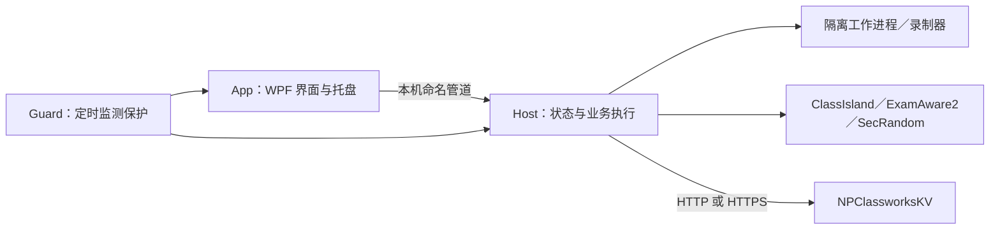

# NPEduTools 当前架构

[文档首页](README.md) · [构建与调试](DEVELOPMENT.md) · [学校互联](npep/README.md)

本页按仓库现有模块整理，核对日期为 2026-10-07。早期的通用场景引擎、AI 接入等目标不作为已实现功能；原文保存在[2026-09-06 架构规划](archive/development/ARCHITECTURE-20260906.md)。

## 进程与通信

```mermaid
flowchart LR
    App["App：WPF 界面与托盘"] -->|"本机命名管道"| Host["Host：状态与业务执行"]
    Host --> Workers["隔离工作进程／录制器"]
    Host --> Software["ClassIsland／ExamAware2／SecRandom"]
    Host -->|"HTTP 或 HTTPS"| School["NPClassworksKV"]
    Guard["Guard：定时监测保护"] --> App
    Guard --> Host
```

| 模块 | 负责什么 | 代码入口 |
| --- | --- | --- |
| App | 首次协议确认、OOBE、主窗口、侧边栏、托盘、学校通知和定时监测页面 | [启动](../src/NPEduTools.App/App.xaml.cs)、[主窗口](../src/NPEduTools.App/MainWindow.xaml.cs) |
| Host | 组合录课、噪音、软件连接、课堂模式和学校互联服务；提供本机管道 | [服务组合](../src/NPEduTools.Host/Program.cs) |
| Core | 录制、计划、模式切换、执行记录和恢复等本机业务 | [Core](../src/NPEduTools.Core) |
| Contracts | App／Host 的类型化消息与状态结构 | [Contracts](../src/NPEduTools.Contracts) |
| Integrations | 各软件的连接与 NPEP 网络会话 | [ClassIsland](../src/NPEduTools.Integrations.ClassIsland)、[NPEP](../src/NPEduTools.Integrations.Npep)、[SecRandom](../src/NPEduTools.Integrations.SecRandom) |
| Recorder | 独立录制进程及包内 FFmpeg／ffprobe | [Recorder](../src/NPEduTools.Recorder) |
| Guard | 受保护定时监测的独立恢复与退出协调 | [Guard](../src/NPEduTools.Guard) |
| ClassIsland.Admin | Windows 管理员任务与权限操作 | [Admin](../src/NPEduTools.ClassIsland.Admin) |
| CLI／PowerPoint 工具 | 命令行探针、触摸翻页及诊断 | [CLI](../src/NPEduTools.Cli)、[触摸辅助](../src/NPEduTools.PowerPoint.Assist)、[诊断](../src/NPEduTools.PowerPoint.Diagnostics) |

## 关键执行边界

- **权限与协议**：正常应用启动先请求提权；协议确认在主窗口构造、Host 启动和学校轮询之前。不要沿用旧规划中“Host 必定普通权限”的描述，单独启动与测试入口须按实际进程核查。
- **本机通信**：App 通过命名管道与 Host 交换消息。Host 为第三方同步 ClassIsland IPC 使用隔离工作进程，限制外部调用卡住主业务的影响。
- **学校互联**：Host 持有网络会话并处理轮询、状态、请求与回执；浏览器通过 KV 管理设备，不直接调用桌面命名管道。各通道遵守对应协议和生命周期。
- **模式与录课**：服务共用运行操作门禁，考试切换协调保存录制、软件、自启动和自动录课暂停；同一请求的执行记录用于恢复和去重。详见[考试用例](npep/EXAM-MODE-OVERVIEW.md)。
- **噪音**：本机采集与分析，上传统计报告和必要状态；不上传原音频。手动监测与学校排程的退出、保护语义不同。
- **后台生命周期**：隐藏窗口不等于停止后台。受保护定时监测期间，退出需要管理验证；Guard 仅保护实际定时采集，不承担手动监测保护或任意进程保活。

## 软件桥接与部署单元

ClassIsland 提供时间、课表及课程接口；ExamAware2 桥接提供状态、退出、自启动和方案校验／放映；SecRandom 使用其内置 IPC，不需额外插件。插件包与本体分开维护，见 [ClassIsland 插件](../plugins/NPEduTools.ClassIsland.Bridge/README.md)和 [ExamAware2 插件](../plugins/npedutools-examaware-bridge/README.md)。

App 构建复制 Host、Guard、Admin、Recorder 等所需目录；交付包再加入运行时、录制组件、插件与源码材料。单独复制 App EXE 不构成完整应用。[安装说明](INSTALLER.md)和[第三方材料](THIRD-PARTY-MATERIALS.md)说明发行边界。

具体实现是否通过验收，应读[测试入口及范围](TESTING.md)，再核对受测提交、报告和设备。架构说明不作为发布或现场验收证明。
