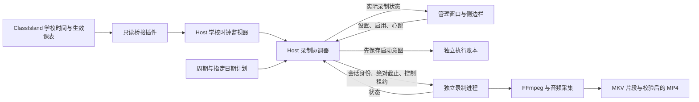

# 自动录课 P3：真实录制、执行记录与截止保护

实施日期：2026-09-19。承接 [P2 计划与预演](AUTO-RECORDING-PLANS.md) 和 [完整实施规划](CLASSISLAND-RECORDING-BRIDGE-PLAN.md)。本轮已经将周期规则、指定日期计划接入独立录制器，开发机短课录制与故障测试通过；教室大屏整课验收仍属于 P4。

后续交付：已完成 [P4 配套试用包及真实 ClassIsland 短录联调](PORTABLE-RELEASE-VALIDATION.md)。本文保留 P3 的实现时点及测试结果；大屏现场验收仍未完成。

## 1. 现在如何使用

1. 启动 ClassIsland，并启用配套 `npedutools.recordingbridge` 0.2.0.0。当前核对对象仍为 ClassIsland 2.1.0.1，具体插件安装与时间验证见 [桥接报告](CLASSISLAND-RECORDING-BRIDGE-P0.md) 和 [P2 报告](AUTO-RECORDING-PLANS.md)。
2. 运行 `scripts/start-app.ps1`，在“录制微课”中选择屏幕、画质、帧率、音源、保存目录，点击新增的“保存设置”。这个按钮只保存设置，不开始采集。
3. 打开“自动录课计划”，保存周期规则、指定日期安排，检查默认排除、冲突和学校日期。未来课表仍标记为预计，只有当天实时安排进入执行器。
4. 可以先“启动预演”核对时刻。预演与实际录制拥有独立开关、记录及去重标记，预演不会生成视频，也不会消耗真实录制机会。
5. 核对后点击“启用自动录制”。后台检查学校时间、屏幕、音源、目录写权限和剩余空间。随后按计划等待，不需要每节再次点击开始。
6. 侧边栏显示自动录制状态、下一项安排、活动会话最长剩余时间，可暂停、继续、停止保存或今天不再自动录制。计划页“实际录制记录”显示结果与文件位置。
7. 完整退出应用会停止新任务并等待当前视频保存；重新启动后自动开关保持关闭，需要重新核对并启用。收起管理窗口不等于退出应用，后台仍会按计划运行。

自动模式使用**启用时读取的已保存录制设置**。修改设置后，请停用再启用自动模式使其生效；当前会话的音源、画质不在中途切换。

课程默认窗口仍是 ClassIsland 学校时间的课前 2 分钟到课后至多 5 分钟。这里的课前 2 分钟由课表时间计算，**尚未接入真实“二分钟铃”事件**，不能保证和额外自定义铃声逐次一致。固定时间段按用户指定的完整区间执行，不另加课前/课后余量，也不套用科目排除。

## 2. 进程职责



手动录制也交给同一个 Host 协调器。App 只提供控件、状态显示和设备探测，不再直接拥有录制子进程。录制器保留原有进程隔离、音频链路、分段与恢复能力；本轮没有换用 C30 私有组件，也没有修改 ClassIsland 的实际课表。

关键实现：

| 文件 | 职责 |
| --- | --- |
| `src/NPEduTools.Host/RecordingService.cs` | 单一会话、自动调度、手动仲裁、预检、状态持久化 |
| `src/NPEduTools.Host/RecorderProcess.cs` | 有界进程通信、状态接收和控制续租 |
| `src/NPEduTools.Core/RecordingExecutionLedger.cs` | 启动意图、结果、学校当天暂停与重启去重 |
| `src/NPEduTools.Contracts/RecorderDeadline.cs` | 身份匹配、绝对截止与不可复活的过期租约 |
| `src/NPEduTools.Recorder/Program.cs` | 独立截止监视、失联收尾与超时退出 |
| `src/NPEduTools.App/RecordingClient.cs` | Host 客户端、界面心跳、带会话身份的操作 |
| `src/NPEduTools.App/AutoRecordingWindow.Execution.cs` | 自动开关、实际记录、结束本节和今天不录 |

Host 构建输出增加 `Recorder/` 运行目录，App 复制完整 Host 产物；App 自己的录制器副本仍供设备探测。发布打包沿用项目依赖与复制流程，本轮未重新制作正式便携发布包。

## 3. 时间及截止规则

**日历判断只使用 ClassIsland 时间。** 今天、星期、开始时刻、课后边界和“今天不录”均不借用系统日期。缺少有效时间时不回退到 Windows 时钟。

开录前把“计划结束学校时刻 − 当前学校样本 − 样本年龄”转换为单调绝对截止。此后：

- 暂停不会延长截止；恢复时根据原截止重新计算本段最大剩余时长。
- 学校时间回拨不会增加预算；向前调整或课表提前结束只允许缩短。
- 桥接失联时禁止新任务，已开录会话仍受原截止约束。
- 日期跳变需重新核对；后台调度循环发生超过 5 秒的异常停顿后停用自动模式。
- 新任务必须有新鲜、正在前进的学校时间；课表任务另外要求当天、启用、有效的日程。无课表时仍可执行固定时间段。

| 保护层 | 本轮取值与作用 |
| --- | --- |
| App → Host 心跳 | 约 2 秒一次，12 秒未续约后停用自动模式并结束活动会话；手动会话也有所属 App 的失联保护 |
| Host → Recorder 租约 | 约 2 秒续约，8 秒未续约后录制器自行收尾；过期租约不能被迟到消息复活 |
| Recorder 独立监视 | 约 100 ms 检查截止/租约，在命令队列之外请求停止 |
| 采集兜底 | 到期后 2 秒仍未结束时终止编码采集进程，不等待被阻塞的录制命令锁 |
| 编码时长 | 每段 FFmpeg 带剩余时间限制，准备和暂停的时间不重新计入预算 |
| 收尾上限 | 约 3 分钟后结束无响应工作进程并保留已写片段；不把失败收尾声称为保存成功 |

“截止”约束的是采集期限，MP4 合并、校验及保存发生在其后。线程调度与设备响应存在延迟，不承诺毫秒级首帧/末帧或故障下零超时。

### 与原规划的计时细化

原规划对跨进程计数采取保守表述。本轮仅在**同一台 Windows、同一次启动的 Host/Recorder**之间传递 `Stopwatch.GetTimestamp()` 对应的绝对 QPC 截止值。Windows 文档说明同机 QPC 可跨线程/进程比较；±1 tick 的次序歧义远小于这里的检查周期。跨机器、跨系统重启、不同来源的计时值不能混用，账本中的旧计数也不会用于恢复截止。依据：[Microsoft：获取高分辨率时间戳](https://learn.microsoft.com/zh-cn/windows/win32/sysinfo/acquiring-high-resolution-time-stamps)。

ClassIsland 桥接样本仍通过年龄、序号和实例校验消费，不把桥接端的任意单调计数当 Host 时间。物理休眠/恢复尚需在目标大屏验证。

## 4. 执行与手动录制的关系

| 情况 | 实际行为 |
| --- | --- |
| 启用前设备缺失、目录不可写或空闲不足 512 MB | 拒绝启用并说明原因；这只是启动门槛，不是整课容量保证 |
| 到点时有手动会话或上一会话仍在收尾 | 本项记为已跳过，不抢占、不等空闲后突然补开 |
| 没进入正式结束时间，但已经错过课前窗口 | 可以在课中开始；正式时段结束后不只补录课后余量 |
| 任务窗口冲突 | 不开始；正式时段结束后记录冲突结果 |
| 已开录后删除规则、停用课程或更换相关档案 | 停止本节，保留处理标记；改早结束只缩短期限 |
| 自动录制中用户按停止 | 保存并结束本节，不因仍在时间窗口中而重复开始 |
| 已处理课程被临时改名/换层 | 同档案正式时段重叠沿用标记，不按名称生成第二次录制 |
| 迟到的旧停止、暂停或继续命令 | 校验 owner、occurrenceId、sessionId，拒绝影响后来开始的会话 |
| 管理自动模式的 App 身份已变化 | 旧管理客户端不能停用或跳过新客户端持有的自动任务 |

“本日录制/本日不录”修改单日计划；“预演：跳过/结束选中节”只影响模拟；“结束本节/跳过下一项”与“今天不再录制”影响真实执行。界面已区分这些入口。

## 5. 独立执行账本与恢复

正式 Host 默认保存位置为 `%LocalAppData%/NPEduTools/config/recording-executions.json`。私有测试端点使用自己的数据目录。UI 计划仍在 `%LocalAppData%/NPEduTools/ui/<管道哈希>.recording-plans.json`，两者各自负责配置与执行历史。

本轮选择版本化 JSON 整体事务：写临时文件 → Flush(true) → 同目录原子替换；单个 Host 串行写入。没有新增 SQLite 依赖。启动必须先成功提交 Starting 及 session ID，才发送录制命令；落盘失败不会开始采集。

实际状态为 Starting → Recording ↔ Paused → Finalizing → Recorded，另有 Skipped、Missed、Conflict、Failed、Interrupted。只有录制器确认 MP4 保存并校验后，才能记 Recorded；预演的“应开始”不能作为成功证据。

启动时将遗留的未完成状态记 Interrupted，不重新发 Start。即使 Host 被强制结束后录制器独立保存成功，重启后的账本也暂时保守显示“中断待检查”；本轮**没有自动扫描输出并重新确认成功**。用户可根据保留目录和视频检查结果，不需要通过删除账本来恢复片段。片段恢复方式见 [微课录制说明](MICROLESSON-RECORDING.md)。

自动视频采用 `自动微课-<sessionId>.mp4`，学校日期显示在执行记录中；手动文件命名沿用原行为。片段 `session.json` 带会话控制元数据，便于关联。

账本最多 4096 项、4 MiB，不循环删除旧去重标记；达到上限时拒绝新自动录制。格式损坏/未知版本保留原文件并停用自动模式。界面返回最近至多 20 项，状态响应额外限制字节大小。归档、按日期检索和显式重试入口尚未实现；请勿手动删除账本来“清历史”，那会丢失防重记录。

## 6. 本轮验证证据

测试使用私有学校时间（2031-04-07）、私有管道和本测试创建的绘图窗口。未调整系统时间，未更改用户真实 ClassIsland 配置；实际采集测试均关闭麦克风和系统音频，只采集测试窗口。

| 验证 | 结果 |
| --- | --- |
| 锁定依赖还原与 Release 编译 | 通过，0 警告、0 错误 |
| 全量 .NET 测试 | 258/258 通过，包括新增截止/租约、账本恢复、去重隔离和协议校验 |
| 短课程实际录制 | 按学校日期执行；暂停后回拨 120 秒仍按原截止结束；MP4 完整解码通过 |
| 重启防重与手动优先 | 重启后开关关闭，重新启用也不重录；手动占用跳过；旧 Stop 无法停止新手动会话 |
| Host 被强制结束 | 录制器独立完成视频；重启标 Interrupted，不重复开录 |
| App 不再心跳 | Host 仍运行时停用自动模式并结束会话 |
| 启动账本写入失败 | 没有新采集会话，自动模式停用，原记录保留 |
| 控制管道保持打开但不续租 | 8 秒租约到期后录制器自行保存，无需 Host 的 Stop |
| 实际 WPF 自动流程 | 保存设置不采集；启用、侧边栏暂停、到期保存、实际记录与学校“今天不录”通过，视频完整解码 |
| 原手动 WPF 流程 | 实际开始、隐藏窗口、侧边栏暂停/继续/停止与退出前保存通过，两个视频完整解码 |
| 计划预演 WPF 回归 | 14 项通过，覆盖学校日期、未来查询、覆盖与冲突、迁移、损坏文件和不启动采集进程 |

核心真实录制证据：`.artifacts/automatic-recording/0d4527f71f114d8fa6d51f5dd28af29e/summary.json`，含 7 组检查及 5 个视频路径。

WPF 自动流程证据：`.artifacts/automatic-recording-ui/7cb2e3d941c8470abe5ad9bc57a50dd2/summary.json`，同目录包含管理页、侧边栏和实际记录截图。检查截图后补充明确了预演文案，避免把“预演未启动”误读为所有录制都停止。

手动录制回归：`.artifacts/recording-ui/5dfa5549829548f79b16381a8b7c7ff3/summary.json`。计划预演回归：`.artifacts/auto-recording-ui/6187fc17f6214bf2a42a44190efd489f/summary.json`。全量测试记录：`.artifacts/test-results/prototype.trx`。证据目录属于本地测试产物，不作为源码提交内容。

复现（实际采集测试须串行，录制器有单实例保护）：

```powershell
./scripts/verify.ps1
python ./scripts/test-automatic-recording.py
./scripts/test-automatic-recording-ui.ps1
./scripts/test-recording-ui.ps1
./scripts/test-auto-recording-ui.ps1
```

## 7. ClassIsland Docs 对照及下一步

继续遵守本地 [IPC 参考](classisland-docs-next/src/dev/ipc/reference.md) 的公开能力边界，以及 [插件入口](classisland-docs-next/src/dev/plugins/plugin-base.md) 的注册方式。只读桥接负责时间与日程，录制控制仍在 NPEduTools；本轮没有增加 ClassIsland 写入服务。此前真本体读取验证属于 P0/P1/P2，本轮采集使用模拟上游，不能把二者相加声称已完成教室全链路验收。

接下来进入 P4 准备：制作带桥接插件的配套包、明确安装/更新/回退步骤，再在 i7-1065G7 核显大屏测试单节与连续多节。至少记录 CPU/内存/磁盘增长、实际首末帧、音画同步、暂停恢复、ClassIsland 退出重连、物理休眠、应用退出保存，以及普通/管理员运行组合。

当前尚未完成：真实学校二分钟铃绑定、提前 10 秒可取消提醒、执行账本归档与显式重试、复杂多周/临时层的完整兼容矩阵、目标大屏整课与物理音频验证。短录与完整解码证明这条执行链已可运行，尚不能证明已解决该大屏所有长期录制假死问题。
