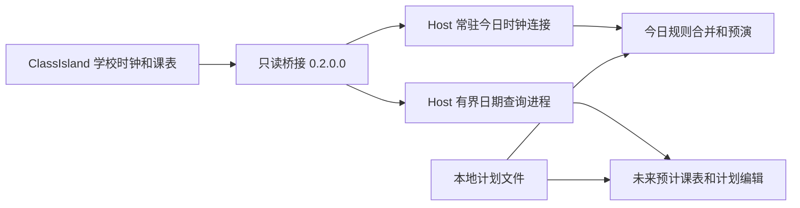

# 自动录课：未来日期、周期与指定日期计划

实施日期：2026-09-19。承接[详细规划](CLASSISLAND-RECORDING-BRIDGE-PLAN.md)及[学校时钟预演](CLASSISLAND-SCHOOL-CLOCK-PREVIEW.md)，本轮实现 P1 的有限日期查询和 P2 的多类计划预演。真实自动采集仍属于下一阶段，当前不会因为保存计划而录屏或录音。

后续更新：已实现 [P3 真实录制、执行记录与截止保护](AUTO-RECORDING-EXECUTION.md)。本文保留 P2 时点的实现和验证记录；实际录制需要单独点击“启用自动录制”，保存计划本身仍不触发采集。

## 1. 本轮可用功能

| 功能 | 当前行为 |
| --- | --- |
| 周期性录课 | 多条每周规则，可设置生效起止日期；跟随课表或指定完整固定时段 |
| 规划录课 | 保存明确年月日；今天、明天、后天均以 ClassIsland 日期计算；单日课程覆盖及固定时段 |
| 未来课表 | 查询学校今天至第 30 天，标注“预计课表，到当天重新核对” |
| 默认排除 | 用户指定的全部 17 项，完整名称匹配、括号归一、档案内科目 ID 绑定 |
| 单日覆盖 | 本日录制、本日不录、恢复继承；可显式关闭当天周期规则，只执行明确安排 |
| 冲突 | 同一课程多规则合并；不同余量要求复核；固定时段重叠不启动 |
| 暂停 | 学校今天不再预演，或暂停至指定学校日期（包含该日） |
| 迁移 | 原规则备份后迁为停用草稿，保留原筛选；不会自动启用预演 |

入口仍是主窗口“自动录课计划”和侧边栏“今日计划与预演”。具体操作见[使用说明](AUTO-LESSON-RECORDING-PREVIEW.md)。

17 项默认排除为：心理、体育、书法、体育(室内)、选修课、班会、技术、艺术、美术、音乐、物理(实验)、化学(实验)、生物(实验)、晨测、早读、午自习、报告厅活动。

课程 10:00–10:40 默认窗口仍为 **学校时间 09:58–10:45**，课后至多 5 分钟。固定时段 09:58–10:45 则原样执行，不再次增加余量。二分钟铃按上课前两分钟解释，尚不读取自定义铃声或提醒事件。

## 2. ClassIsland Docs 与源码依据

只针对当前已验证的 ClassIsland 2.1.0.1，本地源码 `15273f82`；Docs 本地副本 `6b254076`。未引用未使用旧版的内部实现。

| 依据 | 本轮采用的结论 |
| --- | --- |
| [课程服务](classisland-docs-next/src/dev/lessons-service.md) | 通过注入的课程服务读取当前课表、启用状态等，不从界面文本或倒计时反推日期 |
| [IPC 使用](classisland-docs-next/src/dev/ipc/ipc.md) | 继续使用既有 IPC provider 和生成代理，新增独立查询契约；不建立另一个录制控制接口 |
| [插件基类](classisland-docs-next/src/dev/plugins/plugin-base.md)、[依赖隔离](classisland-docs-next/src/dev/plugins/dependency.md) | 保留本体生命周期管理与共享服务类型，包内不复制本体运行时依赖 |
| [发布插件](classisland-docs-next/src/dev/plugins/publishing.md) | 使用 PluginSdk 的 CreateCipx 打包流程 |
| 本地 `ClassIsland/Services/LessonsService.cs:143` 的 `GetClassPlanByDate` | 核对实际代码：按预定临时课表、临时安排、群组及日期规则选择课表；此查询本身不赋值 `CurrentClassPlan` |
| 同文件约 553–594 行的主循环与 `CheckClassPlan` | 当前课表切换及过期临时安排清理属于主循环；NPEduTools 不调用这些修改过程、不复制选课表算法 |

Docs 的课程服务页面没有完整说明未来查询的副作用。因此“查询只读”的判断还使用了当前版本源码和真实隔离本体实验，不能仅凭方法名推断。

## 3. 数据与运行边界



保留原 `IRecordingBridgeP0` 接口标识和方法，增加 `IRecordingBridgeCalendar.GetDayAsync(yyyy-MM-dd)`，通过握手能力 `calendar-31-days` 检测支持。桥接包版本升至 **0.2.0.0**，协议仍为 v1；日期与今日流分开，不把未来查询结果写入实时学校时钟缓存。

日期请求最多排队 4 项，每 250 ms 的 UI 定时回调至多处理一项，单次异步等待上限 1.5 秒，过期请求丢弃。UI 回调只复制有界日程，IPC 异步返回独立 DTO；不在本体 UI 上等待 IPC。每日最多 64 节，响应最多 64 KiB。超过范围、繁忙、卡顿、切换中等情况明确失败，不返回伪造的空成功。

复制前后核对学校日期、档案与当前课表引用。当前 Host 的学校时钟仍使用原常驻连接；未来查询复用已有的隔离单次查询机制，启动独立短命进程，受 Host 请求期限和孤立进程 20 秒上限约束。App 同时最多一个日期查询，后台失败重试间隔至少 10 秒；用户切换日期或刷新可主动查询。旧页面或旧连接的迟到回复不覆盖新页面。

未来结果携带桥接实例、学校今天、请求日期及 `Forecast=true`；映射日程明确为 `ClockVerified=false`。仅用于编辑预览。App 每次决策只向预演器提供学校**当天**计划；无当天课表时，固定时段仍可依靠健康学校时钟预演。连接失效时不会使用系统日历接管。

## 4. 合并、覆盖与去重

1. 先按日期范围、星期、档案、科目和节次筛选周期规则，再应用默认排除与科目例外。
2. 同一课程匹配多条规则只生成一个任务，显示所有来源；余量不一致则标冲突，须统一规则或设置单日覆盖。
3. 单日 Include/Exclude 以档案、日期、节次及原正式时段绑定。原时段与新课程不重叠，或原课程消失，显示待复核，不自动转移到另一节。重叠范围内的调整跟随当前课程，并显示内容/时间变化。
4. 单日 Include 可以覆盖周期筛选及默认排除，不能绕过时钟健康、课表启用、冲突、暂停和已经完成/跳过的标记。
5. 相邻课程优先缩短前一节余量，不截断正式课时；固定时段与其他选中任务重叠，双方显示冲突，不开第二个会话。
6. 课表任务沿用同档案内正式时段重叠去重；固定任务使用规则/单次 ID 加学校日期，修改名称或时段不会让同一任务重复开始。

名单使用 Unicode 归一、首尾空白及括号周围空白归一，再做完整名称比较，不用包含匹配。识别后绑定档案内 SubjectId，保留改名后的排除；明确允许或排除优先于默认名单，设置不会跨档案套用。固定时段没有可靠科目绑定，界面明确说明不使用科目排除。

预演继续使用单调剩余上限：回拨、断线和更长新课时不能延长活动期限，更早终点可以缩短。恢复连接、换课及应用重启不清空已有预演标记。当前标记仍只是“已预演”，绝不作为未来真实录制成功凭据。

## 5. 保存与迁移

在 `%LocalAppData%/NPEduTools/ui/` 下，按 Host 管道哈希隔离：

- `.recording-plans.json` v1：最多 64 条周期规则、256 个单日固定时段、512 个课程覆盖、256 个日期策略、128 个排除名称和 1024 项科目 ID 偏好；总文件不超过 512 KiB。
- `.recording-preview.json` v2：沿用 512 个发生标记、200 条事件上限；不作为正式执行账本。
- `.recording-preview.json.pre-plan-book.bak`：首次迁移前的原文件备份。有不同的既存备份时停止迁移，避免覆盖。

保存先校验，再写临时文件并替换；界面编辑成功落盘后才交给预演。保存失败停止预演。未知版本、损坏内容及超限文件保留原文件，禁用修改和预演。旧规则不暗中添加默认排除，迁成停用草稿并提示核对；程序重启后预演开关保持关闭。

## 6. 验证证据

本次完整锁定依赖还原、Release 构建和测试：**253 项全部通过，0 警告、0 错误**。结果：[`prototype.trx`](../.artifacts/test-results/prototype.trx)。新增测试覆盖 17 项排除、名称归一、档案隔离、单日优先级、重复合并、余量冲突、课程移位/消失、固定时段、暂停、截止与去重、迁移，以及跨进程日期请求边界。

真实 WPF 验证使用私有测试管道，学校日期固定为 **2031-04-07**，故意不同于电脑日期，检查明天为 2031-04-08、后天为 2031-04-09；验证日期覆盖、固定时段冲突、周期编辑、无效输入保留、重启去重、断线、两种配置损坏及备份迁移。未产生录制器进程。证据目录：[`3a8de24c3ad34ceca66622b54a3497bd`](../.artifacts/auto-recording-ui/3a8de24c3ad34ceca66622b54a3497bd)。


真实 ClassIsland 使用私有应用副本与独立档案，**28 项检查通过**。校验今天、明天、第 30 天及越界拒绝；查询前后对比当前课表对象、临时安排、群组、预定课表和时间设置。另验证未来预定临时课表覆盖星期课表但不消耗预约、不切换当前课程；日期查询在 UI 阻塞时限时失败，恢复后重新查询；保留上一阶段校时、跨日、断线和重连检查。证据：[`summary.json`](../.artifacts/classisland-bridge/d9ce9f2ff07f4e9b867fb7f69836b845/summary.json)，同目录保留插件回复、Host 回复及进程日志。

联调中修复过 Host 未向日期查询工作进程传递日期，以及课表摘要匿名字段大小写碰撞的问题。随后完整验证通过。真实 UI 卡顿恢复检查使用阻塞后的采样序号等待新样本，避免把尚在新鲜度期限内的旧缓存误当成已恢复；WPF 测试也等待保存反馈后再读文件。一次并行验证的窗口截图枚举暂未找到窗口，未计作通过；最终上述 WPF 证据来自完整成功重跑。

复现：

```powershell
./scripts/verify.ps1
./scripts/dotnet.ps1 build tests/NPEduTools.Bridge.TestFixture -c Release
./scripts/test-classisland-bridge.ps1 -VerifyHost
./scripts/test-auto-recording-ui.ps1
./scripts/package-classisland-bridge.ps1
```

真实本体测试要求已有本地 ClassIsland Debug 构建，并在发现已运行的 ClassIsland 时停止，不占用用户正在使用的实例。测试只修改私有副本档案与校时偏移，不修改 Windows 时间或用户课表。

## 7. 桥接包与边界

配套 [0.2.0.0 插件包](../.artifacts/bridge-package/6c61d3396ae241b8934193715b4d03a5/NPEduTools.ClassIsland.Bridge.cipx)，SHA-256：

```text
F48DC2378A1DFD6809AB9215B94C60C161AFA40BAAFEB52A6F1ED27C21EFDFDC
```

包结构已检查：包含生产桥接与契约、清单、说明及许可，没有测试插件或重复的 ClassIsland/Avalonia/IPC 运行时。未自动安装到用户日常实例，也未发布市场。当前实际加载验证使用 `-epp`；插件管理器完整安装/升级/卸载流程仍属于后续分发验收。

尚不把本轮结果当作完整生产录制验收：

- 当前预演由 WPF 检查，界面卡死时只能恢复后补记结束；正式录制需要迁入 Host，并让录制器独立执行截止和控制租约。
- 首版只支持日内时段；跨午夜课程、固定时段及午夜附近跨日期提前窗口不作为已支持场景。在线日期选择与课表查询限制在学校今天起 31 天内，尚不提供更远日期的课表预览。
- 复杂多周、临时群组及临时层组合尚未完成全部实机矩阵；本轮直接调用本体选择逻辑，真实覆盖普通星期和预定临时课表，不据此声称所有组合均已验收。
- 计划保存目前是有界 JSON，预演账本也有保留上限；正式录制的事务账本、崩溃恢复、会话所有权和重复启动防护需在 P3 独立实现。
- 未做 i7-1065G7 教室大屏整课录制、物理休眠、管理员权限组合和长期负载验收。

## 8. 下一步：接入真实录制

先把调度放到 Host，建立与预演分离的执行账本，落实发生实例、录制会话及所有权校验；再把计划开始/结束接到已有独立录制器。录制工作进程必须自行限制结束时间，暂停、回拨、失联和界面退出不能无限延长。自动任务遇到手动录制占用时明确跳过，不能抢占或误停手动会话。

完成这些约束后，在私有短课表进行真实录制与故障恢复验证，最后才到目标大屏做整课及连续多课验收。
