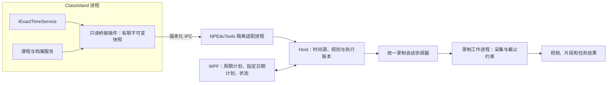
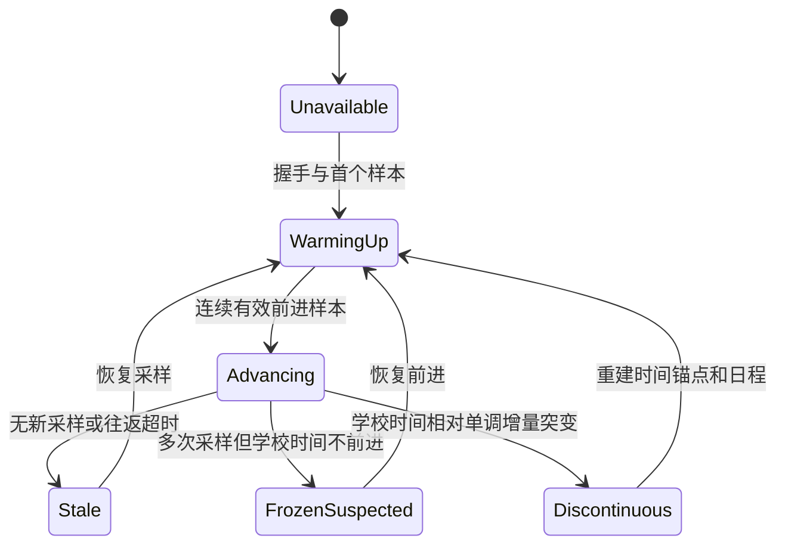

# ClassIsland 时间桥接与自动录课：详细实施规划

设计日期：2026-09-19。本文记录设计阶段的方案与验收要求；设计时尚未实现桥接插件。当前进度见下方执行更新。

后续执行更新（2026-09-19）：P0 最小桥接已实现并通过真实本体验证，详见 [P0 报告](CLASSISLAND-RECORDING-BRIDGE-P0.md)。随后完成了[现有预演采用学校时间](CLASSISLAND-SCHOOL-CLOCK-PREVIEW.md)、[P1 有限日期查询与 P2 周期/指定日期计划](AUTO-RECORDING-PLANS.md)，以及 [P3 真实录制与截止保护](AUTO-RECORDING-EXECUTION.md)。P3 已通过开发机私有短课表与实际录制测试；P4 目标大屏及配套发布验收尚未完成。下文保留规划时点的阶段定义；JSON 事务账本、Windows 同机 QPC 截止及保守 Interrupted 恢复等实现取舍见 P3 报告。复杂群组/多周/临时层组合的完整兼容矩阵仍待补齐。

本规划承接已实现的 [今日计划与预演](AUTO-LESSON-RECORDING-PREVIEW.md)，整合用户新增的周期计划、指定日期计划、默认排除科目，以及必须使用 ClassIsland 时间的要求。若与 [早期构思](AUTO-LESSON-RECORDING-DESIGN.md) 冲突，以本文为准。

P4 准备更新：已完成 [配套试用包与开发机安装验证](PORTABLE-RELEASE-VALIDATION.md)，从新 ZIP 解压的自包含 App 经真实 ClassIsland 的标准插件目录加载 `.cipx` 后完成自动短录。安装管理器交互、教室大屏整课/声音/物理休眠仍待现场验收，不标记 P4 全部完成。

## 1. 决策摘要与范围

1. **ClassIsland 有效时间是唯一的录课日历时钟。** 日期、星期、今天/明天、开始与课后余量均以它为准。系统时间只允许用于诊断日志，不能在失联后偷偷接管调度。
2. **插件只提供只读时间与日程快照。** 不录屏、不录音、不加载编码器、不编辑课表、不更改校时设置。
3. **NPEduTools 负责规则、执行记录和录制器。** 正式自动调度迁入 Host，录制工作进程独立约束截止时间。WPF 负责配置和状态展示。
4. **先验证插件兼容性，再改预演，最后接采集。** 现有倒计时反推只能保留为旧版只读诊断，不能成为新自动模式的时间后备。
5. **“二分钟铃”首版仍指 ClassIsland 课表上课前 2 分钟。** 读取精确时间不等于收到实际铃声；跟随自定义提醒是独立的后续能力。

周期性录课、指定日期录课均支持“跟随课表”和“固定时间段”。自定义时间段同样采用 ClassIsland 时间；没有课表时仍可执行，但必须有健康的 ClassIsland 时间源。

## 2. ClassIsland Docs 依据与源码核对

本轮优先阅读用户提供的本地 Docs，没有用网络上的其他版本覆盖本地版本结论。基线：

| 对象 | 核对基线 |
| --- | --- |
| NPEduTools | 提交 `8680235`，已有预演及手动录制 |
| ClassIsland Docs | `docs/classisland-docs-next`，提交 `6b25407` |
| ClassIsland 本体 | `D:/WebstormProjects/ClassIsland`，提交 `15273f82`，本地版本 2.1.0.1 |
| 目标框架 | 本地 ClassIsland.Core / 示例插件为 `net8.0`；NPEduTools 主体为 .NET 10 |
| SDK | 沿用现有环境；SDK 版本与插件目标框架不是同一概念，不因为安装了 .NET 9 就把插件改成 net9.0 |

下表中的“设计结论”是本项目的选择，不宣称均为上游文档强制要求。

| Docs 章节 | 已核对内容 | 对本项目的设计结论 |
| --- | --- | --- |
| [插件开发环境](classisland-docs-next/src/dev/get-started/development-plugins.md) | Debug 本体、PowerShell Core、开发脚本及环境变量 | 复用已有本体环境；不盲目重跑会清理构建并写用户环境变量的初始化脚本 |
| [创建插件](classisland-docs-next/src/dev/plugins/create-project.md) | 入口、manifest.yml、apiVersion | 独立插件工程，固定依赖；清单版本和协议版本分开管理 |
| [插件入口类](classisland-docs-next/src/dev/plugins/plugin-base.md) | Initialize 在主机启动前执行；部分操作需要 AppStarted | Initialize 注册服务和生命周期回调；AppStarted 显式解析并启动桥接服务 |
| [依赖注入](classisland-docs-next/src/dev/basics/dependency-injection.md) | 公共接口注入、单例生命周期 | 注入 IExactTimeService、ILessonsService、IProfileService、IIpcService；不反射私有字段 |
| [事件](classisland-docs-next/src/dev/events.md) | 50 ms 主循环、Pre/PostMainTimerTicked、AppStopping 禁止异步操作 | 课表处理后采样，限频复制；退出同步取消订阅和标记停止，不等待网络发送 |
| [课程服务](classisland-docs-next/src/dev/lessons-service.md) | 当前课程/课表及时间点状态 | 本体决定生效课表，NPEduTools 不重写单双周与临时课表选择算法 |
| [IPC 用法](classisland-docs-next/src/dev/ipc/ipc.md) | 代理、通知、自定义事件 ID；通知应在连接前注册 | 复用已有 IPC 连接；事件只用于提示刷新，完整快照用于恢复 |
| [IPC 参考](classisland-docs-next/src/dev/ipc/reference.md) | 公开课程/档案/导航服务及四种通知 | 当前没有完整有效时间和真实课前铃声接口，需要插件扩展 |
| [插件基础](classisland-docs-next/src/dev/plugins/basics.md) | AssemblyLoadContext 隔离；配置放 PluginConfigFolder | 验证共享契约类型身份；不把插件配置写进安装目录 |
| [插件依赖](classisland-docs-next/src/dev/plugins/dependency.md) | 其他插件之间共享类型需声明依赖 | 本桥接不依赖其他插件；NPEduTools 是外部进程，不是 manifest 插件依赖 |
| [发布插件](classisland-docs-next/src/dev/plugins/publishing.md) | CreateCipx 打包、清单、校验信息 | 先本地安装包验收，再考虑发布；不把开发目录调试等同于可分发验证 |
| [课表](classisland-docs-next/src/app/profile/classplan.md)、[时间表](classisland-docs-next/src/app/profile/time-layout.md) | 临时层/课表群、课程与时间点关系 | 正确处理临时换课和停用课程；课间/行动不算作课程 |

### 需要防止照抄的差异

- Docs 的插件基础示例中包含 `override OnShutdown()`；**本地 PluginBase 只有 Initialize，没有该虚方法**。本实现应使用 AppStopping 和可重复调用的资源清理，不复制此 override。
- Docs 的输出目录示例不能代替实际路径；本地 Windows Debug 本体路径包含 `net8.0-windows10.0.19041.0`。
- 示例插件使用 `ClassIsland.PluginSdk 2.0.0.*`。工程落地时必须解析并固定实际兼容版本及锁文件，不能把浮动版本直接用于可重复构建。
- `apiVersion` 是插件加载兼容信息，不是对未来所有 ClassIsland 版本的兼容保证。运行握手还要报告本体版本、插件版本和桥接协议能力。
- 本地 `ILessonsService.GetClassPlanByDate(date, out guid)` 可返回日期对应课表 ID；公共 IPC 版本只有无 out 参数的方法。插件可以利用前者，但必须校验今日查询结果确实对应 CurrentClassPlan。
- PostMainTimerTicked 表示课表处理后，并不意味着所有状态和精确时间具有上游事务保证；后台校时可能变化，仍需一致性检查。

关键源码证据：

- [IExactTimeService](../../ClassIsland/ClassIsland.Core/Abstractions/Services/IExactTimeService.cs)、[ExactTimeService](../../ClassIsland/ClassIsland/Services/ExactTimeService.cs)：最终时间采用本地/NTP 基准，加手动偏移和调试偏移；某些同步过程会暂时冻结返回时间。
- [LessonsService](../../ClassIsland/ClassIsland/Services/LessonsService.cs)：课程处理及日期选择使用同一精确时间服务，主循环先处理课程再发 Post 事件。
- [PluginBase](../../ClassIsland/ClassIsland.Core/Abstractions/PluginBase.cs)、[PluginService](../../ClassIsland/ClassIsland/Services/PluginService.cs)、[PluginLoadContext](../../ClassIsland/ClassIsland/PluginLoadContext.cs)：入口、加载和程序集隔离的实际行为。
- [IIpcService](../../ClassIsland/ClassIsland.Core/Abstractions/Services/IIpcService.cs)、[IpcService](../../ClassIsland/ClassIsland/Services/IpcService.cs)：可获得已有 IPC provider，不需要插件再次启动或关闭本体的服务器。

上述相邻 ClassIsland 仓库链接供本机核对；其他机器需具备相同目录布局。

## 3. 架构与工程边界

拟新增工程，名称与路径在实现阶段建立：

| 拟议位置 | 职责 |
| --- | --- |
| `plugins/NPEduTools.ClassIsland.Bridge/` | net8.0 插件、manifest、设置状态页、生命周期与快照发布 |
| `src/NPEduTools.ClassIsland.Bridge.Contracts/` | net8.0 兼容的最小跨进程契约，不依赖 WPF/Core/Recorder；net10 客户端可引用 |
| 现有 Integrations.ClassIsland | 桥接客户端、版本校验、超时/重连；沿用隔离策略 |
| Core 中的新规则与时钟模块 | 不依赖 UI 的纯计划计算、学校时钟状态机、发生实例身份 |
| Host 中的调度与录制协调模块 | 唯一正式调度器、持久账本、手动与自动会话仲裁 |

插件不得引用现有 net10.0 Contracts 程序集。外部 Host 协议和桥接协议分别版本化，通过适配器转换。不能把 ClassIsland 的 ObservableCollection、Profile 或服务对象直接作为桥接 DTO。

现有手动录制由 App 控制，正式接入时需要迁移到同一个录制协调器。不能让 App 和 Host 分别启动录制器，再依靠互斥锁竞争决定谁成功；互斥锁只作最终防重复保护。

### IPC 路线决策

**首选：在已有 IIpcService.IpcProvider 上注册独立的只读桥接服务。** 使用新的契约名，例如 `IRecordingBridgeV1`，绝不替换上游 IPublicLessonsService。使用 primitive/字符串边界承载有限 JSON，降低上游模型序列化耦合；生成器和运行库版本固定并一起验证。

这项注册依据本地 IIpcService 和已有本体 CreateIpcJoint 用法推导，**不是 Docs 已保证可直接工作的插件示例**。P0 必须实际验证加载上下文、代理/Joint 注册、超时与 net8→net10 通信。仓库现有 [ProxyRegistration](../src/NPEduTools.Integrations.ClassIsland/ProxyRegistration.cs) 已有固定 IPC 版本的生成器兼容桥，不能假设新契约天然免疫。

若该方案在固定版本下无法可靠工作，才切换到插件自有、按用户/会话隔离的 Named Pipe JSON 服务；需补充传输决策记录及权限测试。第一版只实现一种桥接传输，不同时维护两套。不会通过修改 ClassIsland 私有实现来强行注入接口。

## 4. 生命周期、线程与性能

1. Initialize 只注册单例、加载最小插件配置、挂接具名生命周期处理器，不提前解析尚未构建的容器。
2. AppStarted 显式获取桥接服务，完成 IPC 注册，订阅课程事件；避免只 AddSingleton 却从未实例化。
3. 在 PostMainTimerTicked 的 UI 线程中读取有效时间及本轮课程数据，复制成不可变 DTO。检测到跨日、课表引用变化或时间跳变时，标为不稳定，等待下一稳定轮次。
4. 网络序列化和发送在 UI 线程之外执行；IPC 请求处理器只访问已经发布的快照，不同步等待 UI，不直接遍历可变 Profile。
5. 未来日期查询采用有界队列交给 UI 线程处理，每次最多一个日期；结果离开 UI 线程前完整复制。不让远程请求触发同步加载/保存档案。
6. 无课时仍须采到 ClassIsland 时间。如果主课程计时器被停用，使用 UI Dispatcher 的低频时钟采样器补充；课表型任务标为不可执行，固定时间任务只依赖有效时钟。UI 阻塞时两者都会变陈旧。
7. AppStopping 同步设置 Stopping、取消订阅和定时器、取消待处理请求；不使用 async void 发送最后一条消息，不等待远端退出，也不 Dispose 本体共享 IpcProvider。连接丢失是对端最终的退出信号。
8. 所有清理可重复调用；晚到回调立即返回。禁用/更新插件首版按需要重启 ClassIsland 处理，不承诺运行期热卸载。

采样建议值：时钟最多每 250 ms 发布一次；日程由变化标记触发，并每 2 秒进行一次有限内容复核。不能每 50 ms 散列整个 Profile，也不能每次时钟包重传全部日程。事件处理异常由插件捕获并转成自身 Faulted 状态，不能从 Post 处理器向外抛出。

性能验收目标（尚未测量）：时钟采样 UI 增量 p95 < 1 ms；有限当日日程复制 p95 < 5 ms；时钟响应 p95 < 500 ms；不随重连次数持续增长内存或订阅数。先开发机测量，再在目标大屏确认。

## 5. 协议草案与能力协商

所有名称均为拟议契约，不是当前已有 API。首版最小方法为：

| 方法 | 结果与限制 |
| --- | --- |
| `GetHello` | 协议主/次版本、插件/本体版本、bridgeInstanceId、capabilities、Ready/Starting/Stopping/Faulted |
| `GetSnapshot` | 同一不可变发布版本的时钟与今日计划状态；可用已知 revision 减少日程正文传输 |
| `GetDayPlan(date)` | 单日预计课表；日期范围首版为 ClassIsland 今天起 31 天；Loading/Ready/NoPlan/Unavailable 明确区分 |

可选变更通知只携带实例 ID、sequence/revision；通知丢失不影响恢复，客户端始终能拉完整快照。首版可只轮询，不把通知实现作为时间正确性的前提。

### 快照字段

| 字段 | 语义 |
| --- | --- |
| `protocolMajor/minor` | 未支持主版本拒绝自动执行；次版本允许忽略新增可选字段，关键能力缺失仍拒绝 |
| `bridgeInstanceId` | 每次插件进程生命周期重新生成；不能持久化复用 |
| `sequence` | 同一实例中每次真正采样递增；反复读取旧缓存不能伪造新 sequence |
| `clockEpoch` | 检测到时间不连续后递增；原因不明时报告 ObservedDiscontinuity，不臆测用户改了哪个设置 |
| `effectiveLocalDateTime` | IExactTimeService 返回的完整学校本地日期时间；使用无 UTC 后缀的约定格式 |
| `sampleAgeMs` | 服务端用本进程单调计时计算的缓存年龄；不会因系统校时变为负值 |
| `clockState` | WarmingUp / Advancing / FrozenSuspected / Discontinuous / Stale / Unavailable |
| `lessonTimerRunning`、`lessonSampleAgeMs` | 与时钟采样新鲜度分离；可有新时钟、无可用课表 |
| `scheduleRevision`、`profileId`、`effectivePlanId` | 日程身份和内容版本，与 sequence/连接身份分离 |
| `schoolDate`、`planStatus` | 日期和 NoPlan/Disabled/Ready/Changing/Invalid 等业务状态 |
| `lessons[]` | 课程序号、科目 ID/名称、正式起止、本体启用状态、稳定性信息；不发送整个 Profile |
| `generatedForDate`、`forecast` | 未来日程必须标记预计，不能冒充该日运行时生效结果 |

ClassIsland 的时间是人为校准后的学校日历时间，不能直接冒充真实 UTC。时区 ID/UTC offset 可以附作诊断元数据，但不能再次叠加校时偏移。系统 UTC 日志字段必须显式命名，不能用于开始/停止比较。不同进程的 Stopwatch 数值不直接互减。

### 一致性和流量约束

- 同一响应内时钟、schoolDate 和今日课表必须来自同次已完成的发布；前后时间跨日或源对象改变则返回 Changing。
- 当日使用 CurrentClassPlan；借助按日期查询返回的 ID 时校验对象一致，不按名称猜测。无法唯一识别则暂停课表型任务。
- 未来课表使用本体 `GetClassPlanByDate`，不修改 TempClassPlan、Overlay、群组和 OrderedSchedules。查询结果按当前配置预测，到当天执行前必须重新读取。
- 请求正文 ≤ 4 KiB；响应 ≤ 64 KiB UTF-8；单日 ≤ 64 节。科目显示名限制长度，同时保留 ID。超限明确失败，不截去后半日伪装成完整。
- 日程订阅/排队有界；单客户端只保留最新待查询日期，总待处理数量建议 ≤ 4；过载返回 Busy，不能阻塞 ClassIsland。
- Host 获取时钟建议 500 ms 一次，2 秒请求超时、3 秒无新鲜采样进入 Stale；日期页切换使用缓存和有限排队。
- 超时/拒绝/无桥接返回结构化错误，禁止退回默认时间、空字符串或系统时钟伪装成功。

这些时限是首版工程参数，须通过 P0/P1 测量确认；调整后需在协议/测试中同步，不散落为多个不一致常量。

## 6. 时间模型与故障语义

### 三类时间必须分开

| 时间 | 用途 | 禁止用途 |
| --- | --- | --- |
| 学校日历时间 C | 日期、星期、课表窗口、开始与业务截止 | 作为真实世界 UTC 证据 |
| 本进程单调经过时间 M | 超时、采样年龄、持续时长、不可延长的兜底截止 | 独立决定今天/星期几 |
| 系统时间 U | 诊断、系统日志对照 | 学校时钟断线后的隐式后备 |

开始新任务只依据**新鲜、有效、正在前进的权威样本**，不以界面插值越过边界作为开录依据。界面可平滑显示倒计时，但这与执行时钟分离。允许约一次轮询周期的触发延迟，真实首帧延迟另行记录。

适配器记录请求的本地单调起止时间和服务端 sampleAgeMs，以缓存年龄加往返耗时作为保守的新鲜度/误差上界。不能拿服务端 effectiveLocalDateTime 与系统 DateTime.Now 相减判断“是否新鲜”。预期学校时间和系统差数分钟属于正常状态。

### 时钟健康状态机

建议首版需要至少 3 个、覆盖 ≥ 500 ms 的一致样本进入 Advancing；相同时间持续 ≥ 2 秒标记疑似冻结；相对经过时间残差 > 2 秒视为跳变。微小校正不导致不断启停，阈值应覆盖实际 IPC 抖动。原因分类来自观测，IExactTimeService 没有完整结构化的 NTP/冻结原因接口；不能解析中文 SyncStatusMessage 来作业务判断。

已有手动偏移在连接前设置：直接以新学校时间初始化，不以“与系统时间不同”阻止工作。连接期间发生跳变：待录任务重算，去重账本保留；日期大幅变化时暂停自动开关并要求用户在产品内重新核对日期。无桥接时允许离线编辑草稿，但不把系统今天标成学校今天。

### 正在录制时的截止约束

进入任务时确定业务结束 E（课程结束 + 0～5 分钟，或固定时间段终点），据最新学校样本 C 和采样误差估计剩余时长，建立本机单调硬截止 H。**H 以后只能提前，不能延后。** 录制启动、暂停与控制延迟均计入该期限。

每次有效样本到来：学校时间已达 E 就请求停止；新业务终点更早则收紧 H；时间回拨、断线、换连接均不增加 H。前调导致跨越 E 时立即结束；只剩余量时不重新开录。

ClassIsland 冻结/断线后，对 E 的绝对判定已不可知，因此只能承诺按最后有效锚点的剩余时长结束，不能宣称仍精确跟随随后未知的铃声调整。界面应说明“时间源异常，按原结束期限停止”。

录制工作进程必须独立持有截止约束，并有控制方存活租约；正常运行不依赖 WPF 定时器。期限下发不能因 IPC 排队重新获得完整时长；需要握手、扣除已消耗时间、回读实际期限的测试。Host 或 App 意外退出按较早的租约/硬截止结束采集并保存，不能只等上课/下课事件。

休眠/唤醒另列验收：不能只假设一种 Stopwatch 在所有电源状态下都满足要求。捕获 Windows 恢复事件后，禁止继续沿用未验证的新任务状态；活动会话先停止/收尾并重新校验时钟。目标 Windows 版本须验证低功耗待机；必要时补充含休眠时长的系统运行时钟作为期限约束，不使用可调的系统日历时间。

业务“截止”指停止采集。重封装保存允许后续完成；记录停止请求、实际末帧、完成保存三个时刻。这不是硬实时系统，不承诺恰好五分钟零毫秒切断所有设备数据。

## 7. 两类计划与默认排除科目

### 周期性录课

- 每周哪些天、生效/结束日期、启用开关。
- 跟随课表：按科目 ID/节次筛选，默认提前 2 分钟、延后 5 分钟。
- 固定时间段：填写开始/结束即为完整录制窗口，不重复叠加余量。
- 学期/假期停用通过规则日期范围和“暂停至指定日期”处理；不自动猜测法定调休安排。

### 指定日期录课

- 今天、明天、后天是 ClassIsland 日期的快捷入口；保存为明确的 YYYY-MM-DD，不持久化“明天”这样的相对词。
- 对某一天的课程指定 Include / Exclude / Inherit，也可新增固定时间段。
- 默认只有明确编辑的课程覆盖周期规则，其余继续继承。另设显式“本日只执行这些计划”，不因新增一节就暗中删除其他周期任务。
- “绑定这一节”随课表换科目/时间而更新，并显示变化；若想固定原时间，则转换为固定时间段计划。
- 无法可靠把旧节次映射到修改后的日程时，标 NeedsReview，不能仅凭“第 3 节”把任务移到完全不同课程。

### 默认排除名单

首次创建课表型规则，默认排除以下 17 项，可修改：

> 心理、体育、书法、体育(室内)、选修课、班会、技术、艺术、美术、音乐、物理(实验)、化学(实验)、生物(实验)、晨测、早读、午自习、报告厅活动。

先统一括号、首尾空格和括号周围空白，再作完整名称匹配。不得使用“包含体育/物理”之类模糊匹配。识别已有科目后绑定档案内 SubjectId；新科目也检查默认名称表；用户对某 ID 的明确允许优先于默认排除，明确排除在改名后仍保留。不得把旧档案的 ID 设置套到新档案。

名单只过滤从课表生成的任务；自定义时间段不具备可靠的科目绑定，创建时明确说明“此时间段按时间执行”。用户明确指定日期录制被排除科目时可覆盖默认排除，界面展示覆盖原因。

执行优先级：技术可执行条件（健康时钟、有效来源、设备与保存可用）→ 总停用/暂停至日期/今天不录/本节已结束或跳过 → 指定日期明确安排 → 周期规则 → 默认排除。技术条件和已完成记录不能被 Include 绕过。

“今天不录”按学校日期保存；“暂停至日期”界面标明包含该日。时间跳回已经执行过的日期，不清空其完成账本。

## 8. 合并、身份与持久化

规则 ID、发生实例 ID、日程 revision、连接实例 ID 和录制 session ID 是五种不同身份。去重不得使用科目名、事件计数、bridgeInstanceId 或当前课表 GUID 作为唯一依据。

课表任务使用“档案 + 学校日期 + 可追踪的课程发生位置 + 原正式时段”建立身份，维护临时层与改时映射。换科目/临时层不自动成为新发生实例；真正下一节即使同科目也应独立。上游没有经核实可用的持久课程发生 UUID 时，不虚构稳定 ID，模糊映射需要复核。固定时间任务使用规则/单次计划 ID 加学校日期。

同一课程被多个规则选中时聚合为一个任务，保留全部来源说明；指定日期明确窗口/预设优先，否则不一致配置标冲突，避免任意选一条。不同任务部分重叠时：课表连续课程优先缩短前一节余量；不能截断正式课时。固定时间与课程窗口冲突则要求在计划页处理，首版不自动拼接或开第二个编码器。

执行账本采用版本化配置及可事务写入的状态存储（建议 SQLite；具体依赖在实施时固定），唯一发生实例键防重复。先提交 Starting 意图与 session ID，再请求录制；重启后和录制器核对，无法确认时标 Interrupted，不盲目重复发送 Start。不能用“应开始”事件直接标 Recorded。

拟定状态：Planned → Starting → Recording ↔ Paused → Finalizing → Recorded；旁路为 Skipped / Missed / Conflict / Failed / Interrupted。开始失败首版不自动循环重试；用户可查看原因后显式重试，重试保持同一发生实例及独立 attempt ID。

旧预演规则可迁成一条草稿周期规则；旧预演标记只属于预演命名空间，不能阻止真实录制。迁移前备份，自动开关保持关闭，损坏/未知版本保留原文件并提示。新默认排除列表应在迁移界面列出，不能无提示覆盖用户已经明确选择的科目。

手动录制优先：自动任务到点时若被占用，首版直接标本节因占用跳过，不等手动录制结束后突然补录。自动 Stop/Shorten 必须携带并匹配 owner、occurrenceId、sessionId，不能误停后来开始的手动会话。

## 9. 用户界面与可观测性

计划管理提供“周期规则”“指定日期”“执行记录”三个页签；顶部固定显示 ClassIsland 日期时间、时间源状态和当前预演/自动录制开关。

日计划每行显示：来源、科目、正式课时、最终录制窗口、采用规则、排除/冲突原因、预计/已确认、临时变更。未来日期是预计，进入当日及开录前重新验证。

侧边栏显示“下一节何时开始”“正在录制/暂停”“课后余量剩余”，提供结束本节和今天不录。缺少插件时说明安装/启用状态；旧版只读课程显示继续可用，但自动录课入口显示不可用。

开始前提示建议提前 10 秒显示并可取消，不要求无人值守时额外点击。设备、音源、保存目录须在启用自动模式前已配置；磁盘不足/设备缺失不进入录制，并保留可解释的失败记录。

诊断同时记录学校时间、可选系统 UTC、单调耗时、实例/epoch/sequence、修订和原因码。默认不逐采样写磁盘，不记录完整 Profile、个人路径或未经需要的科目正文。用户查看任务记录时可以显示课程名称；诊断导出与产品历史区分。

## 10. 版本、安装与回退

- 首轮只承诺验证本地 ClassIsland 2.1.0.1 / `15273f82` 的 Windows x64 构建；未知版本显示未验证，不能仅凭 apiVersion 通过就声称兼容。
- 插件清单候选 ID `npedutools.recordingbridge`、协议 v1，正式冻结前检查命名冲突；插件包版本与协议版本独立。
- 使用 Docs 的 PluginSdk/CreateCipx 流程。开发用 `-epp` 外部目录；正式验收用本地 `.cipx` 安装。不把 ClassIsland.Core/Avalonia 的另一套运行时复制到插件输出制造类型身份冲突。
- 发布物包含锁定依赖、源码提交、兼容矩阵、包校验摘要和安装/卸载说明。只做本地交付，不在本规划中上架市场。
- 插件配置仅放 PluginConfigFolder；NPEduTools 的规则、执行账本、录制路径归 NPEduTools 管理，不在两边各保存一套规则。
- 桥接沿用已有本体管道权限，不能把只读服务描述为更强的鉴权边界；不增加任意文件读取、命令执行或录制控制方法。测试普通/管理员同用户组合、多会话和权限拒绝，失败显示原因，不自动提权。
- 卸载/禁用桥接后自动新任务暂停；活动录制按既定约束结束；手动录制、PPT 功能和旧只读状态仍可使用。保留规则与视频，不随卸载删除。

## 11. 实施阶段与退出条件

| 阶段 | 实际交付 | 必须通过后才进入下一阶段 |
| --- | --- | --- |
| P0：插件可行性 | 独立 net8 插件、握手、有效时间采样、最小今日快照、兼容性报告 | 真本体加载、ALC/代理成功；手动 ±120 秒偏移、无课/末节/跨日读取正确；退出不挂起；选择并冻结唯一传输 |
| P1：学校时钟与快照 | 正式契约、时钟健康状态、有限日期查询、适配器和诊断 | 断线/卡顿/冻结/跳变/重连不伪装健康；系统时钟不参与日历判断；未来查询不改变本体状态 |
| P2：计划与预演升级 | 周期/指定日期、17 项排除、覆盖/冲突、迁移、完整预演 | 今天/明天使用学校日期；默认排除可覆盖；预演仍不产生任何采集进程；重启/换课去重正确 |
| P3：接入真实录制 | Host 协调器、执行账本、单调硬截止、控制租约、手动/自动仲裁 | 私有短课表真实录制；暂停不延长、故障有片段、不会误停手动会话；Host/App 故障录制器能自行结束 |
| P4：安装与大屏验收 | `.cipx` 和 NPEduTools 配套包、现场报告、回退说明 | i7-1065G7 核显大屏整课、多课连续运行、音画与保存检查；发布兼容矩阵 |

P0 不是“做完时间 getter 就直接自动录制”。如果自定义 IPC 或线程模型不可行，在 P0 修改架构记录并重新验证，不带着未确认的前提进入 P3。工期需在 P0 后估计；当前不虚报完成日期。

## 12. 验收矩阵

所有破坏性时间测试使用私有测试时钟/隔离 ClassIsland 配置。系统调时只在专用测试环境进行；不改变用户正在使用的电脑时钟或课表。

| 场景 | 预期与证据 |
| --- | --- |
| 系统 09:56，ClassIsland 09:58，课程 10:00 | 按学校 09:58 开始；记录首个允许样本和实际首帧 |
| 系统与学校分属不同日期/星期 | 周期规则、“今天不录”、明天预览均按学校日期 |
| 无当天课表，但有固定时间段 | 桥接时间健康即可预演/执行固定任务；课表任务显示无课 |
| 最后一节没有下一课间 | 不依赖倒计时反推，仍可取得时间并结束余量 |
| 在 ClassIsland 手动调整 ±120 秒 | 待录计划跟随；活动期限不延长；不重复开录 |
| NTP 等过程冻结返回时间 | 可连接但时钟不前进应变为 FrozenSuspected，新任务禁止开始 |
| UI 线程阻塞 10 秒，IPC 尚可响应 | sampleAge/sequence 反映旧采样，不能续成新鲜 |
| IPC 断线、本体退出/重启、插件缺失/禁用 | 明确不可用，不用系统时间接管；重启实例 ID 改变并重新握手 |
| 网络延迟、重复/乱序样本、超长 JSON | 有界超时/拒绝；旧实例或倒序 sequence 不能覆盖新状态 |
| 临时换课、预定临时层、课表群、单双/多周 | 今日与本体一致；未来标预计；切换时不输出混合快照 |
| 连堂、短课间、重叠时间段 | 可解释地缩短余量或标冲突，不并行开两个编码器 |
| 排除名单中每个科目、中文括号、名称空白 | 默认排除正确；普通物理不误排；指定日期显式 Include 可覆盖 |
| 两个同名科目、删除科目、换档案 | 用 ID 区分；删除则不可执行；旧 ID 规则不跨档案套用 |
| 预演后启用真实录制 | 预演标记不吞掉真实任务 |
| 启动意图落盘前/后崩溃、录制已启动但 ACK 丢失 | 恢复核对会话，不重复开始，不把失败当成功 |
| 手动占用、迟到的旧 Stop、自动过程中手动结束 | 无抢占/误停，结束本节后不重开 |
| 课后 5 分钟、暂停、回拨、断线组合 | 不延长原硬截止；测末帧及收尾耗时 |
| App/Host 卡死与退出、编码器卡住、休眠恢复 | 工作进程独立截止/租约生效；失败片段可定位，不无限录制 |
| 插件安装、升级、禁用、卸载、重装 | 主程序可正常启动/退出；插件配置和用户视频保留 |
| 目标大屏一整节及连续多节 | 无假死，资源占用可接受，音画完整；不能以开发机短录替代 |

自动化证据应包含规则输入、学校时间序列、决策原因、状态变化和媒体探测结果；UI 验证保存截图；性能记录主线程耗时与内存趋势。现有 186 项测试和历史真本体联调只证明旧阶段，**不算本方案已经验收**。

## 13. 当前仍需通过实验解决的问题

1. 固定 IPC 版本在插件 ALC 中注册新服务是否可靠；依赖输出是否正确复用本体类型。
2. 当前/未来课表快照在预定临时层、群组切换、课程改时中的一致性与身份映射。
3. 精确时间冻结/跳变观测阈值是否会误判正常校时；UI 阻塞后恢复的处理是否符合实际运行顺序。
4. Windows 目标大屏低功耗/休眠对经过时间的影响；录制器能否满足暂停与失联情况下的截止约束。
5. 本体普通/管理员运行时，新增 IPC 服务与现有客户端权限组合是否兼容。

这些是 P0～P4 的明确实验任务，不是要求用户先回答的阻塞问题。本轮产物为本规划及文档索引更新；没有生成插件包、运行新的采集测试或更改程序逻辑。

