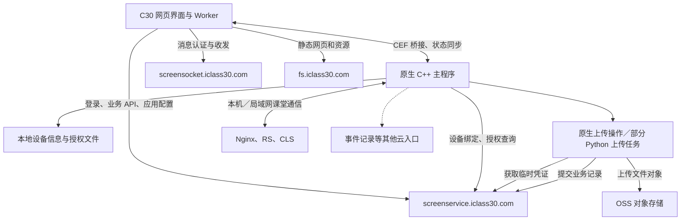
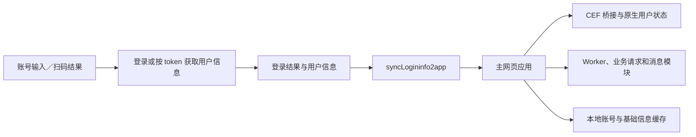
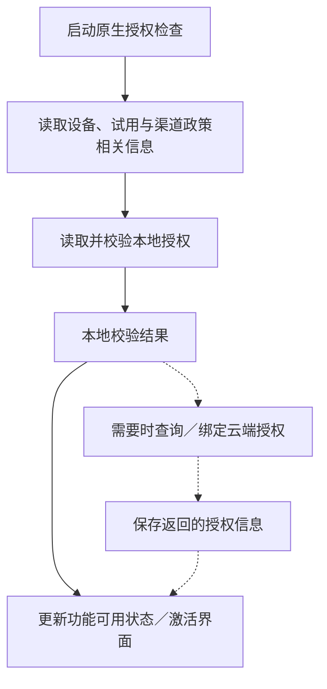

# Datedu／C30 云服务与软件激活深度分析

分析日期：2026-09-17  
限定部署版本：`teach/1.3.1610.0`  
研究范围：云端业务入口、账号会话、消息连接、文件上传、设备身份、软件授权、激活界面及本地状态。

**当前版本采用“云端业务与授权服务 + 本地设备身份和授权文件 + 原生检查线程 + 网页业务界面”的组合架构。** 账号登录、软件激活、投屏配对和文件上传凭证属于不同状态，不能用一个“已登录”或“已联网”概括。

本次最明确的运行证据是：**2026-09-17 的启动日志记录了“校验本地激活文件成功”。** 当前代码同时保留云端设备绑定、授权状态查询、有效期与渠道试用政策处理。这个结论只适用于该次启动记录，不能推导为永久授权、所有附加功能均获授权，或今天服务器仍返回同样结果。[E2][E4]

## 1. 范围、方法与结论强度

`launcher.ini` 中的 `last_start_verion`、`new_verion` 都为 `1.3.1610.0`；已有当前主程序和超级白板启动日志与该路径一致。本轮查询研究电脑的进程列表，没有发现正在运行的 C30 主程序。这里的“当前版本”指配置和历史启动记录指向的部署，而非对厂商最新发行版的联网查询。[E1][E2]

分析只读取当前版本目录及其关联的共享 `teach/AppData/teach`。没有检查其他部署版本，也没有执行 Datedu 二进制、调用产品的登录／激活／上传接口或修改授权文件。

| 证据等级 | 使用方式 |
| --- | --- |
| 运行记录 | 当前版本内的 09-17 主程序、网页应用、登录和桌面日志，证明特定路径曾被执行 |
| 代码证据 | 当前 JS、XML、PE 导入导出和局部调用追踪，说明实现中存在相应逻辑 |
| 结构线索 | 类名、接口名、文件名和路径，支持职责判断，但未必证明实际启用 |
| 推断／未验证 | 服务端实现、授权政策细节、真实网络行为和故障原因，不以客户端材料代替实测 |

分析产物只保留参数名称、事件、路由和文件结构信息。报告不包含实际账号、令牌、激活码、授权文件正文、硬件标识或学校标识。数据库仅查询表结构，未查询账号记录。

## 2. 云服务的整体组织



图中云服务职责由当前配置、调用代码及日志归纳；不是厂商服务端部署图。多个域名不等于已经证明有同样数量的微服务，也不能据此确认后端编程语言、数据库或服务器集群结构。

### 2.1 当前配置中的主要入口

| 配置项 | 当前配置值／主机 | 职责与证据边界 |
| --- | --- | --- |
| `datedu_url`、`base_url` | `https://screenservice.iclass30.com` | 主要业务根地址；当前日志有大量应用配置、课堂和设备接口记录 |
| `socketio_url` | `https://screensocket.iclass30.com` | 消息服务入口；当前 Worker 的生产分支采用相同主机 |
| `upload_url` | `https://fs.iclass30.com/` | 文件／静态资源入口；名称不能证明所有上传内容都经此主机中转 |
| `event_track_url` | `https://recordlog.iclass30.com/` | 事件记录入口配置；本轮未逐条核对上报成功情况 |
| `xxq_url` | `https://xxq.iclass30.com` | 学习资源相关入口，具体业务以调用方为准 |
| `explain_upload_url` | `https://screenweb.iclass30.com/explain_photo/` | 拍照讲解相关网页入口 |
| `explain_upload_scan_url` | `https://gc.iclass30.com/photo-scan/` | 扫描／拍照相关网页入口 |
| `video_course_url` | `https://screenconsole.iclass30.com/video` | 视频课程相关页面入口 |
| `[interact] cloudoss_url` | `oss://datedu/cloud_interact/` | OSS 形式的逻辑资源定位符，不能当作一个 HTTPS API 域名 |

来源为当前 `teach.ini`。它还配置了其他产品／渠道入口，主程序日志也出现相应资源页面。它们不应全部并入每次启动都会访问的主链路。[E3]

`teach.ini` 的主要业务地址使用 HTTPS，但其他配置节仍有 HTTP 地址。配置、URL scheme 和文件中存在某个库，都不足以证明整个客户端的 TLS 证书校验、重定向和所有网络请求行为。本轮没有做抓包或证书验证实验。

### 2.2 实际根地址需要考虑原生状态与缓存

登录公共库的 `getRooturl` 会读取已保存的 `webroot`，并存在从原生全局状态／打包环境配置取得根地址的路径。请求拦截器再以该值补齐相对 API 地址。[E8]

因此，不应只扫描 JS 中所有 `VUE_APP_*` 常量，然后把全部域名当作当前生效配置。对本次部署，`teach.ini` 与运行日志中的 `screenservice.iclass30.com` 是更直接的主业务地址证据。

## 3. 四类容易混淆的身份与凭证

| 类别 | 代表信息 | 用途 | 不代表什么 |
| --- | --- | --- | --- |
| 教师账号会话 | `token`、用户和学校信息、登录渠道 | 查询课堂资源、业务权限和用户数据 | 不等同于设备已激活 |
| 设备／软件授权 | 设备标识、`SN`／`authCode`、本地 `.lic`、`isAuth`／`expiryTime` | 软件或附加产品授权判断 | 不等同于教师账号登录成功 |
| 投屏／连接入口 | `createMachineCode` 返回值、投屏角色、流和端口信息 | 设备发现、连接或投屏入口组织 | 不能仅凭 `MachineCode` 名称认作激活码 |
| 对象存储临时凭证 | `accessKeyId`、`accessKeySecret`、`securityToken`、bucket／endpoint | 指定文件上传路径中的存储访问 | 不等同于 C30 登录 token，也不是软件授权文件 |

网页还用登录二维码的关联标识连接扫码结果与桌面会话；消息模块有自己的 `socketId`、`authInfo` 和认证事件。这些同样需要与设备永久身份区分。[E8][E9]

## 4. 账号登录、会话传播与离线模式

### 4.1 登录不是单纯打开一个远程网页

当前登录页面保留 Vue 打包代码、请求层及原生桥接封装。账号登录调用包含 `/base/baselogin/login`；同一当前包内还存在渠道登录及按 token 获取用户信息的接口。[E8]

从当前实现可以还原以下职责链：



其中 `handleLoginSuccess` 明确把在线结果的 `offline` 设为 `false`，再调用 `syncLogininfo2app`。公共库另有向原生发送 `login_success`、`login_suc` 的方法和用户信息同步逻辑。[E8]

主程序日志记录了 `CInteractWrapperManager::Execute` 处理 `login_suc`；网页应用日志有 3 条“登录成功”记录。这证明本次运行确实经过网页与原生之间的登录状态交接，但这些记录数不一定等于 3 位用户或 3 次手动登录。[E2][E10]

### 4.2 业务请求使用自定义 `token` 请求头

当前登录公共请求层具有以下直接代码证据：[E8]

- 请求前读取 `getLoginInfo()`，设置 `headers.token`。
- 请求配置存在 `withCredentials:true`、超时设置及表单编码处理。
- 响应层区分 HTTP 状态与业务 `code`；例如业务 `code=1` 时取 `data`，`code=200` 时保留相应响应结构。
- HTTP `401`／`402` 在该层会触发 `login_expired` 通知。

这里的 `token` 是产品自定义会话字段。没有证据把它统一称为 JWT、OAuth access token 或 `Authorization: Bearer`；第三方渠道出现类似字段，也不能证明所有渠道使用同一种认证协议。

`withCredentials:true` 说明请求层允许相应凭证机制参与，不足以证明每个接口都依赖 Cookie。客户端返回码处理也不能替代服务端鉴权实现的证据。

### 4.3 扫码登录与普通账号登录会合到用户信息同步

当前代码引用 `https://fs.iclass30.com/screen/login-qr.html`，通过消息模块接收扫码结果。随后按分支使用账号参数或已有 token 取得登录用户信息，再进入同一成功处理过程。09-17 登录日志也记录过该二维码页面地址。[E8][E10]

报告只说明其会合关系，不复述二维码中的实际关联参数或会话载荷。

### 4.4 离线账号模式与设备授权各自存在

`handleLoginFail` 的部分错误路径进入 `startOfflineMode`。该函数先检查运行场景及本地账号条件，再继续本地账号检查与状态同步；它不是任何网络错误都无条件接受登录。[E8]

这说明当前版本为部分教学场景提供了离线账号路径。它不能证明：

- 所有云资源都已缓存在本地；
- 云端仍然接受缓存 token；
- 离线账号状态等同于软件激活通过；
- 设备断网后可以无限期使用全部功能。

另外，`getbaseinfo.class.js` 在 `loginInfo.offline === true` 时不发起特定第三方学习资源权限查询，体现了业务层对离线状态的单独处理。[E9]

### 4.5 本地账号持久化的结构证据

共享 `MCV/userData.db3` 的 `loginlist`、`teachers` 表中存在账号、学校、登录时间、记住账号相关字段，以及名为 `teacherPwd`、`token` 的列。当前登录代码也有读取账号列表的 SQL，并按登录渠道和环境信息筛选。[E8][E11]

本轮只检查列名与类型，没有读取字段值。字段名不能证明其中保存的是原始密码、哪一种编码／加密表示，或仍有效的 token；也不能据此判断本地凭证保护强度。

## 5. 云消息服务与本地通信

### 5.1 当前网页消息层是 Worker + Socket.IO／IMSDK

`socket.worker.js` 引入 Socket.IO、IMSDK 相关脚本，维护 `socketId`、`socketName`、`authInfo`，并通过 BroadcastChannel 把消息、认证结果和控制操作分发给应用页面。[E9]

生产分支使用 `https://screensocket.iclass30.com`。`socketIM.class.js` 调用 `IMSDK.loginImpl`，处理认证回调、重连、断开以及客户端／服务端消息发送。

这些证据说明消息连接有自己的会话状态。应用日志有 8 条“socket认证成功”，与 3 条“登录成功”属于不同事件；不能把连接重建、扫码通道认证和用户登录混为同一个指标。[E10]

此处 HTTPS 形式的连接入口和 Socket.IO 代码，不足以确认每次实际采用 WebSocket 还是其他底层传输回退，亦未恢复服务器消息鉴权规则。

### 5.2 原生日志中的 `[WS]` 不能全部归为云端连接

当前主程序日志中的一组 `[WS]` 连接指向：

```text
ws://127.0.0.1:19560/chat
```

它是本机环回地址。启动阶段先出现连接失败，后出现连接成功记录；不能据此判断 `screensocket.iclass30.com` 故障或软件授权失效。[E2:460][E2:626][E12]

这与已确认的本地 RS／CLS／Nginx 服务共同说明：C30 同时有本机、局域网和互联网通信。RS 配置的 HTTP 端口也是 `19560`，但精确的每条消息归属仍应结合接收方实现验证。[E13]

当前启动日志有 Nginx、RS、CLS 的启动证据。本轮没有新增 Node 服务在该主启动链中运行的证据，因此没有把随包 Node 代码当作云端后端或已运行的本地必需服务。

## 6. 云文件上传：凭证、文件对象与业务记录

### 6.1 已恢复临时凭证上传的实现特征

当前 `teach_core.dll`、`base_app_teach.dll` 中都出现 `/public/oss/getStsToken`；相关代码字段包括 `accessKeyId`、`accessKeySecret`、`securityToken`、`bucket`、`endpoint`。[E4][E5]

这些证据支持 OSS 临时凭证上传的设计判断。STS 临时凭证用于在有限时间和权限范围内访问 OSS，是存储访问层的机制；它与 C30 账号或软件许可证不是同一类凭证。机制含义可参见阿里云的 [使用 STS 临时访问凭证访问 OSS](https://www.alibabacloud.com/help/zh/oss/developer-reference/use-temporary-access-credentials-provided-by-sts-to-access-oss)。

本轮没有申请临时凭证，未获取实际策略、有效期和可访问的对象范围，也未验证 bucket 的访问控制。接口叫 `getStsToken` 不等于已经证明其服务端权限配置正确或错误。

### 6.2 云白板保存链路补充了上一轮的未知部分

上一轮已在 `wb_core.dll` 确认：超级白板准备 `wbdata.xml`、资源目录及预览图，然后通知 C30。此次继续检查当前 `base_app_teach.dll`，找到了 `CSuperWBWnd::HandleSuperWbSaveToCloud` 和 `CWbUploadOperation`。[E5][E14]

`CWbUploadOperation::Process` 的局部调用追踪中，出现三次 `_UploadDataZip` 调用和一次 `_NoticeService` 调用；对象路径模板分别为：

```text
CloudWhiteboard/teach/<关联目录>/<关联目录>/data_<标识>.wb
CloudWhiteboard/teach/<关联目录>/<关联目录>/thumnail_<标识>.png
CloudWhiteboard/teach/<关联目录>/<关联目录>/imginfo_<标识>.png
```

其中 `thumnail` 是当前二进制保留的拼写。占位目录的精确身份映射未在本轮全部恢复，因此没有把它们擅自命名为某个具体用户或学校字段。

`_UploadDataZip` 引用 `/public/oss/getStsToken`；`_NoticeService` 引用 `/screen/base/saveWhiteboardInfo`。同组件另有 `CCloudWBDownloadTask::unzip`、`parseFile` 以及不同上传阶段的失败日志字符串。[E4][E5]

可以据此恢复以下职责流程：


**新增结论是：当前云白板实现中存在 `.wb` 外层对象命名和压缩／解包相关路径。** 这补充了此前尚未确定的外层命名线索，仍不是对实际下载样本的格式验证，也不代表当前所有本地板书导出都使用相同封装。

### 6.3 文件上传成功与业务保存成功有不同边界

从上述职责划分可以推断，至少需要分别考虑：准备页面材料、取得上传凭证、传输数据对象、传输预览图、提交业务记录。某一阶段成功不必然表示后续阶段已成功。

代码中分开设置了数据包、缩略图、详情图等失败标记；云端记录提交也有单独回调。这是分析“文件似乎传上去了，但列表没有记录”一类现象的有用边界，**不是本次实际发现了这样的故障**。[E4][E5]

当前日志没有足够证据确认本次运行完成过整条云白板保存流程，本轮未做上传与下载往返测试。

### 6.4 其他资源的上传入口不能全部视为同一实现

`jscore_c30desktop_plus.dll` 有网盘列表、打开和保存相关包装；`base_app_teach.dll` 导出 `VedioRecordManager::UploadByPython`，并存在调用上传工具的命令模板。`teach_core.dll` 还有课堂互动资源及特定产品上传操作。[E4]

这表明 C30 的文件业务经过多种前端和原生入口。不能仅因配置名为 `upload_url`，就声称所有文件都上传到一个统一 HTTP 接口；也不能根据一个 Python 上传入口把全部云通信归为 Python 实现。

## 7. 软件激活核心在哪里

### 7.1 授权检查集中在原生核心

| 组件／类 | 当前证据中的职责 |
| --- | --- |
| `teach_core.dll`：`CRegisterCheck` | 启动检查线程、试用／渠道政策、本地授权检查及需要时的云端处理 |
| `ui_base.dll`：`CDeviceInfo` | 收集与缓存设备信息，读取、验证、保存授权信息，发起设备注册／绑定 |
| `teach_core.dll`：`CCompositeRegisterCheck` | 附加授权状态读取、HTTP 查询和绑定、有效期处理 |
| `teach_core.dll`：`CRegisterDlg` | 原生激活对话框与网页界面之间的消息处理 |
| `jscore_c30register_plus.dll` | `C30RegisterPlus` 扩展，暴露 `get_stupc_register`／`register_stupc` |

`CRegisterCheck::DoWork` 的局部控制流与调用追踪，确实发现对 `CDeviceInfo::ReadTryTime`、`ReadInfo`、`Validation`、`RegisterDevice`、`SaveInfo` 等方法的调用，并有渠道政策查询路径。[E5]

这些调用分布在不同分支，不能理解为每次启动都无条件按表格顺序执行所有操作。

`C30RegisterPlus` 的方法以及 `teach_core.dll` 导出的 `DT_GetStuPcRegisterState`／`DT_RegisterStuPc`，支持学生 PC 注册功能的职责判断。当前研究没有证明该扩展在这次大屏启动中被实际装载；它不是仅凭名字就能认定的全产品激活中心。[E4]

### 7.2 当前启动的实际授权检查序列

09-17 主程序日志中可以直接核对：[E2]

| 日志行 | 记录 |
| ---: | --- |
| 107–108 | `CRegisterCheck::DoWork` 线程开始，记录 `RG INIT` |
| 109–111 | `CDeviceInfo::ReadTryTime` 读取完成 |
| 112–114 | `CDeviceInfo::ReadInfo` 读取本地授权信息；日志载荷可识别字段名 `e`、`m`、`u` |
| 115、246 | `CDeviceInfo::Validation` 开始及结束 |
| 247 | 明确记录“校验本地激活文件成功” |
| 248 | 随后记录 `update time less than now time` |
| 167、244、260、263 | 其他线程进入组合授权状态查询路径，记录类型编号 1、2 |

这些记录来自不同线程，不能把行号交错强行还原为一条串行调用栈。类型编号也未被直接映射为某一种商业授权等级。

第 248 行说明程序还考虑更新时间与当前时间的关系，但单条文本不足以确定刷新周期、失效策略或无限期离线可用性。主授权的本地校验成功，也不代表每个组合授权项目都通过。

### 7.3 从代码恢复的职责状态图



这是一张职责图，虚线不表示已恢复完整的跳转条件。当前日志实际确认的是本地校验成功分支；其他错误、到期与刷新场景没有在本轮执行验证。

## 8. 设备身份与本地授权文件

### 8.1 设备身份由多个来源构成

`CDeviceInfo` 导出硬盘标识、物理网卡、卷序列、安装标识、本地虚拟标识以及设备缓存相关方法。`RegisterDevice` 的已解析调用也会取得缓存设备信息和本地虚拟标识。[E4][E5]

共享 `device.dat` 是 JSON，当前可见字段名为：

```text
disk_id, cmd_disk_id, mac_id, t
```

文件中的实际值没有写入报告。名称表明实现使用多种设备信息来源及缓存；不能据此确认哪个字段在所有机器上拥有最高优先级，也不能断言更换网卡或硬盘必然导致失效。

程序同时保留从不同系统接口、命令和本地缓存取得信息的路径。这支持“设备身份解析具有兼容和缓存逻辑”的判断，而不是单纯读取一个固定硬件编号。

### 8.2 当前共享目录中观察到的授权文件

| 文件 | 当前文件观察 | 与代码的关联 |
| --- | --- | --- |
| `dt.lic` | 108 字节、单行 ASCII，字符形态符合 Base64 | `CDeviceInfo::ReadInfo`／`SaveInfo` 和主授权逻辑直接引用 |
| `multi.lic` | 同为 108 字节的上述字符形态 | `CCompositeRegisterCheck` 相关代码引用 |
| `dscreen.lic` | 同为 108 字节的上述字符形态 | 组合授权相关代码引用 |
| `ttraining.lic` | 同为 108 字节的上述字符形态 | 组合授权相关代码引用 |
| `stupc.lic` | 当前所检查共享目录中未找到 | 当前二进制保留相应路径，不能认定本次已使用 |

四个文件具有相同长度，不表示内容相同、权限相同或可以互换。文件名也不能单独确定完整商业产品范围。[E6]

本轮没有解码、修改或生成授权文件。Base64 形态只是表示方式线索；它本身不能证明采用了加密、数字签名或特定密码算法。

日志中的本地读取结果存在 `e`、`m`、`u`，组合授权代码另有 `expiryTime`、`isAuth` 等字段。报告不把缩写字段在缺少完整验证时擅自扩展成确定格式，也不据此声称该许可防篡改或可被篡改。

### 8.3 本地文件与云端状态共同参与

`CCompositeRegisterCheck::GetRegisteredState` 的调用追踪包含 `GetRegisterStateByHttp`；后者读取 `isAuth`、`expiryTime`，并调用 `HttpPostForm`。相应绑定函数 `RegisterByHttp` 也调用 `HttpPostForm`。[E5]

这说明当前授权体系不只是“检测一个 `.lic` 是否存在”。同样，存在 HTTP 查询路径也不表示每次使用功能都必须重新联机；缓存优先级、宽限期和异常时的策略仍需要完整分支及运行验证。

## 9. 云端授权接口与激活界面

### 9.1 可以定位到的授权业务职责

下表列出当前代码中的路由和参数类别，作为职责索引；不是可直接复用的第三方 API 文档。[E4][E5]

| 路由／入口 | 代码支持的职责 | 可见参数或响应类别 |
| --- | --- | --- |
| `screen/activecode/getScreenBindInfoOrBindNew` | 主设备绑定信息获取／绑定路径 | 设备信息、渠道、授权输入；响应含到期相关字段 |
| `/screen/pc/getDeviceAuthInfo`、`/screen/pc/deviceBind` | PC 类设备授权查询／绑定入口 | 设备、渠道、产品、授权信息 |
| `/screen/classroomAuth/getDeviceAuthInfo`、`/screen/classroomAuth/deviceBind` | 课堂授权相关查询／绑定入口 | 授权状态、有效期及相应产品信息 |
| `appmgr/product/getProductConfigInfo` | 渠道／产品激活政策配置 | `productId`，响应解析含 `trialDays` 及界面提示相关字段 |
| `screen/activecode/getDate` | 检查线程中的日期相关入口线索 | 具体使用条件和返回时间语义未完整验证 |

不同函数的设备字段不完全相同。核心类别包括 `diskId`、`mac`、`virtualId`、`channel`、`product`，绑定入口还会处理授权输入；部分上下文会附加用户或学校关联信息。

客户端请求参数中包含学校或产品标识，不等于已证明服务端如何实现租户隔离或授权范围。该部分后端规则不在编译后客户端中完整呈现。

### 9.2 试用政策存在云端配置来源

`GetChannelActivationInfoByHttp` 的调用追踪显示 `HttpGet` 和产品配置路由，字段解析包含 `trialDays`。因此，代码支持按产品／渠道取得试用和提示配置。[E5]

没有取得本次服务器返回的有效政策快照，不能仅凭默认常量或函数名给出“可试用多少天”的确定结论。不同渠道的配置分支也不能全部作为当前大屏已生效政策。

### 9.3 当前激活对话框使用 CEF 界面承载

当前 `skin/xml/CRegisterDlg.xml` 的有效布局包含 `CefBrowser name="QRCcef"`。原生 `CRegisterDlg::onCallJsMsg` 处理 `getactiveinfo`、`active`、`setsn` 等消息，二进制中还有 `active_doing`、`active_done` 通知。[E4][E5][E7]

可以据此判断：网页负责激活界面的一部分展示和交互，原生组件承担设备信息、授权输入及检查流程的衔接。界面状态“正在激活／激活完成”不是单靠网页自身决定授权。

同一 XML 文件还有被注释掉的旧布局文本。本报告只以有效 CEF 布局说明当前文件，不把注释中的按钮、联系方式或输入长度认作当前用户流程。

09-17 日志确认本地授权通过，但本轮没有证据证明该次启动实际展示并操作了激活对话框，也没有发起新的激活。

## 10. 投屏登记为何不同于激活

`CScreenEntrance::ReqMachineCode` 在本次运行中调用 `screen/base/createMachineCode`，随后还调用 `screen/base/updateMachineInfoByCode`。其载荷字段包括：

```text
drole, master_device, streamid, thumbport, wsport,
ipList, segmentList, version, ios_stu_version, android_stu_version
```

这里可以看到角色、流标识、缩略图／消息端口、网络信息和连接端版本。它与 `CScreenEntrance`、投屏界面和更新设备连接信息的职责一致。[E2:368][E2:375][E2:660]

激活链路则由 `CRegisterCheck`／`CDeviceInfo` 等处理，本地许可和 `isAuth`／`expiryTime` 是另一组证据。因此，后续看到“机器码获取失败”，首先需要确定它来自投屏入口还是授权组件，不能直接认定为激活故障。

## 11. 云端应用配置、权限与更新

当前应用日志和 Worker 代码包含按学校／产品获取应用列表、应用分类、自启动应用和资源权限的请求。`teachers` 表也有 `appPermissions`、`homeworkPower` 等列。[E9][E10][E11]

这支持功能入口受到账号、学校、产品及配置影响的判断，但本轮没有恢复完整的功能权限矩阵。某个按钮不显示，不能仅凭这一现象归因于软件未激活。

`checkupdate.class.js` 的 `CheckHotUpdate` 使用 `interval=30000`，周期检查 `/appmgr/update/getNewVersionInfo`；参数包含应用、主版本、产品和用户上下文。检测到较新应用版本时向 UI 发出通知。[E9]

09-17 的应用日志有 **999 行提及 `getNewVersionInfo`**，与持续检查的代码设计相符。它们是日志记录，不是 999 次更新安装，也不能当作 999 次激活检查。单凭这些日志还不能验证更新包签名、下载校验或服务端发布规则。[E10]

## 12. 日志解读与故障定位边界

### 12.1 不能把日志中拼出的 URL 当作完整网络抓包

当前请求日志格式会把方法、地址和序列化参数拼接为类似：

```text
METHOD <baseURL><path>?<serialized parameters>
```

即使底层使用 POST，日志也可能展示这种形式。因此，本报告中的“日志参数名称”不等同于实际 URL query，不能仅据其外观判断 token 是否放在真实请求 URL 中。原生授权函数的 `HttpPostForm` 调用也应与附近的格式化字符串分别看待。[E5][E8]

这同样解释了为什么请求根地址拼接、重复日志、重连及缓存操作需要与网络事件分开统计。

### 12.2 当前能直接确认的运行事实

| 观察 | 可以得出的结论 | 不能得出的结论 |
| --- | --- | --- |
| 本地授权校验成功 | 当次检查接受了本地授权信息 | 永久有效、全部功能授权、后续永不复核 |
| 组合授权类型 1、2 查询记录 | 当次进入了附加授权查询逻辑 | 两种类型的具体商业名称及均已通过 |
| 3 条网页登录成功记录 | 用户状态同步流程曾完成 | 3 个不同用户或只有 3 次认证请求 |
| 8 条 socket 认证成功记录 | 消息模块曾成功建立相应会话 | 与用户登录次数相同、全部通信始终畅通 |
| 本机 WS 先失败后成功 | 启动阶段存在本地连接时序变化 | 外网服务故障或授权失败 |
| 持续应用版本检查日志 | 热更新检查模块在该次运行中工作 | 每次都下载更新、所有响应均成功 |

### 12.3 对后续排查有用的分类

| 现象 | 优先区分的层次 |
| --- | --- |
| 账号无法登录，但白板能打开 | 云端账号会话、网络错误和本地授权状态 |
| 登录成功，但某项功能不可用 | 账号／学校／产品权限、附加授权、应用配置和本机依赖 |
| 显示激活或到期提示 | 主授权与组合授权的具体检查来源、许可读取、时间和云端响应 |
| 投屏码无法刷新 | `CScreenEntrance` 设备登记与本地投屏服务 |
| 云白板保存失败 | 页面准备、STS、文件传输、业务记录提交中的具体阶段 |
| 断网后部分功能仍可用 | 离线账号、本地资源缓存与本地授权分别起作用 |

上表是根据已恢复的组件边界制定的排查顺序，不是本次对这些故障的复现或诊断结果。

## 13. 已完成的研究与仍需证据的部分

**本轮已确认：** 当前主业务与消息入口；自定义 token 请求层；网页到原生的登录状态同步；独立的离线账号路径；本地 WS 与云消息的区别；OSS 临时凭证上传特征；云白板对象上传和业务记录提交；原生授权检查类及调用关系；当前本地激活文件校验成功的日志；设备缓存和授权文件结构；CEF 激活界面承载方式。

**仍未确认：** 服务端技术栈、完整鉴权及租户隔离规则；token 格式和服务端有效期政策；实际 STS 权限范围；主许可和各组合许可的完整商业对应关系；授权文件完整编码／校验格式；离线宽限期和所有异常分支；实时云服务状态；云白板上传下载往返的完整结果。

后续最有价值的补充是使用不含课堂个人内容的最小测试账号／页面，在正常产品界面下记录一次登录、一次云白板保存和一次重新打开，并配套采集脱敏事件时间线。授权方面应以正常界面显示和原生检查日志交叉核对，保留当前文件及配置作为基线。

## 附录 A：证据索引

`T`：[当前 teachingtools 目录](/D:/WebstormProjects/Datedu/teach/1.3.1610.0/teach/teachingtools)  
`A`：[当前共享 AppData 目录](/D:/WebstormProjects/Datedu/teach/AppData/teach)

| 编号 | 证据位置 |
| --- | --- |
| E1 | [launcher.ini](/D:/WebstormProjects/Datedu/teach/AppData/launcher.ini:1)，当前部署版本 |
| E2 | [当前主程序日志](/D:/WebstormProjects/Datedu/teach/1.3.1610.0/teach/teachingtools/Log/interact/20260917/20260917071114-14204.log:107)；授权成功见第 247 行，登录同步见第 10738 行；另有 [脱敏授权事件摘录](/D:/WebstormProjects/NPEduTools/.artifacts/datedu-analysis/cloud-activation/activation-log-summary.json) |
| E3 | [teach.ini](/D:/WebstormProjects/Datedu/teach/1.3.1610.0/teach/teachingtools/teach.ini:3)、[配置结构摘要](/D:/WebstormProjects/NPEduTools/.artifacts/datedu-analysis/cloud-activation/config-summary.json) |
| E4 | [当前云与授权组件 PE 元数据](/D:/WebstormProjects/NPEduTools/.artifacts/datedu-analysis/cloud-activation/pe-metadata.json)，及同目录的 `*.selected-strings.json` |
| E5 | [teach_core 调用证据](/D:/WebstormProjects/NPEduTools/.artifacts/datedu-analysis/cloud-activation/teach_core.dll.call-evidence.json)、[ui_base 调用证据](/D:/WebstormProjects/NPEduTools/.artifacts/datedu-analysis/cloud-activation/ui_base.dll.call-evidence.json)、[云白板调用证据](/D:/WebstormProjects/NPEduTools/.artifacts/datedu-analysis/cloud-activation/base_app_teach.dll.call-evidence.json) |
| E6 | [授权文件元数据](/D:/WebstormProjects/NPEduTools/.artifacts/datedu-analysis/cloud-activation/license-file-metadata.json)，不含文件正文或设备值 |
| E7 | [CRegisterDlg.xml](/D:/WebstormProjects/Datedu/teach/1.3.1610.0/teach/teachingtools/skin/xml/CRegisterDlg.xml:14)，有效 CEF 布局与后续注释块 |
| E8 | [登录 chunk-common.js](/D:/WebstormProjects/Datedu/teach/1.3.1610.0/teach/teachingtools/public_web/vue_projects/login/js/chunk-common.js:1)，搜索 `headers.token`、`handleLoginSuccess`、`startOfflineMode`、`getUserlist`；[公共 chunk-vendors.js](/D:/WebstormProjects/Datedu/teach/1.3.1610.0/teach/teachingtools/public_web/vue_projects/login/js/chunk-vendors.js:12)，搜索 `getRooturl`、`syncLogininfo2app`、`login_success` |
| E9 | [socket.worker.js](/D:/WebstormProjects/Datedu/teach/1.3.1610.0/teach/teachingtools/public_web/vue_projects/mainProject/mainProject/libs/webworker/socket.worker.js:1)、[socketIM.class.js](/D:/WebstormProjects/Datedu/teach/1.3.1610.0/teach/teachingtools/public_web/vue_projects/mainProject/mainProject/libs/webworker/socketIM.class.js:1)、[checkupdate.class.js](/D:/WebstormProjects/Datedu/teach/1.3.1610.0/teach/teachingtools/public_web/vue_projects/mainProject/mainProject/libs/webworker/checkupdate.class.js:1)、[getbaseinfo.class.js](/D:/WebstormProjects/Datedu/teach/1.3.1610.0/teach/teachingtools/public_web/vue_projects/mainProject/mainProject/libs/webworker/getbaseinfo.class.js:1) |
| E10 | [当前应用日志](/D:/WebstormProjects/Datedu/teach/1.3.1610.0/teach/teachingtools/Log/h5projects/application/20260917071123-1.log:169)、[登录日志](/D:/WebstormProjects/Datedu/teach/1.3.1610.0/teach/teachingtools/Log/h5projects/login/20260917071123-1.log:8)、[脱敏路由记录](/D:/WebstormProjects/NPEduTools/.artifacts/datedu-analysis/cloud-activation/historical-routes.json)、[前端事件计数](/D:/WebstormProjects/NPEduTools/.artifacts/datedu-analysis/cloud-activation/frontend-event-counts.json) |
| E11 | [账号表结构](/D:/WebstormProjects/NPEduTools/.artifacts/datedu-analysis/cloud-activation/account-table-schema.json)，来自 SQLite 只读 `PRAGMA table_info` |
| E12 | [本地 WS 事件摘要](/D:/WebstormProjects/NPEduTools/.artifacts/datedu-analysis/cloud-activation/ws-events.json)，目标端口另与原日志及 RS 配置交叉确认 |
| E13 | [RS server.ini](/D:/WebstormProjects/Datedu/teach/1.3.1610.0/teach/server/rs/server.ini:1)、[当前语言与架构报告](/D:/WebstormProjects/NPEduTools/docs/DATEDU-CURRENT-ARCHITECTURE.md:299) |
| E14 | [超级白板深度分析](/D:/WebstormProjects/NPEduTools/docs/DATEDU-SUPER-WHITEBOARD.md)，本轮新增的是 C30 接收后的云上传对象命名与业务提交路径 |

## 附录 B：复核方式与样本固定

离线脚本：[cloud_activation_probe.py](/D:/WebstormProjects/NPEduTools/.artifacts/datedu-analysis/cloud_activation_probe.py)、[cloud_activation_calls.py](/D:/WebstormProjects/NPEduTools/.artifacts/datedu-analysis/cloud_activation_calls.py)。前者提取配置、文件元数据及脱敏路由；后者沿局部控制流记录具名调用和选定字段引用，不输出凭证或修改指令。

局部调用分析可以识别部分导入跳板，但没有恢复所有虚函数、间接跳转、回调和服务端行为。函数候选边界来自二进制序言及引用位置，调用记录用于支撑职责关系，不作为完整源码或精确状态机。

9 个所分析 PE 文件的 SHA-256、位数、导入和导出已保存在 E4，可用于判断以后读取的是否仍为同一份样本。授权文件和设备文件不在报告中发布正文或指纹。

本轮新增的是研究脚本、脱敏证据和本报告；Datedu 原始文件与现有运行配置保持未修改。
