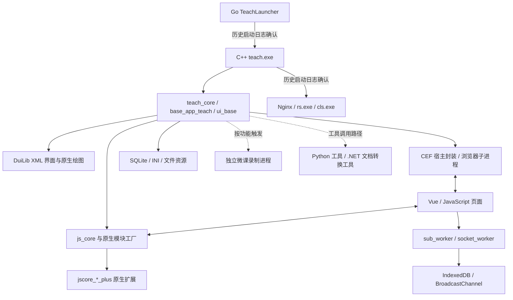

# Datedu / C30 当前版本：语言与架构深度分析

分析日期：2026-09-17。唯一版本范围：**1.3.1610.0**。

## 1. 结论

C30 当前部署是一套以 **Windows 原生 C++ 教学核心**为中心的多语言、多进程桌面系统：Go 负责部分启动工具，CEF 承载 JavaScript / Vue 界面，C++ DLL 实现本机能力和扩展模块，Python 工具处理部分外围任务，C#/.NET 工具承担文档转换，Nginx 和原生 RS/CLS 服务参与本地服务体系。

它的核心组织方式可概括为：**原生业务模块 + 浏览器界面 + 对象化 JS 桥接 + 可加载原生扩展 + 独立功能进程 + 多层本地状态存储**。

这轮补充和修正了先前整体扫描中尚不明确的几点：

1. **已确认的主启动链为 `TeachLauncher.exe → teach.exe`**，不能将另一个 Go 程序 `teachingtools_teach.exe` 自动插入主链。
2. **当前授课版本自身就有 C#/.NET 程序**，位于 `word2pdf`，无需借助版本范围之外的备课插件解释 .NET 的存在。
3. **`py_utils.exe` 是 Python 3.7 的 PyInstaller 包**，不是仅凭文件名推测。
4. **CEF 存在多个宿主/封装组件**；`soft_cefclient.exe` 只是其中一个部署文件，不能将全部网页都认定为由它运行。
5. **Node.js 服务随包存在，但本次核查的启动日志没有证明它启动**；Nginx、RS、CLS 有明确的启动记录。
6. **JS 原生扩展加载与命名管道有实际日志证据**，已不止于文件名或接口字符串线索。

## 2. 当前版本的认定及范围

`Datedu/teach/AppData/launcher.ini:2-3` 的 `last_start_verion` 和 `new_verion` 均为 `1.3.1610.0`。

`Datedu/teach/launcher_logs/20260917071114-13164.log:11-14` 进一步记录启动该版本：

```text
TeachLauncher
  → <安装目录>/teach/1.3.1610.0/teach/teachingtools/teach.exe
       --from teachlauncher --auto
  → 启动成功记录
```

历史日志中的安装位置是 `D:\Program Files (x86)\Datedu`，研究副本位于 `D:\WebstormProjects\Datedu`。文中按相对布局理解路径，不将这两个位置混为同一个正在运行的安装。

当前开发机进程查询没有找到对应的 C30 进程。因此“当前版本”指**配置选中且最新启动日志证明使用的版本**，不是本轮捕获的一棵实时进程树。

分析范围包含该版本目录、直接负责启动它的 `teach/TeachLauncher.exe`、与它关联的共用配置/数据库，以及上述启动日志。不分析闲置旧版本，不作跨版本对比；独立 `znbk` 备课产品树也不纳入本轮架构归属。

下文简写：

- `V` = `D:\WebstormProjects\Datedu\teach\1.3.1610.0`
- `T` = `V\teach\teachingtools`
- `S` = `V\teach\server`
- `A` = `D:\WebstormProjects\Datedu\teach\AppData\teach`
- `L` = `T\Log\interact\20260917\20260917071114-14204.log`

本轮只读样本和历史记录，离线解析 PE、CLR 元数据、PyInstaller 包目录及 SQLite 表名，没有启动样本、执行其中的脚本或读取数据库用户行。分析文件写在 NPEduTools 中。

## 3. 部署规模和位数

仅 `V` 内统计到 **14,190 个文件、1,085,512,454 字节，约 1.01 GiB**，其中 3,455 个 JS、205 个 HTML、572 个 CSS、284 个 XML。包括依赖、图片、缓存与日志，不能当作源码行数或业务规模。

对 `.exe`、`.dll`、`.ocx` 扩展名的 388 个文件解析 PE 头：

| 指标 | 结果 | 解释 |
| --- | ---: | --- |
| Machine = `0x14c` | 384 | PE 的 x86 标记；托管程序还需结合 CLR flags |
| Machine = `0x8664` | 4 | x64 文件 |
| 存在 CLR 目录 | 12 | 含托管工具、依赖和 MFC 托管支持组件 |
| 没有 CLR 目录 | 376 | 包括原生程序，也包括 Go、Python 打包启动器；不能全部标为 C++ |

4 个 x64 文件为 `Magnifier.exe` 及 `server/cls` 中的 `libprotobuf-lite.dll`、`libprotobuf.dll`、`libprotoc.dll`。`cls.exe` 自身为 x86，且其静态导入没有这些 Protobuf DLL。因此“这些库随包存在”不等于“x86 cls.exe 会把它们直接加载进进程”；具体用途未确认。

还发现 **`T/soft.dat` 实际是 x86 PE 可执行映像**，不是普通数据文件。它没有 DLL 标志，导入 libcef；因为扩展名不同，不在上表 388 个文件的统计中。此例说明只按扩展名盘点会漏掉可执行内容。

## 4. 语言和运行时分布

| 语言 / 技术 | 已确认位置 | 主要证据 | 判断边界 |
| --- | --- | --- | --- |
| C++ / Windows 原生 | teach、教学/绘图/界面/通信 DLL | C++ 修饰导出、类与工厂名称、MFC/CRT/Win32 导入 | 无法给出每个原生文件的完整源码语言占比 |
| Go | TeachLauncher、teachingtools_teach | Go build ID、runtime.main/goexit、Go 版本字符串 | 仅前者有本次主启动链证据 |
| JavaScript | public_web、Node 服务代码 | 可读 JS、打包模块、Worker、桥接封装 | 部分源语言可能为 TypeScript，交付形态仍为 JS |
| Vue 2 | mainProject 等前端 | 主项目 bundle 内明确 `Vue.js v2.6.12` | 不代表所有独立页面使用同一 Vue 版本 |
| Python 3.7 | py_utils.exe | PyInstaller 包目录、`python37.dll`、版本字段 307、py_utils 脚本入口 | 尚未反编译其完整业务代码 |
| C# / .NET Framework | word2pdf/*.exe | CLR 元数据、mscorlib/System 引用、C# 编译器生成类型名 | C# 是强推断；托管代码身份是直接证据 |
| C / C++ 第三方实现 | CEF、Nginx、媒体及压缩/网络库 | 部署文件、版本资源、导入/导出 | 不是据此推定 C30 全部业务使用这些库 |
| XML / INI / JSON / Protobuf | skin、conf、AppData、cls.proto | 直接可读的 UI、配置与结构定义 | 属于界面描述/配置/数据契约，并非全部为编程语言 |

### 4.1 Go：启动管理工具，而非整个应用框架

`TeachLauncher.exe` 含 `Go build ID`、`runtime.main`、`runtime.goexit` 和 `go1.18` 标记。它在最新启动日志中选择当前版本并直接启动 `teach.exe`。启动日志还包含安装状态和进程/防火墙项管理相关活动，因此它是部署与生命周期辅助层的一部分。

`teachingtools_teach.exe` 含相同 Go 特征及 `go1.14.3` 标记，但没有足够证据把它定义为每次启动必经的守护进程。版本字符串是包内构建线索，不表示当前机器安装了相同版本 Go，也不表示运行时需要外部 Go 环境。

### 4.2 C++：产品的原生核心

`teach.exe` 直接导入 `teach_core.dll`、`ui_base.dll`、`DuiLib.dll`、`http_svc.dll` 等。多个业务 DLL 中大量出现类方法修饰名、`std::string` / 容器类型，以及 `mfc110u.dll`、`MSVCR110.dll`、`MSVCP110.dll` 导入，明确体现 C++ 和 MFC 相关构建体系。

不能根据某个 DLL 的版本资源推定所有组件统一构建。例如当前主程序版本是 1.3.1610.0，而 `js_core.dll` 自身的文件版本为 1.0.0.642，`base_draw.dll` 为 1.0.0.534。产品版本和内部库版本分别维护。

### 4.3 Python：打包为可执行工具

`py_utils.exe` 的 PyInstaller 包目录包含 1,064 个条目，脚本类型条目包括 bootstrap、若干 runtime hooks 和业务入口 `py_utils`。包尾声明 `python37.dll` 及版本字段 307，支持 Python 3.7 的判断；未从这些字段确定具体补丁版本。

现有原生代码字符串包含调用 `py_utils.exe upload_file ...` 的模板，说明至少有外围上传工具路径。不能仅因包中带有 tkinter、multiprocessing 等 hook 就断言它实际承担独立 GUI 或大量并行工作；这些也可能来自打包依赖。

### 4.4 C#/.NET：文档处理是明确的子系统

当前 `T/word2pdf` 内有 `word2pdf35/40.exe`、`office2img35/40.exe`、`ppt2image35/40.exe`。

离线 CLR 元数据表现为：

| 分组 | 元数据和引用 | 可确认含义 |
| --- | --- | --- |
| 名称含 35 的工具 | `v2.0.50727`，mscorlib 2.0、System.Web.Extensions 3.5 | .NET Framework 3.5 相关引用，使用 CLR 2 系列元数据 |
| 名称含 40 的工具 | `v4.0.30319`，mscorlib/System 4.0 | CLR 4 / Framework 4 系列 |
| Word / 通用 Office 转换 | Aspose.Slides 16.8、Aspose.Words 17.7 引用 | 部分转换通过文档库实现 |
| PPT 图像转换 | Office Interop 引用或嵌入的 PowerPoint 互操作类型 | 存在 Office 自动化路径 |

类型定义包含 `word2pdf.Program`、`ConvertFactory`、`ConvertPPT`、`ConvertWord`、`IOfficeConvert`，以及 `<>f__AnonymousType...`、`<>c__DisplayClass...` 这类 C# 编译产物特征。

`ppt2image40.exe` 不在 AssemblyRef 中单列 Office 程序集，但 TypeDef 中有嵌入的 `Microsoft.Office.Interop.PowerPoint` 类型，不能因此认为它完全不使用 Office 互操作。上述布局也不能证明每次转换都依赖本机 PowerPoint，需按具体工具区分。

## 5. 系统分层与进程边界



图表达职责与已观察的联系，不是声明所有模块均为直接静态依赖，或所有辅助进程都在同一时刻运行。

### 5.1 原生模块并非严格独立的“微服务”

代表性的直接依赖关系为：

```text
teach.exe
  → teach_core / ui_base / DuiLib / http_svc
teach_core.dll
  → base_app_teach / ui_base / base_draw / js_core / net_interact
base_app_teach.dll
  → ui_base / base_draw / js_core / dt_common / SQLite
ui_base.dll
  → js_core / base_draw / d2ui_draw / 多个 FFmpeg 库
wb_core.dll
  → d2_core / d2_common / DuiLib / SDL2 / glew32
```

`ui_base` 既包含界面，又依赖视频、设备、绘图等能力；`base_app_teach` 与教学业务、文件和数据库也有交叉。更准确的描述是**共享基础库和业务库形成的原生组件体系**，而不是层与层之间完全解耦。

`teach_core.dll` 有 44 个命名导出，`base_app_teach.dll` 有 167 个，`js_core.dll` 有 35 个；`ui_base`、`base_draw`、`d2_*` 则暴露较多 C++ 类方法。导出数只是 ABI 表面积，不等于功能数。

### 5.2 独立进程用于部分重任务和服务

当前版本主程序日志 `L` 有：

- `:166` / `:268`：把 rs、cls 加入 ProcessGuard。
- `:336-338`：启动当前版本 Nginx，并记录 CreateProcess 成功。
- `:597` / `:610`：启动 rs、cls 的路径。
- `:163-164`：尝试处理 nodew 进程时记录未找到；同一日志没有找到 nodew 的启动记录。

这支持“有本地进程守护和服务组织”，但不能恢复其全部健康检查、退出顺序或重启策略。启动日志里按进程名进行清理的操作也说明这些组件并不完全依靠隔离的服务管理器；本轮只是读取日志，没有执行其中的命令。

微课录制已在 [专项报告](DATEDU-MICROLESSON-RECORDING.md) 中确认使用独立 `screen_capture_main.exe`。类似的文件分布还包括白板、电子书、投屏、后台执行器等入口，但各自是否在当前现场常驻，不能仅凭 EXE 存在下结论。

## 6. 界面架构：原生 XML 与 CEF 网页并存

### 6.1 原生 UI

`skin` 中大量 XML 描述 `Window`、`VerticalLayout`、`HorizontalLayout`、`Button`、`Combo` 等控件。结合 DuiLib 导入，这些是原生界面布局资源。

MFC、DuiLib 和 Win32 并不互斥：同一产品可以用 MFC/Win32 管理窗口与消息、用 DuiLib 描述部分控件，再嵌入 CEF 页面。微课浮窗就是可直接核查的 XML 界面实例。

白板与绘图也有独立原生体系：`base_draw`、`d2_core`、`d2_common`、`d2ui_draw`、`wb_core`。`render-skia.dll` 导出 `CreateInstance_P`、`CreateSVGCanvas`；`wb_core` 有白板窗口、绘图/擦除配置与管理器导出。不能将全部书写渲染都归给网页 Canvas。

### 6.2 CEF 宿主不只有一个文件

| 文件 | 静态证据 / 实际日志 | 当前判断 |
| --- | --- | --- |
| `cefsimple_sub.exe` | 直接导入 libcef；当前版本有大量对应日志和命名管道创建记录 | 明确参与浏览器子进程体系 |
| `ubrnew.dll` | 导入 libcef；导出 UBRCefInit、UBRCreateCEFMainBrowser、UBRExecJS 等 | 常规浏览器宿主封装 |
| `browser_skia.dll` | 导入 libcef；导出 OSR_CefStartup、OSR_CreateCEFMainBrowser 等 | 另一套带 OSR 命名的封装；具体窗口使用范围未全部确认 |
| `soft_cefclient.exe` | CEF Client 版本资源、libcef 导入 | 随包存在，未证实它是本次主界面的唯一宿主 |
| `soft.dat` | 无 DLL 标志的 x86 PE，导入 libcef | 非标准扩展名的可执行映像；具体调用路径待确认 |

CEF 版本资源明确为 `109.1.18+gf1c41e4+chromium-109.0.5414.120`。上述文件的存在说明宿主封装有多条路径，不证明所有页面都使用离屏渲染或相同 GPU 策略。

`conf/c30_desktop.ini` 指定 `application_desktop` 和 `public_web/vue_projects/mainProject/index.html`。同日 CEF 日志中的源 URL 也来自 `mainProject`，以及登录、开课设置、clientDesktop 等页面，证明这是实际使用过的前端材料。

相比之下，`conf/app.ini` 引用 `public_web/vue_projects/c30Desktop/index.html`，该路径在本轮目录检查中未出现相应一级项目目录。应将其视为待验证配置路径，不与有日志证据的 mainProject 等量齐观。

## 7. 网页语言、构建与前端运行结构

### 7.1 不是一份网页包覆盖所有界面

`public_web/vue_projects` 含 29 个一级项目目录。mainProject、login、clientDesktop、homework、clipWeike、限时练习、互动报告等分别保留 HTML、JS chunk 和资源。

mainProject 的 `index.html` 引用共享 DLL bundle、`chunk-vendors.js`、`app.js` 和动态 chunk。这里名称中的 `.dll.js` 是前端打包文件，**不是 Windows DLL**。

`mainProject/vendors-dll/dt.mainProject.plugins.dll.js` 头部明确写有 `Vue.js v2.6.12`。公共旧式资源 `assets_js/vue/vue.min.js` 则标注 2.5.1；这些资源在同一当前部署内并存，不能以一个 Vue 版本概括所有独立页面。

HTML 的应用名称包含 `@iclass/vue-multiProjects-ts`，说明存在 TypeScript 多项目构建命名线索。但版本目录里找到的 4 个 `.ts` 都是 Node 依赖的 `.d.ts` 声明文件，未找到主业务 `.ts` 或 `.vue` 源文件。因此不能精确判断业务 TS 占比，也不能从文件名直接认定全部前端以 TS 编写。

### 7.2 两类 Web Worker 分担后台工作

主项目 app.js 确实通过 `new Worker(this.workerPath)` 创建 Worker：

| Worker | 已见消息类型 | 已见职责 |
| --- | --- | --- |
| `sub.worker.js` | connect、loginInfo、getTeaClasslist、getAutoRunCCApp、getCefinjectCode、checkHotUpdate | 基础数据、缓存、注入代码组织和应用版本检查 |
| `socket.worker.js` | create、connect、disconnect、reconnect、startIM、destroyIM、online_change | 实时消息连接与状态协调 |

`socket.worker` 导入 Socket.IO、MobileIMSDK 相关脚本、消息封装和 BroadcastChannel 工具。仅凭这些代码，不能将所有实时通信简化成一个原生 WebSocket，也没有验证服务器实现。

`sub.worker` 使用 IndexedDB，`LocalService` 在网页内部通过 `local_service` BroadcastChannel 接收命令。此处的 LocalService **不是一个独立 Node/HTTP 服务**。

### 7.3 网页资源具备更新与注入机制

`checkupdate.class.js` 在启动时检查版本，随后以 `3e4` ms 间隔检查；调用配置 rooturl 下的 `/appmgr/update/getNewVersionInfo`，并将 `checkHotUpdate` 消息传回 UI。该 30 秒周期只适用于这段应用资源检查代码，不代表整个原生程序每 30 秒自动升级。

`cefinject.class.js` 区分本地脚本与在线路径，并能生成脚本链接或代码形式的注入内容。结合多项目资源和配置，可推断前端具有一定独立更新能力；下载验证、缓存回滚和版本兼容的完整机制尚未核实。

## 8. JavaScript 与 C++ 如何协作

### 8.1 两套可见封装

较直接的消息封装在 `assets_js/tools.js:1-22`：

```text
call_client(tag, msg)
  → call_cplus('mirco.call_cplus', tag, msg)
  → cef.message.sendMessage(cmd, [msg, tag])
```

对象化封装在 `mainProject/mainProject/libs/cefInject/win_core.js`：

```text
wincore.<module>:<sync|async>:<method>:<uuid>
  → cef.message.sendMessage(methodId, [payload, callbackTag])
  ← wincore.onCallback / wincore.onAyncNotify
```

对象通常包含 `module_name`、`name`、`uuid`；`create` 获得原生对象身份，业务方法传 JSON 数据，`release` 释放对象。同步封装直接返回结果；异步封装结合标签及事件监听处理回调。

这是“网页对象代理到原生能力”的架构，不是直接把 DLL ABI 暴露成普通 JavaScript 函数。普通浏览器打开页面缺少宿主提供的 cef 对象、原生注册模块和生命周期上下文，不能完整复现应用行为。

### 8.2 模块能力覆盖面

单个 win_core.js 中定义 24 类模块；显式 this 形式调用提取到 150 个去重方法名。统计是词法索引，不是完整 API 文档。

| 能力类别 | 模块实例 |
| --- | --- |
| 系统和文件 | System、Disk、DiskSearch |
| 窗口与网页 | BrowserForm、WindowForm |
| 绘图/白板/电子书 | InkView、WBForm、EBookForm、PdfDocument |
| 数据与网络 | SQLite、HttpUtils、HttpDownload |
| 对象存储 | OSSUpload、OBSUpload、OSSDownload |
| 音视频 | LivePlayer、LiveRecorder、LiveSession、VideoRecorder、FFmpegCmd |
| 事件与分发 | AsyncEvent、Mutlicaster、LiveBoardcast 等 |

这里 `OBSUpload` 是对象存储相关命名，不能与 OBS Studio 录屏软件混淆。

### 8.3 原生模块工厂和 Plus 插件契约

`js_core.dll` 导出 `DT_RegisteFoctory`、`DT_QueryFoctory`、`DT_QueryJSCoreModuleByName`、`DT_JSCore_CallJsMsg` 等。保留原符号拼写，体现工厂注册、模块检索和消息调用体系。

`jscore_c30desktop_plus.dll`、`jscore_ffmpegcmd.dll` 均导出：

```text
DT_JSCore_Plus_DllLoad
DT_JSCore_Plus_DllUnload
```

js_core 中还有“找不到上述入口”的错误字符串。这是一组明确的动态扩展约定，而不是泛泛猜测“支持插件”。

**实际运行证据**：`L:393` 与 `Log/cef/20260917071120_14204.log:13` 在同一时刻记录从 JS 侧发起 `load_jscore_plus`，模块为 `C30DesktopPlus`，路径为 `jscore_c30desktop_plus.dll`。因此可以把“网页请求原生扩展加载”列为当前版本已观察行为。

但仅有导出名不够确定参数布局、C++ 对象接口、线程规则和内存释放约定，也不能把它直接当作受支持的外部 SDK。

## 9. 通信不止一种

| 边界 | 已找到机制 | 证据强度 |
| --- | --- | --- |
| 网页 → 原生业务 | cef.message / wincore JSON 调用 | 脚本 + 双侧日志 |
| CEF 子进程相关 IPC | 命名管道、CPipeServer/CPipeWriter | 二进制字符串 + 实际 CreatePipe 日志 |
| 窗口/功能进程控制 | HandleCopyData、结构化控制消息 | 微课录制进程日志 |
| 页面/Worker 之间 | postMessage、BroadcastChannel、事件封装 | 可读 JS |
| 本地资源/服务 | HTTP、Nginx、RS/CLS 配置及启动 | 配置 + 启动日志 |
| 实时消息/投屏 | Socket.IO/MobileIMSDK、RTSP/RTP、相关原生库 | 脚本、配置和导出；全部活动路径未核实 |

命名管道的具体例子：`Log/cefsimple_sub/20260917163251_14404.log:24` 记录创建 `\\.\pipe\datedu_wincore.xx14404`。文件 `cefsimple_sub.exe` 含 CPipeServer 字符串，`browser_skia.dll` 含 CPipeWriter 和相同管道前缀。

这支持带子进程 PID 后缀的管道命名及两侧读写结构；**不能由这一条日志证明所有 wincore 消息都经过该管道，或推定完整报文帧格式、重连行为和外部可调用性**。

## 10. 本地服务与存储架构

### 10.1 本次启动有 Nginx、RS、CLS 证据

Nginx 配置提供静态文件、资源目录和代理路径。RS 配置包含 TCP 19561、HTTP 19560、RTP 19000，另有 DS 的 8010/8011 配置项；这些是配置值，不是当前开发机实际监听的证明。

`cls.proto` 定义 UserInfo/UserList、题目、作答、分组、统计、互评与点赞等 15 个 message。它是课堂数据契约的重要部分，不能独自说明所有线上或本地传输协议。

### 10.2 Node 是部署中的候选服务，不应自动加入已证实运行链

`S/nodeweb/nodew.exe` 的文件版本为 6.2.0。package.json 声明 Express `~4.16.0`、Jade 等依赖；app.js 为静态目录及少量路由服务，`bin/www` 默认端口为 9022。

Nginx 配置同样写有 9022。前一轮仅看到配置时无法解释是否冲突；本轮启动日志发现 Nginx 被启动，而 nodew 没有启动证据，因此**不能再把“二者同时占用 9022”当作既成事实**。是否存在选择、兼容或其他功能触发路径仍待确认。

### 10.3 状态分散在多种介质

| 存储层 | 已见内容 | 用途判断 |
| --- | --- | --- |
| INI / JSON / 渠道配置 | launcher、userset、videorecordset、client_conf 等 | 版本选择、偏好、功能和渠道配置 |
| SQLite | `A/MCV/userData.db3` | 教师/登录、资源记录、课堂材料等结构 |
| IndexedDB | baseinfo、cachelist、storage | 前端基础数据与本地缓存 |
| Chromium 数据目录 | CEF cache 等 | 浏览器自己的缓存与状态 |
| 普通文件 / Protobuf | 课堂数据、资源、录制输出 | 交换、持久化和媒体材料 |

mainProject 的代码将 `application` 和 `application_desktop` 映射到 `../../../AppData/teach/MCV/userData.db3`。按 T 解析后确实是 A 下的数据库，本轮以 SQLite 只读模式查询表名，得到：

```text
coursewareres, interact_draft, interact_info, loginlist,
resopenrecord, sparkresources, stulist, teachers, sqlite_sequence
```

没有读取这些表中的用户记录。

sub.worker 的 IndexedDB 定义则包括 `classlist`、`current`、`subjectlist`、`comGradelist`、`comSubjectlist`、`habit`，以及缓存、localStorage/sessionStorage 风格的存储表。这里还存在跨语言、跨介质的状态同步问题；本轮未验证其一致性或冲突解决策略。

## 11. 架构特征及研究价值

### 11.1 语言按任务分工，而非统一技术栈

可观察的职责分配是：启动/部署工具用 Go，原生交互和高频能力主要用 C++，界面和业务编排大量用 JS，文档转换用 .NET 库/Office 互操作，外围工具用 Python。这种组成有利于接入既有组件，但需要维护多种运行时、进程启动和数据转换边界。

这不等于“每种语言都必不可少”：部分工具可能只在特定功能触发时使用。尤其不能根据包内文件数量，推算某种语言运行时占用比例。

### 11.2 前端能调用较广泛的本机能力

wincore 模块覆盖窗口、文件、网络、数据库和媒体。业务页面可复用统一宿主能力，减少每个功能都重新开发原生 UI 的工作；相应地，页面对宿主对象、回调协议及版本兼容具有较强依赖。

所以单独替换网页、拿某个 DLL 做 P/Invoke，或移出原目录运行辅助 EXE，都可能遇到初始化和路径依赖。相对路径、共享配置和动态插件是应先确认的边界，不应被视作零依赖组件。

### 11.3 “多进程”与“多线程”同时存在

独立服务和录制工具提供进程级隔离；CEF 有自己的子进程；页面又使用 Worker，原生模块内部还有线程和事件调度。故障定位需逐层判断：主进程、CEF 渲染进程、Worker、功能工作进程、编码/设备线程、网络或磁盘，不能只看 teach.exe 是否还在。

### 11.4 文档和图形存在多条实现路径

原生白板与 CEF 页面并存，Office 库转换与 COM 互操作并存，CEF 也有不同封装。这说明产品在不同功能中采用了不同机制；不能把“某模块发现 Direct3D”外推为全软件统一 GPU 渲染，也不能把“发现 Aspose”外推为所有 PPT 都脱离 Office 运行。

## 12. 尚不能确定的事项

- 全量源码的语言占比、实际构建仓库组织和编译选项；当前只有产物。
- teachingtools_teach、soft.dat、soft_cefclient 的全部触发路径。
- 每个当前窗口使用 ubrnew、browser_skia 或其他封装的对应关系。
- 命名管道的完整帧协议、队列、同步调用等待与错误恢复。
- 原生 Plus 插件的完整 ABI、线程约定和外部支持状态。
- Node 服务在何种条件下启动，以及端口配置是否会被运行时改写。
- 前端热更新的完整下载、验证、回滚和跨版本兼容策略。
- 某次现场运行实际加载哪些 .NET/Python/媒体库，及各自资源占用。

现有 `cls.pdb` 可作为后续符号研究入口，但本轮没有验证 PDB 与 EXE 的 GUID/age 匹配。该版本只发现一个第三方 source-map 库的独立 `.map` 文件，不能据此恢复主业务 TS/Vue 源码；bundle 内嵌映射未全面检查。

## 13. 分析产物与复核入口

本轮材料位于 NPEduTools 的 `.artifacts/datedu-analysis/architecture-current/`，被现有 Git 忽略规则覆盖：

| 文件 | 内容 |
| --- | --- |
| `inventory.json` | 当前版本范围内的数量、类型和大小 |
| `pe-census.json` | 388 个按扩展名筛选的 PE 架构与 CLR 标记 |
| `component-metadata.json` | 40 个重点组件的 SHA-256、导入/导出及版本线索 |
| `cef-hosts.json` | soft.dat、ubrnew、cefsimple_sub、browser_skia 的补充元数据和管道线索 |
| `dotnet.json` | 6 个文档转换工具的 CLR 版本、引用程序集和类型名 |
| `python-archive.json` | Python 包版本与脚本入口目录摘要 |
| `bridge-modules.json` | wincore 模块及显式方法调用索引 |
| `storage-schema.json` | SQLite 数据库位置和只读表名结果 |

辅助扫描脚本：`.artifacts/datedu-analysis/architecture_probe.py`。其版本根目录固定为 1.3.1610.0，不读取旧版本；重点目标包含 soft.dat / ubrnew，按扩展名进行的全目录 PE 统计与重点目标统计分别保留。

与 NPEduTools 的集成研究应优先使用这里明确的进程、文件和数据边界；如果后续要直接调用内部接口，应先补齐该接口的契约和生命周期证据。**本轮完成的是当前版本的语言与组件架构重建，不是对其私有接口兼容性的承诺。**
