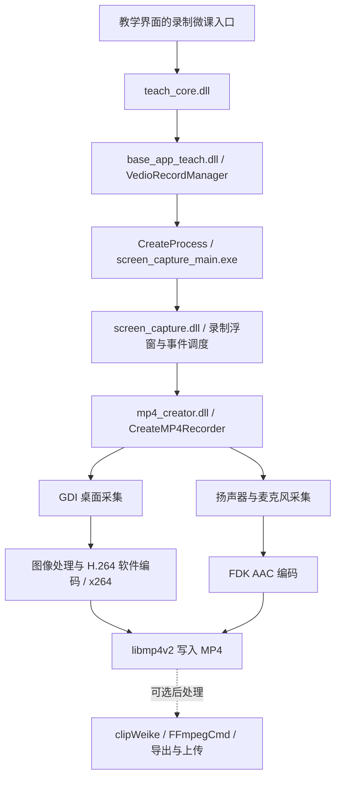

# C30 录制微课：实现链路与低负载原因研究

日期：2026-09-17。主要样本：`D:\WebstormProjects\Datedu\teach\1.3.1610.0\teach\teachingtools`。本报告承接 [Datedu 总体分析](DATEDU-ANALYSIS.md)。

## 结论先行

**当前最有力的解释是：C30 的这条微课录制路径以很低的帧率采集桌面，通过 x264 软件编码写入 MP4，实际工作量与可能的 OBS 4K 录制并不相同。**

这不是只从 DLL 名称作出的猜测。样本中的一份历史日志记录了：

- 采集区域：**2560 × 1440**。
- 启动参数：**fps=8、keyint=40**。
- 采集实现：**CGdiScreenCapturer**，并有持续的采集调用日志。
- 视频实现：**CXH264Encoder**；反汇编证实其初始化调用 x264。
- 音频实现：**CFdkAACEncoder**；采集回调记录 48 kHz、双声道。
- 封装实现：**CMp4v2**；组件导入 libmp4v2 的轨道创建、写样本及关闭函数。
- 从打开录制到请求停止约 **41 分 21 秒**，停止操作约 **1.65 秒**，随后编码器结束、进程进入退出流程。

因此，值得学习的主要是低帧率、明确的录制职责、独立工作进程和采集/音频/界面线程分工。**现有证据不能证明它具备特殊的 Intel 核显优化，也不能证明 OBS 假死就是 GPU 性能不足。**

用户提供的现场信息：Intel i7-1065G7、核显、无独显；C30 没有帧率选择项，能正常完成一节微课；OBS 当时可能设为 4K，其余编码设置未主动修改，版本和具体编码器已不记得。本文没有将“默认设置”推定为 x264 或 Intel QSV，也没有将这份日志的机器硬件身份视为已验证。

## 证据范围和可信度

本轮进行了配置/界面资源阅读、历史日志统计、PE 导入/导出分析，以及少量离线 x86 反汇编。没有启动 C30、加载其 DLL、改写其配置、访问云端接口或在当前开发机录屏。

证据分为三层：**日志事实**说明某一次运行实际记录了什么；**静态证据**说明二进制包含哪些实现和调用；**推断**用于解释负载差异。前两者仍不能替代成片检查和现场性能测量。

为便于定位，下文使用：

- `T` = `D:\WebstormProjects\Datedu\teach\1.3.1610.0\teach\teachingtools`
- `A` = `D:\WebstormProjects\Datedu\teach\AppData\teach`
- `M` = `T\Log\mp4\mp4_creator.log`
- `S` = `T\Log\screen_capture_main\20260916\20260916152617-13052.log`

## 一、确定是哪一种“录制”

C30 同时存在多种录制/传输功能，不能混用参数。

| 路径 | 主要材料 | 本轮判断 |
| --- | --- | --- |
| 录制微课 | `screen_capture_main.exe`、`screen_capture.dll`、`mp4_creator.dll`、`videorecordset.ini` | 本次重点，存在完整历史录制日志 |
| 投屏/实时传输 | `castrecorder.exe`、`rtsp_media.dll`、`castrecorder.ini` | 另一条链路；castrecorder 导入 `CreateWinVideoRecorder` |
| 白板录制相关界面 | `skin/xml_wb/wb_record_toolbar.xml` 等 | 存在独立资源，未证明与本次微课完全相同 |
| 微课剪辑/导出 | `public_web/vue_projects/clipWeike`、`jscore_ffmpegcmd.dll` | 录制后的编辑处理 |

特别注意：`castrecorder.ini` 中的 12 fps、5 fps、`h264_opencl=0` 等配置**不能用来说明本次微课的实际参数**。本次微课的 8 fps 来自自己的 MP4 录制日志。

`wincore.VideoRecorder.start_record()` 是前端存在的一个通用桥接入口，但本轮没有证实每个调用都进入同一实现。以下主链路以微课专用进程、原生导入关系和日志为依据。

## 二、主调用链



图是组件级重建，不代表完整的逐函数调用图。图像处理与音频混合内部的全部缓冲/调度实现尚未恢复。

### 2.1 主程序负责发起和管理

`teach_core.dll` 直接导入 `base_app_teach.dll` 的：

- `VedioRecordManager::OpenVideoRecord`
- `VedioRecordManager::StopVideoRecord`
- `VedioRecordManager::GetVideoRecordState`
- `VedioRecordManager::UpdateBackWnd`
- `CVideoRecordSetData::SetVideoRecordIniDir`

原符号确实拼写为 `VedioRecordManager`。其 `ExecuteScreenRecord` 导出函数位于 `base_app_teach.dll` RVA `0x19da0`；离线反汇编可见 CreateProcess 调用。邻近控制字符串包括 `createwnd`、`showfloatview`、`closewnd`、`getvideorecordstate`、`exsit` 和 `showaudioset`。

`S:2` 实际启动消息包含 `sortid=createwnd`、`wnd_name=application`；后续通过 `CMainFrame::HandleCopyData` 处理控制数据。说明这里确实有独立进程和窗口消息控制，尚不能当作有稳定兼容承诺的第三方 API。

### 2.2 专用录制进程加载录制组件

`screen_capture_main.exe` 静态导入 `screen_capture.dll` 的 `DT_CreateVideoRecordFloatView`、`DT_Mp4Creator_StopRecorder`、`DT_GetScreenCaptureSettingData` 和 `DT_ShowAudioSetWnd`。

`screen_capture.dll` 包含 `CMP4Creator::StartRecorder`、`CStartScreenRecordEvent`、`COpenScreenRecordEvent`、`CStopScreenRecordEvent`。其动态加载字符串包括 `mp4_creator.dll`、`CreateMP4Recorder`、`CreateH264Recorder`、`ConvertMediaToMp4`；本次运行日志明确落在 `CWinMp4Recorder` / `CMp4Recorder` 分支。

独立工作进程可以把录制生命周期与教学界面分开，但两者仍共享 CPU、GPU、内存和磁盘资源。它不是“不可能假死”的保证。

## 三、实际视频采集和编码

### 3.1 本次采用 GDI 桌面采集

`M:16-17` 为 `CGdiScreenCapturer::Init`；从 `M:23` 起持续出现 `CGdiScreenCapturer::CaptureScreen`。

`mp4_creator.dll` 的相关离线反汇编可见 `GetDC`、`CreateCompatibleDC`、`CreateDIBSection`、`BitBlt`。例如在该文件首选 ImageBase `0x10000000` 下，`0x1001b1cc` 调用导入的 `GDI32!BitBlt`。这些地址仅对本次样本有效，不能直接作为运行时固定地址。

目录中另有 `desktop_capture.dll`，包含 DXGI/D3D11 和 GDI 实现；但本次日志指向 MP4 组件内部的 `CGdiScreenCapturer`。不能因为目录里有 Desktop Duplication 就断言微课使用了它；也不能将 GDI 路径描述成完全不涉及 GPU、DWM 或显示驱动。

### 3.2 视频由 x264 软件编码

`mp4_creator.dll` 直接导入：

```text
x264_param_default
x264_param_apply_profile
x264_encoder_open_164
x264_picture_alloc
x264_encoder_headers
x264_encoder_encode
x264_encoder_close
```

`M:18-19` 记录 `CXH264Encoder::Init` 成功走完；对应初始化反汇编在 RVA `0xe082` 调用 `x264_param_default`，在 RVA `0xe0a8` 调用 `x264_param_apply_profile`（传入 `baseline` 字符串），在 RVA `0xe24b` 调用 `x264_encoder_open_164`。

这比单纯发现 x264.dll 更强，支持本次录制使用 x264。初始化过程中还有参数字段赋值，因此未将 `baseline` 调用等同于已经读到最终成片的 Profile。暂未完整还原码率控制、QP/CRF、线程数、B 帧和最终 profile。

组件内含 `ultrafast`、`veryfast`、`zerolatency` 字符串，但没有足够证据证明本次实时录制选择了其中哪个 preset。后处理路径明确出现 `-preset ultrafast`，也不能反推实时编码必然采用同一设置。

### 3.3 帧率低是已经验证的关键差异

`M:15` 原文为：

```text
[CWinMp4Recorder::StartVideo] fps=8 keyint=40
```

8 fps 对应目标帧间隔 125 ms。若 keyint 以帧计，40 帧对应约 5 秒；这里不将它当作成片实际关键帧分布的测量结果。

`A/videorecordset.ini` 没有显式 FPS、QP 或 RF 值，但原生 `CVideoRecordSetData` 有相应读取方法，`screen_capture.dll` 也包含这些配置键。说明界面不显示帧率，不代表内部没有帧率参数。**8 fps 是这次运行的实值，不能泛化为所有版本、画质档位或机器永远固定 8 fps。**

### 3.4 采集尺寸不等于最终编码尺寸

`M:2` 明确记录 `SetVideoCapturePos x=0 y=0 width=2560 height=1440`。这是输入采集区域。

录制组件具备图像缩放/处理能力：`screen_capture.dll` 导入 `ARGBScale`，`mp4_creator.dll` 导入 `YUV_ConvertToI420b`、`YUV_MixRGB` 和 `sws_scale`。这些导入能说明组件能力，不能证明每一帧都走某个特定函数。

本轮没有录制成片可供解析，也尚未完整还原画质档位到编码尺寸的映射，因此**不把 2560×1440 写成已确认的 MP4 输出分辨率**。

## 四、音频与 MP4 保存

保存配置 `Audio=3`；同次日志 `M:3` 为 `mode=3`。界面提供扬声器、麦克风、扬声器+麦克风三种选择，默认界面选中第三项。日志同时出现两次音频设备启动和停止序列，支持双音源采集的判断。

`M:21` 的回调记录为 `nSamples=480`、`nChannels=2`、`samplesPerSec=48000`；一次回调约覆盖 10 ms 音频。最终音轨的采样率、声道布局仍以成片为准。

`mp4_creator.dll` 通过 `lame.dll!CreateAudioRecord` 获取音频采集能力，并包含动态加载 `libfdk-aac-1.dll` 及 `aacEncOpen`、`aacEncoder_SetParam`、`aacEncEncode` 等函数名；`M:22` 确认初始化了 `CFdkAACEncoder`。因此不能仅凭 `lame.dll` 文件名认为成片音频是 MP3。

`CMp4v2::open` 与 libmp4v2 的 `MP4Create`、`MP4AddH264VideoTrack`、`MP4AddAudioTrack`、`MP4WriteSample`、`MP4Close` 导入共同说明 H.264 / AAC 最终进入 MP4 封装。日志有关闭阶段 a/b/c 和编码器 Finit，但没有对写入失败后的恢复、队列上限、断电后可恢复性进行验证。

当前保存配置指向公共视频目录 `C:\Users\Public\Videos`，原始值为 URL 编码路径。录制组件有时间格式 `%Y-%m-%d-` 和 `.mp4` 文件名构造线索。日志里的 `D:/temp/*.tmp` 是临时文件操作，不足以把最终输出路径认定为 D 盘临时目录。

## 五、设置界面与录制状态流程

界面证据：`T/skin/xml/videorecord_settingview.xml`、`videorecord_floatview.xml`。

| 设置 | 界面提供内容 | 当前保存值 |
| --- | --- | --- |
| 录制区域 | 全屏、4:3、16:9、自定义 | `Scale=0`；同次日志采集区域为 2560×1440 |
| 画质 | 标清、高清、超清 | `Sharp=1`；界面默认选中高清，最终编码尺寸未确定 |
| 帧率 | 没有可见帧率控件 | INI 未显式保存 FPS；本次运行 8 fps |
| 音频 | 扬声器、麦克风、两者 | `Audio=3` |
| 画中画 | 关闭、开启并显示、开启并隐藏 | `DrawInDraw=0` |
| 剪辑 | 完成后进入剪辑工具的开关 | `OpenClipTool=0`，与 XML 初始默认开启不同 |
| 时间提示 / 水印 / 鼠标高亮 | 可配置 | 保存值均为 1 |

可复原的顺序是：打开录制窗口 → 检查保存相关条件 → 初始化采集/音频/编码器 → 约 3 秒后打开实际录制 → 持续采集 → 请求停止 → 停止音频与录制、关闭 MP4/编码器 → 退出或进入后处理。

浮窗 XML 标注开始快捷键 F9，并包含开始、关闭、预览、设置按钮。组件另有暂停/继续资源和相关处理线索，但本次约 41 分钟日志没有足够材料验证暂停时的时间戳补偿细节。

### 历史会话的时序

| 事件 | 时间 | 证据 |
| --- | --- | --- |
| 初始化开始 | 15:26:19.814 | `S:24` |
| 初始化结束 | 15:26:20.101 | `S:25` |
| 打开实际录制 | 15:26:23.119–23.124 | `S:28-29`、`M:20` |
| 请求停止 | 16:07:44.108 | `S:32` |
| 停止结束 | 16:07:45.760 | `S:33` |
| 退出工作管理器 | 16:07:45.873 | `S:45` |

初始化约 287 ms，随后约 3.02 秒间隔符合准备/倒计时阶段的解释；倒计时语义属于推断。另一份同日 14:20 会话也记录了约 45 分 35 秒后完成停止，但它没有本次同等完整的 MP4 性能日志可供对照。

不同日志线程 ID 分别承担主窗口、录制控制、屏幕采集和音频回调/编码工作。这证明有线程分工，但没有证实其缓冲队列为有界、采用哪种丢帧策略或避免死锁的具体机制。

## 六、41 分钟日志的连续性统计

对 `M` 共 19,300 行作只读统计，筛选精确包含 `CGdiScreenCapturer::CaptureScreen` 的行，并计算相邻时刻差值：

| 指标 | 结果 |
| --- | ---: |
| 采集日志记录数 | 18,756 |
| 第一条 | 15:26:23.260 |
| 最后一条 | 16:07:44.907 |
| 覆盖时间 | 2481.647 秒 |
| 相邻间隔中位数 | 127 ms |
| 最大相邻间隔 | 249 ms |
| 按日志间隔算的平均调用频率 | 约 7.56 次/秒 |
| ERROR 行数 | 1 |

唯一 ERROR 位于启动阶段 `M:14`，为 `[ReadFromIni] error=2`；随后初始化、采集与关闭继续进行。没有充分依据将其解释成编码失败，也未证明具体缺失了哪个配置文件。

**本段日志没有秒级采集停顿，但“采集调用连续”不等于“最终视频零丢帧、音画完全同步”。** 7.56 次/秒也不是从成片测得的平均视频帧率，不能据此直接宣布丢帧率。最终文件可能具有自己的时间戳、补帧或调度行为。

## 七、为什么它可能比当时的 OBS 稳定

### 7.1 最强解释：输入工作量差异

以下以用户记忆中的 4K 为 3840×2160，并假设 OBS 分别采用 30 或 60 fps，仅比较“像素数 × 帧率”的规模：

| 假设场景 | 每秒像素量 | 相对 C30 已记录采集区域 × 8 fps |
| --- | ---: | ---: |
| C30：2560×1440 × 8 | 29.49 百万 | 1.00 倍 |
| OBS 假设：3840×2160 × 8 | 66.36 百万 | 2.25 倍 |
| OBS 假设：3840×2160 × 30 | 248.83 百万 | 8.44 倍 |
| OBS 假设：3840×2160 × 60 | 497.66 百万 | 16.88 倍 |

这些倍数是**工作规模指标**，不是 CPU/GPU 占用、编码耗时或故障概率的测量。OBS 实际帧率、基础画布与输出分辨率未知，C30 最终编码尺寸也未知。即便如此，8 fps 与 30/60 fps 的差异已足以解释为什么同一台机器可能只在其中一种设置下持续稳定。

8 fps 更偏向静态课件、板书和讲解；代价是快速动画、滚动和视频播放更不流畅。不能只比较“都录屏”，而忽略时间分辨率差异。

### 7.2 采集和渲染路径不同

C30 本次路径为 GDI 采集加软件 x264；OBS 官方说明其场景合成与渲染需要 GPU 资源，减少输出帧率/分辨率和简化场景可以降低负载。[OBS：Encoding Performance Troubleshooting](https://obsproject.com/kb/encoding-performance-troubleshooting)

据此可推断，C30 这次简单录制流程与 OBS 的场景合成流程可能有不同的驱动调用和资源竞争情况。但本轮未取得 OBS 日志，不能确定当时使用哪种显示器捕获后端、是否有额外滤镜/源，或是否发生渲染延迟。

### 7.3 不能归因于“没有独显就录不了”

OBS 支持 Intel QSV；硬件编码与场景渲染是不同环节。软件 x264 则主要把编码任务交给 CPU。选择某个编码器并不自动消除其他阶段的瓶颈。[OBS：Hardware Encoding](https://obsproject.com/kb/hardware-encoding)

因此，可能的解释包括高像素/高帧率负载、编码器或显示驱动停顿、磁盘写入、音频设备与线程等待等。当前只能把低帧率与较小采集区域列为最有证据支持的差异，无法排序 OBS 假死的具体根因。

## 八、后处理与实时录制必须分开看

`public_web/vue_projects/clipWeike/js/chunk-0f5cc92d.js` 包含加载 `jscore_ffmpegcmd.dll`、创建 `wincore.FFmpegCmd`、监听 `on_process` / `on_complete`，以及 `shot_video`、`handle_video`、`stop_handle` 等调用。它将片段起止时间转换为毫秒，并输出 MP4。

`base_app_teach.dll` 另有 `VideoRecordEventThread::SaveToFlv`，邻近命令模板包含：

```text
-i <input> -max_muxing_queue_size 1024 -c:v libx264 -preset ultrafast -crf <value> -c:a copy <output>
```

这是后处理转码线索，并非证明实时录制通过启动 ffmpeg.exe 截屏。其队列参数也不能用来证明实时采集采用同样的缓冲策略。当前 `OpenClipTool=0` 表明保存配置关闭自动进入剪辑，是否与该历史会话完全一致未独立验证。

## 九、对后续实现的启发与验证方案

若 NPEduTools 后续增加轻量微课录制，值得优先做的原型是：独立录制工作进程、8–15 fps 可选、明确的采集/输出尺寸、麦克风和系统音频、可靠停止与文件结束写入。保留采集耗时、编码耗时、缓冲积压、丢帧和落盘状态，比仅显示一个计时器更有诊断价值。

这些是从现有证据提出的设计方向，不代表 C30 已实现所有列出的可靠性措施，也不需要复用其私有 DLL。具体选择 GDI、Desktop Duplication 或其他捕获 API，应通过目标大屏对比实验决定。

现场对照建议按阶段进行，每轮使用相同课件、音源、保存位置和约 45–60 分钟持续时间，避免并行录制相互干扰：

1. **建立真实基线**：拿一段 C30 成片读取分辨率、帧率/时间戳、编码器/码率、音轨参数与时长；保存同次日志。
2. **降低 OBS 工作量后复测**：新建简单场景，显式选择 8 fps 和可比输出尺寸，明确记录采用 x264 或 QSV。若成片参数尚未知，可先用 1920×1080 作为较低负载探索点，但不要称为严格等参数比较。
3. **单独更换编码器**：在其余参数保持一致的条件下比较 x264 与可用的 Intel QSV；这一步用于区分编码路径影响，不预设谁一定更稳定。
4. **逐步提高帧率/分辨率**：一次改变一个变量，观察故障何时出现。4K 是最后一组探索条件，不把它作为与 C30 已记录设置相同的基线。
5. **出现假死时保留证据**：记录准确时间、OBS 日志、CPU/内存/磁盘及 GPU 各引擎状态，区分界面无响应、渲染停顿、编码停顿和输出文件停止增长；必要时取得挂起进程转储再分析等待链。

本轮没有修改 OBS、没有执行这些实验，也没有重放 C30 的控制命令。

## 十、产物与尚未解决的问题

原生组件比较中，旧版与新版 `mp4_creator.dll`、`x264.dll`、`lame.dll` 内容相同；`base_app_teach.dll`、`screen_capture.dll` 有变化。这提示此次 CEF 升级并不等于 MP4 编码组件也升级，不能用浏览器版本解释全部录制差异。

尚未确认：画质三档到输出分辨率/质量参数的映射；FPS 的完整默认与覆盖规则；实际音频采集后端、混合/漂移校正；编码线程与帧队列上限；异常退出恢复；该日志与目标大屏硬件身份的对应；OBS 版本、捕获后端、编码器、帧率和假死时状态。

本地分析材料保存在 `.artifacts/datedu-analysis/recording/`（已有 Git 忽略规则覆盖）：

- `pe.json`：14 个相关二进制的 SHA-256、导入函数与导出地址。
- `*.strings.json`：相关字符串及文件偏移，供定位使用。
- `base-app-recording-disassembly.txt`：录制管理器和参数 getter 的离线反汇编。
- `screen_capture.dll.annotated.txt`、`mp4_creator.dll.annotated.txt`：按录制日志字符串定位的带导入注释反汇编。函数边界由邻近序言推定，非完整反编译源码。
- `log-summary-1.3.1610.0.json`：日志事件和采集间隔摘要；旧版 mp4 日志只有一行初始化信息，无法提供同等连续性分析。

辅助脚本：`.artifacts/datedu-analysis/recording_probe.py`、`disasm_recording.py`。分析依赖 pefile、Capstone 仅安装在该分析目录下，不进入产品依赖。

**本轮能够确认的是一条持续工作的低帧率微课录制实现，并解释它为何可能比更重的 OBS 配置轻。OBS 假死的最终原因仍需现场日志或复现实验。**
