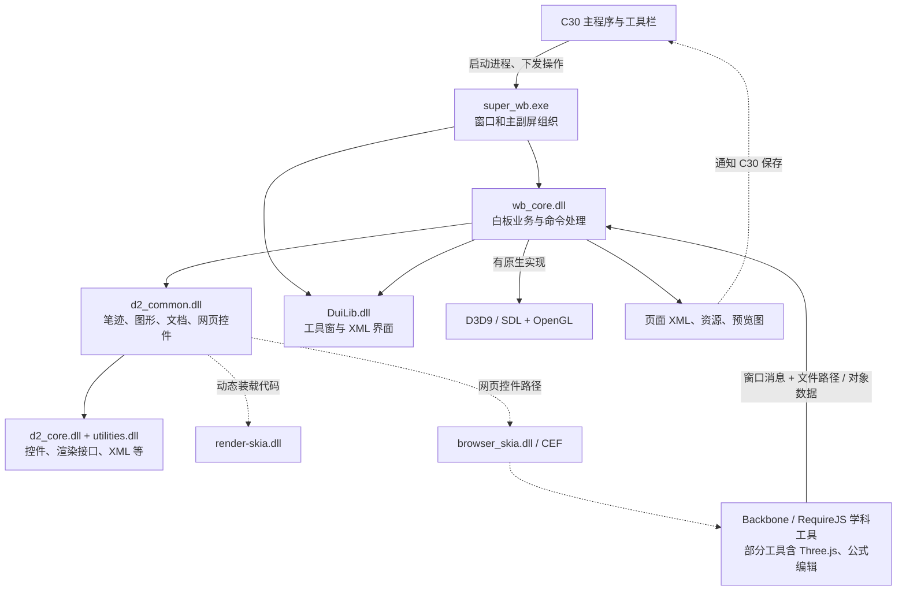

# Datedu／C30 超级白板深度分析

分析日期：2026-09-17  
限定部署版本：`teach/1.3.1610.0`  
研究对象：超级白板的启动、语言与组件、触摸书写、页面和对象、渲染、学科工具、保存及与 C30 的通信。

**核心结论：超级白板是一套以独立 C++ 进程为中心的教学画布系统。** `super_wb.exe` 负责窗口与主副屏组织，`wb_core.dll` 承担白板业务，`d2_common.dll`／`d2_core.dll` 提供笔迹、图形、文档和界面基础设施。部分学科工具通过内嵌网页工作，能够把图片或带数据的可编辑 H5 对象交回原生白板。当前代码还有按页保存 XML、关联资源和预览图的链路。

本次最有价值的新增证据，是白板回传 C30 的 `WM_COPYDATA` 调用、原生触摸注册调用、函数工具的可编辑对象插入代码，以及白板页面保存函数。这些证据比仅凭文件名判断架构更可靠。

## 1. 版本范围与证据等级

启动配置的 `last_start_verion` 和 `new_verion` 都指向 `1.3.1610.0`。该版本的主程序日志又直接记录了启动同目录 `super_wb.exe` 的完整命令。因此，本报告的“当前版本”指这套配置和实际启动记录共同确认的部署，不代表厂商全球最新发行版。[E1][E2]

本次查询研究电脑的进程列表，未发现正在运行的 `teach.exe`、`super_wb.exe` 或 `TeachLauncher.exe`。分析采用复制过来的当前部署文件和随附运行日志；没有重新启动 C30，也没有把历史日志写成现场实时测量。

| 证据等级 | 本报告中的含义 | 能证明什么 |
| --- | --- | --- |
| 运行记录 | 当前部署目录内的历史日志 | 某条启动、操作或处理路径曾被执行 |
| 代码证据 | 可读 JS、PE 导入导出、交叉引用和局部反汇编 | 当前二进制或网页实现中确实存在相应逻辑 |
| 结构证据 | C++ 类型信息、字符串、资源目录 | 组件具有相应设计和能力线索，未必在本次使用中启用 |
| 推断／待验证 | 结合以上材料作出的解释 | 不能替代运行时采样、完整源代码或导出文件实测 |

本轮只检查当前版本目录，以及它关联的共享 `teach/AppData` 配置。未分析其他部署版本。当前程序内部保留的兼容导入函数，也不作为其他版本实现的证据。

下文用 `T` 表示当前组件目录，用 `W` 表示其中的学科网页目录，实际位置见文末证据索引。所有原始日志中的人员信息、课件名称、登录载荷和笔迹坐标均不在报告中复述。

## 2. 整体架构与语言分工



实线中的直接 DLL 依赖和启动关系有静态或日志证据；虚线强调可选、动态或尚未取得运行时装载证明的路径。图不表示所有组件同时运行，也不表示每个像素必经所有节点。[E2][E4][E5]

| 组件 | 已确认的技术特征 | 白板中的主要职责 |
| --- | --- | --- |
| `super_wb.exe` | 原生 x86 PE，无 CLR 目录；C++ 类型和 `MSVCP110`／`MSVCR110` 依赖 | 命令行入口、主副屏管理、工具栏、与大屏主程序通信 |
| `wb_core.dll` | 原生 x86 C++，41 个具名导出 | 白板窗口、页面业务、操作分发、手势、保存和白板录制窗口 |
| `d2_common.dll` | 原生 x86 C++，2,851 个具名导出 | 手写画布、笔管理、几何对象、可缩放控件、浏览器／文档／视频控件 |
| `d2_core.dll` | 原生 x86 C++，2,228 个具名导出；组件版本 `2,9,0,3` | `D2UI` 控件、资源和渲染接口等基础设施 |
| `utilities.dll` | 原生 x86；含 `pugi::xml_document` 等导出 | XML、字符串等公共能力 |
| `DuiLib.dll` 与 XML 皮肤 | 原生界面库及声明式资源 | 工具条、缩略页、对话框等界面 |
| `render-skia.dll` | 有 `CreateInstance_P`、`CreateSVGCanvas` 导出 | 由 D2UI 的装载路径获取渲染／SVG 能力 |
| `W` 下的 JS／HTML | RequireJS、Backbone、jQuery、模板及学科库 | 函数、英语词典、单词卡、立体几何等局部工具 |

`MSVCP110` 等依赖说明采用了相应代际的 Visual C++ 运行库接口；单凭它们不能确定每个文件的完整构建工具链。组件自身的 `2,9,0,3` 也不是另一套 C30 部署版本。

本轮没有发现将白板主体归为 C#／WPF、Python 或 Electron 的依据。C30 整体包含多种语言，不等于每个子功能都使用那些语言；超级白板的直接核心依赖清楚地落在原生 C++ 上。

`d2ui_draw.dll` 与白板共享 D2UI 绘图基础，导出绘图操作接口，但没有出现在本轮 `super_wb.exe`／`wb_core.dll` 的直接导入表中。因此不将它画成超级白板启动的必经模块。[E4]

## 3. 启动、主副屏与进程间通信

### 3.1 当前部署的真实启动链

2026-09-17 主程序日志先读取 `IsUseSuperWb=1`，随后在第 752 行记录启动：

```text
super_wb.exe --class_name:wb_CWhiteBoardPageWnd master MS_slave --is_bigscreen:1
```

同日白板日志第 3 行出现相同参数，第 4 行确认 `SetIsBigScreen:1`，随后创建白板窗口与工具栏。两份日志共同证明，白板是由 C30 启动的独立进程，具有明确的窗口类名和大屏模式。[E2][E3]

`wb_core.dll` 导出 `CreateMasterWhiteBoardWnd`、`CreateSlaveWhiteBoardWnd`、`GetWhiteBoardMgr`、`SetWhiteBoardWndClassName`；二进制类型信息存在 `CMasterWhiteBoardWnd`、`CSlaveWhiteBoardWnd`、`CWhiteBoard_Mgr`。命令区域另有 `doublescreen`、`copyscreen`、`switchscreen`、`developscreen` 字符串。[E4][E6]

这些证据支持主屏／副屏的本地窗口和显示模式管理。`master`、`slave` 的命名本身不能证明多人跨设备协同编辑。虽然代码中还有 `mobile_join`、`drawPoint` 等入口线索，所检查日志没有确认它们的实际使用和完整同步协议。

### 3.2 C30 控制命令有结构化 JSON

日志中反复出现 `COperationHandler::HandleBigScreenMsg`，参数形如：

```json
{
  "method": "switchPenState",
  "pageType": "wb",
  "sortid": "pen",
  "color": "ffffffff",
  "thickness": "4",
  "pen": "pen_brush"
}
```

随后同一线程记录应用笔状态：`penType:pen_brush, penColor:white, penSize:4`。因此这条消息不仅是静态接口名称，还有明确的接收和处理记录。[E3:16–17]

| 操作类别 | 已在当前日志执行的命令 | 当前二进制中的补充入口线索 |
| --- | --- | --- |
| 笔和选择 | `switchPenState`，`setPenParams` | `setName`、不同笔型、线型等 |
| 橡皮与撤销 | `setEraserParams`；含 `eraserUndo`、`eraserClear` | `setEraserSize`、`setAreaEraser`、`eraserForward` |
| 页面 | `AddPage`、`GoToPage` | `GoNextPage`、`GoPreviousPage`、`RemovePage`、`RemoveAllPage` |
| 背景与连续模式 | `SetContinuous` | `SetBkColor`、`SetBkImage` |
| 文档和学科工具 | `switchSubjectTool`，其中使用了 `media_image` | `insertSVG`、`insertH5ToSWB`、量角器、圆规等 |
| 保存 | `saveCurWbPageThumb`，见 09-16 日志 | `SaveWBPageData`、`insertCloudWB`、上传状态通知 |
| 生命周期 | `set_foreground`、`login`、`stopSuperWB` | `switchDesktop` 等 |

右列主要来自命令分发附近的字符串，表示待进一步验证的入口；没有将它们全部标记为实际操作过的功能。[E6][E7]

### 3.3 已还原一条原生回传链路

`super_wb.exe` 中 `CMasterSlaveMgr::SendMsgToBigScreen` 的交叉引用显示：

1. 用 `FindWindowA` 查找窗口类 `ctrltool`。
2. 构造包含数据指针和长度的结构。
3. 调用 `SendMessageW`，消息号为 `0x004A`。

`0x004A` 对应 Windows 的 `WM_COPYDATA`，用于向另一应用传递数据。本次调用点还设置了 `wParam=4`；它是该产品调用中的实际数值，不能直接当作通用接口约定。[E5；Microsoft 的 [WM_COPYDATA 文档](https://learn.microsoft.com/en-us/windows/win32/dataxchg/wm-copydata)]

另一处 `COperationHandler::SendMsgToDesktopDrawWnd` 会查找 `slave_draw_CDesktopDrawWnd` 并调用 `SendMessageW`。因此，至少这些原生组件之间的通信依赖 Windows 窗口消息，而非仅依靠 HTTP 或浏览器管道。

这不等于已还原所有双向路由。白板日志也有 HTTP 工作线程，但线程名称并不能证明上述控制消息通过 HTTP 传输。

## 4. 页面与对象模型

当前代码保留了足够多的 C++ 类型信息，可以恢复白板的数据组织层次。以下是职责示意，不是从源代码得到的精确类继承图：[E4][E6]

```text
白板管理器 CWhiteBoard_Mgr
└─ 主／副白板窗口
   └─ 页面集合 CCanvasPageList / ICanvasPageList
      └─ 页面 CCanvasPage
         └─ 画布 CCanvasView / CDrawView
            ├─ 笔迹 CEasyHWCanvas / IHWStrokeList / IHWStroke
            ├─ 几何对象 CRectangleView / CCircleView / CGeoGraph2D 等
            ├─ 文档对象 CDocumentGraphView / CFullDocumentView 等
            ├─ 图像、视频 CImageView / CVideoPlayer 等
            └─ H5 对象 CH5ResView / CCefWebkit 等
```

这里的关键是：**白板页面具有对象和笔迹结构，保存能力也包含结构化页面数据。** 图片可以作为其中一个对象存在，而不是页面唯一的数据表示。

支持这一判断的证据包括：

- `CEasyHWCanvas` 导出 `GetAllStrokes`、`GetStrokeByPoint`、`RemoveStroke`、`LoadData` 等方法，说明笔迹有可访问的对象集合。
- `CScaleControlUI`、选择器、旋转／拖动相关类型，说明图形和内容对象具有变换及交互能力。
- 页面命令同时包含 `wbId`、`index`，保存通知还包含 `pageId`，表明管理关系超出单一全屏位图。
- 当前白板日志实际收到多次 `AddPage`、`GoToPage`，并执行文档插入。[E3][E4]

原生几何类型覆盖矩形、圆与椭圆、多边形、坐标系、立体对象，以及直尺、圆规、三角板、量角器等。类型名称可以确认能力覆盖方向，但不足以还原每个工具的全部几何算法、约束求解规则或精度。

## 5. 触摸、书写、手势与撤销

### 5.1 输入入口是原生 Windows Touch

`wb_core.dll` 直接导入 `RegisterTouchWindow`、`GetTouchInputInfo`、`CloseTouchInputHandle`、`UnregisterTouchWindow`，同时存在 `GetGestureInfo`、`SetGestureConfig`。[E4]

本次进一步定位到一处实际调用指令：`RegisterTouchWindow` 的第二个参数为 `0`。这说明该处采用默认注册标志；没有证据将该调用描述为开启了 `TWF_WANTPALM` 等特殊标志。触摸注册和输入信息读取的语义可由 Microsoft 的 [RegisterTouchWindow](https://learn.microsoft.com/en-us/windows/win32/api/winuser/nf-winuser-registertouchwindow) 与 [GetTouchInputInfo](https://learn.microsoft.com/en-us/windows/win32/api/winuser/nf-winuser-gettouchinputinfo) 文档核对。[E8]

绘图相关字符串还有：

```text
CDrawView::DrawInkByOneTouch TOUCHEVENTF_DOWN,dwId=
CDrawView::DrawInkByOneTouch TOUCHEVENTF_UP,dwId=
OnTouchMove / OnTouchDown2 / OnTouchUp2
```

结合笔迹类，可以推断主书写路径按触点及其下落、移动、抬起事件组织。现有证据没有显示普通落笔必须先经过 JavaScript 再交给 C++。

### 5.2 手势分类与书写分开处理

类型和日志字符串显示以下职责：

| 组件／标记 | 支持的解释 | 边界 |
| --- | --- | --- |
| `CGestureRecognizer` | 触摸手势识别 | 未恢复完整判定公式 |
| `CGestureTransform`；`Move Begin`／`Scale Begin` | 手势平移和缩放 | 未测出触发延迟或缩放精度 |
| `IsReachGestureErase`、`IsAreaGestureErase`、`GetPausedEraserPos` | 手势擦除、区域判断和擦除状态处理 | 不能仅凭名称确定使用几指或接触面积阈值 |
| `CHWStrokeList::IsMisTouch` | 存在误触判定相关逻辑 | 不能据此声称某种触摸硬件上的误触率 |
| `CTouchInputReviser` | 有输入修正结构 | 平滑、插值、预测算法尚未恢复 |

当前共享配置包含 `geseraserkey=150`、`ishanderaseron=1`。白板启动日志也明确记录 `CGestureRecognizer` 初始化 `g_iUserSetDrawK=150`。这两者相互印证了手势参数参与初始化，但不能把 `150` 擅自解释为像素、毫秒或面积。[E3:8][E9]

`GetIsSupportHandEraser` 的反汇编确实读取 `ishanderaseron`；`GetIsSupportMultiFingerDraw` 读取 `isMultiDraw`。由此可以确认手擦和多指书写是可区分的设置能力，而当前配置快照没有提供足够证据确认多指书写是否开启。[E5]

日志中的 `CloseTouchFeedback` 也不能等同于“关闭系统掌触识别”：触摸反馈效果、系统输入策略和应用自己的手势判断是不同层面的行为。

### 5.3 笔迹处理与撤销的实现线索

`d2_common.dll` 的导出覆盖以下操作：[E4]

- 笔状态：`CPenMgr::SetPenColor`、`SetPenWidth`、`SetPenName`。
- 落笔轨迹：`CEasyHWCanvas::MoveTo`、`LineTo`，以及画布的 `PaintDown`／`PaintMove`／`PaintUp`。
- 擦除：`EraseInk`、`EraseInkRegion`、`EraseInkEnd`。
- 更新：`AddDirtyStroke`。

其中 `AddDirtyStroke` 表明接口层区分了待更新笔迹；它是局部更新设计的依据，但尚不能证明每次呈现都只刷新一个最小区域。

`wb_core.dll` 还有 `CRecord_Mgr`、`COperationRecord`、`IOperationRecord_Mgr`、`CHWCanvasRecord` 等类型，配合 `eraserUndo`／`eraserForward` 命令，支持存在操作历史管理的判断。现有材料不足以确定撤销采用快照、命令对象还是二者混合，也不能确认跨页撤销规则。

### 5.4 图形识别有本地模块证据

`d2_common.dll` 中可以定位到装载 `graphReg.dll` 并取得 `AiGraphReconize` 函数的代码。该 DLL 是 x86 原生文件，导出 `AiGraphReconize` 和 `CreateAiPath`。[E5]

09-17 白板日志第 376、462 行实际记录 `CEasyHWCanvas::RecognizeGraph`，结果含 `code`、`rect`、`shapes`，图形名称出现 `polyline`。[E3]

这证明本地程序具有图形识别模块，并且当日执行过图形识别路径。函数名中的 `Ai` 不足以证明使用神经网络；本轮没有还原算法，也没有把其他 OCR、词典或翻译功能一并认定为完全离线。

## 6. 渲染架构：原生画布、Skia 与网页内容

### 6.1 原生白板保留多个渲染实现

`wb_core.dll` 同时具有以下证据：[E4][E5][E8]

| 路径 | 具体证据 | 可确认的程度 |
| --- | --- | --- |
| Direct3D 9 | `CD3DRender2` 类型；实际 `Direct3DCreate9` 调用点 | 有 D3D9 初始化实现 |
| SDL + OpenGL | `COpenGLRender2`；`SDL_CreateWindowFrom`、`SDL_GL_CreateContext`，随后创建着色器、缓冲和纹理 | 有较完整的 OpenGL 初始化实现 |
| D2UI 渲染接口 | `IRenderTarget`、各对象 `OnPaint` 方法 | 控件与对象通过渲染接口组织 |
| Skia 模块 | `d2_common.dll` 的装载路径引用 `render-skia.dll` 和 `CreateInstance_P`／`CreateSVGCanvas` | 存在动态获取渲染／SVG 能力的代码路径 |
| GDI／GDI+ | 导入表含相应接口 | 部分图像或窗口操作可使用这些 API，不能推出整个画布只用 CPU |

因此，不能仅看到 `d3d9.dll` 就断言当前白板全部由 D3D9 绘制，也不能因缺少直接 Skia 导入便认定没有 Skia。这里存在动态装载和不同层次的绘制职责。

### 6.2 `SuperWbIsUseD3d` 已追到配置读取逻辑

`CUserSetData::getSuperWbIsUseD3d` 的局部反汇编显示：

1. 读取 `[teach]` 下的 `SuperWbIsUseD3d`，读取默认值为空字符串。
2. 检测到空值时存在写入字符串 `1`、随后重新读取的分支。
3. 两处调用者取得该值并进行分支判断。

当前 `userset.ini` 快照没有这一项。结合上面的默认初始化代码，可以确认设计中存在这个开关；**还不能确认日志所对应机器最终创建了哪一种渲染设备，或是否发生初始化失败与回退。** 配置缺项也不能直接解释为关闭加速。[E5][E8][E9]

### 6.3 浏览器内容有单独的绘制路径

`d2_common.dll` 中 `CCefWebkit` 相关代码动态装载 `browser_skia.dll`，查找 `OSR_CreateCEFMainBrowser`、`OSR_Resize`、`OSR_MouseEvent`、`OSR_Invalidate` 等函数；导出中还有 `CCefWebkit::OnPaint`。[E4][E5]

这些代码支持“网页内容被浏览器控件承载并参与原生界面呈现”的解释。它与普通笔迹对象的绘制属于不同子路径。浏览器存在，不代表主画布必须用 HTML Canvas 存储全部板书。

### 6.4 已知显示参数及其限制

09-17 日志在一次 `SwitchCurMonitor` 中记录主屏 `2560 × 1440`、`dpiX=192`、`dpiY=192`。这是该次运行记录中的显示模式，不能替换为此前对 OBS 分辨率“可能是 4K”的回忆，也不能据此确定面板物理分辨率。[E3:21]

本轮未得到帧率、触摸至显示延迟、GPU 占用、CPU 占用、显存／共享内存占用或队列长度。因此，报告不把模块名称和架构特征换算成实测性能结论。

## 7. 学科工具：网页能力如何回到原生白板

### 7.1 当前入口采用 RequireJS 与 Backbone

`super_broad_main.js` 配置 RequireJS，加载 Backbone、Underscore、Hammer、模板库及 `super_broad_view`。后者是 `Backbone.View`，按浏览器窗口身份展示对应工具：[E10]

| 浏览器窗口标识 | 入口行为 |
| --- | --- |
| `cef_function_view` | 展示函数工具 |
| `function_view_master`／`function_view_slave` | 展示智能函数工具 |
| `cef_english_dictionary` | 展示英语词典 |
| `word_card_master`／`word_card_slave` | 展示单词卡 |
| `cef_stereograph_view` | 展示立体几何工具 |

这组文件的主体组织方式有直接源码证据。C30 其他页面采用 Vue 的结论不能直接套用到这组学科工具。

### 7.2 函数工具存在两种不同插入路径

在同一个当前部署中，两个工具实现采取了不同的返回方式，不能混成一种功能：[E11]

| 实现位置 | 返回白板的对象 | 关键实现 |
| --- | --- | --- |
| `function/function_view.js` | 带公式数据、标记为可编辑的 H5 资源 | 写入公式数组 JSON，发送 `insertH5ToSWB`，带 `url`、`datapath`、`id`、`editable:true` |
| `smart_function/calculator_super_view.js` | 图片 | 截图保存 PNG 后发送 `insertImage` 和 `imgPath` |

第一条路径使用 `html2canvas` 生成图像，并把 `latexArr` 写到 `temp/superWb/<id>/<id>_userdata.json`，随后把 `function_play/function.html` 及数据目录交给原生白板。代码层面说明它保留了再编辑所需的数据入口；本轮没有操作界面验证重新打开和云端往返后的编辑效果。

第二条路径保存 `temp/smart_function.png` 后发送图片插入请求。虽然方法名叫 `sendSvg()`，它实际传递的是 PNG 图片路径。研究文件名和方法名时，应以函数体为准。

### 7.3 网页桥接与原生消息不是同一个同步层次

上述函数工具调用：

```text
wincore.BrowserForm[窗口名].post_message2name(
    白板窗口类名, 74, 1, JSON.stringify(操作对象)
)
```

桥接脚本把它包装为 `aSyncSendMessage(..., "post_messsage", ...)`，其中 `post_messsage` 是原文件的拼写。`74` 是十进制的 `0x004A`。[E11][E12]

这表明网页先异步请求原生桥执行窗口消息操作。不能因为网页方法有 `post`、桥接层有 `async`，就断言最终原生 IPC 必然不会阻塞；同样，也不能把另一条已发现的原生 `SendMessageW` 调用直接当作所有网页桥接的实现。

### 7.4 三维学科工具有独立 WebGL 负载

`stereo_graphics/modelList/initFrame.js` 明确创建：

```javascript
new THREE.WebGLRenderer({ antialias: true, alpha: true });
renderer.setPixelRatio(window.devicePixelRatio);
renderer.setSize(window.innerWidth, window.innerHeight - 42);
```

同目录还包含立方体、圆锥、圆柱等模型代码及交互控件。[E13]

由此可知，打开三维工具会引入与普通板书不同的浏览器／WebGL 内容。该处代码使用设备像素比，未在此处看到限制值；是否造成实际性能压力，仍需结合实际窗口尺寸、浏览器设置和 GPU 采样确认。

### 7.5 容易误解的附属文件

`assets_js/wb_init_pages.js` 定义了 `Stroke`、`PageInfo`、`PageList` 等网页模型，包含点数组、页面种类和坐标变换。这是当前包内的一组辅助实现，不能直接当作 `CEasyHWCanvas` 的内存布局或原生保存格式。[E14]

`word_card/card/word_card.art` 的开头是 HTML 模板内容。此处 `.art` 属于模板文件，不是已经确认的板书文件扩展名。

## 8. 保存、云白板与资源组织

### 8.1 已定位到按页准备保存数据的函数

`CWhiteBoardWnd::SaveCurrentWbPageData` 的局部反汇编同时出现以下路径构造：[E5]

```text
<本次页面保存目录>/
├─ wbdata.xml
├─ resource/
├─ thumb.jpg
└─ detail.jpg
```

该函数还使用 `utf-8` 字符串。名称和调用上下文共同支持“序列化当前页面，收集资源并生成预览图”的解释。

这是代码中恢复出的目录职责示意，并非本次实际导出得到的样本。检查当前部署和关联共享数据目录时，未找到可用于逐字段验证的 `wbdata.xml` 文件。

### 8.2 页面数据具有 XML 对象结构

当前 `wb_core.dll` 中可见页面根节点构造模板：

```xml
<wb_data bkimage="%s" bkcolor="0x%x"
         scale="%f" scalecore="%d,%d" movepos="%d,%d" />
```

另有 `easy_hw_canvas`、`image`、`document_graph`、`stroke_graph` 等节点构造字符串，以及 `CDWndXml`、`CDwndXml_Pack` 类型。[E6]

它们支持页面保存背景、缩放和移动状态，并以不同对象描述内容的判断。这里给出的是构造模板，不是完整 Schema；没有证据保证每次保存都出现全部字段，也没有确认最外层下载文件的扩展名和封装方式。

当前代码中的 `LoadOldWbData` 是兼容导入入口。其存在不意味着当前保存格式等同于导入格式，本报告没有用它代替当前保存函数的证据。

### 8.3 云保存包含交接给 C30 的步骤

`CWhiteBoardWnd::NotifyBigScreenSaveToCloud` 构造的字段包括：[E5]

| 字段 | 从代码上下文恢复的用途 |
| --- | --- |
| `sortid: saveToCloud` | 云保存操作标识 |
| `uuid` | 本次数据中的关联标识，完整生命周期未确认 |
| `folderPath` | 本地待保存目录 |
| `detailPath`、`thumbPath` | 预览／缩略图路径 |
| `dataPath` | 页面数据文件路径 |
| `wbId`、`pageId` | 白板与页面关联信息 |

这一职责划分是：白板准备本地页面材料，再通过回调／消息通知大屏主程序继续处理保存。当前检查范围没有完成从接收方到压缩、上传、服务端入库、下载及恢复的全链路验证，因此不声称云保存已被实际测试成功。

### 8.4 皮肤资源包与板书文件应分开看待

当前 `skin/theme_sys_res.7z` 可以列出 818 个目录／文件条目，其中有 797 个文件，包含 731 个 PNG、48 个 XML、17 个 SVG 和 1 个索引文件；`wb/` 下有 760 个文件。[E15]

可列出的路径包括几何面板、键盘、尺规、物理／化学图形等资源。尝试只读提取选定 XML 时，系统解包工具报告文件内容加密，未得到 XML 正文；本轮仅使用了可读取的目录信息。

这描述的是应用界面资源包。它不能证明用户板书也使用 7z 封装，更不能据此认定 `wbdata.xml` 或云白板采用同样的加密方式。

## 9. 运行记录、线程与日志解释

### 9.1 四份日志中的控制命令统计

统计范围全部位于当前版本的 `Log/Super_WB`。只解析命令方法和字段名称，不读取或重现用户内容。[E7]

| 日期 | 日志行数 | `HandleBigScreenMsg` 命令数 | `switchPenState` | `setPenParams` | `AddPage` |
| --- | ---: | ---: | ---: | ---: | ---: |
| 2026-09-14 | 790 | 301 | 141 | 107 | 7 |
| 2026-09-15 | 510 | 268 | 136 | 93 | 11 |
| 2026-09-16 | 971 | 562 | 291 | 193 | 17 |
| 2026-09-17 | 681 | 376 | 197 | 128 | 21 |
| 合计 | 2,952 | 1,507 | 765 | 521 | 56 |

这些是命令次数，不是落笔次数、实际笔迹数量、用户点击数或最终保留页数。例如主程序切换前台窗口时可能重新同步笔状态，不能把每次 `switchPenState` 都解释为教师手动换笔。

### 9.2 `ERROR` 在这些日志中不能直接代表故障

四份日志中的 1,507 条 `ERROR` 都对应可解析的 `HandleBigScreenMsg` 控制命令。09-17 的 376 条亦全部属于这一类，其中包含正常的换笔、加页和结束指令。紧随其后的 `INFO` 还记录了正常状态应用。[E3][E7]

所以，直接按日志等级统计会把大量正常操作计为故障。正确做法是先按记录来源和事件含义分类，再检查初始化失败、异常退出或操作失败证据。这也不表示四天内一定没有问题：日志覆盖和错误记录方式本身存在限制。

### 9.3 线程分工及退出记录

09-17 日志显示：

| 线程 ID | 可观察到的职责 |
| --- | --- |
| `14936` | 窗口创建、控制消息处理、部分绘图／识别及文档插入记录 |
| `10232` | `CAsyncEventOperation::thread_run` |
| `5888` | `CHttpThread::thread_run` |

白板收到 `stopSuperWB` 后，出现界面对象析构及两个工作线程结束记录。日志覆盖约 11 小时 17 分钟，但这只能说明记录跨度与退出序列，不能证明期间每一刻都响应流畅。[E3:676–681]

静态代码中还有异步复制事件及事件队列管理结构，支持把部分后台工作移出界面线程的设计判断。没有取得线程栈和调度采样，无法确认耗时识别、文件处理、每一帧绘制分别占用多少时间。

## 10. 对班级大屏性能研究的实际意义

结合此前提供的 Intel i7-1065G7 核显设备背景，本轮可以得到以下研究方向；表中没有把架构推断写成已测得的收益。

| 观察到的设计 | 对性能的合理解释 | 仍需验证 |
| --- | --- | --- |
| 主书写使用原生触摸和笔迹对象 | 有直接处理触点、独立管理笔迹的路径 | 端到端书写延迟与触摸事件丢失情况 |
| 存在待更新笔迹及画布缓存相关结构 | 具备减少重复绘制工作的设计条件 | 实际刷新区域与复杂页面的开销 |
| D3D9、OpenGL、Skia 和浏览器路径并存 | 性能取决于实际内容和最终选中的后端 | 模块装载、设备创建、GPU 活动及回退情况 |
| 文档、图片、H5 与三维工具是不同对象 | 同一白板中不同操作可能有完全不同的热点 | 分别测试书写、PDF 插入、函数与三维工具 |
| 有独立工作线程，也有界面线程上的处理 | 后台任务和交互存在分工，但并非所有耗时任务都已证明异步 | 阻塞期间的线程栈、CPU 时间与队列情况 |
| 白板核心为 x86 | 复杂文档、大图和长时间使用需要关注进程内存 | 峰值、持续增长和资源释放情况 |

另一个具体架构边界是原生 `SendMessageW`。该 API 会等待目标窗口处理完消息；在跨线程场景下，接收方处理变慢可能延迟发送方。这是已发现通信方式的一般性质，并非本次已发现白板假死或死锁。[Microsoft SendMessageW 文档](https://learn.microsoft.com/en-us/windows/win32/api/winuser/nf-winuser-sendmessagew)

下一步最能提高结论可信度的验证，是在这套实际部署上记录四类独立场景：空白页快速书写、大量笔迹与连续撤销、插入较大 PDF、打开三维工具；同时记录当前后端、内存及响应时间。保存研究则需要一个不含课堂个人内容的最小板书样本，验证保存、重新打开和资源引用是否完整。

这些是后续验证建议，本轮没有修改配置、开启录制、向产品后台发请求或改变课堂程序状态。

## 11. 与此前微课录制研究的关系

`wb_core.dll` 确实导出 `CreateWBRecordWnd`、`GetWBRecordWnd`、`ReleaseWBRecordWnd`，并有 `CWBRecordWnd`、`CWBRecordToolBar` 等类型。当前皮肤中还存在 `wb_record_toolbar.xml`、`wb_record_minwnd.xml`。[E4][E16]

这些证据说明白板具有录制界面／窗口的集成点，但还不能单独证明它们与此前微课录屏入口使用完全相同的调用链。`COperationRecord` 之类操作历史类型，也不能因为名称里有 `Record` 就直接认作视频编码器。

此前“C30 能完成微课录制，而 OBS 可能在 4K 设置下假死”的问题，还需要录制后端和负载方面的证据。超级白板的结构分析补充了内容产生与交互部分，不能代替编码、音视频同步和持续写盘的研究。相关报告见 [微课录制分析](/D:/WebstormProjects/NPEduTools/docs/DATEDU-MICROLESSON-RECORDING.md)。

## 12. 当前可以确认与尚未恢复的部分

**已经确认：** 当前部署启动独立原生白板进程；核心按页面、笔迹及内容对象组织；存在原生 Windows Touch 输入和应用手势处理；实际执行过加页、撤销／清除、文档插入及图形识别；部分原生通信使用窗口消息；函数工具既有图片插入实现，也有携带公式数据的可编辑 H5 插入实现；页面保存代码准备 XML、资源和预览图。

**尚未确认：** 当前机器最终采用的原生渲染后端；完整笔迹平滑／预测算法；手势参数的确切单位；撤销数据结构与容量；完整保存 Schema 和外层文件格式；云保存的全链路行为；移动端协同协议；实时帧率、延迟、资源占用及与 OBS 故障的因果关系。

## 附录 A：证据索引

`T`：[当前 teachingtools 目录](/D:/WebstormProjects/Datedu/teach/1.3.1610.0/teach/teachingtools)  
`W`：[超级白板学科网页目录](/D:/WebstormProjects/Datedu/teach/1.3.1610.0/teach/teachingtools/public_web/smart_board/super_wb_html)

| 编号 | 证据与定位 |
| --- | --- |
| E1 | [launcher.ini](/D:/WebstormProjects/Datedu/teach/AppData/launcher.ini:1)，两个版本键均为 `1.3.1610.0` |
| E2 | [当前主程序日志](/D:/WebstormProjects/Datedu/teach/1.3.1610.0/teach/teachingtools/Log/interact/20260917/20260917071114-14204.log:752)，第 7–8 行设置读取，第 752 行启动，第 774 行后白板前台窗口识别 |
| E3 | [09-17 白板日志](/D:/WebstormProjects/Datedu/teach/1.3.1610.0/teach/teachingtools/Log/Super_WB/wb_20260917071408.log:1)，第 1–21 行启动与显示参数，第 284–286 行文档插入，第 376、462 行识别，第 676–681 行退出 |
| E4 | [白板 PE 元数据](/D:/WebstormProjects/NPEduTools/.artifacts/datedu-analysis/whiteboard/pe-metadata.json)，导入、导出、位数、CLR、哈希；由当前文件离线生成 |
| E5 | [wb_core 局部反汇编](/D:/WebstormProjects/NPEduTools/.artifacts/datedu-analysis/whiteboard/wb_core.dll.annotated.txt)、[进程回传反汇编](/D:/WebstormProjects/NPEduTools/.artifacts/datedu-analysis/whiteboard/super_wb.exe.annotated.txt)、[D2UI 动态模块调用](/D:/WebstormProjects/NPEduTools/.artifacts/datedu-analysis/whiteboard/d2_common.dll.annotated.txt) |
| E6 | [命令区域字符串](/D:/WebstormProjects/NPEduTools/.artifacts/datedu-analysis/whiteboard/command-region.json)、[白板 RTTI 类型](/D:/WebstormProjects/NPEduTools/.artifacts/datedu-analysis/whiteboard/wb-core-rtti.json)、[wb_core 字符串](/D:/WebstormProjects/NPEduTools/.artifacts/datedu-analysis/whiteboard/wb_core.dll.strings.json)；XML 模板可在原二进制中按附录 B 地址定位 |
| E7 | [四份日志的结构统计](/D:/WebstormProjects/NPEduTools/.artifacts/datedu-analysis/whiteboard/log-summary.json)，只保留方法、字段名和次数；另见 [当前日志目录](/D:/WebstormProjects/Datedu/teach/1.3.1610.0/teach/teachingtools/Log/Super_WB) |
| E8 | [触摸与 D3D 调用点](/D:/WebstormProjects/NPEduTools/.artifacts/datedu-analysis/whiteboard/input-d3d-calls.txt)、[渲染开关补充反汇编](/D:/WebstormProjects/NPEduTools/.artifacts/datedu-analysis/whiteboard/render-getter-followup.txt) |
| E9 | [当前 userset.ini](/D:/WebstormProjects/Datedu/teach/AppData/teach/userset.ini:2)，第 3 行手势值，第 6–7 行白板背景／连续模式，第 13 行手擦开关 |
| E10 | [super_broad_main.js](/D:/WebstormProjects/Datedu/teach/1.3.1610.0/teach/teachingtools/public_web/smart_board/super_wb_html/super_broad_main.js:42)、[super_broad_view.js](/D:/WebstormProjects/Datedu/teach/1.3.1610.0/teach/teachingtools/public_web/smart_board/super_wb_html/super_broad_view.js:20) |
| E11 | [函数工具插入代码](/D:/WebstormProjects/Datedu/teach/1.3.1610.0/teach/teachingtools/public_web/smart_board/super_wb_html/function/function_view.js:768)、[智能函数图片插入](/D:/WebstormProjects/Datedu/teach/1.3.1610.0/teach/teachingtools/public_web/smart_board/super_wb_html/smart_function/calculator_super_view.js:123) |
| E12 | [学科工具 win_core.js](/D:/WebstormProjects/Datedu/teach/1.3.1610.0/teach/teachingtools/public_web/smart_board/super_wb_html/assets_js/win_core.js:1)，单行文件中搜索 `post_message2name` 和 `post_messsage` |
| E13 | [Three.js 初始化](/D:/WebstormProjects/Datedu/teach/1.3.1610.0/teach/teachingtools/public_web/smart_board/super_wb_html/stereo_graphics/modelList/initFrame.js:16) |
| E14 | [网页页面／笔迹辅助模型](/D:/WebstormProjects/Datedu/teach/1.3.1610.0/teach/teachingtools/public_web/smart_board/super_wb_html/assets_js/wb_init_pages.js:9)、[word_card.art 模板](/D:/WebstormProjects/Datedu/teach/1.3.1610.0/teach/teachingtools/public_web/smart_board/super_wb_html/word_card/card/word_card.art:1) |
| E15 | [界面资源包目录清单](/D:/WebstormProjects/NPEduTools/.artifacts/datedu-analysis/whiteboard/theme-resource-list.txt)，来源为当前 `skin/theme_sys_res.7z`；仅目录信息可读 |
| E16 | [白板录制工具栏 XML](/D:/WebstormProjects/Datedu/teach/1.3.1610.0/teach/teachingtools/skin/xml_wb/wb_record_toolbar.xml:1) |

## 附录 B：二进制定位与复核

下表地址是根据 PE 首选 ImageBase 计算的静态 VA，不是运行时内存地址。反汇编只覆盖选定函数及字符串引用，部分函数边界依据常见序言识别，不能作为完整源码恢复结果。

| 文件 | 定位点 | 静态 VA |
| --- | --- | --- |
| `super_wb.exe` | `SendMsgToBigScreen` 的 `SendMessageW` 调用 | `0x0043F72A` |
| `wb_core.dll` | `getSuperWbIsUseD3d` 导出入口 | `0x10010C80` |
| `wb_core.dll` | 已定位的 `RegisterTouchWindow` 调用，flags 为 0 | `0x1013A411` |
| `wb_core.dll` | `Direct3DCreate9` 调用 | `0x100C260A` |
| `wb_core.dll` | `SDL_VIDEO_FOREIGN_WINDOW_OPENGL` 所在初始化函数候选 | `0x100C3400` |
| `wb_core.dll` | `SaveCurrentWbPageData` 函数候选 | `0x1013F600` |
| `wb_core.dll` | `NotifyBigScreenSaveToCloud` 函数候选 | `0x101400B0` |
| `wb_core.dll` | 当前页面 `wb_data` 根节点构造字符串 | `0x101A5038` |
| `d2_common.dll` | `graphReg.dll` 装载及识别函数解析入口候选 | `0x10173B60` |

核心样本 SHA-256：

```text
super_wb.exe
37a4e37e80191d32b31ab76a0759084ccd0800c24eead4bd0f5d5cc4133a4b1f

wb_core.dll
b5e9d5f8bf831139e86a4422e6250f4f699659808b239c18dd3c707121c5cec2

d2_common.dll
85274825728cba9eaaa1a3d1408a5143a6e285390cc0d8f3a32b367cfcbbfc9c
```

主要离线分析脚本：[whiteboard_probe.py](/D:/WebstormProjects/NPEduTools/.artifacts/datedu-analysis/whiteboard_probe.py)、[whiteboard_disasm.py](/D:/WebstormProjects/NPEduTools/.artifacts/datedu-analysis/whiteboard_disasm.py)。它们读取当前版本文件并把结果写入研究工作区，不加载执行 Datedu 的 DLL。补充调用点、资源清单和指定字符串区域另由本轮只读提取生成。

本轮仅新增研究材料与本报告。现有 [当前语言与架构分析](/D:/WebstormProjects/NPEduTools/docs/DATEDU-CURRENT-ARCHITECTURE.md) 可作为整个 C30 的上下文，超级白板的具体结论以本报告列出的当前组件证据为准。
