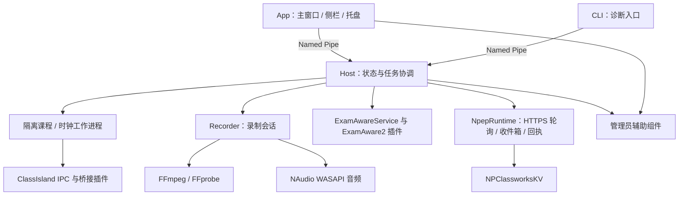

# 从 Visual Studio 到 NPEduTools：代码库接管指南

读者：河豚豚；已有程序设计基础，希望理解和维护这套代码。

核对日期：2026-09-26。仓库根目录：`D:\CodeProjects\NPEduTools`。以下仓库相对路径均相对于此目录。内容来自当前源码、构建脚本和 Microsoft 官方文档，不把历史架构设想当作已实现功能。本次仅新增教程，没有改产品代码。

## 1. 先解决截图中的打开方式

截图右侧写着“解决方案资源管理器 - 文件夹视图”，顶部启动目标是“当前文档(App.xaml)”。这说明当前在浏览目录，尚未以这个仓库的解决方案组织构建、启动和调试。`App.xaml` 是 WPF 应用定义，不能当成独立脚本运行。

操作：

1. “文件 → 打开 → 项目/解决方案”。
2. 选择 `D:\CodeProjects\NPEduTools\NPEduTools.sln`。
3. 等待项目加载、NuGet 还原与后台分析完成。
4. 右侧应出现解决方案和多个项目，而不仅是目录树。
5. 右键项目 **NPEduTools.App → 设为启动项目**。它通常会变成粗体，顶部运行目标也应指向它。
6. 选择 Debug 配置，先生成该项目，再按 F5。

不要新建另一个 WPF 项目来容纳这些文件，也不要将 `Host/Program.cs` 直接作为主窗口启动目标。

本机通过 Visual Studio Installer 的 vswhere 检测到安装版本 `18.10.12217.157`；仓库根目录的 `dotnet --version` 返回 `10.0.401`。这不能仅靠截图推断，是本轮实际检查的结果。

若重新配置机器，Visual Studio Installer 中应有“.NET 桌面开发”工作负载。项目主程序目标为 .NET 10，Microsoft 的支持矩阵要求面向 net10.0 使用 Visual Studio 18.0 或更高；具体 SDK feature band 与 MSBuild 的配合还应按矩阵核对。[官方版本对应关系](https://learn.microsoft.com/en-us/dotnet/core/porting/versioning-sdk-msbuild-vs)。

## 2. C#、.NET、WPF、解决方案分别是什么

| 名称 | 负责什么 | 在本仓库中的位置 |
| --- | --- | --- |
| C# | 编写类型、业务逻辑、异步流程等 | `.cs` |
| .NET Runtime | 执行托管代码，提供 GC、线程池、基础库等 | 开发运行依赖系统运行时；正式包可自包含 |
| .NET SDK | 编译器、MSBuild、dotnet CLI 等开发工具 | `global.json` 选择 SDK |
| WPF | Windows 桌面 UI 框架 | App 项目及 `.xaml` |
| XAML | 描述控件对象、布局、资源和绑定的声明式语言 | `MainWindow.xaml` 等 |
| `.csproj` | 一个项目的编译配置、引用、资源和构建目标 | 每个 C# 项目一个 |
| `.sln` | IDE 的多项目组织入口 | `NPEduTools.sln` |
| NuGet | .NET 包管理体系 | `PackageReference`、`packages.lock.json` |
| MSBuild | 按依赖与目标执行构建 | csproj 中的 PropertyGroup / ItemGroup / Target |

通常 C# 编译为程序集中的 IL，再由运行时执行；不要把每个 `.cs` 想成单独可执行脚本。项目引用建立编译依赖，进程通信建立运行时边界，两者不是一回事。

`App` 引用了 Host 项目但设置了 `ReferenceOutputAssembly="false"`：用于构建依赖与打包，不表示 UI 能把 Host 的服务对象当成同进程对象调用。

### 四类配置要分开看

- `global.json`：SDK 为 `10.0.400`，`rollForward=latestPatch`。允许同一 10.0.4xx feature band 的更新补丁，如当前 10.0.401；不是任意 .NET 10 SDK 都可以代替。
- `Directory.Build.props`：默认 `net10.0`，开启隐式 using、可空分析、警告视为错误、依赖锁文件。
- 单个 `.csproj`：可覆盖目标框架。App/Recorder 为 `net10.0-windows`；ClassIsland 桥接及其契约为 `net8.0`。
- `packages.lock.json`：锁定 NuGet 依赖解析结果；不要通过删除锁文件来掩盖依赖变化。

ClassIsland 本体的开发 SDK 与 NPEduTools 主程序 SDK 可以不同。不要因为之前安装过 .NET 9，就把本仓库所有项目改为 net9.0。

## 3. Visual Studio 的日常工作方式

### 3.1 你应该常开的窗口

| 窗口 | 用途 |
| --- | --- |
| 解决方案资源管理器 | 浏览项目、引用、XAML 与代码文件 |
| 错误列表 | 查看编译/分析诊断；排错时先筛到生成错误 |
| 输出 → 生成 | 查看真正的构建过程、项目路径、第一条错误 |
| 输出 → 调试 | 查看程序调试输出和部分 WPF 绑定错误 |
| 测试资源管理器 | 发现、运行和调试 xUnit 测试 |
| Git 更改 | 查看实际修改、逐块 diff、选择提交内容 |
| 调用堆栈、局部变量、监视 | 断点停住后理解控制流与对象状态 |
| 模块 | 核对加载的是哪一份 DLL，是否加载对应 PDB |

### 3.2 高频快捷键

下面是常见默认键位；若你的键盘配置不同，以菜单显示为准。

| 操作 | 快捷键 | 场景 |
| --- | --- | --- |
| 转到定义 | F12 | 看方法/类型在哪里实现 |
| 查看定义 | Alt+F12 | 在当前文件内临时展开定义 |
| 查找所有引用 | Shift+F12 | 谁在调用这个函数 |
| 全局搜索文本 | Ctrl+Shift+F | 从按钮文字找 XAML 或错误码 |
| 转到文件/符号 | Ctrl+T 或 Ctrl+, | 搜 `RecordingService` |
| 重命名符号 | Ctrl+R，Ctrl+R | 统一更新语言级引用；仍检查 XAML/字符串 |
| 快速操作 | Ctrl+. | 查看修复建议，先理解再接受 |
| 切换断点 | F9 | 在可执行代码行暂停 |
| 启动/继续调试 | F5 | 启动配置的项目或继续运行 |
| 不调试启动 | Ctrl+F5 | 观察普通运行行为 |
| 单步跳过 | F10 | 执行调用，不进入函数内部 |
| 单步进入 | F11 | 进入函数；异步与跨进程有边界 |
| 跳出函数 | Shift+F11 | 执行完当前函数 |
| 停止调试 | Shift+F5 | 结束调试，注意被调试进程的生命周期 |
| 生成解决方案 | Ctrl+Shift+B | 编译整个 sln，不等于运行程序 |

### 3.3 从一个按钮追到真正执行的位置

以“开始录制”为例：

1. 在 `RecordingWindow.xaml` 找按钮的 `Click` 属性。
2. 跳到 `RecordingWindow.xaml.cs` 的 `StartClicked`。
3. F12 到 `RecordingClient.SendAsync`，看传入的 `action/options/control`。
4. 到 `Contracts/HostClient.cs`，看到请求被写入 Named Pipe。
5. 这时已经跨进程，F11 不会自动跳到后台。
6. 附加 Host，在 `RecordingService.HandleAsync` 下断点。
7. 再看 `RecorderProcess` 怎样启动独立 Recorder。
8. 最后看 Recorder 的 `Program.cs` 和 `RecordingSession.cs`。

要问自己的不是“函数名字像不像录制”，而是“这一行在哪个进程里？谁拥有状态？真正的副作用发生在哪一行？”

### 3.4 多进程调试是本项目的必修项

常见进程：

- `NPEduTools.App.exe`：WPF、侧栏、托盘、交互。
- `NPEduTools.Host.exe`：IPC 服务、调度和集成；也可用不同参数启动隔离工作进程。
- `NPEduTools.Recorder.exe`：录制会话与保存。
- `ffmpeg.exe`：媒体采集/编码/封装工作。
- `NPEduTools.ClassIsland.Admin.exe`：独立管理员操作组件。
- ClassIsland / ExamAware2：第三方程序，插件运行在相应本体内部。

在 VS 中使用“调试 → 附加到进程”，选择目标 PID。多个 Host 同名时，看命令行、启动时间和路径；被 UI 启动的那份 Host 通常来自 App 输出目录的 `Host` 子目录。PID 比名字更可靠。附加功能与多进程调试见 [Microsoft 文档](https://learn.microsoft.com/en-us/visualstudio/debugger/attach-to-running-processes-with-the-visual-studio-debugger?view=visualstudio)。

空心断点不一定是代码没执行，常见原因是：附错 PID、运行旧 ZIP 里的 EXE、PDB 不匹配、源文件与已加载程序集不同，或还没走到此分支。先看“模块”窗口路径，再考虑清理构建。

本项目有单实例 Mutex：F5 可能只唤醒已运行的旧窗口。主窗口右上角关闭通常是隐藏到侧边栏，不等于退出。开发前通过应用自己的“退出 NPEduTools / 停止后台并退出”结束旧实例，先确认没有需要保存的录制。

如果只是看 UI，启动 App 即可；如果要调 Host 启动阶段，可以在解决方案启动配置中先启动 Host、再启动 App，但必须确保管道参数一致且没有旧 Host。不是所有项目都应该设为“启动”。

### 3.5 断点会改变系统时序

Host、Recorder、插件之间有租约、心跳、截止时间。断点暂停一分钟，可能被其他进程认定失联；这是调试造成的真实时间流逝。单调时钟不会随调试器一起停住。

调时序问题时优先用日志、跟踪点和测试夹具；不要为了单步方便而直接延长生产超时。监视窗口求值也可能执行属性 getter，避免在有副作用的方法上随意执行表达式。

## 4. C# 语法：按读懂这个仓库的顺序学习

以下标为“示意”的代码解释语言，不是让你直接粘进生产文件。仓库现有类型可通过 F12 查看完整定义。

### 4.1 命名空间、using 和基础类型

```csharp
using System.Diagnostics;      // 导入命名空间，让类型名可省略前缀
using Forms = System.Windows.Forms; // 起别名，解决 WPF/WinForms 类型重名

namespace NPEduTools.App;       // 文件范围命名空间，不是目录或进程
```

`ImplicitUsings=enable` 会自动导入一组常用命名空间，所以看不到 `using System;` 也能用 `Guid`。导入命名空间不等于安装依赖；安装/引用在 csproj。

```csharp
int frames = 8;
long sequence = 0;
double seconds = 0.5;
bool enabled = false;
string title = "学校通知";
var operationId = Guid.NewGuid(); // 静态推断为 Guid，不是 dynamic
string text = $"{title} · {frames} fps";
string path = @"D:\CodeProjects\NPEduTools";
```

`bool/int/long/Guid/DateTimeOffset` 是值类型；类对象、数组和 string 是引用类型。值类型赋值复制值，引用类型赋值复制引用。不能简单说“值类型都在栈上”：对象字段、装箱和闭包等会影响实际存储。string 是不可变引用类型。

C# 参数默认按值传递：传类对象时复制引用，并不复制整个对象。`ref` 表示按引用传递已有变量，`out` 表示方法要给变量赋值，`in` 提供只读引用参数。

```csharp
if (int.TryParse("15", out int fps))
    Console.WriteLine(fps);
```

### 4.2 类、字段、属性与访问权限

```csharp
// 示意
public sealed class Counter
{
    private readonly string _name;
    public int Value { get; private set; }
    public Counter(string name) => _name = name;
    public void Increment() => Value++;
    public string Describe() => $"{_name}: {Value}";
}
```

- `public`：外部可访问；`private`：仅本类型内部；`internal`：同程序集内；`protected`：本类型和派生类型。
- `sealed`：禁止继承；`static`：属于类型，不依赖某个实例。
- `_name` 是字段；`Value` 是属性。属性可以有逻辑，不保证只是读取一块内存。
- `private set`：外部可读，本类型内部可赋值。
- `readonly` 字段只能在声明/相应构造期间赋值，不保证其指向的集合内容不可变。
- `=>` 在这里表示表达式体成员；换成常规大括号写法并不会改变本质。

不要把 `new` 理解为“启动进程”。它通常只是创建当前进程中的对象。启动程序需要 `Process.Start` 等显式动作。

### 4.3 record、with、主构造函数

真实代码中常见：

```csharp
public sealed record RecordingState(string Phase, string Message /* 还有其他字段 */);
```

这里用简化参数解释：位置参数会生成公开属性，普通 positional record class 的这些属性通常是 init-only；record 为数据比较提供生成的相等逻辑。普通 class 默认仍主要体现对象身份。

```csharp
var oldState = new RecordingState("Idle", "准备录制");
var nextState = oldState with { Phase = "Recording", Message = "正在录制" };
```

`with` 生成新对象并替换指定成员，不会原地修改 `oldState`。但这是**浅复制**：如果成员是可变数组，旧对象和新对象可能仍共享它。record 中的数组成员也不会自动获得逐元素的深度相等判断。[record 语义](https://learn.microsoft.com/en-us/dotnet/csharp/language-reference/builtin-types/record)。

另一种真实写法：

```csharp
public sealed class RemoteExamExecutor(
    IRemoteExamStore store,
    RuntimeOperationGate gate,
    IRemoteExamActions actions)
{
    // 类的主构造函数参数，在实例成员里可使用
}
```

普通 class 的主构造函数参数**不会像 positional record 一样自动成为公开属性**。这是依赖传入，不是隐式服务定位器。想找实际实现，查构造调用或 Host 的 Program.cs。

### 4.4 partial：很多文件其实是同一个类

```csharp
public partial class MainWindow : Window { /* 主体 */ }
public partial class MainWindow { /* 另一个文件中的录制逻辑 */ }
```

`MainWindow.Recording.cs`、`MainWindow.Npep.cs`、`MainWindow.Startup.cs` 等由编译器组合为同一个 MainWindow 类型。它们共享实例字段和私有方法；文件分开不意味着对象分开，更不意味着线程隔离。

WPF 的 XAML 也会生成 partial 代码，提供 `InitializeComponent()` 和具名控件字段。通常在 `obj` 里能看到生成物。修改源 XAML / `.xaml.cs`，不要直接修改 `.g.cs`。

### 4.5 null、?、! 与模式匹配

```csharp
string? path = null;                    // 允许为空的引用
string display = path ?? "尚未配置";     // 空值兜底
int? count = null;                      // Nullable<int> 值类型
int length = path?.Length ?? 0;         // 空条件访问
```

`string?` 主要是编译期可空分析；不是一个“带标签包装的 string 运行时类型”。`int?` 则实际是 Nullable<int>。`value!` 只告诉编译器相信它非空，不会进行运行时验证，也不能阻止 NullReferenceException。[可空引用类型](https://learn.microsoft.com/en-us/dotnet/csharp/language-reference/builtin-types/nullable-reference-types)。

本仓库警告视为错误，所以 CS8602、CS8604 等要修正数据流；不要批量加 `!` 来消音。

```csharp
if (state is { Active: true, Control.Owner: "Automatic" })
{
    // state 存在，且嵌套属性满足条件
}

if (state.Control is { } control)
{
    // 非空时绑定局部变量 control
}

bool busy = state.Phase is "Starting" or "Saving";

string label = state.Phase switch
{
    "Idle" => "空闲",
    "Recording" => "录制中",
    _ => "其他状态"
};
```

`is` 在这里执行模式匹配，`or/not/and` 组合模式；switch 表达式产生一个值，`_` 为兜底。它们比长串空检查和 if/else 简洁，但应把“未知状态怎样处理”写清楚。[模式匹配](https://learn.microsoft.com/en-us/dotnet/csharp/language-reference/operators/patterns)。

### 4.6 集合、泛型、LINQ

```csharp
List<string> names = ["日常", "考试"];
Dictionary<string, int> counts = new() { ["通知"] = 2 };
string[] more = [.. names, "待核实"];
```

`List<T>` 是泛型可变列表，`Dictionary<TKey,TValue>` 是映射；`[]` 是目标类型驱动的集合表达式，`..` 在其中展开集合。它不是 JavaScript 的动态数组语义。

```csharp
// 示意：plans 已经是某个 IEnumerable<PlannedRecording>
var selected = plans
    .Where(p => p.Selected && !p.Conflict)
    .OrderBy(p => p.Start)
    .ToArray();
```

`p => ...` 是 lambda，`Where/Select/Any/FirstOrDefault` 是常用 LINQ 操作。许多返回 IEnumerable 的链条延迟执行；`ToArray/ToList` 会枚举并形成当前结果。反复枚举可能重新计算，不一定复用缓存；这里内存集合上的 LINQ 不会自动并行，也不是数据库查询。

`FirstOrDefault` 可能返回 null；`Single` 要求恰好一个，否则抛异常。读本仓库的 `Single` 时，寻找前面的唯一性保证。

### 4.7 接口、委托、事件

```csharp
public interface IRemoteExamAuthorization
{
    Task CheckAsync(bool firstEffect, CancellationToken token);
}
```

接口描述约定，测试可注入假实现，真实适配器执行 Windows/网络操作。C# 的接口实现是显式声明的名义类型关系，与 Go 常见的隐式接口满足方式不同。

```csharp
Func<bool> isPaused = () => true;       // 返回 bool 的可调用对象
Action<string> log = text => Console.WriteLine(text); // 无返回值
```

传入 `Func<bool>` 常常是为了每次获取**当前值**；传入 `bool` 通常只是构造时那次快照。闭包捕获变量而不一定是值快照，异步与可变状态组合时尤其要注意。

`RecordingClient` 使用 `event Action<RecordingState>? Changed`，窗口订阅 `Changed += Apply` 后更新显示。长期存在的发布者会持有订阅者，窗口真正销毁时需要按设计退订，避免内存泄漏或更新已经失效的 UI。

### 4.8 async / await：Task 不是线程

```csharp
// HostClient 中的实际结构，省略错误检查
await using var pipe = CreatePipe(pipeName);
await pipe.ConnectAsync(1500, token);
await Protocol.WriteAsync(pipe, request, token);
var response = await Protocol.ReadAsync<HostResponse>(pipe, token);
```

当等待的操作尚未完成，await 可以挂起方法并让调用线程继续做别的事；完成后再执行后续代码。它不是“看到 async 就新建线程”。Task 表示异步操作，Task<T> 表示还会返回 T。普通 async 方法在遇到未完成的 await 前会同步执行。

对照 JavaScript Promise 有助于理解完成与失败；对照 Go goroutine 则要特别记住：这里并不承诺每个 async 调用都获得独立执行线程。CPU 密集操作需要单独考虑 Task.Run 或专用执行策略，不能只加 async。[async 说明](https://learn.microsoft.com/en-us/dotnet/csharp/language-reference/keywords/async)。

在 WPF UI 线程中，用 `.Result`、`.Wait()` 等同步等待异步操作，可能造成界面冻结甚至死锁。正常 async/await 会尽量沿捕获的上下文继续，但跨线程处理控件仍需 Dispatcher；不能把“有 await”当成所有操作都在 UI 线程的证明。

```csharp
await dispatcher.InvokeAsync(() => StatusText.Text = "已连接");
```

`async void` 主要用于框架要求 void 的事件处理器；业务异步方法优先返回 Task，让调用方能等待并处理失败。`_ = SomeAsync()` 丢弃 Task 不代表可靠后台任务，仍需明确异常、取消和生命周期归属。[WPF 线程模型](https://learn.microsoft.com/en-us/dotnet/desktop/wpf/advanced/threading-model)。

### 4.9 取消、释放资源、异常与互斥

```csharp
using var timeout = new CancellationTokenSource(TimeSpan.FromSeconds(3));
await SomeOperationAsync(timeout.Token); // 示意：被调用方必须支持取消
```

CancellationToken 是协作取消通知，不是强制杀线程。把等待取消也不能推断已经发出的 Windows 动作没有发生。

`using` 声明在离开作用域时调用 Dispose；`await using` 调用异步 DisposeAsync。GC 回收托管内存不等于及时关闭文件句柄、管道、COM 对象或进程。这里的 `using` 与文件顶部导入命名空间的 using 是不同用途。

```csharp
await gate.WaitAsync(token); // SemaphoreSlim
try
{
    await ChangeStateAsync(token); // 示意
}
finally
{
    gate.Release();
}
```

`lock` 适合很短的同步临界区，里面不能直接 await；SemaphoreSlim 可用于跨 await 的串行化，但长期持有仍会阻塞其他操作。N3 的保留权用生命周期明确的 IDisposable，避免等 UAC 时一直占用录制服务的信号量。

`Interlocked.Exchange` 提供某个操作的原子性；`Volatile.Read/Write` 涉及内存可见性，不能让整个对象图自动线程安全。Mutex 在本项目用于跨进程单实例；不要和同进程的 lock 混淆。

```csharp
try { await SaveAsync(); } // 示意
catch (IOException ex) { ShowError(ex.Message); }
finally { ReleaseTemporaryState(); }
```

异常过滤器 `catch (Exception ex) when (...)` 根据条件决定是否处理。重新抛出用 `throw;` 保留原始堆栈；不要一律 `catch { return success; }`。本项目特别区分“拒绝”“已经派发但结果未知”和“读回证实成功”。

### 4.10 Attribute、JSON 和顶级语句

```csharp
[property: JsonIgnore(Condition = JsonIgnoreCondition.WhenWritingNull)]
string? ExecutablePath = null
```

这是 record 参数上的属性目标 attribute，作用于生成的属性，控制 JSON 序列化，不是普通方法调用。`[Fact]` 是测试元数据，`[DllImport]` 声明原生函数入口；每种 attribute 的消费者不同。

`Host/Program.cs` 可以直接出现可执行语句，是 C# 顶级语句语法，编译器生成入口。WPF 的入口则由应用定义生成，实际初始化逻辑在 `App.xaml.cs.OnStartup`。不要要求所有项目都必须手写一个同名 Main。

## 5. WPF / XAML：把截图里的内容读懂

```xml
<Button Content="配置与录制"
        Click="OpenRecordingClicked"
        Margin="0,8,0,0" />
```

这描述一个 Button 对象，Content 是内容，Click 绑定后台事件处理器。不是 HTML，也不是浏览器 DOM。`Grid.Row` 等是附加属性，`x:Name` 可让代码引用控件，`x:Key` 定义资源键，`x:Class` 指定与代码后置关联的 CLR 类型。

```xml
<Grid>
  <Grid.RowDefinitions>
    <RowDefinition Height="Auto" />
    <RowDefinition Height="*" />
  </Grid.RowDefinitions>
  <TextBlock Text="学校通知" />
  <TextBlock Grid.Row="1" Text="{Binding Subject}" />
</Grid>
```

Auto 按内容占用；星号分配剩余空间，可用 `2*` 表示比例；固定数字通常是 WPF 的设备无关单位，不一定等于屏幕物理像素。Margin 是外边距，Padding 是内容内边距；中文长文本常需要 TextWrapping。

### 5.1 绑定从哪里取值

主窗口构造函数有 `DataContext = _model`，`_model` 是 StatusViewModel。`Text="{Binding Subject}"` 因此读取它的 Subject。

StatusViewModel 实现 INotifyPropertyChanged，更新属性后触发通知，绑定系统才知道需要刷新。自动属性默认不会自己发变更通知。列表增删通常使用 ObservableCollection；列表元素属性变化仍需各自通知。[WPF 绑定机制](https://learn.microsoft.com/en-us/dotnet/desktop/WPF/data/)。

本仓库不是完全统一的严格 MVVM：既有 ViewModel 绑定，也有大量 code-behind 直接设置控件。不要把所有 MainWindow partial 文件误认为独立 ViewModel。

### 5.2 资源和样式从哪里来

- `App.xaml`：全局资源、快捷入口模板及部分公共样式。
- `Resources/CommonControls.xaml`：通用控件外观。
- `Resources/RecordingControls.xaml`：录课相关控件资源；是否生效看实际合并/引用位置。
- `Resources/Branding.xaml`：由图标资源生成的 WPF 图形，不应随手改生成的路径。
- `SchoolNotificationWindow.xaml`：通知布局。
- `SchoolNotificationWindow.xaml.cs`：通知视图状态、展示和关闭逻辑。
- `SchoolNotificationWindow.Attention.cs`：全屏遮罩与原生窗口顺序维护。

`{StaticResource Accent}` 查找资源；`{DynamicResource ...}` 保留动态资源引用，可随资源变化更新。Style 的 Setter 设属性；ControlTemplate 定义控件结构；DataTemplate 定义某种数据怎样展示。三者不要混为一谈。

截图中的 `Branding.xaml` 文件头已经标注由 `scripts/sync-branding.ps1` 生成。要改正式图标，先改批准的源资源并走生成脚本；只想改变某个按钮的颜色，就找对应 Brush/Style，不用重绘品牌图形。

## 6. 整个程序怎样分工



最后两条是有意画出来的：现有前台某些管理员入口也直接调用辅助组件，不能想当然认为所有变更已经统一经过 Host。N3 的完整互斥接入还需要覆盖这些入口。

### 项目地图

| 项目 | 责任与推荐入口 |
| --- | --- |
| NPEduTools.App | WPF 界面；先看 App.xaml.cs → MainWindow.xaml.cs → 功能 partial |
| NPEduTools.Contracts | 进程间请求/响应、DTO、校验、HostClient 和消息编码；先看 Protocol.cs |
| NPEduTools.Core | 课表、时间跟踪、计划计算与录制账本等可测试规则；不是 UI |
| NPEduTools.Host | Program.cs 组装服务，PipeServer.cs 分派能力，服务持有长期状态 |
| NPEduTools.Cli | 通过同一管道查询状态，便于分离 UI 和后台问题 |
| NPEduTools.Integrations.ClassIsland | 对接第三方课程、学校时间及日期课表；隔离外部 API 形状 |
| NPEduTools.ClassIsland.Bridge.Contracts | 主程序与 ClassIsland 插件共享的数据/接口定义 |
| plugins/NPEduTools.ClassIsland.Bridge | 在 ClassIsland 内读取真实学校时间与课表，打包为 cipx |
| NPEduTools.Recorder | 录制工作进程、音频、FFmpeg 子进程、片段和恢复 |
| NPEduTools.ClassIsland.Admin | 管理员辅助进程、计划任务与指定实例操作 |
| NPEduTools.PowerPoint.Diagnostics | PowerPoint COM / 输入观察、分析与触摸辅助相关实现 |
| NPEduTools.PowerPoint.Assist | 独立触摸辅助入口；主程序集成路径还经过 Host 的 TouchAssistService |
| NPEduTools.Integrations.Npep | 配对、凭据、状态上报、通知轮询、持久收件箱和回执 |
| plugins/npedutools-examaware-bridge | TypeScript/Node 插件，由 ExamAware2 加载；不是 C# 项目 |
| tests / tools | xUnit、隔离假服务、验收入口、诊断和通知预览工具 |

不是每个文件夹都是正式运行组件。`.tools` 是开发依赖缓存；`.artifacts` 是输出、报告、试用包；`bin` 是构建结果，`obj` 是生成代码/中间状态。修改源文件，不直接修改 bin/obj。截图中来源不明的目录不能仅凭名字认定为架构组成，先查 csproj、脚本和 Git 跟踪关系。

## 7. 逐条理解功能实现

### 7.1 应用启动与生命周期

`App.xaml.cs.OnStartup` 解析参数，创建 Mutex 与激活事件，检查单实例，创建 MainWindow。MainWindow 初始化托盘、快捷入口、录制客户端、首次引导等，并按需启动 Host。

`EnsureHostStarted` 检查 Host Mutex。已存在就复用，未存在才启动 App 输出目录下的 Host。这里能解释“我改了后台代码，为什么看到的还是旧行为”：旧进程可能仍在，或者你调试的是另一份输出。

窗口隐藏、应用退出、Host 退出、Recorder 保存完成是四种不同事件，查问题时逐项确认。

### 7.2 本地 IPC

`HostRequest` 是带 Version、RequestId、Capability 和有限参数的请求。`Protocol.Validate` 限定合法能力与参数组合。`HostClient` 连接管道，写请求，读响应，并核验版本与 RequestId。

消息格式是 4 字节小端长度前缀 + UTF-8 JSON；当前帧上限 64 KiB。不能把 Named Pipe 当成“一次 Read 必定得到一个完整 JSON”，长度读取和 ReadExactlyAsync 负责解决分帧问题。

`PipeServer` 验证后分派到具体服务。理解它类似本地 RPC 路由即可，但它不是 HTTP API，NPEP 的 0.1/0.2/未来 0.3 版本与这里的 Host 协议版本也不是同一个编号。

### 7.3 课程、课表与学校时间

`StatusMonitor` 管理持续课程状态；`SchoolClockMonitor` 管理学校时间。ClassIsland 插件通过本体的时间服务获取可校准的时间，并提供档案、日期与课表信息。

`Core/SchoolClockTracker.cs` 处理新鲜度、连续性和日期变化等；`RecordingPlanner.cs`、`RecordingPlanBook.cs` 等计算候选录制时段。预演计算不是启动录制的证明。

本仓库的学校日期时间有专门的比较语义，不应直接当成 UTC。业务排课跟学校时间；租约、超时等用 Stopwatch 单调计时；审计或服务器事件另用真实时间戳。不要用 DateTime.Now 替换所有时钟，更不要用 ClassIsland 校准后的时钟判定服务器安全许可到期。

### 7.4 手动与自动录制

调用链：`RecordingWindow.StartClicked → RecordingClient.SendAsync → HostClient → PipeServer → RecordingService.HandleAsync → RecorderProcess → Recorder.Program / RecordingSession`。

真实当前录制路径是 **FFmpeg gdigrab + libx264**，不是“已用 Intel QSV”，也不是直接照搬 C30 内部代码。当前参数使用 8/15 fps、720p/1080p 上限、ultrafast、zerolatency、有限线程等；具体事实看 `RecordingSession.cs` 中的参数列表。

`AudioInput.cs` 使用 NAudio WASAPI，包括系统回环与麦克风，向编码器提供音频。录制先保存 MKV 片段，结束时合并/封装并校验；`RecordingRecovery.cs` 为异常遗留片段提供恢复处理。不要在 FFmpeg 进程启动后立即把状态标为 Saved。

自动录制由 Host 的 RecordingService 协调；UI 配置计划、发送启用和租约。执行账本独立记录开始意图及结果，避免重复录制。管理窗口失联、时间异常、硬截止各有处理，所以不能承诺“关掉所有 UI 仍无限录”。

### 7.5 本地课堂模式与 N3 的关键区别

旧 `ClassroomModeService` 管理本地日常/考试模式：包含 Windows 自启动设置、恢复记录，并可选择立即切换运行软件。`ClassroomRuntimeCoordinator` 是该流程的运行切换部分，仍处于旧模式前提下。

新增 N3 内核 `RemoteExamExecutor` 只针对当前运行环境；独立 `RemoteExamStore` 保存暂停和操作记录，`RuntimeOperationGate` 提供协调原语，录制器提供空闲保留权。

截至本指南日期：N3 内核和测试已存在，**没有接到可用的网页远程执行入口**；真实软件适配器、完整本地互斥和现场许可 UI 仍待接入。看到文件存在，不能推断整个功能已经可用。禁止把远程请求直接转成旧的 `classroom.set`，否则会改变用户明确排除的自启动设置。

### 7.6 ExamAware2 与管理员组件

`ExamAwareService` 管理本地配对、桥接会话、启动、正常退出和可选自启动设置。插件在 ExamAware2 进程里，通过认证连接上报并处理有限动作。启动 EXE、桥接连接、指定进程身份验证、真正退出是不同状态。

`AdminClient` 启动独立辅助程序，通过专用管道交互。需要提升的操作使用 Windows UAC；帮助程序核验调用方身份后处理有限动作。主程序当前 manifest 仍是 asInvoker。之后若整体提升，必须处理已经存在的普通权限 Host，不能只改前台权限就宣称全部执行链已提升。

### 7.7 N1 / N2：学校互联与通知

NpepRuntime 是后台周期任务协调者；NpepApi 封装 HTTPS；NpepDevice 管理设备身份与交互；NpepVault 使用当前用户范围 DPAPI 保存凭据。

N2 的网络代码主要在 `.Notifications.cs` partial 文件，NpepInbox 持久保存通知和回执。UI 的 `MainWindow.NotificationDelivery.cs` 读取后台收件箱，重新核对通知版本，创建 SchoolNotificationWindow，并在实际渲染/手动关闭时上报 displayed/dismissed。

因此要分层排查：HTTP 有没有收到 → 是否落盘 → 是否可展示 → 是否创建窗口 → 是否实际渲染 → 回执是否送达。“请求成功”不等于“用户看过”。通知遮罩的层级问题则属于 WPF/Win32 窗口代码，不是后端 API。

### 7.8 配置持久化的读法

看到 `Store/Vault/Ledger`，依次找：存放路径、版本校验、损坏行为、写入顺序、是否有备份/临时文件，以及是否允许重试动作。

N3 使用先写记录、再执行副作用的方式。崩溃后可能知道“发起过”，却不知道“做完没有”，所以保留 UNKNOWN 而不盲目重放。磁盘记录不是装饰性日志，它参与程序是否允许继续执行的判断。

## 8. 构建、测试、运行、发布

### 8.1 第一次构建主程序

在仓库根目录的 PowerShell：

```powershell
Set-Location D:\CodeProjects\NPEduTools
dotnet --version
dotnet --list-sdks

./scripts/dotnet.ps1 restore src/NPEduTools.App/NPEduTools.App.csproj --locked-mode
./scripts/dotnet.ps1 build src/NPEduTools.App/NPEduTools.App.csproj --configuration Debug --no-restore
```

输出目录：`src\NPEduTools.App\bin\Debug\net10.0-windows\`。在 VS 里设好 App 启动项目后按 F5；也可直接运行此目录的 EXE，但那不自动附加调试器。

`scripts/dotnet.ps1` 选择兼容 SDK，设置项目的 CLI/NuGet 缓存位置和测试子进程使用的 dotnet 主机，再调用 dotnet。VS 不会因为脚本存在就自动继承这些环境变量；CLI 与 IDE 的缓存位置可能不同。还原路径异常时，看实际 SDK、project.assets.json 的来源和包缓存，不要立刻改业务代码。

从 WebstormProjects 移到 CodeProjects 后，旧 obj 可能含旧路径，重新 restore 很重要。本轮已实际执行带 locked restore 的 App Debug build，结果为 **0 警告、0 错误**；未自动启动 GUI 或真实录制。

### 8.2 Release 与启动脚本

```powershell
./scripts/dotnet.ps1 build src/NPEduTools.App/NPEduTools.App.csproj --configuration Release
./scripts/start-app.ps1
```

注意 `start-app.ps1` 固定运行 **Release** 输出，不会自动选择你刚在 VS 中生成的 Debug。使用哪份 EXE，就匹配哪份源码构建和 PDB。正式开发调试优先 F5 + Debug。

App 的 MSBuild 复制目标会把 Host、Admin、Recorder 子目录放到输出目录。不要只拿一个 App.exe 到别处试运行。

### 8.3 编译与录制依赖是两件事

只读代码、生成主窗口不一定需要本机已有 FFmpeg；实际采集需要录制工具。

开发环境准备：

```powershell
./scripts/bootstrap-recorder.ps1
./scripts/dotnet.ps1 build src/NPEduTools.App/NPEduTools.App.csproj --configuration Debug
```

该脚本下载固定来源、固定版本并验证哈希，开发构建将工具复制到相应输出目录。失败时先检查下载/哈希/路径，不绕过校验。

正式便携包按既定发布方式**不附带 FFmpeg**，解压后用包里的 `Install-Recording-Tools.ps1` 或所附安装文档单独安装。仓库里的 `install-recording-tools.ps1` 要求已解压发布包的目录结构，不能当成源码根目录的 bootstrap 脚本混用。

### 8.4 分层运行测试

日常改核心规则：

```powershell
./scripts/dotnet.ps1 restore tests/NPEduTools.Tests/NPEduTools.Tests.csproj --locked-mode
./scripts/dotnet.ps1 test tests/NPEduTools.Tests/NPEduTools.Tests.csproj --no-restore
```

只看 N3 内核：

```powershell
./scripts/dotnet.ps1 test tests/NPEduTools.Tests/NPEduTools.Tests.csproj --no-restore --filter FullyQualifiedName~RemoteExamTests
```

NPEP 库测试：

```powershell
./scripts/dotnet.ps1 test tests/NPEduTools.Npep.Tests/NPEduTools.Npep.Tests.csproj
```

整体 C# 解决方案：

```powershell
./scripts/verify.ps1
```

verify 执行 locked restore、Release build、dotnet test。它不是所有 npm 插件验证、所有自定义验收 EXE 和真机验收的总开关。尤其 Npep.Acceptance 是独立验收程序，先看其参数与文档，不能因为项目名叫 tests 就断言已被 xUnit 执行。

上一轮 2026-09-25 的核心回归是 397 项通过，其中 N3 新增 45 项；这是上一轮记录，不是本教程重新跑全量测试的结果。编译成功、单元测试通过、协议夹具通过、真机通过、生产通过要分别记录。

### 8.5 单独看后台

需要两个终端，且要先构建对应项目。下面使用独立管道名避免碰到已经运行的默认 Host，但隔离管道不代表所有外部软件副作用都隔离；此例仅作 ping。

```powershell
# 终端 A
./scripts/dotnet.ps1 build src/NPEduTools.Host --configuration Debug
./scripts/dotnet.ps1 run --project src/NPEduTools.Host --configuration Debug --no-build '--' --pipe NPEduTools.Test.Learning
```

```powershell
# 终端 B
./scripts/dotnet.ps1 build src/NPEduTools.Cli --configuration Debug
./scripts/dotnet.ps1 run --project src/NPEduTools.Cli --configuration Debug --no-build '--' ping --pipe NPEduTools.Test.Learning
```

通过包装脚本调用 dotnet run 时保留 `'--'` 的引号，它分隔 dotnet 参数和程序参数。结束演示用终端 A 的 Ctrl+C，不要随手给默认管道发送 stop。

### 8.6 插件分别构建

```powershell
./scripts/package-classisland-bridge.ps1
./scripts/build-examaware-bridge.ps1
```

前者使用 ClassIsland Plugin SDK 生成并验证 `.cipx`；后者需要 Node/npm，执行 npm ci、构建、默认测试及 `.ea2x` 打包。打开 sln 不会把 TypeScript 插件自动变成 C# 构建的一部分。两种插件都应安装到对应的第三方本体，而不是复制到 App.exe 旁边就算安装。

### 8.7 面向用户的 ZIP

```powershell
./scripts/package-npedutools.ps1 -ReleaseVersion InDev-20260920
```

此命令使用仓库已有的同名发版文档举例；正式新版本应先准备匹配的 `docs/releases/<版本>.md`，不能用旧版本号发布新改动。

该脚本不只是 Compress-Archive：会还原锁定依赖、构建插件、分别 publish App/Host/Admin/Recorder 为 win-x64 自包含输出，加入插件、安装说明、许可证/源码材料和校验信息，最后打包。新版本材料或依赖缺失时应解决原因，不删除检查。

`build` 生成开发输出；`publish` 准备运行分发内容；正式打包脚本再组合多组件、材料和 ZIP。不能用一次 `dotnet publish App` 代替完整发布链，因为其他进程的 publish 输出和插件也需要正确组织。

## 9. 怎样通过一次小改动真正掌握仓库

建议先做一个不会启动/退出第三方软件的学习分支，按顺序练习：

1. **追踪 UI**：只给“配置与录制”按钮事件下断点，确认调用链，不必开始录制。
2. **读状态表达式**：看 RecordingState.Active / Busy，解释为什么 Paused 仍然占用会话。
3. **调试一个测试**：在测试资源管理器调试 RemoteExamTests 的正常顺序用例，观察 fake actions 与持久文件怎样配合。
4. **修改展示文案**：只改明确一处文案，生成、运行、确认实际调用的是 Debug 输出，然后查看 Git diff。
5. **增加一个规则测试**：比如为未覆盖的无效状态补一条测试，先写预期再改实现；不要先让 AI 改完再猜测试该期待什么。
6. **解释一次失败**：自己说清楚“在哪个进程、哪个方法、什么输入、哪项状态不满足、有没有副作用”，然后再请求 AI 帮忙。

每次修改前写三句话：行为要变成什么、责任在哪个模块、怎么证明成功。提交前逐块审查差异：有没有顺手改协议、路径、权限、版本号或测试断言？这比“能编译就接受”更能保持掌控。

让 AI 提供最小改动和调用链解释，让它区分测试夹具与真实环境。对于超时、重复请求、权限错误，要求先定位原因，不默认接受“加重试/放大超时/忽略异常”。

## 10. 常见问题速查

| 表现 | 先检查 |
| --- | --- |
| 顶部仍是当前文档，不能正常启动 | 是否打开 sln，是否选 App 启动项目 |
| SDK 不匹配 | 仓库根目录 dotnet --version、global.json、VS 版本 |
| NETSDK1064、包路径丢失 | 移动目录后的 locked restore、旧 obj 与缓存路径 |
| CS8602 / CS8604 | 可空数据流；不要无脑添加 `!` |
| XAML 出错但 C# 看似无错 | 先看 XAML 第一条错误、x:Class、事件名、资源键 |
| 界面改动没出现 | Debug/Release、启动脚本、旧单实例、运行文件路径 |
| Host 断点不中 | 附加是否成功、PID、模块 DLL/PDB 路径 |
| 录制按钮可点但不能录 | Recorder/Tools、FFmpeg/FFprobe、设备和写入权限 |
| 单步时突然失联 | 断点使心跳/租约过期；先用夹具/跟踪点排查 |
| 修改状态却不更新 UI | DataContext、INotifyPropertyChanged、Dispatcher |
| N3 文件都有，但网页无按钮 | 当前只是内核，尚未接通完整远程链路 |

建议阅读顺序：`App.xaml.cs → MainWindow.xaml/.cs → StatusViewModel → Protocol/HostClient → Host.Program/PipeServer → RecordingService → 一个对应测试`。先走通一条纵向功能，再横向研究所有模块。
