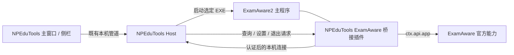

# NPEduTools 与 ExamAware2：启动、退出和登录自启动接入研究

研究日期：2026-09-19。结论基于官方当前发行源码与本地文档核对；尚未安装、运行或控制 ExamAware2 发行程序。本次没有修改 NPEduTools 业务代码、ExamAware 配置或 Windows 自启动项。

## 1. 结论

**可以建立联系。启动无需插件；可靠的退出和自启动设置，建议通过 ExamAware2 官方插件 API，加一个轻量本机桥接插件实现。**

| 目标 | 当前官方能力 | NPEduTools 的接入方式 | 判断 |
| --- | --- | --- | --- |
| 启动软件 | `ExamAware.exe`；单实例锁 | 启动用户选定的程序，核实路径、进程与桥接状态 | 可做，不依赖插件 |
| 唤起已有实例 | `second-instance` 会恢复、显示并聚焦主窗口 | 再次调用同一程序；验证主实例，不把短暂的第二进程当成主程序 | 可做 |
| 打开基本设置 | `examaware://settings/basic` | 将链接作为已选定程序的参数传入，或使用系统协议关联 | 可做，不依赖插件 |
| 正常退出软件 | 插件 `ctx.api.app.quit()` | 桥接调用后观察实际主进程退出 | 可做，受插件权限、集控策略及窗口关闭流程约束 |
| 查询自启动 | 插件 `ctx.api.app.getAutoStart()` | 桥接读取当前登记状态 | 可做；不能直接等同于 Windows 最终允许启动 |
| 开启/关闭自启动 | 插件 `ctx.api.app.setAutoStart(boolean)` | 由 ExamAware 自己更新登录启动项，再读回核实 | 可做，需目标软件正在运行且桥接可用 |

这里的“开机自启”准确说是 **Windows 用户登录后启动桌面程序**，不是登录前的系统服务。

主要依据：[官方启动入口](https://github.com/ExamAware/ExamAware2/blob/7979213fed918eaece7a5bf424e15f534778d7f2/packages/desktop/src/main/index.ts#L166)、[插件 App API 类型](https://github.com/ExamAware/ExamAware2/blob/7979213fed918eaece7a5bf424e15f534778d7f2/packages/plugin-sdk/src/api/contracts.ts#L17)、[App API 实现](https://github.com/ExamAware/ExamAware2/blob/7979213fed918eaece7a5bf424e15f534778d7f2/packages/desktop/src/main/plugins/api/mainPluginApi.ts#L89)。

## 2. 本地文档到底对应哪个版本？

用户提供的 `docs/ExamAware-docs` **是一套覆盖多个产品、仍保留旧内容的过渡期文档**，不能简单归为“全是 ExamAware1”或“完整的当前 ExamAware2 文档”。

本地仓库来源为 `https://github.com/ExamAware/ExamAware-docs`，提交为 `816e80e8fe3abcb28a581d9db6c41b7a09aca2fd`。证据如下：

| 本地文件 | 内容 | 对版本的判断 |
| --- | --- | --- |
| [安装与开始](ExamAware-docs/src/app/setup.md) | 同时列出旧版 `ExamShowboard-Legacy`、`ExamAware2-Desktop`、网页与移动产品；把新版桌面端写成开发中、发行版暂无 | 属于多产品文档，安装状态已落后于官方当前发行情况 |
| [配置文件说明](ExamAware-docs/src/app/config-edited.md) | 明确提示 ExamAware2 和 ExamCloud 已集成编辑器，可跳过手工配置教程 | 大部分手工配置说明不能直接套到新版功能实现 |
| [桌面端说明](ExamAware-docs/src/app/desktop/README.md) | 仍引用旧仓库名 `ExamAware2-Desktop`，主要转向安装和配置教程 | 对当前外部控制能力说明不足 |
| [文档 package.json](ExamAware-docs/package.json) | 文档工程版本为 `2.0.0` | 这是文档工程版本，不能据此判定应用或插件协议版本 |

当前研究以用户指定的官方 `ExamAware/ExamAware2` 仓库为主。本地文档用于理解产品沿革；接口则交叉核对官方仓库随源码提供的 `docs/plugin-dev/`、`docs/usage/deeplink.md` 和实现。

### 本次锁定的版本

| 项目 | 本次基准 |
| --- | --- |
| 产品/仓库名称 | ExamAware2 |
| 最新正式发行 | `v1.5.2 Harbor / 港湾`，2026-08-19 发布 |
| 官方提交 | `7979213fed918eaece7a5bf424e15f534778d7f2`；查询时远端 HEAD 与该标签一致 |
| 桌面包版本 | `@dsz-examaware/desktop` 的 `1.5.2` |
| 插件 API | `examaware.apiVersion: 2` |
| 同仓库插件 SDK | `@dsz-examaware/plugin-sdk` 的 `1.5.2` |
| 桌面技术 | Electron `39.2.7`、TypeScript、Vue；与 NPEduTools 的 WPF/.NET 通过进程间通信协作 |

**产品名中的“2”、软件版本 `1.5.2`、插件 API V2 是三件不同的事。**

参考：[官方发行页](https://github.com/ExamAware/ExamAware2/releases/tag/v1.5.2)、[桌面包配置](https://github.com/ExamAware/ExamAware2/blob/7979213fed918eaece7a5bf424e15f534778d7f2/packages/desktop/package.json)、[V2 插件快速开始](https://github.com/ExamAware/ExamAware2/blob/7979213fed918eaece7a5bf424e15f534778d7f2/docs/plugin-dev/quickstart.md)。本机另有 `2school-ExamAware2` fork，读取到的提交较旧，因此没有将其作为当前官方实现的依据。

## 3. 启动与唤起：不需要先开发插件

官方入口使用单实例锁；第二次调用会将协议参数交给已有实例，同时恢复并聚焦主窗口。因此“启动/打开 ExamAware”可以先实现。

建议流程：

1. 在 NPEduTools 中保存 `ExamAware.exe` 的完整路径，验证文件与产品版本。
2. 使用直接进程启动，工作目录设为程序所在目录，参数通过结构化参数列表传递。
3. 核对同一用户会话中的完整可执行路径和主进程身份；Electron 子进程也可能同名，不能以进程数量判断重复启动。
4. 区分“进程已运行”“桥接已连接”“可以执行控制”。插件未安装时仍可打开软件，但不展示虚假的完整连接状态。
5. 已有其他目录的实例时提示路径冲突；不要因为新启动进程很快退出，就循环重新启动。

内置 Deep Link 支持设置、编辑器和播放器。首阶段只需要 `examaware://settings/basic` 与 `examaware://settings/plugins`。将 URL 作为选定 EXE 的参数传入，可以减少系统协议关联指向另一份安装的歧义。协议注册也可能失败，不能只凭系统接受 URL 就宣布连接成功。

没有在本次基准中找到内置 `--quit`、`examaware://quit` 或通过 URL 直接切换自启动的公共命令。未知 Deep Link 的通用动作仍可能唤起主窗口，不能猜测路由名称后把它当退出接口。[官方 Deep Link 文档](https://github.com/ExamAware/ExamAware2/blob/7979213fed918eaece7a5bf424e15f534778d7f2/docs/usage/deeplink.md)、[路由实现](https://github.com/ExamAware/ExamAware2/blob/7979213fed918eaece7a5bf424e15f534778d7f2/packages/desktop/src/main/deepLink/appDeepLinkController.ts)。

## 4. 退出：必须区分关闭窗口与退出进程

主窗口拦截 `close`，普通情况下改成隐藏；全部窗口关闭后，入口也保持常驻。因此发送关闭窗口消息、调用 `CloseMainWindow()` 或模拟点击叉号，都不能作为可靠退出方案。[主窗口关闭处理](https://github.com/ExamAware/ExamAware2/blob/7979213fed918eaece7a5bf424e15f534778d7f2/packages/desktop/src/main/windows/mainWindow.ts#L85)、[常驻逻辑](https://github.com/ExamAware/ExamAware2/blob/7979213fed918eaece7a5bf424e15f534778d7f2/packages/desktop/src/main/index.ts#L567)。

插件的 `ctx.api.app.quit()` 才是明确的退出入口，需要 `app.quit` 权限，并会检查集控是否禁止退出。随后进入应用自身的退出协调流程。NPEduTools 应返回“退出请求已受理”，再单独观察进程是否结束；不能把 WebSocket/TCP 断开直接当成退出成功。

需要特别验证的两处行为：

- **集控禁止退出**：返回明确受限状态，不改集控配置，也不自动降级成强制结束进程。
- **存在未保存编辑内容**：退出协调器刷新的是应用配置，不能据此承诺自动保存考试编辑稿。源码中编辑器关闭依赖渲染端确认，而退出流程较早撤销 IPC/插件资源；这条组合流程必须在发行版实机验证，不能仅凭 `quit()` 存在就判定所有窗口状态都能顺利退出。

退出请求应有截止时间。到期仍运行时显示“仍在运行/可能等待窗口确认”，保留诊断；不自动重试退出，也不因连接断开重新拉起 ExamAware。[退出协调器](https://github.com/ExamAware/ExamAware2/blob/7979213fed918eaece7a5bf424e15f534778d7f2/packages/desktop/src/main/runtime/shutdownCoordinator.ts)、[编辑器关闭流程](https://github.com/ExamAware/ExamAware2/blob/7979213fed918eaece7a5bf424e15f534778d7f2/packages/desktop/src/main/windows/editorWindow.ts)。

## 5. 自启动：能力明确，但有三个容易误判的地方

### 5.1 使用插件 App API，不直接写配置开关

`ctx.api.app.setAutoStart(enabled)` 需要 `app.configure` 权限，内部调用 Electron 的登录启动 API，然后读回登记状态。`getAutoStart()` 返回当前 `openAtLogin`。

**插件 `setAutoStart(false)` 成功关闭后可以返回 `false`；这个布尔值是最终状态，不是“执行成功标志”。** 应将读回值与目标值比较。应用内部渲染 IPC 的同名设置方法返回语义不同，不能混用。[插件实现](https://github.com/ExamAware/ExamAware2/blob/7979213fed918eaece7a5bf424e15f534778d7f2/packages/desktop/src/main/plugins/api/mainPluginApi.ts#L100)、[内部 IPC 实现](https://github.com/ExamAware/ExamAware2/blob/7979213fed918eaece7a5bf424e15f534778d7f2/packages/desktop/src/main/ipc/handlers/appHandlers.ts#L42)。

`behavior.autoStart` 只是配置值。基本设置页面在挂载时向系统读取实际状态，并通过页面上的监听调用系统设置接口；通用配置接口负责写配置和广播，不保证执行系统自启动变更。在设置页面恰好打开时产生的间接效果，也不能当作稳定协议。[基本设置页面](https://github.com/ExamAware/ExamAware2/blob/7979213fed918eaece7a5bf424e15f534778d7f2/packages/desktop/src/renderer/src/views/settings/BasicSettings.vue#L95)、[配置存储实现](https://github.com/ExamAware/ExamAware2/blob/7979213fed918eaece7a5bf424e15f534778d7f2/packages/desktop/src/main/config/configStore.ts)。

首版以系统读回结果为准，不额外写 `behavior.autoStart`。若联调发现需要同步显示缓存，再通过公开 `appSettings` API 处理，并独立报告缓存更新失败；不要直接改运行中的 `config.json`。

### 5.2 已登记不一定等于 Windows 允许启动

Electron 在 Windows 还提供 `executableWillLaunchAtLogin`、`launchItems[].enabled` 来反映启动项审批状态，但当前插件 App API 只公开简化布尔值。用户在任务管理器中禁用启动项等情况，需要额外核实。

建议首版界面表述为“登录启动已登记/未登记”，另提供 Windows“启动应用”入口；无法判断系统禁用状态时显示“系统许可状态未核实”。不能仅凭该布尔值承诺下次一定启动。[Electron 39.2.7 登录启动定义](https://github.com/electron/electron/blob/v39.2.7/docs/api/app.md#appgetloginitemsettingsoptions-macos-windows)。

### 5.3 静默自启动另需验证

官方入口以 `wasOpenedAtLogin` 或 `--autostart` 判断是否不显示主窗口。但 Electron 39.2.7 将 `wasOpenedAtLogin` 标为 macOS 专属，而 Windows 设置分支没有传入 `--autostart`。

**源码推断：Windows 原生自启动可能不能进入预期的静默分支；必须通过实际注销/登录验证。** “设置自启动成功”和“自启动时只驻留托盘”应分开验收。不要擅自给原启动项追加参数，因为查询 API 按路径和参数匹配，追加后可能让本体设置页误判状态。[启动判定](https://github.com/ExamAware/ExamAware2/blob/7979213fed918eaece7a5bf424e15f534778d7f2/packages/desktop/src/main/index.ts#L380)、[Electron 固定版本定义](https://github.com/electron/electron/blob/v39.2.7/docs/api/app.md#appsetloginitemsettingssettings-macos-windows)。

因此，本次不建议另建一个 NPEduTools 自有 ExamAware 启动项，与原生开关形成两套来源。ExamAware 未运行时，桥接不能执行设置；应提示先打开本体，而不是把连接失败显示为“自启动关闭”。

## 6. 内置 HTTP API 为什么不能直接完成全部目标？

确实存在内置 HTTP API，默认关闭，默认候选端口 `31234`，前缀 `/api/v1`。端口占用时会尝试其他端口并保存实际端口，不能硬编码默认端口来认定目标身份。

已注册的核心路由包括健康检查、应用信息、时间同步、HTTP 配置和通用应用配置；没有内置应用退出或原生自启动控制路由。`/readyz` 与健康接口使用同一处理器，也不代表 NPEduTools 桥接已经可用。[默认配置](https://github.com/ExamAware/ExamAware2/blob/7979213fed918eaece7a5bf424e15f534778d7f2/packages/desktop/src/main/httpApi/types.ts)、[核心路由](https://github.com/ExamAware/ExamAware2/blob/7979213fed918eaece7a5bf424e15f534778d7f2/packages/desktop/src/main/httpApi/httpApiService.ts#L270)。

插件可以注册扩展 HTTP 路由，所以“桥接插件 + 内置 HTTP”是备选方案。不过当前服务绑定 `0.0.0.0`，依靠中间件限制远程访问；鉴权也由服务全局设置决定。虽然路由类型声明 `requireAuth`，当前路由分发未单独依据这个字段强制鉴权，不能以设置这个字段代替验证认证配置。若采用这条路线，需要显式确认服务的本地访问和令牌设置。[服务访问控制与监听](https://github.com/ExamAware/ExamAware2/blob/7979213fed918eaece7a5bf424e15f534778d7f2/packages/desktop/src/main/httpApi/httpApiService.ts#L400)。

## 7. 推荐架构：官方插件 API + 本机专用桥接

建议桥接采用 API V2 的主进程插件，以 `.ea2x` 分发。第一轮只支持本次锁定并验收的官方版本，后续再扩展兼容矩阵。遵循官方文档，通过 `ctx.api` 调用宿主能力，不复制内部 `window.api` 或 Electron IPC 通道。[官方插件开发说明](https://github.com/ExamAware/ExamAware2/blob/7979213fed918eaece7a5bf424e15f534778d7f2/docs/plugin-dev/quickstart.md)、[插件打包说明](https://github.com/ExamAware/ExamAware2/blob/7979213fed918eaece7a5bf424e15f534778d7f2/docs/plugin-dev/packaging.md)。

### 通信方式建议

优先验证 **插件反向连接 NPEduTools Host 的本机 TCP**：Host 仅监听回环地址，插件使用公开的 `ctx.api.network.connectTcp()`，启用 `allowLocalNetwork`。这不依赖 ExamAware 内置 HTTP 开关，也不需要给 NPEduTools 添加完整的 Web 服务运行时。公开 WebSocket 接口是同等可行的备选。

第一轮原型可以在插件设置中显式配置端口与配对信息；发行版再通过引导完成配对。不要假定 SDK 已提供与 .NET 命名管道直连的公共入口。本机 TCP 需要完整的分帧、消息大小限制、身份认证、重连与心跳；仅用 `127.0.0.1` 不能代替认证。[SDK 网络契约](https://github.com/ExamAware/ExamAware2/blob/7979213fed918eaece7a5bf424e15f534778d7f2/packages/plugin-sdk/src/api/contracts.ts#L406)、[本地连接与权限检查](https://github.com/ExamAware/ExamAware2/blob/7979213fed918eaece7a5bf424e15f534778d7f2/packages/desktop/src/main/plugins/api/mainPluginApi.ts#L534)。

建议仅声明实际需要的权限：

| 权限 | 用途 |
| --- | --- |
| `app.quit` | 正常退出 |
| `app.configure` | 修改登录自启动 |
| `network.tcp` | 连接本机 Host |
| `network.local` | 允许连接回环地址 |
| `ui.contribute`（可选） | 在本体插件设置中提供配对页 |

核心方案无需读取考试正文、修改课表或控制播放。安装时由 ExamAware 的插件安装界面呈现所需权限；源码对敏感权限已有确认机制，不通过后台复制文件绕过该流程。[权限定义](https://github.com/ExamAware/ExamAware2/blob/7979213fed918eaece7a5bf424e15f534778d7f2/packages/plugin-sdk/src/api/permissions.ts)、[插件安装检查](https://github.com/ExamAware/ExamAware2/blob/7979213fed918eaece7a5bf424e15f534778d7f2/packages/desktop/src/main/plugins/host.ts#L755)。

### 建议提供的 NPEduTools 能力（尚未实现）

| 能力 | 行为 |
| --- | --- |
| `examaware.config.get/set` | 保存与校验本体路径、连接配置，独立于 ClassIsland 配置 |
| `examaware.status` | 区分未运行、启动中、仅进程运行、桥接就绪、退出中、受策略限制和版本不兼容 |
| `examaware.start/show` | 打开软件或唤起已有实例；受理与最终就绪分开 |
| `examaware.quit` | 带请求 ID 和截止时间的正常退出请求，最终由实际进程退出确认 |
| `examaware.autostart.get/set` | 设置目标布尔值并读回；连接失效返回未知，不当成关闭 |

请求携带协议版本、请求 ID、连接实例标识和期限；重连后不重放过期写操作。自启动修改采用“设为开启/关闭”，不用易被重试翻转的“切换”命令。退出确认须在插件开始清理连接前完成协议应答，Host 再观察进程；应答、断线和实际退出是三个不同事件。

NPEduTools 已有启动路径校验、操作去重、状态查询和后台隔离的基础，但当前 `LaunchService`、`IClassIslandLaunchTarget` 等仍绑定 ClassIsland。接入时新增 ExamAware 服务与契约，复用通用机制；不要让 ExamAware 的退出或自启动开关复用 ClassIsland 的管理员计划任务逻辑，也不要复用仅管理 NPEduTools 自身的 `LoginStartup` 值名。

## 8. 产品界面建议

主窗口增加“考试看板 · ExamAware”卡片，包含打开软件、连接状态、正常退出与登录启动管理。侧边栏以“打开考试看板”为主入口，将退出放在展开的管理区域，避免紧邻启动按钮误触。

未安装插件时显示“可打开软件；完整控制需安装桥接”，并提供打开插件设置的入口。断连时保留运行状态与连接状态的区别。自启动设置提交后显示实际读回结果，不先乐观切换后忽略失败。

首次引导可增设“考试看板”用途，按需出现路径、桥接与配对步骤。完成引导不会自行启用 ExamAware 自启动；退出 NPEduTools 也不应顺带退出 ExamAware。

ExamAware 自己也有时间同步能力，但本阶段不把它接入录课计时：既有自动录课仍以 ClassIsland 学校时间为准，避免两个时钟源互相影响。

## 9. 下一阶段实施顺序与验收

| 阶段 | 交付 | 验收重点 |
| --- | --- | --- |
| E0：发行版联调环境 | 固定官方 1.5.2，准备可恢复的测试配置 | 验证实际版本、单实例、协议关联；开发运行会注册协议，须隔离或恢复 |
| E1：基础启动 | 路径设置、打开软件、唤起已有实例、跳转设置 | 中文/空格路径、已运行、托盘隐藏、不同安装路径、Electron 子进程 |
| E2：最小桥接 | 官方 V2 插件、配对、版本/自启动只读状态 | 无插件、禁用/重载插件、双方重启、连接鉴权与端口占用 |
| E3：正常退出 | 退出请求、策略反馈、实际退出确认 | 只有主窗口、托盘驻留、播放器、未保存编辑器、用户取消关闭、禁止退出策略 |
| E4：自启动写入 | 开启、关闭、回读、Windows 状态说明 | 成功关闭返回 false、任务管理器禁用、设置页未打开、程序升级换路径、真实注销登录 |
| E5：界面整合 | 主窗口卡片、侧栏入口、OOBE 可选步骤 | 按需配置，不重复启动、不误退出、不产生双重自启动来源 |

**建议真正写代码时，先完成 E1 与 E2 的最小闭环，再加入退出和自启动写操作。** 最有价值的首轮实机验证，是“正确识别现有实例 + 官方插件握手 + 读回原生自启动”，随后验证有未保存编辑内容时的退出行为。

## 10. 本次证据与范围

本次执行了官方仓库/发行信息查询、固定提交源码检出、本地文档版本核对、接口与调用链静态追踪。没有进行发行版实机启动、退出、Windows 注销登录或插件安装测试，故本文结论属于**有官方源码依据的可行性结论与实施设计**，不是已交付可用的接入功能。

本机研究材料位于：

- `.artifacts/examaware2-research/upstream-v1.5.2/`：官方固定提交，未修改。
- `.artifacts/examaware2-research/releases.json`：本次 GitHub 发行元数据。
- `.artifacts/examaware2-research/electron-v39.2.7-app.md`：与应用依赖一致的 Electron 文档快照。

用户已有的 `docs/website.txt` 修改、本地 `ExamAware-docs` 仓库以及其他 ExamAware 源码目录均保持原状。
