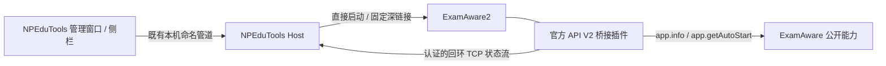

# ExamAware2 接入：第一阶段实现与验证

> 历史阶段记录。当前桥接 0.3.0 的登录自启动设置见 [E4 报告](EXAMAWARE2-STAGE4.md)，正常退出与配对撤销见 [E3 报告](EXAMAWARE2-STAGE3.md)。下文保留第一阶段的原始验证范围。

日期：2026-09-19。承接 `EXAMAWARE2-INTEGRATION-RESEARCH.md` 中建议的 E1 + E2 最小闭环。

## 1. 本次交付

NPEduTools 已增加「考试看板」管理窗口和侧栏启动入口。支持保存 ExamAware2 程序位置、发送启动/唤起请求、打开官方基本设置或插件设置，以及通过官方 API V2 桥接读取版本和原生登录自启动登记状态。

当前适配 Windows 正式版 **ExamAware2 1.5.2**。插件为 `npedutools-examaware-bridge` 0.1.0，产物位于 `.artifacts/examaware-bridge/npedutools-examaware-bridge-0.1.0.ea2x`。本次没有实现退出、自启动写入，也没有将 ExamAware 的时间源接入自动录课。

这是一份已实现并经过模拟宿主联调的第一阶段版本，**尚未完成官方 ExamAware2 发行版本体的实机验收**。不得把跨进程测试通过解释为已经验证真实播放器、托盘、学校集控、插件权限安装流程或 Windows 登录行为。

## 2. 使用流程

1. 启动重新编译后的 NPEduTools，在主窗口左侧打开「考试看板」。
2. 浏览选择正式安装目录中的 `ExamAware.exe`，保存位置。
3. 点击「打开插件设置」，从 ExamAware 本体导入 `.ea2x`，按本体流程审阅权限并启用插件。
4. 在 NPEduTools 点击「导出配对文件」。
5. 在 ExamAware **主页面**点击「连接 NPEduTools」，导入刚才的 JSON。
6. 返回 NPEduTools 确认连接状态。配对文件含连接凭据，导入后可以删除。

程序位置保存后，侧栏的「打开考试看板」可直接发送打开请求。尚未配置或后台拒绝请求时转到管理窗口。关闭管理窗口只隐藏该窗口；退出 NPEduTools 不退出 ExamAware。

插件提供「断开 NPEduTools」按钮，用于清除插件一侧的配对设置。普通重启无需重新配对。

## 3. 实现结构

| 层 | 文件 | 职责 |
| --- | --- | --- |
| 公共契约 | `src/NPEduTools.Contracts/ExamAware.cs`、`Protocol.cs` | 状态、配对及网络帧；能力白名单与参数校验 |
| Host 服务 | `src/NPEduTools.Host/ExamAwareService.cs` | 独立配置、配对、TCP 接入、心跳、启动请求去重 |
| 程序操作 | `src/NPEduTools.Host/ExamAwareTarget.cs` | 正式版路径检查、现有同名进程位置/会话检查、直接启动与固定深链接 |
| WPF | `ExamAwareWindow.*`、`MainWindow.ExamAware.cs` | 管理页、状态刷新、导出配对和侧栏快捷启动 |
| 桥接插件 | `plugins/npedutools-examaware-bridge/src` | 主进程只读上报；渲染进程配对导入及解除配对 |

使用官方 SDK 的 `defineMainPlugin`、`defineRendererPlugin`、`ctx.api.settings`、`ctx.api.files`、`ctx.api.ui.home` 和 `ctx.api.network.connectTcp`，没有复制本体内部 IPC，也不启用内置 HTTP 服务。

源依据锁定官方提交 `7979213fed918eaece7a5bf424e15f534778d7f2`：[插件开发说明](https://github.com/ExamAware/ExamAware2/tree/7979213fed918eaece7a5bf424e15f534778d7f2/docs/plugin-dev)、[SDK 契约](https://github.com/ExamAware/ExamAware2/blob/7979213fed918eaece7a5bf424e15f534778d7f2/packages/plugin-sdk/src/api/contracts.ts)、[深链接说明](https://github.com/ExamAware/ExamAware2/blob/7979213fed918eaece7a5bf424e15f534778d7f2/docs/usage/deeplink.md)。本地 `docs/ExamAware-docs` 是新旧内容混合的过渡文档，版本判定与本次调用以已锁定源码为准。

## 4. 操作与状态语义

| 能力 | 行为 |
| --- | --- |
| `examaware.status` | 查询状态，不返回配对密钥 |
| `examaware.config.set` | 校验完整本机路径并按配置修订号保存 |
| `examaware.start` | 直接执行选定程序；已有实例的唤起交由官方单实例处理 |
| `examaware.settings` | 仅传入 `examaware://settings/basic` |
| `examaware.plugins` | 仅传入 `examaware://settings/plugins` |
| `examaware.pairing.get` | 通过现有同用户、同会话命名管道读取配对信息，供用户主动导出 |

仅允许 `ExamAware.exe`，检查 PE 标记、产品名、1.5.2 文件版本及相邻 `resources/app.asar`。这些检查用于避免选错程序，**不等于发行包签名鉴定**。版本与平台还会从桥接读回。遇到不同安装位置、其他会话或无法核实的现有同名进程，停止启动操作。

启动请求先记录受理，再执行；保存最近 64 个请求 ID，跨 Host 重启去重。同时设置三秒启动冷却，抑制连续点击。若受理之后程序启动失败或后台崩溃，结果可能不确定；相同请求不会自动重放，用户需查看软件窗口后决定是否发起新请求。不会把第二实例的短暂进程 ID 当成真实主进程。

界面中的「已发送打开请求」与「桥接已连接」分别表示启动请求已发出、近期收到认证状态。桥接不是所选 EXE 路径的远程证明：官方 `app.info()` 不提供 PID 或路径，本阶段通过用户显式配对关联实例，没有伪造这种校验。

自启动状态使用三态：已登记、未登记、未知。断开、超时、不兼容版本、读取异常均不把状态解释为关闭。登记值只对应官方 `getAutoStart()` 返回值，不能证明 Windows 任务管理器允许该启动项运行。

## 5. 连接协议与持久化

- Host 只监听 `127.0.0.1`，首次选择空闲端口后持久化；端口冲突明确失败，不偷偷换端口。
- 两个固定接入循环；单帧最大 64 KiB，四字节小端长度头 + UTF-8 JSON，支持拆包。
- Host 每连接生成 32 字节随机 nonce，并发送 `hello`；其 proof 为 `HMAC-SHA256(key, "host\\n" + nonce)`。
- 插件验证 hello 后，每两秒调用只读 API，生成精确的 payload JSON 字符串。状态 proof 为 `HMAC-SHA256(key, "peer\\n" + nonce + "\\n" + sequence + "\\n" + payload)`，此处 `\\n` 表示实际 LF 换行。
- 序号从 1 开始严格递增；Host 使用固定时间签名比较。旧连接的状态帧不能在新 nonce 下重放。
- 握手期限四秒；状态帧间隔超过七秒失效；只保留一个有效报告者。非法对端的断开不清除另一有效连接的状态。
- 插件连接失败按 1、2、4、8、15 秒退避；卸载、禁用、清除设置会释放连接和定时器。不会因桥接断开而自动重启 ExamAware。
- 本阶段 Host 不向插件发送业务命令。hello 是共享密钥持有证明，不是带客户端随机挑战的双向会话协议；加入写操作前应升级握手、应答、期限和密钥撤销机制。

正常实例在 `%LocalAppData%/NPEduTools/config/examaware.json` 保存版本化配置、固定端口、随机配对密钥、程序位置与去重记录。独立于 ClassIsland 的配置及写锁。保存采用临时文件、落盘和替换，保存失败不更新内存中的配置版本。配置损坏或不兼容时保留原文件并停止本模块操作。

配对密钥目前保存在当前用户配置和插件设置中，不经网络发送原文。导出只由用户按钮触发，日志不记录密钥。此连接设计面向本机同用户应用互通，不提供抵御已控制同一 Windows 用户账户的恶意程序的隔离边界。后续加入写操作前，还需补充主动撤销/重置配对的产品入口。

## 6. 插件权限和构建

| 权限 | 用途 |
| --- | --- |
| `network.tcp`、`network.local` | 使用公开接口连接本机 Host |
| `files.dialog`、`files.read` | 用户选择并导入配对文件 |
| `ui.contribute` | 主页面配对、断开按钮 |
| `ui.notify` | 配对结果提示 |

不声明 `app.quit` 或 `app.configure`。本体安装流程仍由用户在 ExamAware 中完成。

SDK 1.5.2 发布包的依赖仍含 `workspace:*`；插件的 npm overrides 将两个内部包固定到同标签源码记录的 core 1.1.1、rpc 0.3.0。依赖锁文件已生成，官方 SDK 源码未修改。主进程使用宿主提供的 SDK；渲染进程打包所需 SDK 代码，避免浏览器中的裸模块导入。插件包附源码、锁文件、构建脚本、GPL v3 文本与第三方说明。

构建：`./scripts/build-examaware-bridge.ps1`。完整 .NET 验证：`./scripts/verify.ps1`。WPF 检查：`./scripts/test-examaware-ui.ps1`。

已经验证的现有 bundle 可以通过 `./scripts/build-examaware-bridge.ps1 -PackageOnly` 重打包。本次打包时 npm 再次还原出现连接重置与停滞，因此使用此前已构建、已验证的 bundle 完成打包，未更换依赖版本。

## 7. 本次验证结果

| 检查 | 结果与覆盖 |
| --- | --- |
| .NET Release 编译 | 0 警告、0 错误 |
| .NET 全量测试 | 288/288 通过，其中新增 ExamAware 测试 14 项 |
| 插件 TypeScript / bundle | 编译通过，依赖固定 |
| 插件跨进程与界面贡献检查 | 5/5 通过：使用官方 SDK 入口、模拟 `ctx.api`，实际连接真实 Host 的 TCP 和命名管道；覆盖拆包、错误密钥、读回 true/false/未知、后台重启、设置更新与卸载 |
| WPF 界面自动化 | 3/3 通过：无配置启动提示、中文/空格无效路径拒绝、侧栏转入配置、窗口关闭与重新打开、应用正常退出 |
| 打包检查 | `.ea2x` ZIP 根清单与两个入口完整；输出 SHA-256 |

全量测试首次运行暴露原有 `FakeSchedule` 的晚间缺陷：第二节课结束时间为当前时刻加 91 分钟，22:29 后会生成跨午夜课表，四项测试因此失败。本次仅将该测试夹具的课程安排固定在白天，并将实时倒计时锚点与课程安排分开；修正后完整复跑通过。没有修改实际课表读取或录课调度逻辑。

界面截图：`.artifacts/examaware-ui/cd43b74366c44058a4b0ab5ed3cf4688/management.png`；同目录 `summary.json` 为界面检查记录。.NET 结果位于 `.artifacts/test-results/prototype.trx`。

## 8. 火绒告警与当前交付状态

2026-09-19 23:08:14，火绒对本次工作生成的临时文件 `.artifacts/restore-examaware-cache.ps1` 报告 `Backdoor/Meterpreter.q`（病毒 ID `A8EA9DA9FFB22BC3`），操作为「执行」，结果为「已处理，删除文件」。触发进程为 Codex 使用的 PowerShell，PID 77620；父进程为 Codex，PID 41716。此处记录的是用户提供的告警详情，不将其当作文件内容哈希或已确认的病毒家族归因。

该文件是依赖恢复辅助脚本：读取插件锁文件、校验本机 npm 缓存 SHA-512、限制解包目标在本插件 `node_modules` 内、使用 .NET 解压，并调用构建与测试。已写入的原文中没有 Meterpreter 载荷、进程注入、远程控制或关闭杀毒软件的逻辑。不过，未获得火绒复核结论，不能仅以脚本用途判断为已确认误报。

文件消失后、用户告知杀毒告警之前，执行者曾将恢复逻辑改为直接命令尝试，后因压缩包路径前缀检查失败退出。获知告警后已停止构建和解包，没有恢复被删除脚本、添加白名单或修改火绒设置。该临时脚本现已废弃。

告警后仅做只读核对：安装包中的主/渲染 bundle 及三份插件源文件与工作区逐项 SHA-256 一致；包内不含该恢复脚本。当前包 SHA-256 为 `1E7789F19CAF93E89BF071E7C0B4453AF457F510F3777F0075AC86D3DFF7611F`。这些结果说明已检查文件的一致性，不构成杀毒软件复核或正式版兼容性验收。

先前编译及测试结果仍作为当时的验证记录保留。后续依赖恢复中曾发生异常文件和编译失败，因此暂停了进一步构建。

用户随后告知已自行将文件夹加入火绒白名单。执行者没有修改杀毒软件配置，也没有恢复或重新执行被删除的脚本；改回标准 `npm ci --ignore-scripts --prefer-offline --no-audit --no-fund`，成功重新安装 99 个锁定依赖。之后 `npm run build` 与 5 项插件联调测试再次全部通过，两个重建 bundle 与上述安装包内文件逐项 SHA-256 一致。现有包无需替换，前述 SHA-256 仍有效。

这次标准流程的成功说明构建已恢复，不等于告警已被厂商确认为误报。此前所有解包异常与该告警是否具有共同原因，仍不能仅凭时间关联确定。不建议长期保留整个项目目录的广泛白名单；后续可凭原始告警与脚本原文向火绒申请复核，本次没有向外部提交文件。

## 9. 下一步

2026-09-19 后续真实源码宿主联调已完成，见 [联调报告](EXAMAWARE2-REAL-HOST-VALIDATION.md)。发现 0.1.0 主进程外置 SDK 无法从用户插件目录解析，0.1.1 改为打包所需 SDK 代码；第 6 节原有构建描述与第 8 节哈希仅记录 0.1.0 的历史产物。当前应使用 0.1.1。

官方 1.5.2 源码构建下，安装权限提示、插件按钮、配对、版本/自启动读回、插件重载、双方重启、隐藏窗口唤起和设置深链接均已通过。还需在隔离配置的官方 Windows 1.5.2 发行版中完成生产 EXE 路径的启动验收、不同安装路径拦截、程序移动后的处理。开发进程的自启动登记读数不能替代官方 EXE 的读数；真实登录启动未验证。

完成 E1/E2 本体验收后进入 E3 正常退出：增加官方退出权限、明确请求应答与实际进程退出的区别，验证学校集控禁止退出及未保存编辑的行为。随后进入 E4 自启动写入：目标值设置、结果回读、Windows 禁用状态说明与真实注销登录验证。涉及写操作时先升级会话认证及配对撤销机制。最终在 E5 统一主窗口卡片和 OOBE 可选引导。
