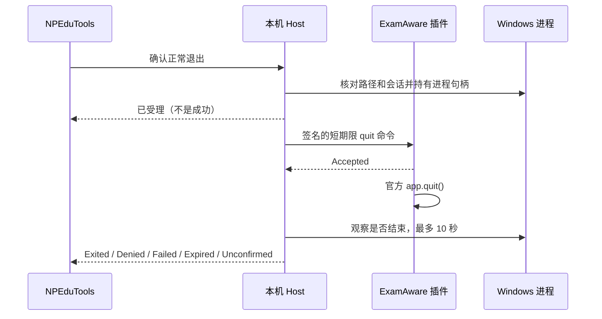

# ExamAware2 E3：正常退出、配对撤销与验证

> E3 阶段记录。现已新增 [E4 登录自启动设置](EXAMAWARE2-STAGE4.md)，插件版本 0.3.0；下文保留 E3 当时的权限与验证范围。

日期：2026-09-20。范围：NPEduTools 开发构建、桥接 0.2.0、Windows ExamAware2 1.5.2 / Plugin SDK 1.5.2。

## 结论与使用前提

已实现从 NPEduTools 发起官方正常退出、跟踪结果、学校策略拒绝和配对撤销。普通窗口、托盘隐藏、播放器及先关闭编辑器后退出的流程，均通过官方源码宿主联调。产品不包含强制终止或退出自动重试。

**必须先保存并关闭考试编辑器。** 实测上游 1.5.2 的 `app.quit()` 会先清理 IPC / 插件，再尝试关闭编辑器。编辑器请求保存确认时，接口已经不可用，导致关闭无法完成，桥接也已断开。NPEduTools 会报告 `Unconfirmed`，不会误报成功。这项已知限制尚未在上游修复；E3 不能宣称覆盖任意窗口状态下的无条件退出。

官方打包 EXE 的生产路径启动与退出尚待单独验收。此次运行的是用户提供源码的构建结果，不把源码宿主结果等同于正式发行版验收。E4 自启动写入未实施。

## 操作流程

1. 同时更新 NPEduTools 和 `npedutools-examaware-bridge-0.2.0.ea2x`，在官方安装器确认新增 `app.quit` 权限。
2. NPEduTools 保存正式 `ExamAware.exe` 的位置。源码运行时 `electron.exe` 不应作为生产管理页的目标。
3. 重新导出配对 JSON，在 ExamAware 主页面导入。0.1.x 的 v1 配对文件不能用于 0.2.0。
4. 确认连接就绪，保存并关闭编辑器、结束放映；在 NPEduTools 点击「退出 ExamAware」并确认。
5. 查看最终结果。超过 10 秒未确认时，先检查 ExamAware 状态；系统不会强杀或自行重复请求。

需要作废旧文件时，使用「撤销当前配对」，再导出和导入新文件。普通重启无需重新配对。单纯关闭 NPEduTools 不会退出 ExamAware。

## 实现与结果状态

| 部件 | 本次变化 |
| --- | --- |
| `NPEduTools.Contracts/ExamAware.cs` | 退出命令、应答、进程 ID、退出结果契约 |
| `NPEduTools.Host/ExamAwareService.cs` | 协议 v2、异步退出观察、去重、配对密钥轮换 |
| `NPEduTools.Host/ExamAwareTarget.cs` | 核对路径 / 会话，保留目标进程句柄 |
| `NPEduTools.App/ExamAwareWindow.*` | 正常退出卡片、操作确认、结果轮询、配对撤销 |
| `plugins/npedutools-examaware-bridge` | 官方 `app.quit()`，签名命令与应答，单次连接初始化 |
| `tests/NPEduTools.ExamAware.TestHost` | 仅供源码宿主的独立测试适配器，加入解决方案，不随应用分发 |



插件先写出 `Accepted` 再调用官方退出，因为调用可能同步卸载插件和连接。若官方 SDK 拒绝，插件补发 `Denied`；其他调用异常为 `Failed`。`Accepted` 只代表插件受理，仍需进程观察。

| 状态 | 含义 |
| --- | --- |
| Sending / AwaitingExit | 正在发送 / 插件已受理、等待目标结束 |
| Exited | 保留的目标进程句柄确认进程已结束；没有应答时文案会说明 |
| Denied | 官方 SDK 拒绝，通常是学校策略或插件权限 |
| Expired | 命令超出有效期，未执行 |
| Failed | 插件报告调用失败，没有强制退出 |
| Unconfirmed | 10 秒内未确认，或发送/观察遇到错误；断线不等于退出 |

保留句柄可避免 PID 被复用时误判另一个进程。超时后不继续后台追踪，也不把稍后退出自动改写为成功。退出进行中拒绝重新发起、修改程序位置、打开软件或撤销配对。

## 协议与信任边界

- 私有配对/桥接协议升级为 v2，与官方 Plugin API V2 独立。服务端和客户端各生成随机挑战，完成双方认证后才读取状态或接受命令。
- HMAC-SHA256 包含方向、双方随机数、逐方向递增序号、帧类型及原始 payload。错误签名、序号重放或旧握手不能作为有效会话使用。
- 仅允许 `quit`，有效期最多 3 秒；执行前和应答后均检查期限与会话是否仍有效。这里的系统 UTC 用于本机命令过期控制，不改变录课采用 ClassIsland 时间的设计。
- Host 持久化最近 64 个已受理的副作用请求 ID，再进行操作；这不是无限历史去重。插件当前激活周期保留最多 64 个已消费退出 ID，达到上限拒绝后续命令，不驱逐旧 ID。
- 只监听 IPv4 回环地址；新鲜状态窗口 7 秒，插件通常每 2 秒报告。重置配对会轮换密钥并关闭旧会话。
- 进程 ID 来自持有配对密钥的插件，再由 Host 核验路径、当前 Windows 会话与实际进程句柄。**未做 TCP 连接所有者的操作系统级 PID 证明**。同用户能读取配对凭据的进程处于该信任范围；这不是对本机同用户恶意程序的隔离边界。
- 新增 `app.quit`，未申请 `app.configure`；没有自启动写操作、任意程序执行命令、考试正文或编辑器内容读取。
- 持久化配置仍为版本 1，能载入原 E2 配置；旧 Host 不认识新增操作回执，回退旧版本可能拒绝加载，不能混用旧 Host 与新插件。

## 联调发现

### 初始化重复连接

真实 SDK 的设置订阅会立即发出当前值。原实现的订阅回调与末尾初始化同时连接，产生同轮两次连接；某条连接被拒绝后会使本应有效的连接失去活动身份。现在每轮只允许一个连接尝试，并用激活所有权避免旧实例的 dispose 影响新实例。新增“立即回调订阅”和“替换激活”回归测试。

### 上游编辑器关闭顺序

证据来自用户提供源码与运行结果（以下路径相对于 ExamAware2 仓库）：

- `packages/desktop/src/main/plugins/api/mainPluginApi.ts`：官方 app.quit 检查学校策略后调用 Electron app.quit。
- `packages/desktop/src/main/runtime/shutdownCoordinator.ts` 与 `packages/desktop/src/main/index.ts`：before-quit 中先执行 disposeIpc / pluginHost.shutdown 等清理，再调用 app.quit。
- `packages/desktop/src/main/windows/editorWindow.ts`：关闭被拦截，要求渲染端确认。
- `packages/desktop/src/renderer/src/composables/useExamEditor.ts`：未保存时请求原生消息框，确认后还需要 closeCurrent IPC。

实测手动关闭编辑器时，取消 / 保存 / 不保存三个选择均正常；仍保留编辑器时直接发起 app.quit，则确认接口不可用，Host 最终为 Unconfirmed。故 UI 与插件说明明确要求先关闭编辑器。未修改 ExamAware 源码，也没有模拟一个成功关闭来掩盖此问题。

官方 WindowsApi.get 只访问插件自己命名空间内的窗口，不能用于检测内置编辑器；当前插件未加入非公开窗口枚举或自动关闭编辑器的逻辑。若已进入此异常状态，编辑器数据仍在内存不等于已安全落盘，应先保全内容，避免直接结束进程。

## 验证结果与范围

| 验证 | 结果 |
| --- | --- |
| .NET 全套回归 | 294 / 294，通过；Release 构建 0 警告、0 错误 |
| 桥接插件回归 | 12 / 12，通过；覆盖真实 .NET Host、认证、重放、期限、权限、初始化与安装位置加载 |
| WPF 管理页 | 5 项通过：未配置启动、非法路径、侧栏重开、断线退出禁用、撤销配对确认可取消 |
| 官方源码宿主 | 20 项通过，含已知缺陷的预期不确定结果断言 |

20 项宿主场景包括原 E2 的 11 项安装/连接/重启/唤起检查，加上配对撤销、普通退出、托盘隐藏退出、学校策略拒绝、编辑器取消、编辑器未关闭的上游限制、保存关闭后退出、放弃关闭后退出和播放窗口退出。

宿主源码：`D:\WebstormProjects\ExamAware2`，提交 `7979213fed918eaece7a5bf424e15f534778d7f2`，Desktop / SDK 1.5.2，Electron 39.2.7。测试通过源码构建运行，`isPackaged=false`。测试适配器只允许指定的 electron.exe 路径，进程核验与观察复用产品实现，生产路径校验未放宽。

每轮在唯一临时目录隔离 userData、配对、考试文件、管理策略。原生文件/消息框适配用于选择夹具和确认选项，实际安装器、权限确认、SDK、网络和退出调用均参与。禁止登录自启动写入，并拦截系统协议关联登记；未修改用户正式配置。故意拒绝退出的测试进程在断言结束后由夹具自行清理，该清理不计作正常退出通过，也不是产品的备用退出手段。

每轮结果在 `.artifacts/examaware-real-host/<时间戳>/summary.json`，含检查清单、运行版本与编辑器限制诊断；截图位于同目录。最终报告目录、包的 SHA-256 另见本报告的交付记录。

## 复现

先完成 ExamAware2 的源码构建（沿用 [E2 文档](EXAMAWARE2-REAL-HOST-VALIDATION.md)）。在 NPEduTools 根目录执行：

```powershell
./scripts/verify.ps1
./scripts/build-examaware-bridge.ps1
./scripts/test-examaware-ui.ps1
node scripts/test-examaware-host.mjs --source D:/WebstormProjects/ExamAware2 --playwright <playwright/package.json绝对路径> --e3 true
```

`verify.ps1` 会构建解决方案中的测试 Host。不要把测试 Host 分发给用户；应用发布流程不引用它。真实宿主测试不依赖对用户正式 ExamAware 进程的操作。

## D 盘事件与恢复

2026-09-19 23:54:29–30，Windows NTFS 事件 50 / 140 记录 D 盘延迟写入失败与卷被卸载，设备为 Lenovo PS9 PSSD。两个工作树文件（桥接 main.ts、真实宿主测试脚本）被发现为全零字节。源码及插件包随后转移到 C 盘恢复和验证。

恢复目录：`C:\Users\Changhong\NPEduTools-E3-recovery-20260919-235632`，保留原始损坏文件、哈希清单、磁盘事件、Git 基线及工作副本。main.ts 从先前完整打包暂存文件恢复；测试脚本由 Git 基线和本阶段新增逻辑重建。后续通过 C 盘构建和测试，向 D 盘只写回本任务变更与已验证产物，并核对内容哈希。

此磁盘故障与此前火绒告警分别记录，没有将磁盘写入失败归咎于杀毒软件，也没有恢复被删除的缓存修复脚本或修改杀毒设置。

## 后续

1. 使用官方 1.5.2 发行版补齐真实安装目录、生产路径启动与退出验收。
2. 跟踪上游关闭顺序问题，修复后再扩大“编辑器仍打开”场景的退出能力。
3. 单独推进 E4 自启动配置，明确官方权限、Windows 登记与实际生效状态。

## 本次交付记录

- 最终插件：`.artifacts/examaware-bridge/npedutools-examaware-bridge-0.2.0.ea2x`。
- SHA-256：`AA233D08E3C5C7209312315A50E473D789BF1EFDC35173122D4875ED6F5CD82D`。
- 最终插件包真实宿主复测：`.artifacts/examaware-real-host/2026-09-19T16-25-56-434Z/summary.json`，20 项通过。
- 最终 WPF 复测：`.artifacts/examaware-ui/394368b5bce2443eb7794697ae84038a/summary.json`，5 项通过。
- .NET 结果：`.artifacts/test-results/prototype.trx`，294 项通过；后续将测试 Host 加入解决方案并更新 WPF 文案后，锁定还原与完整 Release 构建再次通过，未重复运行未受影响的全套测试。
