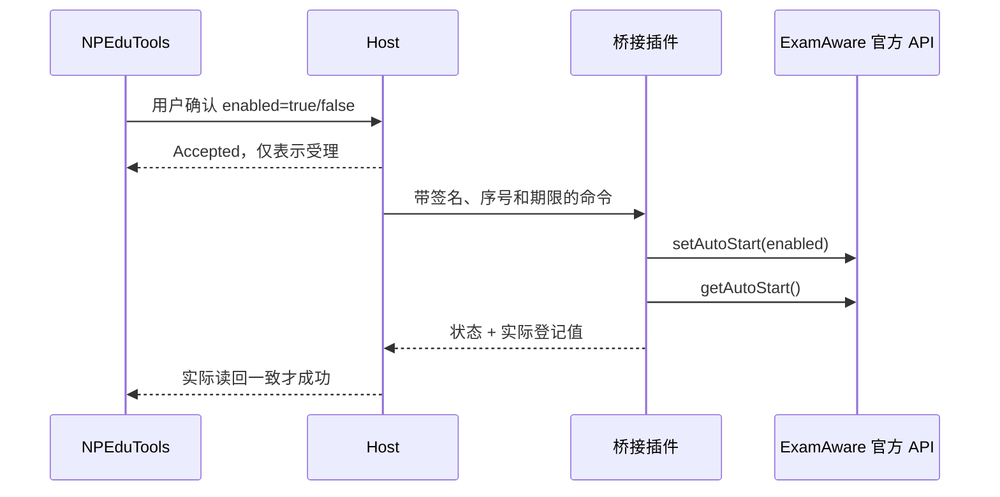

# ExamAware2 E4：登录自启动设置与验证

日期：2026-09-20。适配 Windows ExamAware2 1.5.2 / Plugin API V2 / SDK 1.5.2，NPEduTools 桥接 0.3.0。

## 本次交付

NPEduTools「考试看板」现在可以明确开启或关闭 ExamAware 的当前用户登录自启动。每次界面操作都先确认，再通过已经认证的桥接调用官方 `ctx.api.app.setAutoStart(enabled)`，随后独立调用 `getAutoStart()` 读回登记结果。没有直接修改注册表、另建启动项或使用计划任务。

结果分为成功、读回不一致、权限拒绝、已过期、调用失败与无法确认。只有独立读数与请求一致时显示成功，**关闭成功返回 false，不是失败**。断线、超时和 Host 重启都不会自动重放写操作。开启/关闭与退出互斥。

本阶段代码、回归和隔离源码宿主联调完成；**真实 Windows 登记、任务管理器禁用与实际注销登录尚未验收**。这与“已经完成完整开机自启实测”不同，详见验证边界。

## 用户流程与升级

1. 同时更新 NPEduTools 和 `npedutools-examaware-bridge-0.3.0.ea2x`。插件新增声明 `app.configure` 权限。
2. 使用正式安装目录中的 ExamAware.exe，保存位置并完成配对。仍采用 v2 配对格式，已有 v2 文件可继续导入；旧 v1 文件需重新导出。
3. ExamAware 运行且桥接连接就绪后，点击「开启登录自启动」或「关闭登录自启动」，确认所选程序与当前 Windows 用户。
4. 等待实际读回。上方是当前登记状态，下方单独显示上次设置结果；不会先乐观切换显示再忽略失败。

新 Host 能与 0.2.0 插件继续查询和退出，但未宣告设置能力的旧插件不能执行 E4。0.3.0 新状态字段不兼容旧 Host 的严格解析，需要一起更新。升级未验证版本仍被拒绝。新操作回执保存在原配置中，回退旧 Host 可能因不认识回执能力而拒绝载入。

确认框显示后台已经保存的实际程序路径。请求携带确认时的配置修订号；如果确认期间程序位置或配对被其他操作改变，Host 拒绝这次设置，要求重新核对，避免把旧确认用于新目标。

安装、导入配对、初始引导或普通启动都不会自行开启 ExamAware 自启动。未知不等于关闭；断连时按钮不可用。程序位置变化会清除页面上的上次设置结果，避免把旧程序的操作当作新位置的状态。

## 官方接口核对

依据用户提供的 `D:\WebstormProjects\ExamAware2`，提交 `7979213fed918eaece7a5bf424e15f534778d7f2`，Desktop / SDK 1.5.2、Electron 39.2.7。

| 源文件（相对 ExamAware2） | 核对结果 |
| --- | --- |
| `packages/plugin-sdk/src/api/contracts.ts` | `setAutoStart(boolean): Promise<boolean>`，`getAutoStart(): Promise<boolean>` |
| `packages/desktop/src/main/plugins/api/mainPluginApi.ts` | 设置前检查 app.configure，调用原生 setLoginItemSettings，再读 openAtLogin |
| `packages/desktop/src/renderer/src/views/settings/BasicSettings.vue` | 页面挂载时读系统状态；监听 behavior.autoStart 后调用原生接口，因此不依赖该页面的间接副作用 |
| `packages/desktop/src/renderer/src/components/PluginPermissionDialog.vue` 与安装权限清单 | 1.5.2 高权限确认框展示敏感权限子集，实测没有单列 app.configure |

插件仍如实声明 app.configure，并明确告知用途；SDK 仍检查清单权限。NPEduTools 对每次设置另有操作确认。没有通过其他权限或直接系统调用规避 SDK 检查。

**登记和最终生效要分开理解**：这里是当前用户登录后的桌面程序启动，不是登录前服务。openAtLogin 不覆盖任务管理器 StartupApproved 禁用、路径搬迁后的旧项或实际启动失败。不能据此保证下次登录一定启动，或一定只显示托盘。原 E1 研究中的静默启动判断限制仍保留。

## 实现

| 层 | 变化 |
| --- | --- |
| Contracts | HostRequest.AutoStartEnabled 为可空 bool；设置请求必须传明确 true/false，其他命令不能携带；增加设置命令/应答/历史结果/能力标志 |
| Host | examaware.autostart.set；校验配置位置、支持版本、新鲜连接、能力和实际进程路径/会话；持久化请求回执后发送；最多等待 10 秒 |
| 插件 | 只执行 autostart.set 白名单；调用官方 setter 和独立 getter；用结果帧 autostart.reply 返回；不把 setter 返回值直接当成功 |
| WPF | 两个明确按钮，确认后提交；进行中禁用；实时登记与上次结果分开显示；后台失联时禁用控制 |



| 结果 | 行为与解释 |
| --- | --- |
| Sending | 正在执行，旧登记值暂时保留，未乐观改写 |
| Succeeded | 读回值与请求一致，false 同样成功 |
| Mismatch | 有明确读数，但与请求不符；保留实际值 |
| Denied | SDK 权限拒绝，提示检查 app.configure |
| Expired | 执行前已过期，没有执行设置 |
| Failed | setter 抛异常；可能已经产生部分效果，因此文案明确结果可能不确定 |
| Unconfirmed | getter 失败、连接中断、进程结束或等待超时；不自动重试 |

E3 的双方随机挑战、HMAC、方向/序号、最大 3 秒命令执行期限保持不变。设置应答必须来自**发送命令的同一认证会话**并匹配 requestId；新会话不能补报旧操作成功。Host 在最近 64 条持久化回执范围内去重，插件单次激活最多消费 64 个写命令 ID（包括退出），满额拒绝，不是无限历史去重。

设置与退出、改路径、启动/打开设置、撤销配对互斥。心跳读取若开始于写入之前，写入后丢弃该旧读取结果，避免旧登记值覆盖新的应答。设置后仍持续读取实时状态，可反映用户在别处的变更。超时结束后不将迟到应答改写为成功；后续实时读数独立更新。

进程核对和配对密钥的同用户信任边界沿用 [E3](EXAMAWARE2-STAGE3.md)。没有新增远程端口或任意命令通道，没有改动 ClassIsland 时间与自动录课逻辑。

## 验证与边界

| 层次 | 结果 |
| --- | --- |
| .NET 全套测试 | 304 项通过；其中 ExamAware 专项 30 项 |
| 桥接插件测试 | 19 项，覆盖开启/关闭、false 成功、错误签名、参数类型、重复/过期、权限拒绝、读回失败/不一致、互斥、断线及旧心跳结果抑制 |
| WPF 自动化 | 6 项：原有入口/路径/退出/撤销检查，加断线时两个设置按钮禁用、未知文案 |
| 真实源码宿主 | 27 项：原 E3 20 项，加 E4 开启、关闭、读回不一致、写入异常、读回异常、重启不重放和外部登记变化 |

联调使用真实官方插件安装器、权限确认、SDK、TCP、Host 与状态反馈。在 Electron 的 `app.setLoginItemSettings/getLoginItemSettings` 边界替换为临时目录内的文件登记适配器：可以确定不写入用户真实 Windows 启动项，并可注入异常；这部分是模拟的系统边界，**不把它称为真实注册表测试**。官方 SDK 的 setter 本身也会读一次；随后插件再次独立读取，测试覆盖第二次读取失败而设置已经发生的情况。

学校禁止退出、托盘、播放器和编辑器限制仍保留 E3 验证。自启动 SDK 只检查 app.configure，不能将 E3 的退出策略拒绝测试解释为 E4 已验证所有学校策略。原生写入异常模拟为 SDK 失败；权限拒绝另由插件单元测试覆盖。

未执行用户注销登录、真实 StartupApproved 切换、官方发行版安装目录迁移或跨版本升级测试；未修改用户正式 ExamAware 配置。正式发行版 EXE 的路径与启动验收也仍沿用 E3 的待办。源码宿主仅使用单独测试 Host 允许固定 electron.exe，产品校验没有放宽。

## 复现与交付

先按 [E2](EXAMAWARE2-REAL-HOST-VALIDATION.md) 完成 ExamAware2 源码构建，在 NPEduTools 根目录执行：

```powershell
./scripts/verify.ps1
./scripts/build-examaware-bridge.ps1
./scripts/test-examaware-ui.ps1
node scripts/test-examaware-host.mjs --source D:/WebstormProjects/ExamAware2 --playwright <playwright/package.json绝对路径> --e4 true
```

`--e4 true` 包含 E3 场景，启用隔离的登录启动适配器；仅 `--e3 true` 时依然禁止原生自启动写操作。测试不会自动设置真实启动项。报告在 `.artifacts/examaware-real-host/<时间戳>/summary.json`，界面结果在 `.artifacts/examaware-ui/<标识>/summary.json`。

本次仍在 C 盘工作副本开发和测试，E4 前的 E3 文件另存于 `C:\Users\Changhong\NPEduTools-E4-baseline-20260920`。写回 D 盘前核对旧文件哈希，写回后再次核对。保留 C 盘工作副本与基线，不删除上次恢复资料。

下一步是隔离环境下的官方发行版 Windows 实机验收，再决定是否进入 E5 的 OOBE 和界面整合。E3 中编辑器仍打开时的上游退出问题尚未修复。

## 最终交付记录

- 插件：`.artifacts/examaware-bridge/npedutools-examaware-bridge-0.3.0.ea2x`。
- SHA-256：`FEC684F8B3EE10AA06A78C8A6D2EB6A003BF194C6A34C9AE3CD3A29764A31B22`。
- 最终包及 Host 联调：`.artifacts/examaware-real-host/2026-09-19T16-47-49-683Z/summary.json`，27 项通过；包含 `autoStartNativeAdapter: true` 和安装确认框实际展示情况。
- 最终界面检查：`.artifacts/examaware-ui/b9f34e56a8ca4dfcac29f196f90c11df/summary.json`，6 项通过。
- 最终 .NET 结果单独保留于 `.artifacts/examaware-stage4/prototype.trx`，304 项通过；Release 构建 0 警告、0 错误。
- C 盘回写清单：`C:\Users\Changhong\NPEduTools-E4-baseline-20260920\writeback-verified.json`。工作副本仍位于 `C:\Users\Changhong\NPEduTools-E3-recovery-20260919-235632\workspace`。
