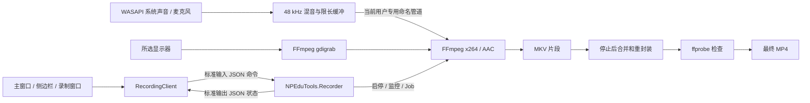

# NPEduTools 独立微课录制

更新：2026-09-17。已实现主窗口配置、侧边栏控制、屏幕与双音源录制、本地 MP4 保存及异常片段恢复。

2026-09-19 后续更新：已接入 [P3 自动录课](AUTO-RECORDING-EXECUTION.md)。手动与自动会话现在由 Host 统一管理，新增控制失联保护；“保存设置”可单独保存选项供自动模式使用。下文保留手动录制的操作与采集说明。

依据此前的 [C30 录制微课研究](DATEDU-MICROLESSON-RECORDING.md)，借鉴低帧率、简单采集链路和独立录制进程的设计。实现使用自己的控制协议、WASAPI 和固定版本 FFmpeg，不调用 Datedu 的程序、DLL、激活接口或云服务。

## 使用方式

1. 主窗口概览点击“录制微课 → 配置与录制”，或侧边栏“课堂工具 → 录制微课”。打开窗口及检测设备不会开始采集。
2. 选择屏幕、画质、帧率及音源。默认 1080p 上限、8 fps，系统声音与麦克风都开启；没有可用设备时可以取消对应音源。
3. 选择保存目录，点击“开始录制”。没有倒计时；编码器实际生成首帧后显示“录制中”。
4. 在录制窗口或侧边栏暂停、继续、停止并保存。暂停时间不进入成片，继续时建立新片段。
5. 等待“已保存”，再打开视频或文件夹。默认位置为 Windows“视频”目录下的 `NPEduTools`，文件名包含时间及随机后缀。

关闭、最小化或收起窗口保持录制。完整退出 NPEduTools 会先结束录制并保存；保存失败则显示错误和保留片段位置。设置按用户及后台端点隔离，测试不会覆盖正常配置。

| 参数 | 当前实现 |
| --- | --- |
| 采集 | GDI，所选显示器的实际像素区域，包含鼠标 |
| 帧率 | 8 fps / 15 fps |
| 保存尺寸 | 1080p 档最大 1920×1080；720p 档最大 1280×720；等比例缩小、不放大、宽高取偶数 |
| 视频 | libx264 软件编码，ultrafast、zerolatency、CRF 23、YUV420P、2 个编码线程 |
| 音频 | WASAPI 系统回环及麦克风；48 kHz 双声道混音 → AAC 128 kbit/s |
| 双音源 | 各 50% 增益；没有回声消除、自动降噪或自动增益 |
| 格式 | 录制中 MKV，停止后重封装为 MP4，启用 faststart |
| 并发 | 同一 Windows 会话内仅允许一个录制工作进程 |

4K 屏幕仍以原始尺寸进行 GDI 采集，随后缩小再编码，不能把它理解为采集开销与 1080p 相同。当前路径不使用 Intel QSV，也不要求独立显卡；是否改善 OBS 在目标设备上的问题仍需比较实测。

## 架构



录制与 ClassIsland Host、PowerPoint 辅助独立，Host 重连不会重启录制。界面只负责命令和状态，GDI、WASAPI 和编码都在独立进程链路中，没有录制上传逻辑或网络监听。

状态为 `Idle → Starting → Recording → Pausing → Paused → Starting`；停止进入 `Saving → Saved`，失败进入 `Failed`。启动、暂停、保存期间禁用重复操作；只在首帧产生后显示 Recording，只在临时 MP4 检查通过并移动到最终路径后显示 Saved。

### 音频与有界缓冲

先初始化全部 WASAPI 设备，再启动 GDI/FFmpeg，避免设备初始化造成数百毫秒的起始音画偏移。音频管道连接后清空启动期间的缓冲，按单调时钟每 20 ms 提供数据；没有音频回调时补静音，避免系统静音导致时间轴停顿。

每路源缓冲上限 2 秒，积压超过 300 ms 清空并计数；音频写入超时 3 秒、调度落后超过 500 ms 或设备异常会报告失败。FFmpeg 视频输入队列为 2，音频输入队列为 16。界面展示帧数、文件体积、FFmpeg 丢帧和音频缓冲异常计数；计数为零不代表没有重复帧，也不能替代真实讲解的同步检查。

### 暂停和文件生命周期

暂停向 FFmpeg 发送 `q`，正常关闭并验证当前片段；继续创建下一个片段。停止后用 concat demuxer 按顺序复制编码流到 MP4，不重新压缩视频。最终检查确认正时长、H.264、尺寸及所需 AAC 音轨。日常保存检查媒体结构，自动化验收和恢复还会完整解码。

输出目录下的 `.npeedutools-sessions/<会话名>/` 包含：

- `session.json`：版本、设置、尺寸、片段清单和状态，以临时文件替换方式保存。
- `part-0001.mkv` 等：录制片段，约每秒关闭一个 Matroska cluster 并刷新写入。
- `part-0001.mkv.log` 等：每片段约 1 MB 上限的诊断日志，达到上限仍持续排空错误管道。
- `final.partial.mp4`：保存期间的临时成片，验证后才移动到最终路径。

正常保存后删除本会话 MKV，保留小型清单和日志；失败保留片段。本版尚无历史录制列表或日志自动清理。

### 中断和恢复

- 开始前至少需要 512 MB 空间；录制中低于 256 MB 停止。重封装需额外容纳片段总体积加 64 MB，长课应提前预留约两份视频的空间。
- 连续 15 秒没有新增编码帧、编码器退出或音频异常，会停止并保留片段。
- 编码器放在启用 `KILL_ON_JOB_CLOSE` 的 Windows Job 中；录制进程异常退出时，编码器也会被关闭。
- 主程序消失造成控制输入 EOF 时，工作进程尝试正常保存。原生驱动卡死时，启动/暂停/继续最多等待 30 秒，停止/退出保存最多 3 分钟；超时结束工作进程，保留片段。

录制失败后点击“打开保留片段”，记下目录并完整退出 NPEduTools，再以该目录执行恢复。恢复与录制共用进程互斥检查，避免同时操作正在录制的片段：

```powershell
./scripts/recover-recording.ps1 -SessionDirectory 'D:\录制目录\.npeedutools-sessions\微课-会话名'
```

也可运行完整 App 构建目录中的 `Recorder/NPEduTools.Recorder.exe --recover <片段目录>`。工具校验清单及文件名，只读取当前目录中的 `part-数字.mkv`；缺失、空文件、重复、无效路径或媒体验证失败会停止。成功后在片段目录生成唯一的 `恢复-随机标识.mp4`，不删除原片段或覆盖已有成片。

断电、磁盘损坏及尚未写入完整帧的数据不保证恢复。已验证的是进程中断后已写入片段的恢复，并非任意损坏修复。

## 开发和运行组件

首次准备录制组件，然后运行现有构建验证：

```powershell
./scripts/bootstrap-recorder.ps1
./scripts/verify.ps1
./scripts/start-app.ps1
```

引导脚本校验固定 FFmpeg 9.0.1 压缩包 SHA-256，提取 `ffmpeg.exe`、`ffprobe.exe`、许可证和说明到 `.tools/recording`。上游 release 别名改变时哈希校验会拒绝新文件，需维护者明确更新版本及哈希；日常启动不会下载组件。

App 旁的 `Recorder` 及其中的 `Tools` 必须保留。组件缺失会显示错误，其他工具仍可使用。交付是需要 .NET 10 Desktop Runtime 的构建目录，尚未验证独立安装包或 `dotnet publish`。NAudio 2.2.1 使用 NuGet 锁文件；FFmpeg 的构建说明和 GPL v3 文本随 Tools 复制，见 [依赖说明](DEPENDENCIES.md)。

主要源码：`src/NPEduTools.Recorder/`（采集、监控和文件生命周期）、`src/NPEduTools.Contracts/RecordingModels.cs`（命令和状态）、`src/NPEduTools.App/RecordingClient.cs` 及 `RecordingWindow.*`（进程连接和界面）。

## 验证记录

```powershell
./scripts/test-recording.ps1 -DurationSeconds 120
./scripts/test-recording-ui.ps1 -Configuration Release
./scripts/test-app-smoke.ps1 -Configuration Release
./scripts/test-shortcuts-ui.ps1 -Configuration Release
```

媒体测试只捕获自建 960×540 动态窗口；系统声音测试播放低音量测试音，麦克风测试短暂录制本机音源，视频只保存在 `.artifacts`。正常产品录制所选显示器；测试窗口目标只由明确的测试命令或私有测试端点启用。

2026-09-17 媒体实测通过，见 [媒体结果](../.artifacts/recording/e6780fe971434c92b60c83328b56ee06/summary.json)：

| 测试 | 实际结果 |
| --- | --- |
| 8 fps 屏幕采集、暂停续录 | 10.000 秒 MP4，暂停等待不计入，完整解码通过 |
| 系统声音连续录制 120 秒 | 121.896 秒 H.264/AAC MP4，测试音非静音，完整解码通过 |
| 麦克风 + 系统声音，15 fps | 3.687 秒 MP4，控制输入关闭后自动保存，完整解码通过 |
| 工作进程被强制结束 | 编码器随 Job 结束；片段恢复出 6.125 秒 MP4，完整解码通过，原片段保留 |
| 无效屏幕 | 开始前拒绝，没有虚假输出文件 |

这些成片均为 960×540，丢帧与音频缓冲异常计数均为 0，不是 4K 大屏性能数据。音画轨道时长差检查阈值为 0.5 秒，尚未通过真实讲解口型验证端到端同步。

锁定依赖还原、Release 构建及 166 项测试通过。真实 WPF 流程也已通过，见 [界面结果](../.artifacts/recording-ui/237228b06cb34b42baa41ce09643c84b/summary.json)：界面开始录制，关闭录制窗口、隐藏主窗口，侧边栏暂停/继续/停止；再次开始后完整退出，自动保存并清理工作进程；两段成片完整解码通过。

已有功能回归同样通过：[主窗口、侧边栏及 Host 生命周期](../.artifacts/app-smoke/6921b066ae9740769fdd42a5127dfd3d/summary.json)、[快捷编辑、真实启动、失效路径及配置恢复](../.artifacts/shortcuts-ui/8a553fc3177e4d01823c718e7338bf74/summary.json)。这些本地产物位于 Git 忽略目录，脚本复现会生成新的随机目录。

随后对最终录制实现补测了带系统声音的暂停/续录，15.646 秒成片通过完整解码及音画轨道时长差检查；崩溃恢复与麦克风混录回归再次通过，见 [最终媒体回归](../.artifacts/recording/237864bc1b4b412596cff434b0d91dfc/summary.json)。

## 当前边界

- 尚未在班级 i7-1065G7 核显机器完成 45–60 分钟整课测试，不能宣称已解决 OBS 假死的根因。当前开发机为 Core Ultra 9 275HX、RTX 5060 Laptop，主屏 2560×1600，与目标设备不同。
- 目标机的 4K 原始采集负载、温度、驱动、多屏/不同 DPI、音源拔插和空间不足仍需现场验证；本轮没有 CPU/内存性能基准。
- 8/15 fps 适合课件和板书，不适合高帧率视频、快速动画；细小文字清晰度应实看成片。
- 控制窗口、侧边栏及其他可见内容会进入所选屏幕的画面。本版没有窗口自动排除或区域裁剪；可收起控制窗口，侧边栏仍然可见。
- GDI 不保证采到受保护媒体、UAC 安全桌面、锁屏或所有硬件叠加画面；录制期间需保持正常桌面会话。
- 双音源没有回声消除，扬声器外放可能再次进入麦克风。

参考一手资料：[FFmpeg GDI 说明](https://ffmpeg.org/ffmpeg-devices.html#gdigrab)、[FFmpeg 官方下载](https://ffmpeg.org/download.html)、[Gyan 构建](https://www.gyan.dev/ffmpeg/builds/)、[NAudio](https://github.com/naudio/NAudio)。
