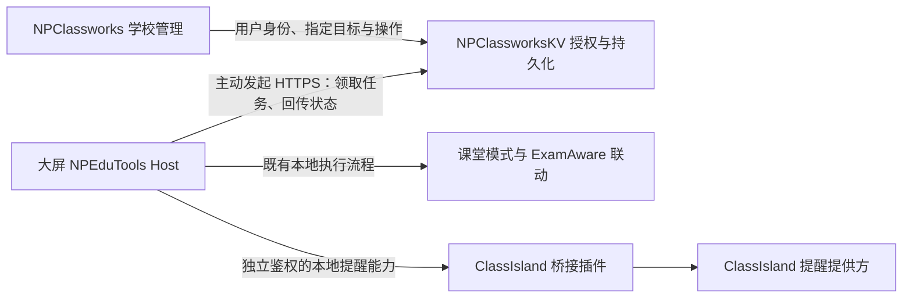

# NPEP：互联基础与首阶段协作草案

日期：2026-09-20。名称：NOVARK POWER EDUCATION PLUS（NPEP）。状态：架构提案，未冻结协议，未实现功能，未部署。目标是让学校管理通过 NPClassworks 安全联动教室内的 NPEduTools，并逐步接入 ClassIsland 等本地软件。

后续进展：N1 已整理为[共同契约与示例](npep/README.md)。本文保留阶段背景；具体 N1 路径、字段和边界以 [NPEP-N1-CONTRACT.md](npep/NPEP-N1-CONTRACT.md) 为准。N2/N3 仍是待后续设计的能力。

## 1. 本轮观察与协作分工

用户指定 NPClassworks 和 NPClassworksKV 位于同级目录。本轮阅读前端 AGENTS.md、两个仓库 README、设备绑定/通知回执服务、前端实时客户端，以及本项目模式切换和 ClassIsland 桥接源码。

观察时前端 HEAD 为 `472cefe`，KV 为 `151f703`。本项目当前本地分支为 main、HEAD 为 `ca75bc3`；这是本地观察基线，不代表 GitHub 合并后的最新基线。真正实现前必须先核实远端与已审核发布修订，不能直接在旧本地 main 上开展跨端协议开发。

| 负责人 | 负责范围 | 本轮交付 |
| --- | --- | --- |
| 本任务 | NPEduTools Host、用户授权界面、本地执行与恢复、ClassIsland 桥接 | 本文及设备端约束 |
| 现有“分析 Classworks 项目”任务 | NPClassworks 管理界面、KV 权限/设备注册/命令与通知回执 | [服务端研究草案](../../NPClassworksKV/docs/NPEP-SERVER-DISCOVERY.md)，已交换主要发现，契约待冻结 |
| 双方共同 | 协议版本、字段、错误码、撤销语义、联调样例 | 下一步统一契约，不分别发明不兼容 API |

本轮只新增研究文档，不改变三个项目的产品代码或线上服务。下文所有新增接口名称、状态和数字均为建议，需要双方确认。

## 2. 建议的数据路径

设备主动连接指定服务端，大屏不开放公网控制端口。网页负责发起管理请求；NPEduTools 在线不依赖 NPClassworks 网页必须一直打开。通知由 KV 按同一班级范围分发，网页和 ClassIsland 是两个展示渠道，避免“网页刷新或退出便失去中继”。

第一版建议 HTTPS 有界轮询/长轮询，确定命令和回执后再评估 Socket.IO 唤醒。Socket 事件不能成为唯一任务记录；断线恢复后仍从服务端查询未完成结果。Socket.IO 默认送达保证不能替代业务持久化、重放控制和去重。[官方说明](https://socket.io/docs/v4/delivery-guarantees/)

服务端任务的发现已交叉核对：当前 `utils/socket.js` 的 join-workspaces 不校验账号/设备身份，只筛选有效工作区，不能作为控制通道；既有 ClassroomScreenCommand 只包含 REFRESH_DATA/RELOAD_APP，其 DELIVERED 是服务端准备随心跳投递，不证明客户端实际收到，更不证明操作成功。双方一致建议新增独立设备命令与渠道回执。

## 3. 配对与授权

1. NPEduTools 本地用户主动启用 NPEP，填写并确认学校服务地址。生产 HTTPS 必须正常验证证书；不使用跳过验证选项。
2. 设备发起短期、一次性配对会话。学校管理员登录网页并选择学校、行政班和已有大屏绑定；大屏现场再次显示并确认这些信息及授权能力。具体采用设备码还是扫码，下一阶段确定。
3. 新建独立的 NPEP 设备身份，关联既有 screen binding。网页大屏的 PIN、fingerprint、token 不直接作为 Windows 控制权限，更不能仅凭同网段或 IP 判定可信。
4. 凭据限制在一个服务实例、学校、绑定设备及获准能力；设备端保护本地秘密（例如当前 Windows 用户的 DPAPI），服务端只保存必要校验材料。浏览器不接收长期设备控制秘密，日志不记录凭据。
5. 学校管理员可撤销设备；大屏现场可以停用互联。凭据轮换、学校/班级迁移、绑定停用、恢复备份后的身份变化，都需使旧授权失效或重新核准。

建议能力先分为状态查询、通知投递、模式切换，分别开关。服务端在创建任务和设备领取时重新核对权限/绑定；本地执行前再核对有效授权、目标实例、能力和策略。网页隐藏按钮不构成权限控制。

一期仅允许明确的业务操作；命令中不接受任意 PowerShell、程序路径、命令行、注册表路径或任意插件调用。设备凭据不授予其他设备/学校的管理权限。

## 4. 首个闭环：配对、状态与一条通知

建议先实现一台测试大屏的配对和只读状态，再打通一条纯文本测试通知，最后接模式切换。这样可以先验证身份、送达、撤销和回执，避免第一条网络请求就修改 Windows 自启动设置。

最小状态只包含设备在线时间、NPEduTools/桥接版本、能力、课堂模式与切换阶段、ClassIsland/ExamAware 是否就绪、是否存在录制阻碍。默认不上报屏幕截图、录制文件、麦克风内容、配对秘密或完整课表。

KV 已有 `notificationDeliveryService.js`，通过 publicationId、revision、screenBindingId 维护收到/展示/确认状态。新展示渠道不能把这些字段无差别覆盖：网页展示不代表 ClassIsland 展示，显示过也不代表老师已阅读。建议新增带 channel 的投递明细，由网页明确展示各渠道结果。

通知去重至少包含服务实例、设备、publicationId、revision、channel。实际展示前确认未撤回、未过期、目标仍有效；断线后只补尚有效的消息，不把历史通知一次性轰炸大屏。更新通知需按 revision 处理，撤回时取消尚未展示的队列；已经显示的内容不能假装可以抹去。

一期先用短纯文本标题和正文，不执行 HTML、脚本或远程传来的 UI 定义；限制长度、频率、队列和显示时长。语音、全屏特效及紧急级别以后单独讨论，遵守本地提醒设置。

## 5. ClassIsland 提醒提供方

已阅读本地 ClassIsland Docs 的 `src/dev/notifications/index.md`、`notification-channels.md`，并核对本地 ClassIsland 本体。使用当前提醒 V2 API：注册继承 NotificationProviderBase 的提供方，通过官方 NotificationRequest 发送；不使用旧版提醒 API。中文文档和本地 API 是此处的参考，英文旧示例不能直接混用。[官方提醒文档](https://docs.classisland.tech/dev/notifications/)

现有桥接 0.2.0.0 只提供学校时间与课表读取，尚无通知写入能力。应新增带版本协商、独立授权、输入验证、限流和去重的本地提醒契约；不能因为旧只读 IPC 可连通就直接开放写接口。需要验证普通权限 Host 与管理员 ClassIsland 间的 ACL、身份/配对和退出卸载行为。

特别注意：本地 `NotificationHostService` 在提醒被整体禁用时也会触发 CompletedToken；因此 ShowNotificationAsync 返回或 Completed 事件 **不能直接证明已在屏幕展示**。后续须针对请求 State/播放会话核实可观测语义，区分 received、queued、displayed、suppressed、expired、unavailable、unknown。无法证明 displayed 时只回报已提交或结果未知，不能替老师生成 acknowledged。

考试模式下 ClassIsland 可能已退出，此时应明确返回“ClassIsland 不可用”。不为了展示通知而擅自重开 ClassIsland 或退出考试软件。网页自身的提醒渠道可独立工作，是否增加 NPEduTools 原生通知为后续议题。

## 6. 第二个闭环：学校端请求考试模式

网页选择一台已授权大屏 → 查看带采样时间的状态和前置条件 → 选择目标考试模式及是否同时切换运行软件 → 服务端创建操作 → 本地按策略执行 → 网页持续显示真实结果。

复用 ClassroomModeService、ClassroomModeStore 和恢复流程。不能把云端请求直接映射为任意 HostRequest；由独立设备端适配层构造受限调用，并保留“本地/远程发起人、目标、时间、操作 ID”的审计记录。

目前的 UAC、编辑器退出限制和失败恢复仍然存在：

- 第一版的“一键”是网页发起一次有回执的请求，不等于已经具备静默管理员权限。需要授权时显示“等待现场处理”，不自动点击或绕过 UAC。
- 返回日常模式所需的考试内容已保存确认不能由服务端自动填 true；编辑器未关闭的已知问题仍须阻止或交给现场处理。
- 录制进行中先报告阻碍；一期不让远程请求擅自停止正在进行的采集。如何保存后切换需作为明确产品策略另行确认。
- 切换期间及考试模式保留既有自动录课暂停机制，不清空计划；联网恢复、返回日常或远程查询不能自行打开用户尚未启用的自动录制。
- 已有未完成恢复记录、配置漂移或并发操作时拒绝新任务覆盖；现场操作与远程任务共用一个执行协调器。

真正无人值守的管理员操作需后续单独设计预授权与最小权限组件，不能以长期管理员身份运行整个联网 Host 作为默认解决办法。

## 7. 协议必须先约定的内容

建议消息包至少有 protocolVersion、serverInstanceId、schoolId、deviceId、bindingEpoch、operationId、kind、issuedAt、expiresAt、payload；模式操作增加 expectedStateRevision，通知增加 publicationId/revision/channel。类型是显式枚举，不直接转发函数名。API 路径、字段格式和限值待双方共同冻结。

命令状态与业务执行状态分开：排队、设备已接收、检查中、等待现场、执行中、成功、拒绝、失败、部分完成、已过期、结果未知。收到 HTTP 200 或 IPC Accepted 都不能显示“已切换”。回执重传也必须幂等且不能让终态倒退。

命令写入服务端持久化队列，设备在执行前持久化操作账本；同一 operationId 不重复触发副作用。若崩溃发生在外部操作完成与账本提交之间，重启后先对照实际状态并报告，不承诺分布式 exactly-once，也不盲目重放退出/切换动作。

远程任务的签发、过期和安全时效使用服务端 UTC 及连接时测得的时间关系、单调计时，**不能使用可手调的 ClassIsland 学校时间**。学校时间继续负责课表与自动录课。两种时钟职责必须分开；本地系统时钟大幅跳变时，重新确认服务端时间再执行有时效操作。

断网后保留本地常规功能；不开始未能重新核实的远程模式任务。已开始的本地切换按已有安全收尾与恢复规则处理。撤销不能神奇撤回已发生的副作用，协议需明确“尚未领取/已领取/已执行”的处理差异。

## 8. 分阶段验收

| 阶段 | 内容 | 完成标准 |
| --- | --- | --- |
| N0 | 两端研究与协议草案 | 确认学校/设备身份、权限、通知回执、模式阻碍；文档一致 |
| N1 | 配对、撤销、只读状态 | 两个学校隔离；错误/过期配对被拒；网页关闭仍在线；解绑后无法继续操作 |
| N2 | 单设备纯文本通知 | 重复、断线、撤回、过期、禁用提醒、插件退出、设备重启均返回真实状态；无伪造已读 |
| N3 | 单设备考试模式 | 前置检查、UAC 取消、录制中、软件失败、并发、重启与部分完成不误报成功，可安全恢复 |
| N4 | 有限试点 | 一间教室现场验证，再考虑批量切换、计划任务和更多功能 |

一期不开放全校广播式模式切换；批量能力需要逐设备结果、失败隔离与额外管理确认。也不加入远程录屏、文件传输或任意程序执行。

## 9. 下一次双方需要共同定稿

确定设备是否与现有大屏绑定一对一、管理员角色范围、配对码流程、设备凭据轮换、命令有效期、通知多渠道去重/回执、API 版本和测试样例。实现从 N1 开始，先把“这确实是本校授权的这台大屏”做可靠，再增加有副作用的能力。

服务端任务完成后的对齐结果：双方统一按 N0 → N1 配对/撤销/只读 → N2 单设备纯文本通知 → N3 模式 → N4 试点推进；现场二次确认、独立能力授权、关联既有 screen binding 的方向一致，是否一对一仍待定。commandId/operationId、bindingRevision/bindingEpoch 等字段命名与接口路径尚未冻结。对外目标枚举也需统一到本地既有 Exam/Daily 映射，一期可先只开放切入考试，返回日常继续现场操作。

服务端另记录了两个实施约束：既有通用审计在响应后异步写入，新的可靠命令日志需要事务性持久化；旧通知回执不核验 publishAt/expiresAt，不能用回执写入接口替代“当前允许展示”的授权判断。预计新增设备和命令持久化模型将需要数据库迁移；本轮未创建迁移。详见服务端研究中的源码依据和验收清单。

## 本地证据索引

- `../plugins/NPEduTools.ClassIsland.Bridge/Plugin.cs`、`BridgeService.cs`：当前只读桥接注册。
- `../src/NPEduTools.Host/ClassroomModeService.cs`、`ClassroomModeEffects.cs`：模式、修订约束、受理与实际执行、恢复。
- `../../NPClassworksKV/services/classroomScreenService.js`：学校管理与大屏凭据/绑定。
- `../../NPClassworksKV/services/notificationDeliveryService.js`、`domain/notificationDelivery.js`：当前通知范围、revision 和回执。
- `../../NPClassworks/src/utils/socketClient.js`：网页实时客户端。
- `classisland-docs-next/src/dev/notifications/`：本地官方文档副本。
- `../../ClassIsland/ClassIsland/Services/NotificationHostService.cs`、`ClassIsland.Core/Models/Notification/NotificationRequest.cs`：提醒禁用与完成事件语义。
