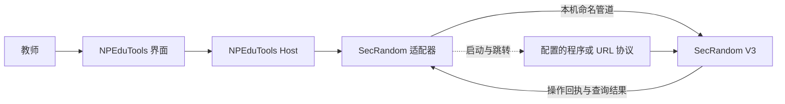

# SecRandom V3 接入研究

日期：2026-10-03。结论：**先接内置命名管道 IPC，URL 用于启动与跳转；需要额外能力时再开发桥接插件。**

本报告记录实现前的源码研究及在线发布信息核对；当时未启动 SecRandom、触发抽取、安装插件或修改业务代码。随后已开始实现，最新进度和真实只读 IPC 验证见[本机接入任务卡](iterations/SECRANDOM-LOCAL-INTEGRATION-20261003.md)，操作说明见[课堂点名](SECRANDOM.md)。下文研究依据保留原始范围。

## 版本与依据

- [v3.0.0 正式发布](https://github.com/SECTL/SecRandom/releases/tag/v3.0.0)，非预发布，发布时间为北京时间 2026-10-03 20:42:44。
- GitHub 标签解析后的提交为 `348ab0f506db86384c06b7d1d485b042128217f9`；本地 `D:\CodeProjects\SecRandom` 的 HEAD 与之相同，工作树干净。本报告不研究 V1/V2。
- 主程序及 PluginSDK 为 .NET 10；NPEduTools 当前 App 为 `net10.0-windows`、WPF。运行时一致便于实现客户端和插件，但两种 UI 框架仍应各自运行。
- NuGet 官方 [版本索引](https://api.nuget.org/v3-flatcontainer/secrandom.pluginsdk/index.json) 已列出 `3.0.0`。SDK 及本体声明 GPL；具体分发材料在实际打包时整理。
- [在线概览](https://secrandom.sectl.cn/doc/overview) 仍有 Alpha 阶段提示，不能用该提示否定正式发布；API 细节以本次固定提交的源码为准。

## 三种方式如何分工

| 方式 | 已有能力 | 限制 | 建议用途 |
| --- | --- | --- | --- |
| `secrandom://` | 启动、显示窗口、切页、触发操作 | Shell 启动没有业务回执；需要启用协议 | 启动入口、快捷跳转 |
| 内置 Named Pipe IPC | 同样的操作命令，以及名单、历史查询和闪抽结果 | 无通用状态查询、事件订阅、请求去重接口 | 第一阶段的主要通信方式 |
| PluginSDK | 服务注册、插件页面、生命周期、受控抽取 API | 插件与宿主同进程；需安装并重启；扩展通信需自行实现 | 原子参数请求、主动推送等后续需求 |

**第一阶段不要求用户安装桥接插件。** NPEduTools 保留自己的 WPF 界面，不直接加载 SecRandom 的 Avalonia 窗口或整个 Core 到后台进程。



这是拟议结构。现有 NPEduTools 尚没有 SecRandom 适配器。

## URL：能做什么

以下均为 V3 路由器中存在的命令：

| 目的 | 示例 |
| --- | --- |
| 显示点名页 | `secrandom://window/main?action=show&page=roll` |
| 显示抽奖页 | `secrandom://window/main?action=show&page=lottery` |
| 显示历史页 | `secrandom://window/main?action=show&page=history` |
| 显示／隐藏浮窗 | `secrandom://window/float?action=show` / `action=hide` |
| 打开基本设置 | `secrandom://settings/basic` |
| 闪抽一人 | `secrandom://roll_call/quick_draw` |
| 开始／停止／重置点名 | `secrandom://roll_call/start` / `stop` / `reset` |
| 改人数、分组、性别、名单 | `roll_call/set_count?count=2`、`set_group?group=…`、`set_gender?gender=…`、`set_list?name=…`，前面加 `secrandom://` |
| 正常退出 | `secrandom://tray/exit` |

参数值用 `Uri.EscapeDataString` 编码；显示操作显式传 `action=show`，避免默认 toggle 导致重复点击后隐藏窗口。抽奖命令还有 `lottery/start`、`stop`、`reset`、`set_count`、`set_pool`、`set_list`、`set_group`、`set_gender`。

Windows 协议注册由 SecRandom 的基本设置控制，使用当前用户的 `HKCU\Software\Classes\secrandom`，启动参数含 `--url`。NPEduTools 可以配置稳定的外层启动程序路径，不应固定更新后会变化的 `app-*` 内部路径。

URL 成功交给 Windows 只能表示“已发起打开”。不能显示“抽取成功”或“软件已退出”。`data/*` 虽然能被 URL 解析，但 URL 激活不会返回名单；查询必须走 IPC。

现有 NPEduTools `ShortcutCatalog` 仅接受 HTTP/HTTPS 网址，**现在不能直接把 `secrandom://` 填入普通网址快捷项**。后续应增加专门集成入口或严格允许该协议，不笼统开放任意 scheme。

## IPC：实际协议

管道名：`SecRandom_IPC_SecRandom_3F2A1B0E`。使用双向字节流、UTF-8、每行一个 JSON；一次连接完成一次请求／回执。

```json
{"version":1,"type":"url","payload":{"url":"window/main?action=show&page=roll"}}
```

`payload.url` 支持相对路由，也支持完整 `secrandom://` URL。内置 IPC 不受 `Basic.UrlProtocol` 开关限制；仍受 OOBE、设置完整性确认及相应操作的安全验证限制。

查询示例（假设名单已存在）：

```json
{"version":1,"type":"url","payload":{"url":"data/roll_call_list?name=%E9%AB%98%E4%BA%8C1%E7%8F%AD"}}
```

返回结果位于 `result.data`。四种查询为：

- `data/roll_call_list?name=…`：候选学生的 `id/name/gender`。
- `data/lottery_list?name=…`：候选奖品。
- `data/roll_call_history?name=…`：按抽取轮次分组的学生历史。
- `data/lottery_history?name=…`：奖品及被分配学生的历史。

这组路由**没有列出所有名单名称、导入名单、查询版本／能力、查询当前窗口及抽取状态、订阅事件**的端点。`roll_call/start` 的回执是启动抽取状态，不是最终名单；`roll_call/quick_draw` 则等待闪抽后返回一位学生。内置闪抽回复不包含证明 ID 或抽取轮次 ID。

### 回执判定是第一处易错点

业务失败可能返回：

```json
{"success":true,"type":"url","result":{"status":"error","message":"操作未获授权","code":"authorization_denied"}}
```

因此操作成功必须同时满足 `success == true` 且 `result.status == "success"`。`success == false` 时读 `error.code`；业务失败读 `result.code`。不能靠中文 message 或最外层 success 判断。

需分别显示 `pipe_unavailable`、`timeout`、`invalid_state`、`not_found`、`authorization_denied`、`feature_disabled`、`oobe_required`、`integrity_confirmation_required` 等原因。

### 超时、权限与结果不确定

- 上游客户端默认连接超时 3 秒、读回执 30 秒；服务端读请求帧超时 5 秒、最多 8 个并发连接、请求帧上限 8192 字符（包括 JSON 包装）。NPEduTools 的适配器应另设有界响应读取；历史查询没有上游分页，不宜高频拉取完整历史。
- 没有 requestId／幂等去重。**抽取超时后不得自动再抽一次**；可能第一轮已经提交历史，只是回执未收到。NPEduTools 内部可记录请求 ID，但它不是上游的去重凭据。
- `tray/exit` 会启动退出流程，可能来不及收到回执；应核实所绑定目标进程已退出，不能靠管道断开就判断成功。
- SecRandom 管道使用 `PipeOptions.CurrentUserOnly`。NPEduTools 目前启动后提权，两端可能出现不同 token owner／完整性级别；需要用真实 Windows 实例验证，不能承诺普通权限 SecRandom 一定可连接。
- 内置管道名不含用户 SID 或 SessionId。适配器应核实服务端 PID、当前用户 SID、会话和配置的程序身份，防止连到其他会话或错误实例。若客户端的 CurrentUserOnly 检查挡住同用户跨提权通信，可研究显式身份验证方式；保留服务端 ACL，不开放给 Everyone。
- 多条 `set_list → set_count → start` 不是原子操作，教师可能在中途改选择。首期优先打开 SecRandom 由教师操作，或使用其现有闪抽配置；需要“一条请求完成指定名单多人抽取”再走插件受控 API。

## PluginSDK 适合补哪些能力

插件继承 `PluginBase`，在 `Initialize` 注册服务／页面；`OnAppStarted` 后启动通信，`OnAppStopping` 和 `DisposeAsync` 清理资源。插件是进程内代码，不是自带 HTTP／IPC 的远程 SDK。

引用 `SecRandom.PluginSdk 3.0.0`，排除 `runtime;native`；项目设 `CreateSrpx=true`，清单含插件 id、入口程序集、插件版本和 `apiVersion: 3.0.0`。构建产生 `.srpx`，通过插件页面导入并重启。SDK 打包目标会排除宿主提供的 Core／SDK／Avalonia 等程序集。

注意：正式标签的示例项目仍引用 `3.0.0-alpha1`，SDK README 的本地引用描述也与该示例不完全一致；实际新插件应明确固定已发布的 `3.0.0`，不能原样复制示例依赖。

已有的插件公开面包括：

- `IAppNavigationService`：打开主窗口、设置、闪抽窗口，保留宿主保护流程。
- `IAppLifecycleService`：启动／停止事件。
- **`IPluginDrawService`**：指定名单、人数、分组、性别、课程后抽取；返回结果、证明 ID 与抽取轮次 ID，经过课程限制、安全验证及同一提交管线。

不要绕过这个入口直接调用内部 `IRollCallSession`、`IDrawCommitService` 或改历史文件。该抽取服务返回领域结果，不应假定它同时执行主页面动画或现有通知展示。

本轮检查的 SDK／公开抽取接口没有通用 `DrawCompleted` 订阅；插件可推送自己发起的操作结果，但要监听教师在所有原生页面完成的抽取，还需稳定的宿主事件扩展点。名单编辑接口中也有明确标为 Host-internal 的接口；学校名单同步需要另做身份映射与受控写入设计。

若后续开发桥接插件：使用独立、版本化、经过本机配对的管道协议，带 RequestId、超时、执行状态和去重记录；参考既有 ExamAware 桥接机制，不携带学校令牌，也不修改 SecRandom 安全凭据。学校配对授权与 SecRandom 自身密码／课程保护是不同层级。

## 建议下一张任务卡

**主交付物：无插件的 SecRandom V3 本机接入。**

| 项目 | 内容 |
| --- | --- |
| 做什么 | 配置程序位置；启动／打开点名页；显示／隐藏浮窗；按既有配置闪抽并显示准确回执 |
| 模块 | 新建 `NPEduTools.Integrations.SecRandom`；Host 注册适配器；Contracts 增加类型化操作和结果；App／侧边栏增加入口 |
| 控制范围 | 教师本机操作；由 SecRandom 维护名单、抽取算法和历史；不默认上传学生数据 |
| 本轮不做 | NPEP 远程抽取、名单同步、考试模式自动改变 SecRandom、自启动管理、嵌入 Avalonia、主动事件订阅 |
| 自动化检查 | 路由编码、两层回执、畸形／超长回复、响应超时、并发点击、抽取超时不重复提交 |
| 人工验收 | 正式版冷启动／已有实例；协议开关；OOBE；授权允许／取消；普通／管理员／UIAccess 权限组合；抽取历史只新增一轮 |

第一项技术验证应是**管理员 NPEduTools Host 与普通权限 SecRandom 的真实 IPC 连通性**。通过后做界面和业务接入；若失败，明确失败的权限层，再选择同用户适配或桥接插件方案。不是先写满业务代码再排查权限。

## 关键源码入口

以下均固定在正式版本提交，后续维护不跟随 master 漂移：

- [协议路由及两层结果](https://github.com/SECTL/SecRandom/blob/348ab0f506db86384c06b7d1d485b042128217f9/SecRandom/Services/Ipc/ProtocolCommandRouter.cs)
- [命名管道与帧限制](https://github.com/SECTL/SecRandom/blob/348ab0f506db86384c06b7d1d485b042128217f9/SecRandom.Core/Services/SingleInstance/SingleInstanceService.cs)
- [IPC DTO](https://github.com/SECTL/SecRandom/blob/348ab0f506db86384c06b7d1d485b042128217f9/SecRandom.Shared/Models/Ipc/IpcContracts.cs)
- [启动／完整性与 OOBE 门控](https://github.com/SECTL/SecRandom/blob/348ab0f506db86384c06b7d1d485b042128217f9/SecRandom/App.axaml.cs)
- [Windows 协议注册](https://github.com/SECTL/SecRandom/blob/348ab0f506db86384c06b7d1d485b042128217f9/SecRandom/Services/Desktop/DesktopIntegrationService.cs)
- [SDK 入口](https://github.com/SECTL/SecRandom/blob/348ab0f506db86384c06b7d1d485b042128217f9/SecRandom.PluginSdk/PluginBase.cs)及[受控抽取实现](https://github.com/SECTL/SecRandom/blob/348ab0f506db86384c06b7d1d485b042128217f9/SecRandom/Services/Plugins/PluginDrawService.cs)

研究阶段状态（实现前）：正式发布及本地提交对应已核对；协议和 SDK 已静态分析；现有上游测试源码已阅读但未重跑；当时真实 IPC、插件加载、教师操作和班级大屏均未测试，仅新增本文，无提交、推送或部署。随后实施及只读 IPC 验证结果见[本机接入任务卡](iterations/SECRANDOM-LOCAL-INTEGRATION-20261003.md)。
