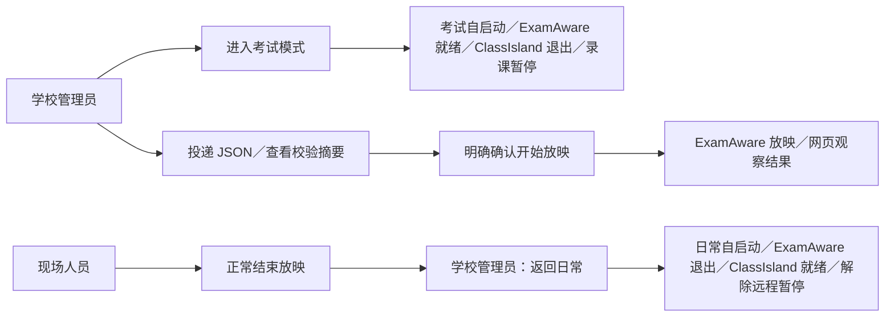

# 考试互联：当前用例与验收

> 归档记录：正文保留当时的范围、决定与验证结果，不代表当前功能、发布或部署状态。[历史资料索引](../README.md)。

更新：2026-09-28。本页是当前行为入口；早期“不改自启动”“首次另开许可”“已有暂停拒绝新请求”方案已被后续决定替代。

**实现及自动验证完成；用户已回报单设备完整流程走通；本轮新版尚未推送、部署或发布。** 本次确认未明确设备是否为目标班级大屏，因此不视为生产大屏验收。

## 当前规则

| 操作 | 语义 |
| --- | --- |
| 学校配对 | 有效配对即授权现有考试模式和方案能力；服务端仍检查学校管理员权限 |
| 远程进入考试 | 正常保存当前录制、暂让通知，再切换自启动和运行软件；保留录课计划 |
| 重试 | 新请求核查现场并补完缺失步骤；同一请求编号不重复执行，重启不重放旧任务 |
| 投递方案 | 先校验，再由管理员明确开始；不替换已有放映、不自动播放下一场 |
| 远程返回日常 | ClassIsland 自启动开、ExamAware 自启动关；正常退出后启动 ClassIsland 并核实课程接口，再解除远程暂停；不打开原本关闭的录课总开关 |
| 遇到阻碍 | 显示具体原因，不强杀程序。放映先在现场结束；编辑器退出问题仍是已知限制 |
| 桌面“结束远程考试状态” | 只解除本地远程暂停，不等同于网页完整返回日常 |

网页入口：**学校管理 → 大屏 → NPEP 设备互联 → 对应设备的远程考试模式／考试方案**。完成回执是当时的事实，不保证软件此刻仍在运行。

前提：正确的程序路径、ClassIsland 管理员任务与课程接口、ExamAware 1.5.2 和桥接 0.4.0、有效学校配对；桌面启动时请求管理员权限。

## 验收边界

- 用户已确认：远程进入 → 方案校验 → 真实放映 → 结束放映 → 远程返回日常，完整流程走通。
- 自动验证：跨端契约、单元测试、隔离浏览器交互、原生临时 PostgreSQL 与真实 .NET HTTP 链路；软件启动／退出等系统效果在自动验收中使用替身。
- 尚未确认：目标班级大屏试点、真实 Windows 重启／休眠／断网恢复，以及录制中抢占、通知遮罩恢复、编辑器异常等现场边界。主流程通过不自动覆盖这些项目。

操作细节：[远程返回日常](REMOTE-DAILY-20260928.md) · [投递考试方案](EXAMAWARE-PLAN-REMOTE.md)。发布审核：[三仓发布候选](../releases/NPEP-EXAM-20260928-REVIEW.md)。

源码阅读：网页 NpepRuntimeControl／NpepExamPlanControl → KV 的 npepRuntimeService／npepExamPlanService → 桌面 NpepRuntime.ControlLoop／NpepRuntime.Plans → RemoteExamExecutor／ExamAwareService.Plans → 插件 src/plans.ts。

下一阶段先收尾发布与单台大屏试点；噪音、音频、摄像头、批量方案不进入本轮。
