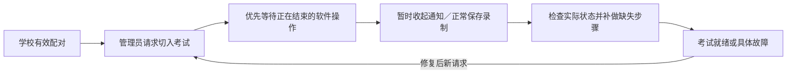

# 考试控制：配对授权与优先切入

> 归档记录：正文保留当时的范围、决定与验证结果，不代表当前功能、发布或部署状态。[历史资料索引](../README.md)。

2026-09-28。本轮目标：已配对的大屏可优先、重复、可恢复地进入考试模式，不要求现场先清理历史暂停。仅本地开发；没有推送或部署。

后续同日新增 [远程结束考试／返回日常](REMOTE-DAILY-20260928.md)。下面“返回日常仅由本地操作”的范围已扩展为网页也可请求完整返回；本地原有暂停解除入口保留。

## 行为约定

- 配对自动授权现有考试模式及方案投递。删除桌面的两项重复许可开关；换校、解绑、撤销和暂停互联仍影响请求执行。配对说明明确包含登录自启动。
- 远程目标是完整考试模式：暂停后续自动录课、正常保存当前手动或自动录制、确认 ExamAware 就绪、切换两款软件的自启动、正常退出 ClassIsland。
- 通知与遮罩暂时收起，不发送用户关闭回执；内容继续保留，切换结束后按原投递规则恢复。
- 优先请求阻止新的普通管理操作进入；等待已执行步骤释放占用，最多 30 秒。正常保存录制最多等待 60 秒，失败或超时明确报告，不强杀录制器。
- 已就绪的软件、已满足的自启动状态不重复启动或写入。已有放映不替换；完成切入也不会自动播放方案。
- 部分失败不自动回滚，不强制退出其他软件；下一次明确请求重新核对并补完。保留原始历史和恢复基线。
- 历史暂停不再禁止新请求。终态回执释放服务端操作槽；Host 换代能关闭旧执行槽，迟到的匹配回执仍可补入历史，不影响新任务。
- 相同请求编号返回原结果，活动期间的等价请求合并。断线或重启仅补传已有结果，不自动重放旧启动动作。过期请求不能开始。
- 本次完成后，本地仍可返回日常；旧请求不会持续把设备拉回考试。返回日常后仍保留现有“结束远程考试状态”入口解除独立暂停。

## 兼容与代码入口

N3 仍使用 0.4 信封，新增 `policy.pairedExamControl=true` 能力标识。网页与服务端拒绝不支持新语义的旧客户端；先更新后端，再更新网页和桌面。没有新增数据库迁移。若尚未安装上一轮考试方案迁移，仍须按原说明处理。

本机许可文件迁移到版本 3：重新从有效绑定派生考试权限，旧独立勾选不再决定权限。旧任务不会因迁移重新执行。

| 层 | 入口 |
|---|---|
| 网页 | `npepRuntimePresentation.js`、`NpepRuntimeControl.vue` |
| 后端 | `runtimeControl.js`、`npepRuntimeService.js` |
| 配对授权 | `NpepControlPolicyStore.cs`、`NpepRuntime.Control.cs`、`NpepRuntime.Plans.cs` |
| 执行和恢复 | `RemoteExamExecutor.cs`、`ClassroomModeService.RemoteExam.cs` |
| 优先协调 | `RuntimeOperationGate.cs`、`RuntimeOperationFile.cs`、`RecordingService.cs` |
| 通知让位 | `MainWindow.NotificationDelivery.cs` |

## 验收卡

自动化入口：`scripts/test-npep-exam-plans.ps1 -Browser -Database`，原生临时 PostgreSQL，不使用 Docker、不连接生产或开发数据库。播放器与系统软件写入使用测试替身；不等同真实大屏验收。

本轮已验证：跨仓 N3 的 31 个契约样例、网页及后端状态测试、Host 与联网层回归、隔离浏览器流程，以及原生 HTTP／PostgreSQL 的 21 项验收。数据库验收包含真实 .NET 联网层的成功、部分失败、重复请求、重启不重放及方案校验／启动；已更新旧规则下的拒绝断言并复验通过。WPF 在隔离输出目录编译通过，未生成发布包。

结果记录：`.artifacts/exam-priority-final.log`、`.artifacts/exam-priority-database.log`；浏览器记录在 `.artifacts/exam-priority-acceptance.log`。该早期总日志因旧数据库断言失败结束，数据库最终通过状态以单独复验日志为准。真实录制文件保存、通知遮罩恢复和现场软件状态尚需下列人工验收。

现场使用 IDE 重启 App/Host，并重启本地前后端后，依次验证：

1. 已配对后无需额外授权，网页可以切入；再次切入成功且不重复启动。
2. 通知和遮罩打开时切入，窗口暂时收起，通知不被标记为用户关闭。
3. 手动／自动录制期间切入，录制文件正常保存，然后才切换软件。
4. 中途让桥接断开，网页显示具体原因；恢复连接后直接在网页重试，不需清理旧暂停。
5. 已有 ExamAware 放映不被替换；本地返回日常后不会被旧请求自动切回。

远期噪音、音频、摄像头、批量方案等不属于本轮。
