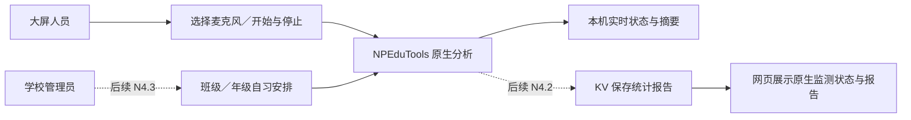

# N4：原生噪音监测

> 归档记录：正文保留当时的范围、决定与验证结果，不代表当前功能、发布或部署状态。[历史资料索引](../README.md)。

**2026-10-01 更新：[N4.3c 学校排程执行](N4.3c-SCHEDULE-EXECUTION-20261001.md) 已完成本地实现与模拟闭环，统一测试 424 项、隔离 HTTP／SQL 28 项及浏览器流程通过。** 更新后的已配对桌面可接收学校规则并按 ClassIsland 时间自动执行。N4.3b 人工联调按用户要求跳过，N4.3d 待做；未部署。以下为各阶段历史记录，旧“尚未接入”等表述只描述当时状态。

**最新进度（2026-10-01）：[N4.3a 学校排程纯计算](N4.3a-SCHEDULE-RULES-20261001.md) 已实现，348 项自动测试通过；学校后台、下发与实际自动采集尚未接入。N4.2 自动验收与开发电脑基本人工联调通过，见 [任务卡](N4.2-NOISE-TAKEOVER.md) 和 [人工记录](N4.2-MANUAL-ACCEPTANCE-20261001.md)；[低电平修复](N4.2-LOW-SIGNAL-20261001.md) 自动回归通过，新界面人工复测按用户要求跳过。班级大屏和生产验收未完成。以下保留 N4.1 的历史记录；其中“不上传／尚未接管”仅描述 N4.1。当前已配对设备会上传统计，学校排程执行器仍未接入。**

2026-09-30 · N4.1 本机实现已接入，用户已回报“功能调试完毕，正常”，记为本机功能人工验收通过。未据此补写设备型号或全部异常场景／班级大屏长期运行结论。用户决定暂跳发布候选审查；N3 原有代码和验收记录保留。N4.2 互联接管与 N4.3 排程仍为方案。

**当前入口：主窗口左侧 → 噪音监测。** 在 IDE 重启 App 与 Host 后，选择麦克风并手动开始。关闭监测窗口继续工作；点击停止释放麦克风，摘要保留至下次开始或后台退出。不自动启动、不保存录音、不上传数据。

## 用例与迭代

| 阶段 | 交付用例 | 完成标准 |
| --- | --- | --- |
| **N4.1：本机监测** | 大屏选择麦克风并开始，看到电平、信号质量与趋势，停止后查看本次统计 | 独立于微课录制和 FFmpeg；缺设备、拔出、重试、退出后资源释放可验证 |
| N4.2：互联接管 | 已配对大屏由原生端监测，网页显示来源、状态及报告，KV 接收统计 | 网页不重复采集；停止、断线、旧数据、解绑、重复上报处理明确 |
| N4.3：学校排程 | 学校按班级／年级配置固定自习时段，桌面按有效策略执行 | 时区、时间来源、跨日、重叠、离线策略与考试模式优先级明确并通过测试 |

**N4.1 已获用户本机功能验收；建议下一轮进入 N4.2。** 原始音频上传仍未决定，不纳入当前实现；摄像头不属于 N4。

### 下一轮建议：单设备互联接管

目标用例：已配对大屏在网页点击开始监测 → NPEduTools 使用本机选定麦克风 → 网页显示原生状态、数据更新时间及采样质量 → 网页停止后，在学校后台查看 KV 保存的本次统计。

- 实施顺序：冻结状态／控制／报告三类契约，再接 KV、桌面和网页；沿用既有学校绑定、HTTP 轮询及幂等处理，不另建一套身份系统。
- 第一轮只做单设备手动控制和统计报告，麦克风在桌面选择；学校统一时段安排留给 N4.3。
- 接管按设备能力与绑定明确选择提供方；旧客户端保持网页实现，原生接管后网页不再独立采集。失联显示未知，不静默恢复网页采集。
- 报告包含有效采样时长、覆盖率、能量统计、质量与算法版本，不上传录音。当前 N4.1 摘要只有内存存储，N4.2 需补有界本地待传队列、服务端去重和保留策略。
- 验收：网页开始／停止与桌面一致、网页无重复麦克风采集、报告可查、重复上报不重复计数、过期状态不冒充实时、解绑／换校不串数据。自动部分使用原生 PostgreSQL 与模拟音频；本机联调由用户手动启动真实采集。

本节是下一轮建议，尚未新增网络接口、远程噪音命令或数据库表。

## 已核对的基础

| 仓库／入口 | 当前实现 | N4 用法 |
| --- | --- | --- |
| NPClassworks `src/utils/noiseService.js` | Web Audio、100 ms 特征帧、500 ms 分析、60 s 窗口、30 s 统计片段 | 参考数据含义和 UI，不直接在 .NET 中运行浏览器服务 |
| `noiseScoring.js` | RMS 到参考 dB 换算、相对基线评分、覆盖率／信号质量 | 分开记录算法版本、参考值与质量；迁移需共享测试样本，不能假定同名分数一致 |
| `noiseMonitoringController.js`／`noiseScheduleSettings.js` | 手动限时、浏览器本地按绑定保存的定时设置，当前使用浏览器日期时间 | 不是学校集中排程，不能直接当作后台策略下发 |
| `noiseHistoryStore.js` | IndexedDB，本地保留最多 14 天／5000 条 | 已有网页历史保留，不冒充 KV 中的原生报告 |
| NPEduTools `src/NPEduTools.Recorder/AudioInput.cs` | NAudio WASAPI 麦克风／系统音频采集，混音后送给录制管道 | 借鉴设备选择、采样格式与生命周期；噪音监测只取麦克风，另建服务，不混入系统回环音频 |
| `src/NPEduTools.Host/SchoolClockMonitor.cs` | ClassIsland 学校时间与新鲜度 | 留给排程阶段定义时间策略；监测时长使用单调时钟，不因校时突然跳变 |
| NPClassworksKV | 已有设备身份、学校绑定与 HTTP 投递基础；未检索到噪音业务接口／表 | N4.2 复用身份与 HTTP 传输，新建统计业务，避免塞进考试命令处理器 |

## N4.1 实现边界

- Host 管理监测会话，App 负责麦克风选择、开始／停止、实时显示及结束摘要。关闭主窗口与停止监测区分，托盘退出必须释放采集。
- 音频帧只在内存中计算；本阶段不写录音文件、不上传 PCM／原音频，不触发系统扬声器回放。摘要仅包含时间、信号统计、质量与算法版本。
- 首先交付 dBFS 信号电平和质量。现有网页 `estimatedDbFromRms` 使用参考 RMS／参考 dB 换算并截断到 20–100；不能将它当作已校准的绝对声级。若沿用评分或估计音量，应明确标注来源并使用一致测试向量。
- 缺样、断麦、设备错误不能显示为“教室非常安静”或满分。无效区间单独计入覆盖率，不用补零伪造数据。
- 麦克风重新插入、默认设备变化应报告实际使用设备；指定设备丢失不静默换成另一支麦克风。
- 先建立独立采集抽象、纯计算模块和会话状态，再接 WPF。避免为了复用录课而同时改动整个音频子系统。
- 与录课、考试模式的共存必须显式测试。建议考试切换可暂停监测，并报告暂停原因；是否返回后自动恢复在加入自动化前定稿，不从旧录课规则偷偷继承。

## 接管与排程阶段需要明确的规则

1. **接管条件**：学校已启用、绑定设备声明原生监测能力且状态有效。仅有旧版 NPEP 配对不能让网页立即停掉现有功能。采用原生提供方后，网页失联应显示未知，不自动偷偷启动第二套采集；回退须有明确流程。
2. **数据隔离**：每段统计绑定学校、设备、绑定版本、会话及片段序号；上传幂等，解绑／换校不得把旧班统计传给新班。规定批大小、离线队列上限与保留期。
3. **网页入口**：现有按钮指向当前提供方；浏览器设备 ID 与 Windows 音频端点 ID 不可互换，原生麦克风由桌面选择。页面现有“本地处理、不上传”的说明须随报告上传功能同步更新。
4. **排程时间**：明确学校时区与 ClassIsland 对齐时间如何使用；来源失效不得无提示切到系统时间。跨午夜、校时、暂停、重启补执行都要有测试。
5. **权限与范围**：沿用学校绑定与管理员权限，监测开关和工作时段可见；原音频的保存／上传是独立待议能力，不随统计功能默认加入。

## 验证方法与下一步

先写可注入音频源的计算与会话测试：静音、固定振幅、削波、缺样、多声道、不同采样格式；再验证连续开始／停止、启动中取消、设备中断、旧回调不污染新会话、与录制并存及退出释放。它们可在没有班级大屏时完成。

开发电脑麦克风用于真实采集验证时需明确启动，不能把合成音频测试说成硬件验收。班级大屏的声学效果、摆位、设备兼容性和长时间运行继续单列待现场验证。延续原生 PostgreSQL、统一网页／后端启动与 IDE 调试，不使用 Docker 或生产环境调试。

## N4.1 实现与验收入口（2026-09-30）

| 代码 | 职责 |
| --- | --- |
| `Contracts/Noise.cs`、`Contracts/Protocol.cs` | 本机状态、设备列表、开始／停止命令；Host 实例与修订号隔离迟到／重复操作 |
| `Core/NoiseMeter.cs` | PCM16／24／32、float32、多声道能量、100 ms 窗口、削波检测；不保存原始音频 |
| `Host/WasapiNoiseCapture.cs` | WASAPI 共享模式、指定输入端点；不混入扬声器回环、不静默更换麦克风 |
| `Host/NoiseService.cs` | 单会话、停止清理、状态、最近一分钟趋势、能量平均摘要；摘要与最多 120 个趋势点只在内存 |
| `App/NoiseWindow.xaml`／`.xaml.cs` | 设备选择、控制、dBFS 电平、质量、趋势及本次摘要 |

全零采样显示“全零信号，检查静音”，无效帧不计入有效采样，超过 1 秒缺样隐藏旧电平，超过 3 秒停止并提示手动重试。启动超过 5 秒提示超时；驱动未结束清理前仍保留占用，不能虚报已释放或启动第二个采集。清理报错要求重启后台。统计不包含不足 100 ms 的末尾未完成窗口，覆盖率按实际完整有效采样计算。

本阶段为手动独立监测：不会接管网页、修改自习排程或随考试模式自动恢复／暂停。WASAPI 使用共享模式，但真实设备与录课并存的驱动表现仍需现场验证。

统一测试：`scripts/test-noise.ps1`（PowerShell 5.1 可用）。**193 项通过、0 失败、0 跳过**。使用合成 PCM、模拟采集源、真实本机命名管道及隔离构建目录，不打开真实麦克风。覆盖格式、反相声道不抵消、静音／削波／无效帧、缺样、超时、取消、旧回调、资源释放与录课／考试回归。测试日志：`.artifacts/noise-results/noise-regression.trx`。回归曾发现 `TestProcess` 从常规构建目录查找测试辅助程序，现已支持当前隔离构建目录并补两项路径回归。

隔离 WPF 编译及真实控件模拟数据渲染已验证。用户随后回报本机功能调试正常，未提供逐项测试记录；设备兼容性、拔麦等异常和班级大屏长期运行不自动标记为全部通过。保留现场检查路线：选择设备开始 → 说话／静音观察 → 关闭并重开窗口 → 停止看摘要 → 拔麦提示与重连后手动重试 → 托盘退出确认释放。没有麦克风时应显示无可用设备且不能开始。未生成发布 ZIP、未推送或部署。

命名：产品阶段 N4 自本次起指噪音监测。旧 `n4-exam-plan.schema.json` 和对应方案测试属于已实现的考试方案扩展；不为改阶段名称而更改现有协议或文件，避免兼容性变化。
