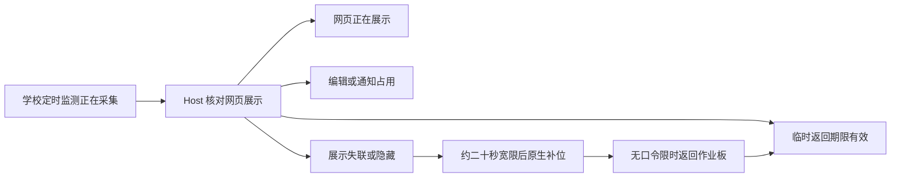

# 定时监测保护 · P2 任务卡

2026-10-04。交付：网页展示心跳、展示丢失诊断、NPEduTools 原生备用窗口。桌面 P1～P3 已按功能范围本地提交；网页／KV 的 P2 本地提交为 `e21b0f1`／`e8617c6`，包含网页隔离排程脚本的逐路由协议修正。三仓均未推送或部署。上一轮 P1 网页提交为 `7622448`；KV 的 P1 提交为 `f4a630b`。

## 使用流程



| 情况 | 行为 |
| --- | --- |
| 正常网页监测页面 | 每 5 秒和状态变化时上报展示状态；网页恢复展示后原生窗口隐藏。 |
| 网页关闭、隐藏或状态无法确认 | 已确认服务支持 0.9，且当前仍有实际定时采集时，经过约 20 秒宽限后原生补位。未知状态显示“网页状态未确认”，不宣称浏览器已关闭。 |
| 临时返回作业板 | 网页／原生共用同一条后台期限；无需口令，采集继续。默认 10 分钟，沿用 P1 的学校配置。 |
| 编辑、通知、维护窗口 | 新鲜网页 BLOCKED 或正在操作的桌面窗口使补位暂缓。原生展示不持有运行切换锁；考试与通知优先。 |
| 手动监测、考试暂停、时段结束、采集结束 | 不自动显示备用窗口。展示心跳不启动、停止或改变采集。 |
| 旧服务不支持 0.9 | 明确诊断 DISPLAY_UNSUPPORTED，不误判为网页丢失。桌面“噪音监测 → 定时监测保护”可查看展示诊断。 |

## 关键边界

- 网页标签页各自有 ID 和递增序号。KV 用接收时间判断新鲜度；重复心跳不续命，隐藏标签页不会覆盖另一个可见标签页。
- 设备观察绑定当前学校、登录会话、Host 实例、采集会话和学校时段。延迟的旧回复不能隐藏新会话；统计 0.6、排程 0.7 和管理 0.8 保持原协议。
- 返回倒计时在运行中使用单调时钟，重复关闭、网络重试、同一时段更换采集会话都不延长当前期限。服务端回执只能沿用或缩短本机期限。
- 原生离线返回先保存原始意图并提示“学校期限登记待恢复”；恢复网络按原请求 ID／开始时间补登记。已经过期也有明确回执，不新建期限。重新启动只恢复可信且未过期的缓存；时间回拨时不续期。
- 返回记录损坏保留原文件；写入失败拒绝返回，不能把未保存的期限当成成功。完全退出后台仍需 P1 的本机管理验证。
- 原生窗口采用工作区展示，保留任务栏；只从 Host 读取电平、质量和趋势。不会启动浏览器实例，不采集额外音频。

## 实现与调试

桌面入口：`MainWindow.NoiseDisplay.cs` → `noise.display.status/return` → `NoiseDisplayService`。网络接口：独立 0.9 的 `screen/noise-display/presence`、`device/noise-display/observe`、`device/noise-display/return`。

KV 新增迁移 `20261004020000_noise_display_presence`。两侧应用更新后重启 Host，旧 Host 不具备补位能力。详细 wire 契约在 NPClassworksKV 的 `docs/npep-noise-display-presence-0.9.md`。

统一验证入口（PowerShell 5.1）：

```powershell
powershell -NoProfile -File scripts/test-npep-noise-schedules.ps1 -Display -Protection -Presence
# 可另加 -Database 或 -Browser；使用隔离临时 PostgreSQL／浏览器，不用 Docker。
```

## 证据与下一步

- 桌面全套 716 条、NPEP 全套 181 条通过，零跳过。新增展示状态 15 条、0.9 协议／运行循环 21 条通过；20 个实际 C#／KV 正负解析样例一致。
- 原生临时 PostgreSQL：旧数据库升级 6/6，HTTP／SQL 44/44 通过、零跳过，临时集群已清理。实际 C# 联验覆盖可见／占用心跳、原生返回登记、网页共用截止时间和采集次数不变。日志：`.artifacts/noise-presence-database.log`。
- PowerShell 5.1 统一入口 `-Display -Protection -Presence` 通过、零跳过；包含 0.8 既有流程与 0.9 新跨端解析核对。日志：`.artifacts/noise-presence-unified.log`。
- 协作对话回报：隔离浏览器流程 1/1 通过，包含 BLOCKED、DISPLAY_VISIBLE、RETURNING；网页 lint／构建通过。全套网页 677 通过、1 个可选跨端快照测试跳过；KV 单测 385 通过、19 个需数据库的用例跳过，数据库项另由上述完整隔离入口覆盖。
- 原生窗口构建通过；真实麦克风、大屏视觉效果、系统休眠与生产验收未进行。自动化使用合成音频，不等同现场验收。

**P3 已接续实现**：透明独立守护，异常退出受控恢复；正常维护、升级、注销和关机不复活。实现边界、证据与待人工验收项目见 [P3 任务卡](SCHEDULED-NOISE-GUARD-20261004.md)。
