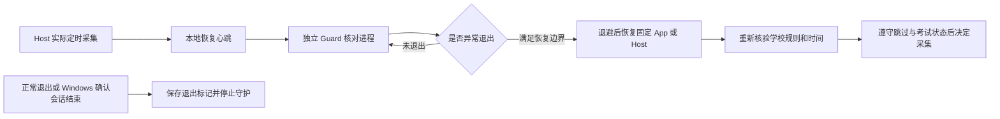

# 定时噪音监测保护 · P3 独立守护

2026-10-04。主交付：定时采集期间 App／Host 异常退出后的受控恢复。本地实现已按 P1～P3 功能范围提交；未推送或部署。安装器、录课页面的其他未提交改动仍保留，NPEssentials 未修改。

## 用户能看到什么

- 启动 App 时运行独立 `NPEduTools.Guard.exe`，在任务管理器可见；噪音监测页显示守护状态和恢复次数。
- 只在 Host 实际持有受保护定时采集时恢复。手动监测、空闲、规则待确认均不因此启动采集。
- App 崩溃后安静恢复侧边栏，不重开 OOBE、不重复启动触摸辅助。Host 恢复后重新取得学校规则和 ClassIsland 时间，本时段跳过、考试暂停仍生效。
- 2／5／15 秒退避；每个守护运行周期最多三次启动尝试，成功与失败均计数。达到上限后检查故障并正常退出、重新打开应用。
- 原界面无限重启 Host 的逻辑已移除。界面仍重试连接；未处于定时采集时后台异常退出，需要检查后重新打开应用。

## 恢复边界

| 情况 | 行为 |
| --- | --- |
| 定时采集时 App／Host 确认已退出 | 在仍有恢复依据、桌面可交互时恢复固定组件；存活但无响应的进程不被结束或替换。 |
| 最近恢复心跳已超过 30 秒 | 不沿用旧许可恢复；重复读取旧文件不能续期。 |
| 正常停止后台并退出、Host Ctrl+C | 先保存当前 generation 的退出标记；保存失败时拒绝正常停止，可重试。 |
| 正常维护／升级 | 先在托盘正常停止后台并退出，再调试或升级；安装器仍不强制结束进程。 |
| Windows 注销／关机询问 | 仅记录临时会话询问，暂停启动。取消后解除暂停；确认结束才永久停机，不拉起。WPF 在询问期间自行退出不会误写正常退出标记。 |
| 锁屏／安全桌面 | 不启动进程；解锁后仍需未过期的恢复依据。 |
| 休眠／恢复 | 丢弃旧恢复资格，需 Host 新的实际定时采集心跳，不能凭睡前状态重启。 |
| 守护自身退出／文件不可读写 | 不自我复活；界面提示未连接／陈旧，需手动重启应用。 |

## 简单流程

## 实现入口

`Core/GuardState.cs`：有界原子记录、进程身份、单调退避。`Core/GuardHostSession.cs`：Host 心跳与正常退出标记。`Core/GuardSupervisor.cs`：恢复决策。`Guard/Program.cs`：独立进程、隐藏 Windows 消息窗口和桌面检查。`App/MainWindow.Guard.cs`：登记和启动；恢复参数 `--guard-recovery`。

记录在当前实例配置目录的 `guard` 子目录，只含 generation、PID／启动时间、心跳序号、恢复状态与本包位置，不含凭据、学校身份或音频。目标固定为 Guard 所在包中的 App／Host；按程序路径、会话和启动时间核实后接纳，不从文件接收任意命令。不混用另一包或另一 ClassIsland 测试端点。

Guard 将自身关机通知顺序设为应用范围的 `0x3ff`，先于默认 `0x280` 的 App／Host 收到询问，确保也会收到最终取消／确认；设置失败不启用恢复。[Windows 关机顺序](https://learn.microsoft.com/en-us/windows/win32/api/processthreadsapi/nf-processthreadsapi-setprocessshutdownparameters)、[询问消息](https://learn.microsoft.com/en-us/windows/win32/shutdown/wm-queryendsession)、[最终消息](https://learn.microsoft.com/en-us/windows/win32/shutdown/wm-endsession)。

网页／KV 沿用 0.6／0.7／0.8／0.9，恢复不续期已有返回作业板期限。网页显示“状态待确认”，不从断网推断具体恢复阶段；最多约 15 秒旧状态新鲜度窗口仍存在。开发构建与独立发布都包含 Guard，便携包校验要求 Guard 自包含运行时。

## 验证与限制

- PowerShell 5.1 统一入口：`powershell -NoProfile -File scripts/test-npep-noise-schedules.ps1 -Guard -Display -Protection -Presence`。
- 独立 Guard 进程测试使用专用假 App／Host，验证崩溃恢复、安静参数和维护停止；会话询问／取消／确认消息只发送给本次隔离 Guard，未注销或关机。
- 合成恢复采集测试验证必须有重新确认的规则、推进的学校时间，且考试门控解除后才创建新会话；持久跳过回归保留。
- 最终边界 40 项通过；独立进程复验 2 项通过，包含询问→取消→再次崩溃恢复→确认结束。NPEP 全套 181 项通过，均无跳过。日志：`.artifacts/noise-guard-final-boundaries.log`、`noise-guard-process-cleanup.log`、`noise-guard-all-npep.log`。
- 最终桌面全套 **743 项通过，0 失败／跳过**；结果 `.artifacts/noise-guard-all-desktop-final.log`，原始 TRX `.artifacts/noise-guard-results/guard-desktop-all-final.trx`。
- PowerShell 5.1 统一入口与 0.8／0.9 跨端解析通过，见 `.artifacts/noise-guard-unified.log`；之后新增的会话取消及恢复边界由上述最终专门回归覆盖。WPF 锁定依赖构建 0 警告／错误，Host／Guard 的实际拷贝哈希与新构建一致，见 `.artifacts/noise-guard-build.log`。
- 8 项安装包合成校验通过，含 Guard 自包含组件与安装脚本编译；结果 `.artifacts/installer-package-tests/374428e0334342b293197a85649dbf82/result.json`。未正式安装或发布，未启动真实麦克风、操作正在运行的 App／Host或修改 Windows 自启动。
- 首次最终完整回归为 742 通过、1 失败；失败定位为子进程已退出后删除临时 EXE 的 Access Denied，不在恢复断言。已为限定临时根目录的清理增加最多 5 秒有界重试；两条进程用例及完整 743 项复验均通过，最终检查无本轮假 App／Host／Guard 残留进程。
- 实际班级大屏、Windows 真实关机／休眠／锁屏与故障恢复人工验收仍未进行；本轮没有 Docker、数据库迁移或生产操作。

后续三端整体验收与维护入口见 [整体任务卡](SCHEDULED-NOISE-INTEGRATED-20261004.md)，其中记录了 P1～P3 的同轮隔离浏览器／数据库结果；本页保留 P3 专项原始证据。
