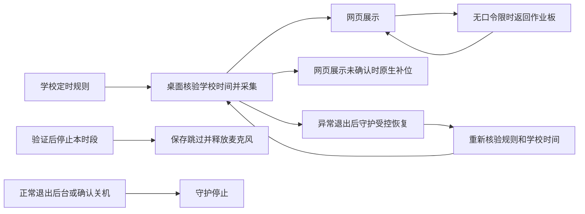

# 定时监测保护 · 整体验收与维护

2026-10-04。目标：把已实现的 P1～P3 作为一套功能验证，修正文档与测试入口的过期假设。桌面 P1～P3 已按功能范围本地提交；网页／KV 本地提交为 `e21b0f1`／`e8617c6`。三仓均未推送或部署；不使用 Docker、生产服务或真实麦克风。

## 一张用例图



返回只改变展示。网页定时 STOP 使用学校 PIN；桌面管理操作使用本机管理口令。手动监测不应用 P1～P3 保护。考试与通知仍优先。

## 当前入口

在 NPEduTools 根目录用 Windows PowerShell 5.1：

```powershell
.\scripts\test-npep-noise-schedules.ps1 -Guard -Display -Protection -Presence -Database -Browser
```

需要当前三仓依赖、原生 PostgreSQL 和 Playwright Chromium。数据库入口创建独立临时集群；浏览器使用模拟服务，不连接开发／生产 API。每轮保存 `.artifacts/noise-schedule-tests/run-<ID>/result.json` 和分项日志，记录所选范围、退出码、开始／结束及失败原因；没有选择的项目不算通过。异常中止可能留下 RUNNING，应先检查日志和本轮拥有的临时进程，不能解释为成功。

## 维护顺序

调试、切换程序包或升级前，在托盘正常停止后台并退出，再运行新版本。关闭窗口只隐藏；直接结束实际定时采集的 App／Host 可能触发守护。安装器不会强制结束正在运行的程序。没有管理口令时先由网页学校 PIN 结束定时采集，再完成配置。

P1／P2 的 KV 迁移 `20261004010000_noise_display_return`、`20261004020000_noise_display_presence` 需要先应用；部署时先升级 KV，再升级网页和桌面。P3 只增加本地守护组件，无新数据库迁移。这里描述维护顺序，本轮没有执行部署。

## 本轮结果

最终统一复验 **17 个阶段全部通过**。结果 `.artifacts/noise-schedule-tests/run-2d24c010075449929cd9ad97120f1d35/result.json`，逐项日志在同目录；完整入口日志 `.artifacts/noise-protection-integrated-final-20261004.log`。

| 验证范围 | 本轮结果 |
| --- | --- |
| 独立守护／启动／停止边界 | 39 项通过，含真实隔离假进程恢复；本轮假进程无残留。 |
| 桌面排程、保护、备用展示及网络协议 | 191 + 15 + 52 项通过；所选用例零跳过。 |
| KV 与网页状态回归 | KV 143 项、网页 151 项通过；所选用例零跳过，数量为各组执行数，存在交叉覆盖。 |
| 真实 C#／网页／KV 解析 | 29 项展示断言、7 份实际服务快照、20 个 0.8 和 20 个 0.9 正反例通过。 |
| 隔离浏览器 | 排程管理／报告流程及展示交互流程均通过；展示 Playwright 1/1。 |
| 原生隔离 PostgreSQL | 旧数据库升级 6 项、HTTP／SQL 44 项通过，零跳过，临时集群已清理。 |

数据库独立复验也通过相同 6 + 44 项；日志 `.artifacts/noise-protection-integrated-database-20261004.log`。PowerShell 5.1 对原生 stderr 的警告包装以及构建依赖的浏览器数据提醒保留在日志中，测试成败按实际进程退出码判断；没有为这些提示更新无关依赖。

第一轮在旧网页排程浏览器脚本发现失败：它假设全部请求为 0.7，但当前页面还会读取 0.8 返回期限设置。已补正确模拟响应并严格按方法／路由核验版本，没有放宽所有请求；失败记录保留在 `run-c443ce409ad6479e97e471c1b96fea09/result.json`。记录器复验另发现 PowerShell 5.1 管道退出码被局部同名变量遮住，已改为读取原生进程实际更新的全局退出码；失败记录 `run-f751548e634b474f9f86ad1f6609affc/result.json` 保留。实际记录函数的 0／7 退出码、stderr 和调用方状态恢复检查通过；测试日志目录 `.artifacts/noise-reporter-check-9530d40ae80e4bcc8d84f3b367ba6591`。

真实教室排程、麦克风、后排可读性、Windows 关机／休眠／锁屏及实体故障恢复仍待人工验收。用户不在，均不记为通过。

## 分层实现

- [P1：限时返回与管理验证](SCHEDULED-NOISE-PROTECTION-PLAN-20261004.md)
- [P2：网页心跳与原生补位](SCHEDULED-NOISE-FALLBACK-20261004.md)
- [P3：独立守护与异常恢复](SCHEDULED-NOISE-GUARD-20261004.md)
- [网页页面与导航](https://github.com/tempChanghong/NPClassworks/blob/main/docs/ui-screen-scheduled-noise-display-20261004.md)
- [KV 0.9 展示状态契约](https://github.com/tempChanghong/NPClassworksKV/blob/main/docs/npep-noise-display-presence-0.9.md)
