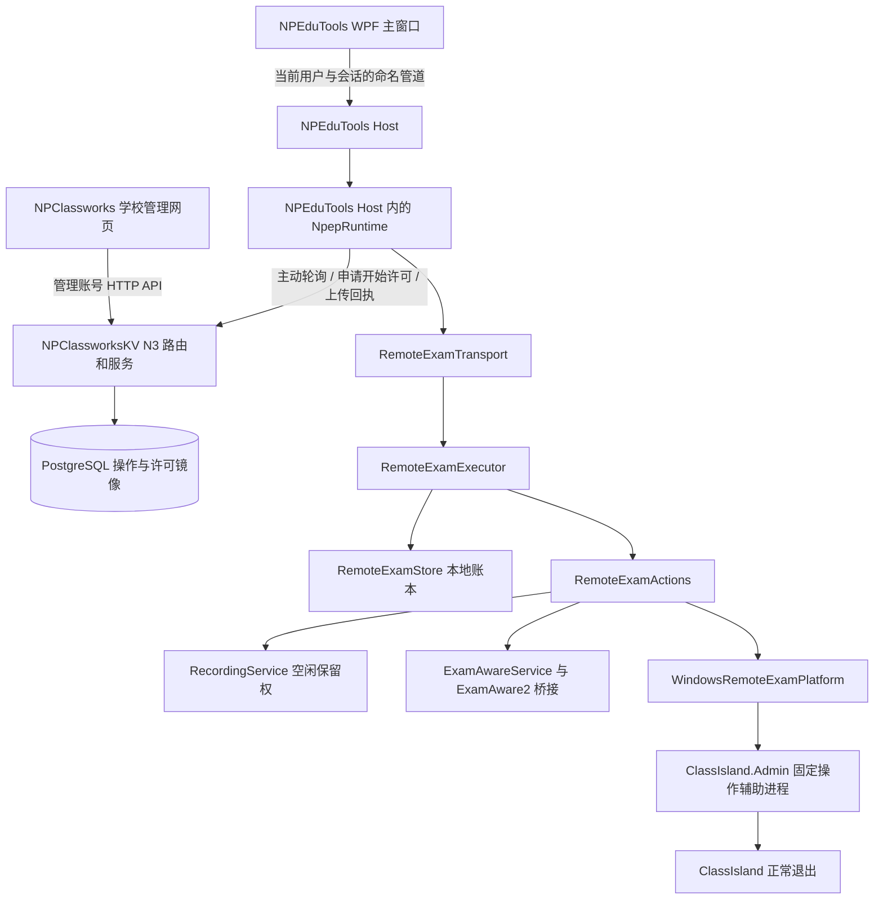
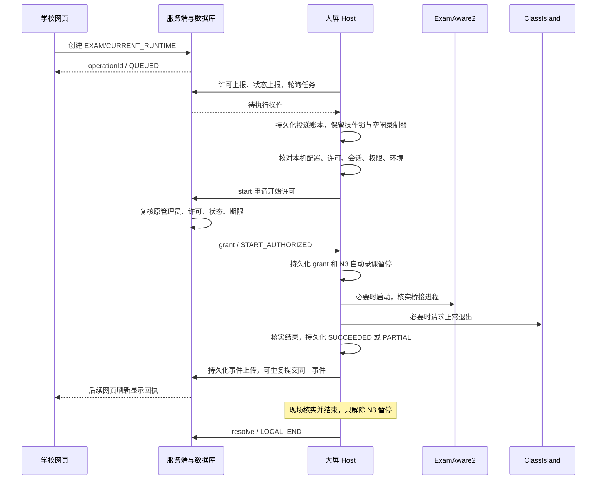

# 考试模式与 N3 远程考试环境：架构、执行链及源码导读

> 日常阅读请先看[一页用例图](EXAM-MODE-OVERVIEW.md)。本文记录调整前的实现：其中 N3 不修改自启动的描述属于旧实现；完整考试模式现已接入本地代码，使用 N3 0.4，尚未部署。

核对日期：2026-09-27。对象：当前 `D:\CodeProjects` 下三个仓库的工作区源码，包含尚未提交的修改。本文描述已实现行为，并明确区分协议预留、历史测试和待验证事项；不代表生产网站版本。

核对时 HEAD：NPEduTools `862c44d`、NPClassworks `8cc9dd4`、NPClassworksKV `ebcdc74`。这些提交号不能单独复现当前工作区，因为 N3 存在未提交／未跟踪文件。

本轮仅编写本文和文档索引，没有修改业务代码、重新构建应用、切换软件或部署。

## 1. 首先消除概念歧义

代码中并不存在一个统管一切的 `ExamMode = true`。目前至少有四种彼此相关、但不能互换的状态：

| 状态 | 所有者 | 表示什么 | 不表示什么 |
| --- | --- | --- | --- |
| 本地 `ClassroomModeState.Mode` | `ClassroomModeService` | 用户选择的长期 `Daily`／`Exam` 模式 | 不保证进程此刻没有被外部程序关闭或启动 |
| N3 操作 `Outcome`／服务端 `state` | 本地执行账本／服务器操作账本 | 某次请求执行到什么结果 | 不等于软件的持续实时状态 |
| N3 `AutomaticPaused`、`PauseOperationId` | `RemoteExamStore` | 当前是否因远程考试阻止后续自动录课、由哪次操作建立 | 不等于本地长期模式已经改为 Exam |
| `runtimeMode` | `RemoteExamTransport` 现场观察 | ExamAware 桥接就绪且 ClassIsland 停止时为 `EXAM`，否则 `OTHER`，无法确认时 `UNKNOWN` | 不是自启动设置，也不能把 `OTHER` 当成已经验证的 Daily |

用户可以先在本地选择 Daily，然后通过 N3 进入考试环境。此时本地 Mode 仍是 Daily，N3 暂停为 true，运行环境可以是 EXAM。这在当前设计中是允许的。

### 两条操作路径

| 项目 | 本地日常／考试模式 | N3 远程考试环境 |
| --- | --- | --- |
| 发起位置 | NPEduTools 本地模式界面 | NPClassworks 学校管理网页 |
| 入口能力 | `classroom.set` 等 | NPEP 0.3 `EXAM / CURRENT_RUNTIME` |
| 修改 Windows 自启动 | 是 | 否 |
| 立即切换正在运行的软件 | 用户选择 `SwitchRunning` 时执行 | 执行本次考试环境准备 |
| 返回日常软件环境 | 支持本地 Daily 路径 | 不提供远程 DAILY |
| 自动录课 | 独立的本地模式暂停；可请求停止正在进行的自动录制 | 只接受录制器空闲，不停止已有录制；阻止后续自动开始 |
| 原有课表和计划 | 保留 | 保留 |
| 主持久化文件 | `classroom-mode.json` | `remote-exam-runtime.json` |
| 出错恢复 | 自启动恢复点；即时切换可本地重试 | 保留部分／未知结果及暂停，本地核实结束，不自动重新执行 |

N3 刻意没有直接调用 `classroom.set(Exam)`，因为那会继承修改自启动等超出远程请求范围的行为。

## 2. 系统与进程边界



- 网页不会直接连接大屏上的端口；大屏主动向学校 API 发起 HTTP 请求。因此远程大屏通常不需要开放入站端口。
- 网页使用 Vue 3／Vuetify／JavaScript；后台为 Node／Express、Prisma 与 PostgreSQL。N3 存储访问使用 Prisma 事务内的参数化 SQL。
- 桌面主程序为 WPF，当前主应用目标是 `net10.0-windows`，公共工程默认 `net10.0`。不能用早期 ClassIsland 的 .NET 8／9 构建要求替代当前 NPEduTools 的要求。
- WPF 负责界面与本机许可；Host 负责网络循环、持久化、执行、录课协调。关闭一个管理窗口不等于停止后台，也不取消已受理任务。
- App 的构建目标会复制 Host／Admin／Recorder 到输出目录。只重新编译源码而继续复用旧 Host，仍可能运行旧实现。
- N3 使用自定义 HTTP 轮询；NPClassworks 其他功能使用 Socket.IO，不代表考试控制也使用 Socket.IO。

源码组装点：[Host/Program.cs](../../src/NPEduTools.Host/Program.cs)。它先加载两类暂停存储，再创建录制器，随后创建 ExamAware、课堂模式服务、N3 适配器和 NpepRuntime。

## 3. 权限、身份与固定能力

### 3.1 Windows 权限

[StartupElevation.cs](../../src/NPEduTools.App/StartupElevation.cs) 保留 `asInvoker` 启动入口，在初始化 UI、凭据和工作进程之前检查管理员身份；不足时用 `runas` 重启自身，原实例退出。取消 UAC 后不会继续普通权限运行。

复用已有 Host 前，会核对服务器进程 PID、用户 SID、Windows 会话和管理员状态；不能把“前台已提权”当成“旧后台也自动提权”。

Host 管理管道使用 `CurrentUserOnly` 并检查当前会话。Admin 辅助进程使用随机管道，调用方核实连接者就是刚启动的辅助进程，辅助进程再核实 SID／会话与请求。已经提权的进程启动同权限辅助程序时，不需要再次走 `runas`。

这里的目标是约束学校远程请求和普通错误操作；并不声称能对抗已经控制本机管理员账户的攻击者。

### 3.2 学校账号与设备身份

学校管理 API 检查账号、会话、tokenVersion、账号禁用状态以及学校成员角色，只有 OWNER／ADMIN 可以发起。开始授权时重新检查原发起人的账号、会话和角色，避免排队期间被撤销权限的旧请求直接执行。

设备端使用 N1 配对取得的独立 Bearer 凭据；不使用浏览器管理员令牌。后端验证凭据摘要、设备 ACTIVE 状态、授权期限、学校班级绑定和部署身份。设备凭据在本机以用户范围 DPAPI 保存于 `npep.credentials.dpapi`，不是明文存放在许可 JSON 中。

### 3.3 首次本机许可

入口：设置 → 学校互联 → 远程考试环境本机许可。

`NpepControlPolicyStore` 保存：

```text
Revision       本机许可版本
Allowed        是否允许
Scope          当前学校服务与绑定身份的 SHA-256 摘要
ConsentId      本次许可身份
ControlEpoch   控制上下文代际
```

Scope 由 origin、serverInstanceId、deploymentEpoch、deviceId、screenBindingId、bindingRevision、credentialGeneration、approvalId 组成。换服务器、换绑定或重新配对时，不沿用旧许可。

同一绑定的正常重启保留 Allowed，但会更换 ControlEpoch 并递增许可版本；旧启动请求不能直接跨代执行。启用／禁用许可也更换 ConsentId 和 ControlEpoch。临时离线可以保留许可，但 `CanEnable`／可执行条件要求连接可用。

关闭许可不会自动退出 ExamAware、恢复日常软件或解除已经建立的 N3 暂停。

### 3.4 网络能力边界

请求只接受固定的 `target: EXAM`、`scope: CURRENT_RUNTIME`，不接受远程程序路径、命令行、自启动开关、任意 shell 命令或批量设备列表。可执行文件路径来自本机已保存配置。

当前客户端按用户要求同时接受 HTTP 和 HTTPS；HTTPS 仍正常验证证书，失败可重试，不自动降级。HTTP 是明文传输，Bearer 和请求内容不具备传输保密性。本地 DPAPI、请求去重和身份字段都不能替代 HTTPS。

## 4. 网页如何发起一次切换

入口：学校管理 → 大屏设备 → 打开 NPEP 设备互联 → 设备卡片「考试环境」。

主文件：

- `NPClassworks/src/components/admin/NpepDeviceManager.vue`：设备入口与弹窗挂载。
- `src/components/admin/NpepRuntimeControl.vue`：确认框、发起／取消按钮、历史结果。
- `src/composables/admin/useNpepRuntimeControl.js`：请求生命周期、轮询、并发保护。
- `src/utils/npepRuntimePresentation.js`：可操作条件、中文状态、创建请求。
- `src/utils/classworksV2Client.js`：管理 API 与响应关联。

网页每 10 秒刷新状态与最近 20 项历史。组件使用 generation 和 AbortController，使切换学校／设备后旧请求不会覆盖新界面；用 `reading`／`busy` 避免自身重叠操作。

网页按钮主要检查：支持 N3、本机允许、状态样本不超过 60 秒、没有未解决任务、录制空闲、交互桌面、无通知阻碍、无远程暂停、运行阶段可用。

网页只做第一层提示，服务器和设备仍会重新检查。

创建体的关键字段：

```json
{
  "requestId": "本次网页请求的 UUID",
  "target": "EXAM",
  "scope": "CURRENT_RUNTIME",
  "expectedRuntimeRevision": 12,
  "expectedModeRevision": 4,
  "expectedConfigurationRevision": 7,
  "consentId": "许可 UUID",
  "policyRevision": 3,
  "controlEpoch": "控制代际 UUID"
}
```

以上是字段示意，不是可直接提交的完整有效请求。

网页首次提交前生成 requestId，并把请求体存入内存 pending。网络结果不明确时，重试沿用同一份 ID／内容，服务器返回同一个 operationId。pending 不是跨刷新持久化存储；重载网页后应先查看历史和设备状态，不能把按钮重新可见当成先前操作没有发生。

`201 Created` 只代表服务端登记成功。只有设备最终回执能确认软件切换结果。

## 5. HTTP 接口与服务器处理

统一前缀：`/api/v2/npep`；以下为相对路径。

| 调用方 | 方法／路径 | 含义 |
| --- | --- | --- |
| 网页 | GET `/schools/:schoolId/devices/:id/runtime-status` | 许可镜像、状态样本、占用情况 |
| 网页 | GET 同设备 `/runtime-operations` | 最近 20 项历史 |
| 网页 | POST 同设备 `/runtime-operations` | 创建 EXAM 请求 |
| 网页 | POST 同设备 `/runtime-operations/:operationId/cancel` | 取消尚未获开始许可的请求 |
| 设备 | POST `/device/runtime-control-policy` | 上报本机许可与控制上下文 |
| 设备 | POST `/device/runtime-status` | 上报运行环境样本与序号 |
| 设备 | GET `/device/runtime-operations` | 领取当前未解决任务 |
| 设备 | POST `/device/runtime-operations/:operationId/start` | 申请一次开始许可 |
| 设备 | POST `/device/runtime-operation-events` | 上传持久化执行结果事件 |
| 设备 | POST `/device/runtime-operations/:operationId/resolve` | 上报现场已结束暂停 |

N3 版本头为 `X-NPEP-Version: 0.3`。requestId 必须能够与响应关联，POST 的头／体若同时提供则必须一致。成功响应包含 protocolVersion、requestId、serverTime、data；错误有明确代码。客户端不接受自动重定向，单次请求期限 10 秒，控制请求／响应最大 64 KiB。

路由使用严格 JSON 和 JSON Schema 校验；服务端还有 UTF-16 长度检查，使 JavaScript 与 .NET 字符串边界一致。设备 N3 接口当前共用每设备凭据 60 次／60 秒限额，管理 POST 共用每会话 30 次／60 秒限额。

### 服务分层

| 文件 | 职责 |
| --- | --- |
| `NPClassworksKV/routes/v2/npep.js` | 路由、版本、Schema、认证入口、限流与响应封装 |
| `services/npepService.js` | 已有 N1 身份事务、学校／成员／绑定／设备锁与校验 |
| `services/npepRuntimeService.js` | 许可、状态、创建、开始、事件、取消、现场结束 |
| `domain/npep/runtimeControl.js` | 纯规则：状态新鲜度、版本匹配、事件转移与幂等 |
| `services/npepRuntimeRepository.js` | PostgreSQL 参数化读写 |

服务端事务先锁学校行，再按既有顺序检查账号／绑定／设备，避免管理权与设备状态并发变化。事务还核对部署身份在执行前后没有改变。数据库唯一索引进一步限制并发，不只依赖 JavaScript 进程内变量。

### 两个 PostgreSQL 表

`NpepRuntimePolicy`：`deviceId` 主键，`data JSONB` 保存当前许可、上下文、状态、样本时间和序号。

`NpepRuntimeOperation`：`id`、`deviceId`、`requestId`、`createdAt`、`resolvedAt`、`data JSONB`。JSON 内还有原发起人 claims、操作视图、事件和现场结束信息。

- `(deviceId, requestId)` 唯一：同设备相同请求不能生成两项操作。
- `deviceId WHERE resolvedAt IS NULL` 部分唯一：同设备最多一个未解决操作。
- `(deviceId, createdAt DESC, id DESC)` 历史索引。
- 没有随设备删除而级联清空的外键，避免撤销授权时抹去未知执行证据。

迁移文件：`prisma/migrations/20260926000000_npep_runtime_control/migration.sql`。更新后端路由而没有应用迁移，不是完整升级。

## 6. 一次 N3 操作的完整时序



### 6.1 轮询与接收

`NpepRuntime.ControlLoop.cs` 初次等待 1 秒，之后每轮完成后通常等待 10 秒。实际周期还包含网络和本机检查耗时，并不是严格每 10 秒到达。

只在 ACTIVE、ONLINE、未暂停上报、设备不 Busy 且未被阻断时进入控制周期。每轮先上报许可，再采样／上报状态，随后轮询操作、补传旧回执、处理新操作。

第一次看到 operationId，先保存到 `runtime-control-outbox.json`，再进入执行内核。已经存在于 outbox 的操作只做恢复核对／回执补传，不再次调用 ExecuteAsync。

### 6.2 开始许可 Grant

服务器登记时设置 5 分钟未开始有效期。设备完成本机检查后才调用 `/start`。

服务器再次核对原发起人、设备、许可、上下文、三个 expectedRevision 和状态样本。许可包含 grantId、operationId、身份／会话／控制代际、许可版本以及 `authorizedAt`／`startNotAfter`。

`startNotAfter = min(请求到期时间, 服务端当前时间 + 30 秒)`。

设备以服务端的 `startNotAfter - serverTime` 减去本次网络往返耗时，得到保守剩余时间；使用 Stopwatch 单调时钟消耗这个窗口。该窗口约束首次产生效果前的开始资格，不是“所有软件动作必须 30 秒结束”。

后续步骤会重新检查本机许可、绑定和会话，但并非每个步骤都重新向服务端验证学校管理员身份。服务端对原管理员的再次校验发生在 `/start`；设备撤销等变化依赖后续网络状态及取消令牌传播，不应描述成零延迟撤销。

Grant 是经设备认证 HTTP 通道返回、保存在服务端／本地账本中的许可对象，不是可以脱离服务器独立验证的签名 JWT。

获 Grant 后网页不能取消任务；通信静默也不会让服务器自动断言动作没有发生。

### 6.3 桌面执行内核

`RemoteExamExecutor.RunAsync` 依次执行：

1. 校验请求，取得整个执行期的互斥保留权。
2. 查本地账本：同 ID／同意图直接返回已有结果；同 ID 不同意图拒绝。
3. 检查 runtimeRevision、未解决历史、存储容量，写入 CHECKING。
4. 检查当前许可／会话，原子保留空闲录制器，检查本机软件配置与实际环境。
5. 在第一次效果前申请并持久化 Grant。
6. **先持久化 N3 自动录课暂停**，记录 RUNNING／PauseRecording。
7. ExamAware 未就绪时执行 PrepareExam，并检查已运行实例，避免重复启动。
8. 再次确认 ExamAware 就绪；ClassIsland 仍在运行才请求正常退出。
9. 再次核实配置、许可与环境；确认 ExamAware 就绪、ClassIsland 停止后写 SUCCEEDED。

每个关键软件动作之前都会再检查配置版本、路径、权限与状态，防止从首次检查到实际执行期间发生变化。

这里用接口分离可测试部分：`IRemoteExamActions` 隔离 OS／软件动作，`IRemoteExamAuthorization` 隔离许可检查，`IRemoteExamStore` 隔离持久化。生产实现分别是 RemoteExamActions、传输层闭包和 RemoteExamStore。

## 7. 实际如何控制两个软件

### ExamAware2

`ExamAwareTarget.Validate` 当前明确限制为 Windows 正式版 **1.5.2**：检查绝对本机路径、文件名 `ExamAware.exe`、MZ、ProductName／版本和 `resources/app.asar`。

Host 的 ExamAwareService 在 loopback TCP 上接收桥接插件连接，使用配对密钥、双方 nonce、HMAC-SHA256 和有序帧校验。连接存在还不够：N3 继续核实桥接上报 PID 对应的真实进程、文件路径、用户、会话与是否退出。

若 ExamAware 未运行，通过本机保存路径启动；若已经运行但桥接尚未就绪，则等待并核实，准备窗口约 18 秒，不因“桥接还没来”就再开一个实例。

**N3 只准备 ExamAware，不远程退出它。** 本地 Daily 的退出则走 ExamAware 插件 quit 协商，涉及编辑器／放映阻止退出等问题。此前已知的编辑器退出缺陷属于后者，不能用 N3 成功推断已修好。

### ClassIsland

`WindowsRemoteExamPlatform` 找到的目标必须与本机保存路径、SID、会话一致，并记录 PID 和进程创建时间；进程不匹配、多实例或身份无法读取时拒绝。

退出链：

```text
RemoteExamActions.CloseClassIslandAsync
  → WindowsRemoteExamPlatform.CloseClassIslandAsync
  → AdminClient.RunAsync(action = runtime-close)
  → ClassIslandRuntime.Execute
  → ClassIslandProcess.EnsureStoppedAsync
```

`runtime-close` 不实例化任务计划程序、不读写自启动。发送前再次核对授权与目标 PID／创建时间，避免 PID 重用或进程被替换后退出错误实例。

底层不是调用课表 IPC 或 ClassIsland 时间桥接退出。它枚举目标顶层窗口，按 Windows 会话结束消息方式询问正常退出，再发送对应结束／撤销消息；代码使用 `0x11`／`0x16` 和 CLOSEAPP 标志，不使用强制关键结束标志。拒绝或无响应时失败，之后最多轮询约 10 秒确认进程消失。

因此“课程接口已连上”与“可以正常退出”是两个条件。ClassIsland 学校时间／课表桥接主要用于录课计划，本身不是这条 N3 退出通道。

这里承诺不强杀 ClassIsland／ExamAware 业务进程。AdminClient 的 finally 可以终止自己专用的辅助 worker；源码出现 worker.Kill 并不代表会强杀目标软件。

## 8. 三类状态机与时间字段

### 本地长期模式

```text
Mode: Unconfigured / Daily / Exam
Phase: Idle → Checking → Switching → [Running] → Idle
                        └ 出错后可能 Incomplete
存储不可用: Unavailable
```

本地切换先观察自启动，保存恢复点并暂停自动录课，优先启用目标软件自启动，再禁用另一方，读回确认。选了 SwitchRunning 才继续当前进程切换。只有成功才提交目标模式；中途失败会保留恢复点和暂停。

本地恢复 `classroom.restore` 恢复之前的自启动／模式暂停；它不保证把所有进程恢复到切换前画面。`classroom.retry` 专用于待完成的本地即时切换，不是重放 N3 请求。

### 服务端 N3

常见路径：

```text
QUEUED → START_AUTHORIZED → SUCCEEDED
  ├ 未获开始许可 → CANCELLED / EXPIRED / REJECTED
  └ 已获许可后结果不完整 → PARTIAL / UNKNOWN → 现场 resolve
```

协议还接受 RECEIVED、CHECKING、RUNNING、WAITING_LOCAL 等状态，但当前桌面主要上传一次最终事件；不要期待网页必然显示每一个中间步骤。服务端不是对任意状态做简单覆盖：有事件顺序、Grant 绑定、终态及证据检查。

### 本地 N3

```text
CHECKING → RUNNING(PauseRecording / PrepareExam / CloseClassIsland / Verify)
   ├ 暂停尚未建立时出错 → REJECTED
   ├ 暂停建立后出错 → PARTIAL
   ├ 最终核实通过 → SUCCEEDED
   └ 进行中重启 → UNKNOWN / HOST_INTERRUPTED
```

本地普通异常在暂停建立后归为 PARTIAL；“部分”可以只表示暂停已写入，并不一定已经启动或退出某个软件。

### 不要把三个结束概念混为一谈

| 字段 | 意义 |
| --- | --- |
| `Outcome/state = SUCCEEDED` | 当时最终检查通过 |
| `ResolvedAt/resolvedAt` | 执行结果已解决，不再占未解决执行槽 |
| `LocallyEndedAt/localEndedAt` | 现场后来结束了这次 N3 暂停 |

成功时 resolvedAt 已可设置，但 AutomaticPaused 仍为 true。服务器同时检查上报的 remoteExamPause，避免把“执行槽已释放”误解为“可以随意再发新的考试请求”。

本机结束后保留原 SUCCEEDED／PARTIAL／UNKNOWN，不篡改为另一种历史结果。

## 9. 录课协调：到底暂停了什么

Host 把两个独立委托传给 RecordingService：本地模式暂停、N3 远程暂停。任一暂停仍有效，自动录课都不能正常进入新的计划录制；还要满足启用开关、学校时间、计划、录制器等原有条件。

N3 使用 `ReserveIdleForRuntimeAsync`，在录制服务自己的锁内检查并设置保留标记，防止“刚检查空闲，自动录课就抢先启动”的竞态。保留期间自动开始被阻止，UI 的录制控制也受运行操作门控。

内部空闲判定允许无活跃 worker 的 Idle／Saved／Failed；但传给服务器的录制状态映射更保守，Failed 映射 UNKNOWN，学校侧仍要求 IDLE。这是两个层次当前存在的判定差异。

N3 不调用 `PauseForClassroomModeAsync`；该方法属于旧本地模式，会向正在进行的自动录制发送停止指令。本地模式暂停和 N3 暂停不能互相替代。

N3 暂停也不是把用户的“自动录课已启用”改成 false，不清空计划；它不是“禁止一切手动录制”的永久开关。操作结束释放锁后，手动录制仍走原有自己的入口与校验。

现场解除 N3 暂停后，调度器恢复按原条件判断；如果正处于可录制课时且其他条件满足，可能开始录制。解除暂停不等于无条件马上录制，也不等于补录已错过课程。

## 10. 锁、并发与 OPERATION_BUSY

`RuntimeOperationGate` 是 Host 内共享协调器：

- `TryEnterMutation()`：普通管理操作持有的共享保留权；N3 独占期间拒绝。
- `TryReserveSwitch()`：N3 切换／核实／结束取得的独占保留权；有普通修改或另一独占操作时立即失败。
- `ReleaseAfter(lease, task)`：直到实际异步任务完成才释放，不能在 IPC 返回 Accepted 时提前释放。

`RuntimeOperationFile` 把协调扩展到前台通知、前台直接调用 Admin 和后台 Host，路径为：

```text
%LOCALAPPDATA%\NPEduTools\coordination\runtime-session-<SessionId>.lock
```

普通持有者以共享方式打开文件；独占操作以 FileShare.None 打开。文件存在本身不代表占用，关键是仍打开的句柄。进程退出后 Windows 释放句柄；不要用删除 lock 文件作为常规恢复方式。

学校通知和通知预览从显示到 Closed 持有共享保留权；N3 执行中新的通知应延后展示。录制空闲保留权是另一层锁，ClassIsland 辅助程序还有用户范围 Mutex。

### 当前真实存在的可观测性问题

1. `InspectLocallyAsync` 虽然不修改配置，仍取得独占保留权和空闲录制器保留权，以获得受保护的检查窗口。
2. 后台 `RemoteExamTransport.ObserveAsync` 也调用它。后台每轮采样与用户点击“核实当前考试状态”因此可能互相碰撞。
3. 失败统一返回 OPERATION_BUSY，UI 文案只提“通知窗口或软件管理操作”，没有指出后台采样或具体锁持有者。
4. ObserveAsync 捕获 OPERATION_BUSY 后把 `noticeOpen` 设置成 true，也会把普通占用解释为通知。网页因此可能提示“正在显示通知”，但这不是可靠的实际通知窗口证据。

以上由代码路径可以确认；并不证明此前截图一定由后台采样引起。需要占用来源或日志才能给那一次事件定因。本轮不通过自动重试、延长超时或移除锁来掩盖问题。

## 11. 持久化、版本与防重复

默认 Host 数据根目录为 `%LOCALAPPDATA%\NPEduTools\config`；`--data-dir`／自定义 pipe 的测试实例可以改变位置。不要把工具账号读取到的文件未经核实就认定为另一个用户 Host 的数据。

| 文件 | 内容／用途 |
| --- | --- |
| `classroom-mode.json` | 本地 Daily／Exam、阶段、自启动恢复点、即时切换意图、原有暂停 |
| `classisland.json` | ClassIsland 保存路径、配置版本和启动验证记录 |
| `remote-exam-runtime.json` | N3 执行结果、配置快照、独立暂停、revision、现场结束 |
| `npep/runtime-control-policy.json` | 本机许可 Scope／Allowed／ConsentId／ControlEpoch |
| `npep/runtime-control-outbox.json` | 已接收请求、Grant、待上传事件、ack 与现场结束投递 |
| `npep/npep.credentials.dpapi` | N1 配对／凭据；用户范围 DPAPI 保护 |
| `npep/npep.lock` | 互联资料目录单一所有者保留权 |

N3 主账本最大 256 项／2 MiB；outbox 最大 256 项／4 MiB。当前没有自动归档已结束历史来释放容量。网页只显示最近 20 项，没有真实分页；桌面本地界面只展示最近 8 项，不代表底层只有 8 项。

N3 写盘先写 `.pending`、Flush(true)，再替换目标文件。发现未完成写入或内容损坏时，不自行猜测最后结果：许可故障禁用控制，执行账本故障保留暂停。这里不能宣称跨所有文件和外部软件动作具备一个原子事务。

版本字段各自有职责：

| 字段 | 防止的陈旧状态 |
| --- | --- |
| runtimeRevision | 本地执行／暂停账本已经改变 |
| modeRevision | 本地日常／考试模式已变化 |
| configurationRevision | 当前实现为 ClassIsland 与 ExamAware 配置 revision 之和，用于线上检查；本地仍比对两项路径与版本快照 |
| policyRevision／consentId | 本机许可变动 |
| controlEpoch | 控制上下文跨重启／许可变更 |
| runId／sessionId／statusEpoch | N1 进程运行／服务器会话代际变化 |
| bindingRevision／deploymentEpoch | 绑定或部署身份变化 |
| eventId／sequence | 事件重复或乱序 |

### 两份本地账本为什么分开

执行账本回答“实际做到了哪一步，暂停是否还在”；outbox 回答“收到了哪项请求，哪些回执还没被服务器确认”。软件动作完成但回执丢失时，只补传回执，不再启动／退出一次。

服务端事件要求连续 sequence；同 eventId 或同 sequence 必须内容相同才能作为 DUPLICATE 接受。上传时可以使用新的有效上传会话，但事件里的 execution 保留原 Grant 的运行／会话身份。

目标是“持久化去重、不自动重放、可说明不确定结果”，不是保证外部 Windows 软件动作严格 exactly-once。

## 12. 失败、断线、重启和取消的行为

| 情况 | 当前处理 |
| --- | --- |
| 网页创建请求响应丢失 | 同 requestId 重试并查询历史；不等于未登记 |
| 未发 Grant 的请求超过 5 分钟 | 服务端在处理时标 EXPIRED 并释放未解决槽 |
| Grant 响应丢失 | 再轮询核实已提交的 Grant，结合本地账本；不直接重执行 |
| 程序启动失败、ClassIsland 拒绝退出 | 暂停建立后为 PARTIAL，保留暂停，不自动补偿关闭／重启其他软件 |
| 执行中 Host 重启 | 本地进行中条目转 UNKNOWN／HOST_INTERRUPTED，保持暂停 |
| 回执网络失败 | outbox 保留同一事件，下一轮补传 |
| 授权／绑定／会话变化 | 拒绝旧上下文，取消当前控制周期；已发生效果不会假装回滚 |
| TLS 验证失败 | 后续周期继续重试且继续验证证书 |
| 保存账本失败 | 停止继续执行，存储故障状态保守保留暂停或禁用控制 |
| OPERATION_BUSY | 拒绝本次操作，不偷偷排队执行 |

当前传输层在 ExecuteAsync 外层捕获非致命异常后依靠账本分类，而不是把所有异常直接显示给网页。如果在写本地执行条目之前就被操作锁挡住，ResultAsync 的兜底可能只得到 REJECTED／有限原因。这是诊断完整性需要改善的部分。

网络重试只用于恢复通道和上传记录，不意味着允许重新执行已经收过的 operationId。

## 13. 本机“核实”与“结束”具体做什么

WPF 文件：[MainWindow.RemoteExam.cs](../../src/NPEduTools.App/MainWindow.RemoteExam.cs)。

- `remoteexam.status`：读取本地许可、账本版本、暂停与历史。
- `remoteexam.preflight`：没有暂停时检查；存在未解决执行历史会要求恢复。
- `remoteexam.inspect`：有暂停时核实当前环境，可以检查待恢复现场。
- `remoteexam.command { action: consent }`：修改本机许可。
- `remoteexam.command { action: end-local }`：结束指定操作的 N3 暂停。

本地 IPC 没有一个可由任意网页传入路径的 N3 execute 命令；执行来自固定学校传输链。

成功核实后，UI 缓存“已检查的 runtimeRevision 与 controlEpoch”。只有它们仍匹配、存在 PauseOperationId、账本健康且处于暂停状态时，结束按钮才启用。

点击结束时弹出确认。Host 再次独占、检查 revision／operationId、保留空闲录制器、重新核实现场与保存的配置快照，然后写 LocallyEndedAt、清除本次暂停。第二次检查不是单纯信任按钮亮起。

结束并不要求 ExamAware 必须仍在运行、ClassIsland 必须停止；现场可以先自行处理软件，只要现有检查及配置一致性条件满足。结束不是远程 DAILY，也不改原长期 Mode。

本机结束先在本地生效，后续 HTTP 周期再上传 resolve。网络断开时，网页显示可能暂时落后于本地。

### 回执证据的边界

成功历史里的 ExamAware READY／ClassIsland EXITED 表示当时核实的结果。当前 ResultAsync 对非成功结果多使用 UNKNOWN，并不是每次失败都记录了最后一次准确的双软件状态。

现场 resolve 的 evidence 目前从原事件复制，更新 remoteExamPause=false 和时间；它没有重建一份独立的完整软件运行快照。因此不能把“现场已结束”旁边的历史 READY／EXITED 当成结束时重新观察到的进程状态。

## 14. 本地原有模式的独立实现

阅读顺序：

1. [ClassroomModeService.cs](../../src/NPEduTools.Host/ClassroomModeService.cs)：受理请求、revision、恢复点、模式提交。
2. [ClassroomModeStore.cs](../../src/NPEduTools.Host/ClassroomModeStore.cs)：持久化与重启后的 Incomplete。
3. [ClassroomModeEffects.cs](../../src/NPEduTools.Host/ClassroomModeEffects.cs)：观察并修改两个软件的自启动。
4. [ClassroomRuntimeCoordinator.cs](../../src/NPEduTools.Host/ClassroomRuntimeCoordinator.cs)：可选的即时切换顺序。
5. 同目录 `ClassroomModeEffects.Runtime.cs`：上述即时切换的真实适配。

Exam 目标：准备 ExamAware → 正常退出 ClassIsland → 最终验证。

Daily 目标：正常退出 ExamAware（保存编辑器／结束放映）→ 通过管理员任务启动 ClassIsland → 最终验证。

这条 Daily 路径依赖管理员自启动任务与 ExamAware 的正常退出协商，比 N3 的单向 EXAM 更广。因此 N3 成功不能证明 Daily 路径所有问题已解决。

## 15. 时间来源与调试边界

录课计划用 ClassIsland 学校时间。N3 网络许可期限和新鲜度用服务端时间、样本年龄与 Stopwatch；本地记录时间一般用 UTC，UI 转本地时间。不能把学校手动调时当成网络授权时钟。

本地开发：从 NPClassworks 根目录 `pnpm dev` 启动统一前后端，Vite 3031、API 3000，使用原生 PostgreSQL。NPEduTools 由用户在管理员 Visual Studio 中 Debug。

保持浏览器、大屏互联 origin、后端数据库属于同一个本地测试环境。能登录生产学校管理并不代表本地 N3 新代码已经部署在生产。

必要断点建议：

| 目的 | 位置 |
| --- | --- |
| 看网页究竟发了什么 | useNpepRuntimeControl.create／浏览器 Network |
| 看管理员请求为什么拒绝 | npepRuntimeService.create + requireReady |
| 看开始许可为什么拒绝 | npepRuntimeService.start |
| 看设备是否领取 | NpepRuntime.ControlCycleAsync 保存新 outbox 项处 |
| 看实际动作顺序 | RemoteExamExecutor.RunAsync |
| 看哪个软件身份校验失败 | RemoteExamActions.InspectAsync |
| 看 ClassIsland 退出 | ClassIslandProcess.EnsureStoppedAsync |
| 看核实为什么忙 | RuntimeOperationGate.TryReserveSwitch；记录当时持有者来源 |
| 看解除暂停为什么拒绝 | RemoteExamExecutor.EndLocallyAsync |
| 看回执不同步 | FlushControlResultAsync／npepRuntimeService.events／resolve |

不要在真实执行中随意长时间断点暂停：网络状态会过期，30 秒开始资格会失效，UI 和后台观察也会变化。检查时钟／授权拒绝宜先用单元测试或隔离环境，不靠生产调试。

## 16. 自动验证能证明什么

统一入口，PowerShell 5.1 或 7，在 NPEduTools 根目录执行：

```powershell
./scripts/test-npep-n3.ps1
./scripts/test-npep-n3.ps1 -Database
```

默认包括三端契约、网页请求／呈现、后端状态机／协议、桌面执行内核和 N1／N2／N3 传输测试。`-Database` 额外启动独立临时原生 PostgreSQL 集群，使用随机回环端口与临时数据库，运行 SQL／HTTP／真实 .NET 客户端链路；不连接开发数据库，不使用 Docker。

测试输出在 `.artifacts/n3-tests`，不替换 IDE Debug 主应用。跨端自动化中的 OS 软件动作仍由测试实现模拟，不能取代真实 ExamAware／ClassIsland 进程验收。

已有 2026-09-26 统一验收记录为 220 项通过及 29 个契约样例；之后启动诊断专项 LaunchTests 为 19 项通过。它们是既有运行记录，本轮只做源码阅读，没有重新运行，不应称作今天全部重测通过。

`test-npep-n3.ps1` 的桌面内核筛选并不包含所有 LaunchTests；统一入口也不等于整个解决方案所有测试。此前统计中的 54 项内核用例与后来 19 项专项存在不同筛选范围，不能随意相加作为唯一测试总数。

## 17. 本次审阅确认的可维护性问题

| 项目 | 已核实情况 | 后续合理方向（本轮未实施） |
| --- | --- | --- |
| “考试模式”命名重叠 | 本地自启动模式、N3 暂停、观察环境、历史结果混用同一中文概念 | 明确 UI 名称和状态展示，保留各自语义 |
| 占用原因不透明 | 同一 OPERATION_BUSY 包含多种占用，后台观察也使用独占锁 | 记录占用种类、持有者和耗时，再决定是否分离观察协调 |
| noticeOpen 误映射 | 普通操作占用可能被上报为通知打开 | 使用独立占用字段或准确来源，不把未知直接归类为通知 |
| 进度预期不一致 | 协议支持多个中间态，当前客户端主要上报最终事件 | 明确产品表现，若增加中间回执需保序、落盘和失败测试 |
| 现场结束证据较粗 | resolve 复用原事件的软件状态 | 区分历史证据与新的现场观察快照 |
| 账本容量固定 | 本地各 256 项，无完成项归档策略 | 设计保留去重信息的归档；不能直接清空恢复能力 |
| 网页列表不分页 | 仅最近 20 项、nextCursor=null | 需要时补服务端分页和对应索引验证 |
| 注释与当前实现落后 | RemoteExamExecutor／Host Program 有“尚未开放”等阶段注释，但传输已接入 | 审核后清理过时注释，历史状态留在带日期文档 |
| 跨仓契约副本 | 多个 schema／样例副本靠脚本核对 | 后续明确唯一源与生成方式，避免手工同步漂移 |
| 工作区与发布基线不一致 | 大量未提交 N3 文件，HEAD 不能代表完整现状 | 待审阅后形成可复现提交与验收基线，避免直接生产调试 |

这些是源码核对所得，不构成一次全面安全审计，也不把尚未复现的竞态直接认定为特定现场故障。

## 18. 掌握代码的推荐阅读顺序

先理解状态所有权，再看代码；不建议从整个 MainWindow 或所有 JSON Schema 开始。

1. 本文第 1、8、9、13 节：分清四种状态、成功与结束、两类录课暂停。
2. [RemoteExamModels.cs](../../src/NPEduTools.Host/RemoteExamModels.cs)：模型及接口。
3. [RemoteExamExecutor.cs](../../src/NPEduTools.Host/RemoteExamExecutor.cs)：核心执行和本地结束。
4. [RemoteExamActions.cs](../../src/NPEduTools.Host/RemoteExamActions.cs) 与 [WindowsRemoteExamPlatform.cs](../../src/NPEduTools.Host/WindowsRemoteExamPlatform.cs)：真实软件适配。
5. [RemoteExamStore.cs](../../src/NPEduTools.Host/RemoteExamStore.cs)、[RuntimeOperationGate.cs](../../src/NPEduTools.Host/RuntimeOperationGate.cs)：恢复和互斥。
6. [NpepRuntime.ControlLoop.cs](../../src/NPEduTools.Integrations.Npep/NpepRuntime.ControlLoop.cs)：网络许可与 outbox。
7. NPClassworksKV 的 runtimeService → runtimeControl → runtimeRepository：服务器规则与持久化。
8. 网页 composable → component；最后读桌面 [MainWindow.RemoteExam.cs](../../src/NPEduTools.App/MainWindow.RemoteExam.cs)，对应实际操作界面。

修改前应能够回答：这次修改改变哪份状态？哪个组件是唯一写入者？断电后留下什么？重复请求如何处理？失败后保留什么暂停？是否影响另一套本地模式？对应哪层测试？

后续是否重构，应由这份现状图和具体缺陷决定，而不是在尚未分清状态所有权前再加一个统管所有功能的“大模式开关”。
