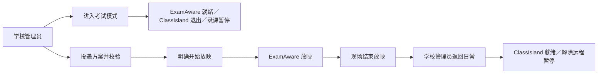

# 考试互联：用例与操作入口

[学校互联](README.md) · [使用指南](../GETTING-STARTED.md#关联教学软件)

学校配对授权现有考试模式与方案能力；服务端仍核查操作者、学校和设备权限。早期“不改自启动”“首次另开许可”“已有暂停拒绝新请求”方案已被替代。

## 如何操作

网页入口：**学校管理 → 大屏 → NPEP 设备互联 → 对应设备的远程考试模式／考试方案**。

先保存正确程序路径，配置并核实 ClassIsland 的管理员登录任务与课程接口，安装 ExamAware2 及桥接并完成本机配对，再连接学校。当前适配版本见[插件说明](../../plugins/npedutools-examaware-bridge/README.md)。

| 操作 | 实际行为 |
| --- | --- |
| 远程进入考试 | 正常保存当前录制，暂让通知，切换两款软件的登录自启动及运行状态，建立自动录课暂停，保留计划 |
| 再次请求 | 核对实际状态并补完缺失步骤；同一请求不重复执行，重启不重放旧任务 |
| 投递方案 | 先校验，再由管理员明确开始；不替换已有放映，不自动播放下一场 |
| 远程返回日常 | 打开 ClassIsland 自启动、关闭 ExamAware 自启动；正常退出后启动 ClassIsland 并核实接口，解除远程暂停；不打开原本关闭的录课总开关 |
| 桌面结束远程考试状态 | 只解除本地远程暂停，不等同于网页完整返回日常 |
| 部分完成或受阻 | 显示失败步骤与原因；处理后重新请求核查，不强杀软件。编辑器应先保存关闭，放映应正常结束 |

## 如何判断结果

“请求已收到”不等于切换完成；完成回执描述的是执行时状态，不保证软件此刻仍在运行。部分失败、恢复与迟到回执应结合请求编号、最后步骤及当前状态核对。

桌面“最近操作记录（历史回执）”显示中文结果、最后记录的步骤、原因和处理建议；请求编号与原始错误码可展开技术详情复制。最后步骤不是已完成步骤的清单。“当前远程录课暂停”单独显示；本机解除暂停后，历史原结果仍保留。展示范围与自动检查见[本轮任务卡](../iterations/EXAM-RESULT-PRESENTATION-20261007.md)。

自动检查与真实设备验收分别记录，见[测试与验收](../TESTING.md)。单设备人工主流程曾被用户确认通过，原结果和未覆盖项保存在[2026-09-28 用例记录](../archive/npep/EXAM-MODE-OVERVIEW-20260928.md)，不能据此推断所有班级大屏或生产环境均已验收。

进一步阅读：[优先切入与恢复](../archive/npep/EXAM-PRIORITY-20260928.md)、[返回日常](../archive/npep/REMOTE-DAILY-20260928.md)、[本机方案校验](../archive/npep/EXAMAWARE-PLAN-LOCAL.md)、[学校投递方案](../archive/npep/EXAMAWARE-PLAN-REMOTE.md)。这些记录中的范围、测试和部署结论按原日期阅读。
