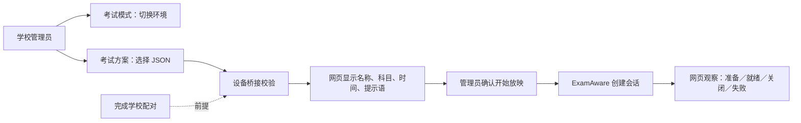

# 学校投递考试方案：一页流程

2026-09-28 更新：学校配对即授权现有考试模式与方案功能，不再另开首次许可。最新规则及验收见 [考试优先级一页说明](EXAM-PRIORITY-20260928.md)。

2026-09-27 · **本地实现，未推送、未部署**。沿用 ExamAware 1.5.2 与桥接 0.4.0，无需重做桥接配对。



**“切换考试模式”和“播放考试方案”是两个操作。** 前者沿用现有自启动与软件切换逻辑；后者不改自启动，不替换已有放映，也不提供远程结束放映。

## 现在怎么测试

1. 停止本地开发服务，在 **NPClassworksKV** 目录对已配置的本地开发库应用新增迁移：
   ```powershell
   node --env-file=deploy/.env.debug node_modules/prisma/build/index.js migrate deploy
   ```
   新增 `NpepExamPlanDevice`、`NpepExamPlan` 两张表。此命令使用你的 `.env.debug`；不要换成生产配置。
2. 在 **NPClassworks** 目录执行 `pnpm dev`；在 IDE 重新启动 NPEduTools Debug，确保旧 Host 已退出。
3. 大屏 **设置 → 学校互联**，确认已连接目标学校。有效配对自动授权现有考试功能；解绑后失效，换校后按新绑定授权。
4. 网页 **学校管理 → 大屏 → NPEP 设备互联**，先完成 **考试模式** 切换，再点同一设备的 **考试方案**。
5. 选择 ExamAware 编辑器导出的 UTF-8 JSON，点 **投递并校验**。应出现摘要，**此时不放映**。文件最多 24 KiB，最多 32 场。
6. 核对目标班级、设备及考试时间，点 **核对并开始放映 → 开始放映**。应同时确认真实窗口出现，以及网页“实际放映：放映已就绪”。“启动已受理”只代表创建了会话。
7. 在 ExamAware 放映页面自己的退出入口结束；网页应观察到“放映已结束”。已有放映时再次投递／启动应被阻止。

方案任务有效期 **5 分钟**；设备获得启动授权后只有 **30 秒**可发出启动。网页和设备每 **10 秒**轮询，观测超过 **45 秒**显示未知。等待结果时可手动刷新。通知仍走原有通知链路。

## 代码只追这五处

| 层 | 文件与职责 |
|---|---|
| 网页 | NPClassworks：`NpepExamPlanControl.vue`、`useNpepExamPlans.js`：选文件、摘要、确认框、实际状态、原请求重试 |
| HTTP／存储 | NPClassworksKV：`routes/v2/npep.js`、`npepExamPlanService.js`、`npepExamPlanRepository.js`：管理员/设备鉴权、串行事务、任务与结果 |
| 桌面联网 | NPEduTools：`NpepRuntime.Plans.cs`、`NpepPlanJournal.cs`：本机许可、轮询、先保存操作记录再执行、中断恢复 |
| 本机执行 | `ExamPlanTransport.cs`、`ExamAwareService.Plans.cs`：考试模式、录制空闲、可交互桌面、进程/配置检查、互斥、桥接命令 |
| 官方播放器 | 桥接 `src/plans.ts`：`player.prepare` → `startFromConfig(replaceExisting:false)` → `listSessions` |

联网新接口使用 **0.5**，现有 N3 保持 **0.4**。固定动作只有“校验”“启动”，不接收程序路径、shell、覆盖播放或批量设备执行参数。协议定义：[n4-exam-plan.schema.json](n4-exam-plan.schema.json)。

请求绑定学校设备、运行会话、许可代际和 ExamAware 配置版本。内容用原文件 SHA-256 核对；开始时同时核对桥接返回的准备 ID。获取启动授权时重新检查发起管理员的会话与学校权限。

网络失败只自动重传**已有结果**，不会重新启动播放器。Host 中断后换代，旧任务失效或显示未知；本地操作记录未写完时停止该通道并保留文件。关闭许可不能撤回已发出的放映，现场可正常退出。

考试原文件暂存在服务端待校验任务中，校验结果落库／取消／查询到过期后移除正文；摘要和历史保留。桌面操作记录保存摘要与结果，不保存原文件正文。网页展示最近 10 条任务，仅最新一条保留完整摘要显示，以限制响应大小。

## 验证范围

统一入口（Windows PowerShell **5.1** 可用）：

```powershell
./scripts/test-npep-exam-plans.ps1 -Browser -Database
```

- `-Browser`：真实 Vue 组件和 API 客户端，隔离的接口数据；验证显式确认、丢响应重试同一编号、实际会话状态。
- `-Database`：真实 .NET 轮询、Node HTTP 和新建的临时原生 PostgreSQL；不用 Docker，不连接你的开发库。播放器是测试替身。
- 常规套件覆盖文件限制、重复投递、许可撤销、旧会话、过期授权、已有放映、错误准备 ID／哈希、结果不明、重启不重放，以及 N1/N2/N3 回归。
- 已通过：299 项常规测试、21 项原生数据库链路测试、跨仓契约检查、隔离浏览器交互；新增主窗口控件在独立 WPF 检查项目编译通过。未生成或替换正常应用构建包。
- **2026-09-28 人工验收更新**：用户已确认完整远程流程走通，包含方案校验、真实放映、结束放映和远程返回日常。设备类型与生产部署未在本次确认中明确，不能据此标记班级大屏试点完成。最新汇总见[当前用例与验收](EXAM-MODE-OVERVIEW.md)。

后续范围：整理发布候选、审核后发布，再进行单台班级大屏试点。学校端方案管理、批量投递另立迭代；本次没有自动开始下一场或远程强制关窗。
