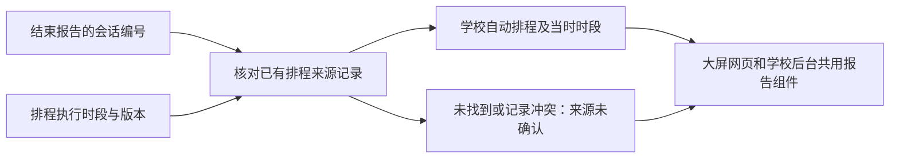

# N4 收尾：统计报告来源对照

2026-10-01 · 本地实现与自动验证完成，未推送／部署。用户尚未回来，N4.3d 的真实学校时间和麦克风联调继续待验收。

| 任务卡 | 本轮范围 |
| --- | --- |
| 目标 | 大屏网页及学校后台能把自动监测的结束报告与其执行时段对起来 |
| 包含 | 来源标签、学校时段、历史规则提示、迟到记录更新、两端一致显示 |
| 不含 | 新采集功能、原始音频、评分、汇总排名、导出、生产部署 |
| 验收 | 缺记录不猜测来源；更新规则或离线不改变已确认的历史来源；学校时间不转换时区 |

## 用户看到的变化

- 自动排程报告显示“学校自动排程”和执行时的学校日期／时段。
- 对应规则后来改变时，提示“按当时规则执行，当前规则已更新”。不会拿当前规则覆盖历史时段。
- 其他报告显示“来源未确认”。旧桌面、来源记录未到达或已清理都可能缺少关联，因此不能据此断言是手动监测。
- 来源记录比统计报告晚到时，刷新后标签更新；设备离线时，已收到的历史来源仍可查看。

入口：大屏 **课堂工具 → 噪声监测**；学校后台 **NPEP 设备互联 → 原生噪音报告**。

## 实现边界

复用 0.6 的 `reports` 与 0.7 的 `sessions`，仅按精确 `sessionId` 关联。相同时间段不构成来源证据；冲突的重复记录和无效学校日期不展示为已确认来源。学校时段按协议中的日历原文显示，不使用系统时区转换。报告自身的开始／结束时间及统计字段保留原有含义。

本轮没有修改 KV 接口、桌面采集逻辑、授权、数据保留期或数据库迁移。已有来源映射最多 200 条、保留 30 天；来源不完整时保持“未确认”。切换查看的设备时，清空之前设备的报告和排程状态。

| 源码 | 用途 |
| --- | --- |
| NPClassworks `src/utils/noiseReportSources.js` | 精确关联、冲突处理和学校日期显示 |
| `src/components/v2/NoiseReportList.vue` | 共用来源标签及历史时段 |
| `NativeNoisePanel.vue`／`admin/NpepNoiseReports.vue` | 传入各自设备的来源记录 |

## 验证

- PowerShell 5.1 统一排程入口 **430/430 通过**：桌面 168、KV 138、网页 124，包含本轮新增的 6 项来源回归。
- 隔离浏览器使用实际 Vue 组件与 API 客户端，验证大屏／管理员两处显示、迟到来源、未知来源、历史规则和离线保留；已检查实际截图。
- 既有原生监测浏览器流程通过：手动开始／停止、低输入、失联隐藏、恢复与报告。两种浏览器流程的麦克风请求均为 0。
- 本轮改动文件 ESLint 通过。没有重跑上轮 28 项数据库验收；本轮未改后端或数据库，不能把旧结果算作本轮重跑。

证据：桌面 `.artifacts/noise-schedule-tests/report-sources-unified.log`；网页 `.artifacts/noise-schedules/report-sources-browser.log`、`.artifacts/noise-schedules/report-sources.png` 及 `.artifacts/native-noise/report-sources-regression.log`。

下一项仍是 [N4.3d 的短时段人工联调](N4.3c-SCHEDULE-EXECUTION-20261001.md#暮至长虹回来后的下一步)。本轮不会将模拟输入记为真实 ClassIsland／麦克风验收。
