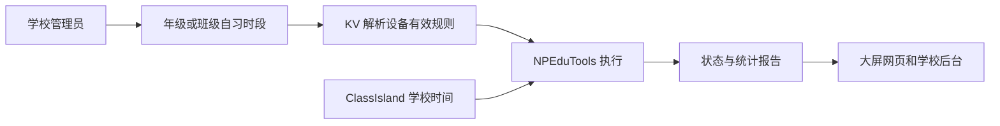

# N4.3：学校自习排程（一页方案）

2026-10-01 · **N4.3a–c 已实现，见 [N4.3c 当前任务卡](N4.3c-SCHEDULE-EXECUTION-20261001.md)；424 项统一测试、28 项隔离 HTTP／SQL 验收和浏览器流程通过。** N4.3b 人工联调按用户要求跳过，N4.3d 真实时钟／音频联调仍待做。班级大屏与生产验收未完成。

## 本轮目标与分工

用例：学校管理员为高二设置周一至周五 19:15–21:30 → KV 为每个已配对行政班解析有效排程 → NPEduTools 按学校时间自动监测 → 网页显示来源、下一时段和暂停原因 → 结束后复用现有统计报告。

| 部分 | 职责 |
| --- | --- |
| 学校后台 | 编辑、启停年级／行政班周期排程；预览影响的班级与设备，显示保存与设备应用状态 |
| KV | 校验管理员及范围，按实际绑定解析班级、年级与学期；保存版本、返回有效规则及接收执行状态 |
| NPEduTools | 缓存规则、读取学校时间、协调唯一采集会话；按窗口启停、记录本次跳过及统计 |
| NPClassworks 大屏 | 显示排程来源、下一窗口、时间源和暂停原因；保留手动启停，接管后不执行浏览器定时采集 |

首次只做按星期重复的固定时段，支持跨午夜。不加入固定日期特例、节假日表、原音频、摄像头或评分；旧网页本地设置不自动上传成学校政策。

## 首轮执行规则（拟采用）

| 问题 | 默认方案 |
| --- | --- |
| 范围与继承 | 按现有学期的年级／行政班 ID 配置。班级有“继承年级／使用班级时段／关闭自动监测”三种状态；班级配置覆盖年级，不叠加 |
| 生效与授权 | 学校绑定沿用现有授权，不新增现场许可开关。设备已配对且支持排程、麦克风已保存时执行；未配置时显示具体原因 |
| 周期与边界 | 星期按开始日计算，窗口为开始包含、结束不包含；开始等于结束非法。重叠及相邻窗口合并，合并后的连续时长最多三小时；每个目标最多 32 条规则 |
| 时间来源 | 使用 ClassIsland 学校日期与时刻。复用 `SchoolClockMonitor`／`SchoolClockTracker` 的新鲜度与连续性判断；不静默使用 Windows 时间替代 |
| 时区语义 | 首轮学校日历为北京时间。`SchoolNow` 的零偏移只是日历比较载体，不能当 UTC 再加八小时；策略租期、网络时间与会话时长分别使用服务端时间／单调计时 |
| 校时与跨日 | 正常午夜连续切换可执行；冻结、跳变、失联时停止排程所属会话并显示原因。恢复可靠时间后，只进入仍在进行的窗口，已过去时段不补录；异常日期跳变沿用待核实保护 |
| 手动会话 | 手动监测已运行时，排程显示“已有手动监测”，不重复采集、不接管其结束时间；手动会话仍沿用 N4.2 限时 |
| 手动停止自动会话 | 桌面／网页停止后记录“本次窗口已跳过”，不会在下一次轮询重新启动；本次跳过可持久保存，更新规则不偷偷清除。提供“恢复本次自动监测”入口；下个窗口正常执行 |
| 考试优先级 | 考试模式及切换过程中不启动排程，会暂停排程所属会话；返回日常后仅恢复仍有效且未被人工跳过的窗口。本轮不改变已有手动会话的考试行为 |
| 网络失联 | 当前 Host 已确认的规则可缓存使用最多 24 小时，期间学校时间仍须有效。到期停止排程会话；服务恢复后刷新规则、补传统计。Host 重启后先重新联网确认，再允许自动启动；不会仅从旧缓存重置租期 |
| 停用／撤销／换绑 | 收到停用或撤销立即停止自动会话、清除对应策略；换绑不继承旧学校规则或本次跳过记录。失联时无法立即感知服务端撤销，界面明确显示缓存与有效期 |
| 失败与重试 | 缺麦克风／驱动故障不每秒重新拉起；本次窗口记录失败，配置变更或用户明确重试才再尝试。网页显示原因，不能把已保存或已下载当作采集成功 |

## 实现切分与契约

1. **N4.3a 纯规则与契约**：窗口计算、继承、校时、手动跳过、单会话与考试仲裁。C# 和 JS 用同一组时间样例；不连接真实设备。
2. **N4.3b 服务端与管理页**：新建学校目标排程存储和审计，版本冲突检测；后台预览／保存。只写本地开发库并用临时原生 PostgreSQL 验证隔离。
3. **N4.3c 桌面与网页**：下发有效规则、缓存租期、按源持有会话、持久化跳过；状态和报告可追踪。
4. **N4.3d 联调**：模拟音频与时钟通过后，用户实际启动短测试时段，确认无需保持网页打开。

拟增加独立 **0.7 排程接口**，现有 0.6 手动控制及报告继续工作；首次下发不向旧客户端增加默认自动采集。能力名拟为 `noise.schedule`，需在三端统一契约后实现。

- 学校管理：`/api/v2/npep/schools/:schoolId/noise-schedules`；按现有学校管理员身份操作，写入携带请求 ID 和期望版本。
- 设备：`/api/v2/npep/device/noise-schedule`；复用设备身份与当前连接上下文，KV 从真实绑定解析有效规则，不接受设备自行指定学校／班级。
- 大屏只读：`/api/v2/npep/screen/noise-schedule`；沿用大屏凭据，展示本设备的有效规则及运行状态。
- 保存项：学校、目标类型与 ID、继承模式、星期及时段、启用状态和版本；设备应用版本、时间源状态、窗口／跳过／会话标识另列。
- 策略变更、学期／年级归属变更与绑定版本共同影响有效版本。只有实际执行状态上报后，后台才显示“已应用／监测中”。
- 报告仍使用现有会话与统计格式；排程来源、窗口、暂停原因由新增排程执行记录关联会话，不能向严格 0.6 报告结构偷偷塞字段。

## 验收与当前状态

必须覆盖：跨午夜、正常校时／倒拨／冻结、时段合并、班级覆盖与关闭、手动停止不重启、已有手动会话、考试进出、缓存到期、Host 重启、迟到策略、撤销／换绑、统计去重与旧客户端兼容。自动验证仍使用模拟输入、临时原生 PostgreSQL、隔离浏览器；不用 Docker 或生产环境调试。

| 实现依据 | 已核对的入口 |
| --- | --- |
| 学校时间 | `Contracts/SchoolClockFrame.cs`（新鲜度 3000 ms，日历载体）；`Core/SchoolClockTracker.cs`（连续性与日期待核实） |
| 桌面会话与上传 | `Host/NoiseService.cs`（唯一会话、三小时限时）；`Host/NoiseTransport.cs`；`Integrations.Npep/NpepRuntime.Noise.cs` |
| 网页接管与旧时段 | NPClassworks `noiseScheduleSettings.js`（浏览器本地）；`NoiseScheduleManager.vue`（仅 browser 提供方执行旧排程） |
| 管理与绑定 | NPClassworks `NpepDeviceManager.vue`；KV `services/npepService.js`、`prisma/schema.prisma`（School／AcademicTerm／Grade／Workspace） |
| 网络与统计 | KV `routes/v2/npep.js`、`npepNoiseService.js`；三端 0.6 噪音契约 |

**执行状态：N4.3a–c 的计算、管理、0.7 设备交换和自动采集执行器已完成，见 [最新任务卡](N4.3c-SCHEDULE-EXECUTION-20261001.md)。** 没有部署；模拟闭环通过，N4.3d 真实来源联调仍待做。
