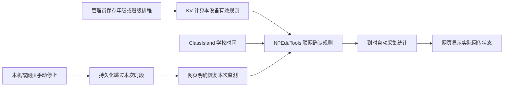

# N4.3c：排程下发与自动监测

2026-10-01 · 本地实现及自动验证完成。N4.3b 人工联调按用户要求跳过；没有因此记为通过。N4.3d 真实 ClassIsland／真实麦克风的排程联调、班级大屏和生产验收仍待做。没有推送、部署、修改既有开发数据库或开启真实麦克风。

| 任务卡 | 本轮范围 |
| --- | --- |
| 目标 | 保存学校排程后，由支持新版协议的 NPEduTools 按学校时间自动监测，并回传实际状态 |
| 包含 | 0.7 下发／回执、会话归属、持久化跳过、失败抑制、离线租期、网页状态及本次恢复 |
| 不含 | 日期例外／节假日、网页旧排程导入、原音频、噪音评分、摄像头、部署 |
| 验证 | 合成音频、模拟学校时钟、真实 HTTP 与临时原生 PostgreSQL、实际 Vue 的隔离浏览器流程 |

## 使用流程



管理员入口仍为 **学校管理 → 大屏账号 → 打开 NPEP 设备互联 → 学校自习噪音排程**。年级／班级规则沿用 N4.3a–b 的继承、覆盖、关闭、跨午夜与最多三小时语义。

大屏网页：**课堂工具 → 噪声监测 → 学校自动监测**。显示规则来源、学校日期时间、本次／下次时段、桌面是否应用当前版本，以及等待、考试暂停、手动跳过、采集失败等原因。手动停止后可点击“恢复本次自动监测”。异常日期跳变需要读者核对屏幕显示的学校日期，再明确恢复；不会自行确认或换用 Windows 时间。

学校管理员查看设备的**原生噪音报告**，可同时查看只读排程状态。保存、应用和执行是三个不同事实：保存成功仅说明数据库已写入；收到匹配有效版本的新鲜回传才显示“已应用”；自动会话的运行状态来自桌面回传。离线时保留历史展示并明确标为陈旧，不能点击恢复。

旧网页本地定时设置仍停用，不自动导入学校排程。旧 0.6 桌面不支持 `noise.schedule`，不会因为后台保存规则而启动采集；页面提示更新。0.7 暂不可用时，0.6 手动监测和统计报告保持独立，不退回浏览器重复使用麦克风。

## 执行约束

- Host 每 500 ms 检查学校时间和当前窗口；每约 3 秒交换规则及执行状态。窗口采用 `[开始,结束)`，实际设备打开和释放仍需要时间。
- 只使用 ClassIsland 桥接样本，经已有 `SchoolClockTracker` 检查连续推进、年龄、冻结、跳变及日期变化。无可靠学校时间时自动会话停止／等待。学校日历在协议中没有时区后缀，不作 UTC 转本地的八小时转换。
- 自动会话以自己的会话 ID 控制。手动会话不被排程接管或停止。考试模式及切换过程阻止／停止排程会话，回到日常后可恢复当前仍有效且未跳过的窗口，不补录已过去的时段。
- 网页 STOP 与本机 STOP 共用 `NoiseService` 的停止路径，在取消采集之前落盘跳过记录。与记录重叠的规则修改不能绕过跳过。采集失败以窗口和麦克风指纹抑制反复重启；更换设备或明确恢复后才重试。
- 规则在当前 Host 中获得单调时间租期，最长 24 小时。服务断线可继续使用未到期的已确认规则，但学校时钟仍必须可靠。Host 重启不恢复租期，需联网重新确认。暂停互联也作废旧租期；解绑、撤销和绑定改变停止排程并隔离旧数据。
- `noise-schedule-state.json` 只存作用域、跳过／失败记录和恢复命令回执；最多 128 个窗口记录、32 个恢复回执，麦克风键使用定长摘要。规则及在线租期不写入该文件。文件无法读写时停止自动执行并保留原文件；统计发件箱不可用也阻止自动采集。
- 配对就是学校排程授权，没有新增一次授权开关。依然需要本机保存麦克风、后台运行及更新后的桥接时间来源。

## 跨端契约

接口前缀 `/api/v2/npep`，排程使用 `X-NPEP-Version: 0.7`，初始配对仍为 0.1，手动监测／统计报告仍为 0.6。

| 接口 | 身份及用途 |
| --- | --- |
| `POST /device/noise-schedule` | 当前设备凭据，携带当前 run／session／statusEpoch、递增序号和 `noise.schedule` 状态；返回有效规则、确认租期和待恢复命令 |
| `GET /screen/noise-schedule` | 当前大屏凭据，只读取其对应设备的排程状态 |
| `POST /screen/noise-schedule/resume` | 当前大屏凭据，严格绑定当前规则版本及本次窗口，幂等请求；HTTP 受理不等于恢复成功 |
| `GET /schools/:schoolId/devices/:id/noise-schedule` | 当前学校 OWNER／ADMIN，只读设备排程与回执 |

有效版本是指纹，包括实际设备身份／绑定修订、学期、行政班、年级归属、年级／班级政策修订和合成规则。班级移动到另一年级，即使政策行修订号相同，也会产生不同版本。学校锁与已有设备／会话验证继续使用；重复序号不会更新观测时间或续租，重复回复 `confirmed:false`。

`NpepNoiseScheduleDevice` 保留每设备有界执行状态、恢复命令及自动会话来源映射。通过 `sessionId` 将 0.6 统计报告关联到 0.7 排程窗口和版本，**没有向严格的 0.6 报告添加字段**。来源映射最多 200 条、保留 30 天，离线设备也由已有维护任务清理。恢复演练将新状态表一并纳入，避免新外键阻止恢复设备表。

## 源码入口

| 模块 | 关键文件 |
| --- | --- |
| 桌面执行／持久化 | `Host/NoiseScheduleService.cs`；`NoiseService.cs` 的用户停止与排程启动／停止入口 |
| 网络交换／0.7 校验 | `Integrations.Npep/NpepRuntime.NoiseSchedules.cs`、`NpepApi.NoiseSchedules.cs`、`NpepNoiseScheduleProtocol.cs` |
| 服务端有效政策／状态／恢复 | `NPClassworksKV/services/npepNoiseScheduleRuntime.js`、`domain/npep/noiseScheduleWire.js` |
| 网页状态／本次恢复 | `NPClassworks/src/components/v2/NoiseScheduleStatus.vue`、`NativeNoisePanel.vue`、`utils/nativeNoiseController.js` |
| Schema／双端反例 | 两端同 SHA-256 的 `noise-schedule-wire.schema.json` 与 `noise-schedule-wire-cases.json` |

## 本轮验证

- Windows PowerShell 5.1 统一入口 **424/424 通过**：桌面 168、后端 138、网页 118；含 15 个双端 0.7 解析样例、自动会话归属、暂停／重启、跳过落盘、失败抑制、冻结时钟、租期与损坏存储等回归。
- 临时原生 PostgreSQL 的完整 HTTP／SQL 验收 **28/28 通过**：新增有效版本／作用域／会话检查，以及真正 .NET Host 执行器通过 0.7 下发、合成音频采样、0.6 STOP／报告、跳过、幂等恢复和来源映射的闭环。原考试／配对及数据库恢复验收也通过。临时实例已移除。
- Playwright 使用真实 Vue 组件与 API 客户端，通过管理编辑／预览／保存、恢复按钮、规则应用与执行状态区分、学校时间显示及离线历史；网络回复为隔离样例。浏览器采集请求为 0。
- 既有网页原生接管、手动控制和提供商生命周期相关回归 **10/10 通过**；新改网页文件 ESLint 和 Prisma Schema 校验通过。

统一入口在 NPEduTools 根目录，可选数据库／浏览器检查只使用隔离环境：

```powershell
./scripts/test-npep-noise-schedules.ps1 -Database -Browser
```

证据日志分别位于桌面 `.artifacts/noise-schedule-tests/unified.log`、KV `.artifacts/noise-schedules/database.log`、网页 `.artifacts/noise-schedules/browser.log`。这些测试不证明真实 ClassIsland 连接、真实音频设备、班级大屏长期运行或生产部署。

## 暮至长虹回来后的下一步

进入 **N4.3d：本地短时段人工联调**。先在 KV 根目录为本地调试库应用两项排程迁移，保持既有配对与测试学校：

```powershell
node --env-file=deploy/.env.debug node_modules/prisma/build/index.js migrate deploy
```

随后正常运行网页／后端统一开发入口，并在 Visual Studio Debug 启动 NPEduTools。以 ClassIsland 当前日期时间设置约两分钟的测试时段，核对“已应用 → 到时自动开始 → 手动停止仍跳过 → 明确恢复 → 到时结束”。关闭网页后桌面应继续按时执行；切入考试只暂停自动会话。不要把模拟闭环替代这轮真实来源验收。
