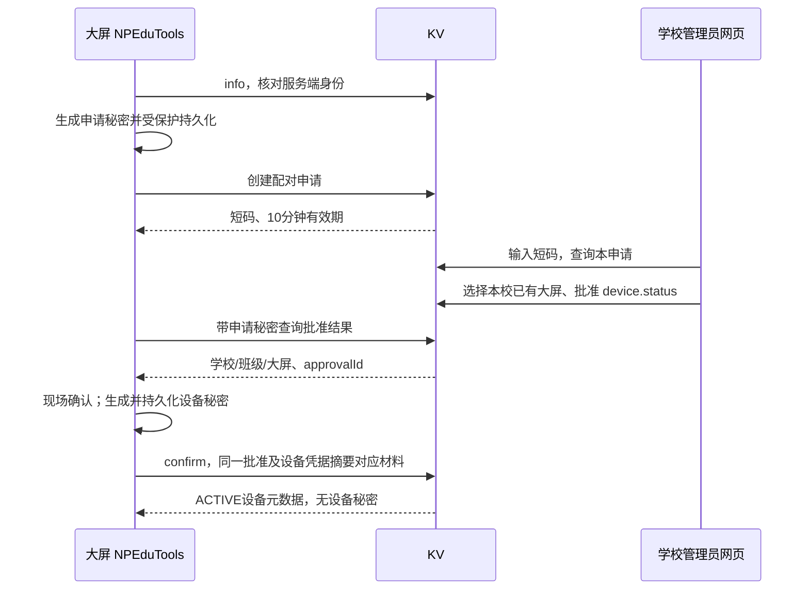

# NPEP N1 联合契约 v0.1

日期：2026-09-20。状态：双端交叉审阅通过，作为 N1 隔离环境实现基线。本文是 N1 实现依据；此前两份研究草案中的路径、字段若与本文冲突，以本文为准。尚无在线 API、数据库迁移或产品实现，例子不代表已完成安全验证。

## 1. 本轮边界与固定决策

N1 只提供配对、撤销及只读设备状态；唯一可授予的能力为 `device.status`。未来的 `notification.deliver`、`classroom.mode.set` 仅预留名称，N1 请求中出现即拒绝，不授权、不实现通知或命令执行接口。

| 项目 | 决策 |
| --- | --- |
| 学校管理者 | 当前学校 OWNER / ADMIN，必须具有有效可撤销账号会话；不接受旧令牌兼容路径 |
| 设备归属 | 必须关联本校当前启用学期内有效行政班的既有 screenBindingId |
| 配对数量 | 一个 screenBinding 同时至多一个 ACTIVE NPEP 安装；更换前显式撤销旧安装，不静默顶替 |
| Windows 会话 | 一期一个已授权交互用户内运行的 Host；同一用户单实例。本地多用户争用不自动接管 |
| 网络 | 设备主动发起 HTTPS；生产验证证书，不开放大屏入站端口，不依赖浏览器常驻 |
| 试点 | 只读状态，不自动提权、探测时启动外部软件、切换模式或启用录制 |
| 版本 | 请求头 `X-NPEP-Version: 0.1`，响应体 protocolVersion 为 `0.1`；不支持时 426 |

设备身份是软件安装的凭据身份，不证明物理机器不可克隆。安装 ID、设备名称、IP 和浏览器 fingerprint 都不是授权证明。设备秘密泄露须撤销；DPAPI 不保证抵御同用户恶意进程或本机管理员。

## 2. 身份、代际与数据格式

- `serverInstanceId`：服务器安装的稳定 UUID；`deploymentEpoch`：位于数据库备份之外的部署配置 UUID，恢复旧库/克隆实例必须重新生成并使旧 NPEP 授权失效。两者都需现场确认并记在本地配对记录中。
- `installationId`：NPEduTools 本地生成的 UUIDv4，绑定服务地址和 Windows 用户，重装或换服务不复用。`deviceId`：服务端生成的 UUIDv4，不与浏览器 screenBindingId 混同。
- 学校、行政班、screenBindingId 沿用 KV 的不透明字符串 ID（1–191 字符），不要假设它们是 UUID。
- `bindingRevision`：在既有 screen binding 上新增独立 NPEP 绑定代际，从1开始，每次停用、归属变化、班级/学期失效均递增并同步撤销设备。即使停用后启用、改班后改回也不恢复旧值，防止 ABA。设备保存批准时的代际快照。`credentialGeneration` 为独立凭据代际，从1开始。N1 不开放设备改绑/原位凭据轮换；变化均撤销并重新配对，新 deviceId。两者均为安全整数，不能用原有浏览器 credentialVersion 代替。
- `requestId`、`pairingId`、`approvalId`、`credentialId`、`runId`、`sessionId` 为 UUID。`statusEpoch` 从 0 开始（0 表示无运行会话），`sequence` 从 1 开始；最大均为 2^53-1，耗尽时停止并重新配对，不回绕。
- UTC 时间固定为 `YYYY-MM-DDTHH:mm:ss.sssZ`；不得用 ClassIsland 手调学校时间判定授权到期。学校时间继续负责课表与录制。本地状态新鲜度优先用服务端接收时间和设备单调采样年龄。
- JSON UTF-8；N1 请求体上限 16 KiB。拒绝额外字段、重复 JSON 属性、错误类型、不支持的枚举。字符串长度以 Unicode 标量值计；ID 限 ASCII，显示文本去控制字符，不渲染 HTML。

所有响应为 `{protocolVersion, requestId, serverTime, data}` 或 `{protocolVersion, requestId, serverTime, error:{code,message,retryAfterSeconds}}`。无请求体的 GET 用 `X-Request-Id`；POST requestId 在 body，二者同时出现须一致。返回 `Cache-Control: no-store`；秘密、认证头、配对短码不进访问日志、遥测、URL 或错误正文。示例文件用固定假数据，绝不能用作真实凭据。

设备 API 不自动跟随重定向、不携带网页 Cookie；服务地址须是用户确认的 HTTPS origin（禁止 userinfo、query、fragment 和任意路径前缀），API 固定挂载 /api/v2/npep。跨域管理网页沿用现有明确允许的 origin 配置，设备控制凭据绝不注入网页脚本。服务端展示给设备的学校/班级名字也按纯文本处理。secret 解码必须得到32字节并能无填充base64url原样重编码，不能只用长度检查代替解码。

## 3. 配对生命周期

### 创建

设备生成 32 个 CSPRNG 字节的 `pairingSecret`，无填充 base64url 编码成 43 字符，先使用 Windows CurrentUser DPAPI 存储后发送。安装 ID 和创建 requestId 同时落盘，原请求重试不能换新 secret。

`POST /api/v2/npep/pairings`，无需账号认证，body 为 requestId、serverInstanceId、deploymentEpoch、installationId、deviceName（1–64）、appVersion（1–64）、pairingSecret、requestedCapabilities（严格 `["device.status"]`）。服务端校验配置的实例身份，仅存 secret 的 SHA-256 原始字节摘要，常量时间验证。

201 返回 pairingId、userCode、state=PENDING、expiresAt、pollAfterSeconds=5。userCode 为随机 8 位 `ABCDEFGHJKLMNPQRSTUVWXYZ23456789` 字符（展示可加一个横线，提交时去横线），在未到期申请内唯一。短码只能用于管理员匹配申请，不能充当设备 secret 或 confirm 授权。

同 installationId + requestId、同规范化请求返回同一申请；不同内容 409 IDEMPOTENCY_CONFLICT。创建回执保留至到期后 24 小时，过期重试不创建新申请；届时用户明确重试应生成新 requestId。有效期固定 10 分钟，管理员批准与重试均不延长。

### 管理员批准与现场确认

管理端先 `POST /schools/{schoolId}/pairings/resolve` 提交 userCode（不放 URL），只有该校 OWNER/ADMIN 可查候选设备名、版本和期限；不返回 pairingSecret。未绑定申请可被其他学校猜测匹配，因此物理现场核对与最后一次设备确认不可省略，不声称仅凭短码即可证明归属。

管理员通过 `POST /schools/{schoolId}/pairings/{pairingId}/approve` 提交 requestId、screenBindingId、capabilities。事务内重新检查会话、角色、班级/学期、绑定及唯一 ACTIVE 安装约束，记录审批人、approvalId、绑定快照与审计事件。PENDING → APPROVED。不同管理员重复批准不改写结果，返回 PAIRING_STATE_CONFLICT；同请求同内容可幂等返回。APPROVED 不能重新编辑，选错需取消重来。

设备通过 `GET /pairings/{pairingId}`，头 `Authorization: Bearer npepp1.<pairingId>.<pairingSecret>` 查询。APPROVED 返回 approvalId、schoolId/name、administrativeClassId/name、screenBindingId/name、capabilities、expiresAt；N1 显式显示“仅查看状态，不能控制软件”。现场明确确认后才发送 confirm。拒绝时 `POST /pairings/{pairingId}/cancel`；管理端另有同校批准者可用的 cancel 路由。取消/过期为终态，不能复活。

### 解决 confirm 响应丢失

设备在确认前自行生成新的 32 字节 CSPRNG `deviceSecret` 和 UUID credentialId，以 DPAPI 原子持久化为候选凭据；不能先请求后才保存。该 secret 与 pairingSecret 不同。

credentialId 全局唯一。若已被其他申请或凭据占用，返回409 CREDENTIAL_ID_CONFLICT，不 upsert、不覆盖现有秘密；只有本次 confirm 幂等收据可以命中自己的同一 credentialId。

`POST /pairings/{pairingId}/confirm` 用配对 Authorization，body 为 requestId、serverInstanceId、deploymentEpoch、approvalId、credentialId、deviceSecret。服务端按申请锁及固定锁顺序核验到期、批准快照、批准人的当前有效会话/OWNER或ADMIN资格、绑定仍有效和未被占用，然后只存设备 secret 摘要，创建 ACTIVE 设备。响应只含 deviceId、归属、代际、capabilities、credentialExpiresAt、statusEpoch=0；不下发新的 secret。

confirm 同 requestId + 相同规范化 body（秘密用摘要比对）幂等返回同一个公开收据，不再次生成身份、不延长期限、不重置状态会话/序号/lastSeenAt；不同内容冲突。幂等命中仍核验设备 ACTIVE、有效期、当前部署与绑定代际，撤销后不返回可用激活收据。已激活但响应丢失时，设备可用已落盘的候选凭据请求 `/device/me` 恢复元数据，即使配对申请已经到期。me 返回结果必须匹配原服务身份、installationId 和已确认的绑定；不匹配则停止。me 返回401可能是 confirm 仍在途，不能马上生成新 secret；原候选秘密和确认参数继续保留，按同参数有限重试/查询，直到原配对明确到期或取消且 me 仍无有效身份才结束。确认资格以事务提交前重新核验的期限为准，不能把排队收到请求的时刻当作无限有效授权。

配对授权仅存活至原期限；ACTIVATED 收据可保留 24 小时，但过期配对 bearer 不再访问接口，使用设备 bearer 恢复。设备本地持久化 ACTIVE 元数据后删除本地配对 secret。服务端从不保存原始 secret；激活后仍保留配对摘要至原 expiresAt，仅允许查询 ACTIVATED 状态或同次 confirm 收据重放，不可取消已激活身份、重新批准或签发新凭据。到期删除配对摘要。激活前任何失败都不允许开始状态会话。服务端绝不为丢失的确认响应重新发一个不同 secret。

## 4. 设备凭据与撤销

设备 Authorization 为 `Bearer npep1.<credentialId>.<deviceSecret>`。类型前缀、UUID和43位base64url编码严格检查；配对凭据、设备凭据、管理员账号令牌不可跨用途使用。body 的 deviceId/schoolId 不能替代认证后的身份。

N1 设备凭据有效期为激活后 90 天，固定、不滑动续期。到期前 7 天显示重新配对提示；先撤销旧设备再重新配对。到期、撤销、权限变化不静默扩大能力，也不引入未经评审的刷新令牌。学校可随时撤销，设备可主动解绑。

撤销路由：管理员 `POST /schools/{schoolId}/devices/{deviceId}/revoke`；设备 `POST /device/revoke`。带 requestId 与 expectedBindingRevision。身份有效时事务将 ACTIVE → REVOKED，关闭状态会话并保留审计；并发撤销同对象返回已撤销。为保证鉴权严格，设备自撤销若丢失响应，后续收到 401 即清除本地凭据并显示“已在本机解绑，服务端确认不可用”，不能无限重试或声称服务端已删除。

现有 screen binding 被删除、禁用、重新归属学校/班级、班级或学期停用时，NPEP 后续认证失效；重新启用不得复活旧授权。实施需修改这些生命周期事务，与 NPEP 身份同步撤销。单独重置网页 PIN/token 不自动撤销 NPEP；管理界面须明确“重置网页凭据”和“撤销本地设备”区别。不沿用浏览器 credentialVersion 作为 NPEP 代际。

设备心跳事务与撤销/绑定生命周期更新共用锁和一致锁顺序。若心跳先提交，可以接受最后一个旧状态；若撤销先提交，心跳必须失败，不能写回 ACTIVE。管理员查看设备时始终由当前授权状态决定显示，历史状态不能覆盖已撤销标志。

批准到激活之间需要重新核验批准人的持久化账号会话、tokenVersion、localDisabled 与学校角色。激活后普通退出账号不撤销学校已登记的设备；设备权限由显式撤销、绑定生命周期、部署 epoch 和凭据期限控制。后续 N3 命令须重新按发起人授权，不继承 N1 配对批准人的长期管理资格。

本地停用互联立刻停止网络任务；有网时尝试撤销，无网则本机删除凭据并提醒管理员在线撤销旧登记。不要自动认为云端已撤销，也不要保留不可见的后台重连。

部署恢复约束：deploymentEpoch 不能只放在可恢复 PostgreSQL 中。恢复/克隆旧库前先隔离 NPEP 入口并轮换外部 epoch；恢复后失效全部旧配对/凭据/会话，再同步数据库 epoch 后开放。普通同库重启不换 epoch。当前部署脚本尚未实现此机制，这是 N1 上线验收门槛；不得宣称现在已能防止备份恢复复活旧凭据。客户端见 epoch 改变必须停止并现场重新确认。

## 5. 只读状态会话与防旧状态覆盖

`GET /device/me` 返回自身身份、能力、当前 statusEpoch；不报告设备在线、不延长凭据。Host 本地正常单实例；每次新进程生成 runId，旧进程不得自动争抢。

`POST /device/sessions` body：requestId、serverInstanceId、deploymentEpoch、runId、expectedStatusEpoch。校验设备后，原子比较 expectedStatusEpoch 与当前值，成功分配新 sessionId、statusEpoch+1 并替换旧会话；清除当前状态为 UNKNOWN、当前 lastSeenAt=null，直到新样本到达。可保留单独历史观测，但不得据此显示新会话在线。当前相同 requestId/runId/body 重试返回同一会话；已经被替代的旧会话重试返回 SESSION_SUPERSEDED，不能重新夺回。新进程可以首次读取 me 后开会话，运行中的进程遇 superseded 必须停用上报并提示实例冲突，不能循环 me → 抢占。

`POST /device/status` body：requestId、serverInstanceId、deploymentEpoch、sessionId、statusEpoch、sequence、sampleAgeMs、status。身份由 Authorization 导出。sampleAgeMs 是单调计时测得的采样到发出请求的年龄（0–5000 ms），不接受旧心跳离线排队；每轮取新样本。

规则：设备从1开始生成序号，允许跳号；服务端首次可接收任意正序号，之后必须大于已接收序号。相同 sequence、相同 requestId 和相同请求内容返回 DUPLICATE，不更新状态与 lastSeenAt；同序号不同内容/请求 ID 返回 SEQUENCE_CONFLICT；较小序号返回 STALE_SEQUENCE。旧 session/epoch 返回 SESSION_SUPERSEDED。status 是通用重试策略的例外：客户端丢失响应后不重传旧心跳，生成更大序号、新requestId和新采样；代理重复提交仍用 DUPLICATE 规则处理。不得修改样本后复用同序号。服务端不相信客户端时间证明真实采样时间。

status 固定字段：

| 字段 | 值与含义 |
| --- | --- |
| appVersion | 1–64 字符，版本展示信息，不当作授权凭证 |
| mode | DAILY / EXAM / UNCONFIGURED / UNKNOWN；映射本地 Daily/Exam/Unconfigured，其余 UNKNOWN |
| modePhase | IDLE / CHECKING / SWITCHING / RUNNING / INCOMPLETE / UNAVAILABLE / UNKNOWN |
| modeRevision | 非负安全整数或 null；只有拿到有效本地模式快照才传整数 |
| automaticRecording | ENABLED / DISABLED / UNKNOWN；这是用户启用状态，不代表当前正在录制 |
| recording | IDLE / RECORDING / PAUSED / FINALIZING / UNKNOWN；映射须根据实际录制器状态，不确定用 UNKNOWN |
| classIsland、examAware | 各为 `{connection: READY / DISCONNECTED / UNKNOWN, bridgeVersion: string或null}`，只读本地缓存，不启动软件以获得 READY |

服务端以接收到新鲜样本的时间写 lastSeenAt，结果含 disposition=APPLIED/DUPLICATE、acceptedSequence、receivedAt、nextPollSeconds=20；DUPLICATE 返回原样本 receivedAt，不更新接收时间。在线窗口 60 秒内 ONLINE，超过为 OFFLINE；没有样本为 UNKNOWN。页面同时展示观测时间；OFFLINE 不代表程序必然已退出，旧 EXAM 只能显示为上次观测。服务端不得把“已启用自动录制”解释为现在正在采集。

状态样本不包含截图、音频、视频、学生姓名、文件路径、命令行、完整课表、任意异常堆栈。N1状态仅证明设备报告了这些值，不承诺对被攻陷客户端的远程证明。

## 6. 路由清单

以下均以 `/api/v2/npep` 为前缀；路径与枚举区分大小写。所有 POST 有 requestId。

| 方法与路径 | 认证 | 成功语义 |
| --- | --- | --- |
| GET /info | 无 | 200：protocolVersion、serverInstanceId、deploymentEpoch、supportedCapabilities=[device.status] |
| POST /pairings | 无，限频 | 201 新申请；200 幂等申请 |
| GET /pairings/{id} | 配对 bearer | 200 PENDING/APPROVED；状态与批准快照 |
| POST /pairings/{id}/confirm | 配对 bearer | 201 新激活；200 同次激活收据 |
| POST /pairings/{id}/cancel | 配对 bearer | 200 CANCELLED；ACTIVATED 时拒绝并要求设备撤销 |
| POST /schools/{schoolId}/pairings/resolve | 本校管理员会话 | 200 短码匹配的未过期候选，不含秘密 |
| POST /schools/{schoolId}/pairings/{id}/approve | 本校管理员会话 | 200 APPROVED |
| POST /schools/{schoolId}/pairings/{id}/cancel | 本校批准者的有效管理会话 | 200 CANCELLED；不允许其他学校取消 |
| GET /schools/{schoolId}/devices | 本校管理员会话 | 200 items、nextCursor；limit 默认20、最大100，cursor不改变权限过滤 |
| POST /schools/{schoolId}/devices/{id}/revoke | 本校管理员会话 | 200 REVOKED |
| GET /device/me | 设备 bearer | 200 当前自身注册和代际 |
| POST /device/sessions | 设备 bearer | 201 新会话；200 同会话重试 |
| POST /device/status | 设备 bearer | 200 APPLIED 或 DUPLICATE，仅状态写入 |
| POST /device/revoke | 设备 bearer | 200 REVOKED |

N1 没有 `/commands`、`/notices`、`/claim`；不要因为老草案提及这些路由就提前实现。GET info 不接受或回显个人数据；所有写接口不得通过 GET 执行。

## 7. 错误、超时与限流

固定错误 code，message 仅用于可读提示，客户端不得靠中文字符串分支。失败响应不得带 secret 或跨校设备资料。

| HTTP | code | 客户端动作 |
| --- | --- | --- |
| 400 | INVALID_REQUEST | 修正结构；不自动重发同无效内容 |
| 401 | AUTH_INVALID / CREDENTIAL_EXPIRED | 停止设备上报，提示重新配对；不存在/错误凭据不泄露设备是否存在 |
| 403 | SCHOOL_ADMIN_REQUIRED / CAPABILITY_DENIED / APPROVER_NO_LONGER_AUTHORIZED | 不降级为旧令牌或网页大屏 token |
| 404 | NOT_FOUND | 对管理员隐藏跨校对象；不泄露其存在 |
| 409 | INSTANCE_MISMATCH / PAIRING_STATE_CONFLICT / IDEMPOTENCY_CONFLICT / CREDENTIAL_ID_CONFLICT / BINDING_OCCUPIED / BINDING_CHANGED / REVISION_CONFLICT | 停止当前操作，重新查看状态，需重新配对的错误不能自动确认 |
| 409 | SESSION_SUPERSEDED / SEQUENCE_CONFLICT / STALE_SEQUENCE | 不覆盖已有样本；会话冲突停止旧运行实例 |
| 410 | PAIRING_EXPIRED | 丢弃申请并由用户重新发起；可用候选设备 bearer 尝试 me 恢复已完成的激活 |
| 413 | PAYLOAD_TOO_LARGE | 修正体积 |
| 426 | PROTOCOL_UNSUPPORTED | 明示升级或不兼容，停止业务请求 |
| 429 | RATE_LIMITED | 按 Retry-After 和 retryAfterSeconds 等待，不更换身份规避限流 |
| 503 | TEMPORARILY_UNAVAILABLE | 有界指数退避；不标记设备已解绑 |

已正确证明秘密但被撤销的凭据也可统一返回 AUTH_INVALID，避免依赖错误码区分删除/撤销。API 的非 JSON/网关错误视为网络失败，不从页面内容执行指令。设备 HTTP 超时 10 秒；仅同 requestId 同内容安全重试，退避 5/10/20/40/60 秒并增加 0–20% 抖动，稳定成功后重置。每轮最多一个请求，不产生无限并发队列。

配对查询至少间隔5秒，申请固定10分钟；创建按 IP 默认5次/分钟、30次/小时，实例同时最多10000个有效申请。短码匹配按已认证账号10次/分钟、100次/小时，另设服务端总额上限；不因外人猜某一码而锁死该申请。状态每凭据最多12次/分钟，普通建议20秒；管理写入每会话30次/分钟。限流应由部署统一多进程存储实现，反代只信任明确配置的代理来源，不能信任任意 X-Forwarded-For。大规模学校共享 NAT 场景需调整创建额度，但不取消短码防猜测约束。

## 8. 生命周期、事务与验收要求

服务端需新增配对、设备、凭据摘要、状态会话、幂等收据与审计记录。关键授权变更与审计同事务，不能仅复用响应后异步审计中间件。至少有 ACTIVE screenBinding 唯一约束、credentialId唯一、申请幂等键、会话 fencing CAS；既有学校/账号/绑定生命周期必须参与一致锁定。仅写本接口里的二次查询不足以证明并发撤销安全。

保留建议：配对收据到期后24小时回收；当前及被替代会话的幂等信息保留至该设备凭据过期（最多90天），配额与会话频率限流同时生效；审计默认90天可按学校策略调整，不包含秘密。设备页面仅保存最新状态，N1不建立无限心跳历史。任何秘密摘要、待配对和设备授权记录均不得通过学校业务迁移包复制成另一实例的有效身份。

实施前统一测试用例：

1. 现场批准前不激活；错误短码/错误配对 secret/学生或教师/跨校审批均拒绝。
2. confirm 响应丢失后用相同候选凭据恢复；同键不同secret失败；申请到期但已经激活可 me 恢复。
3. 两个申请竞争同一 screenBinding 只允许一个 ACTIVE；管理员降权/注销、改绑、学期关闭与 confirm 并发不绕过授权。
4. 撤销与心跳竞态不会复活身份；停用后重启/恢复旧库不能重新使用旧 secret；deploymentEpoch 恢复门禁实际有效。
5. 状态重复、乱序、旧会话、旧进程延迟重试不覆盖新状态；断网不重放历史心跳；失联不显示实时 EXAM。
6. 未启用 NPEP 时无网络后台；网页关闭设备仍可上报；切换 Windows 用户无法读取原用户 DPAPI 凭据。
7. 设备只声明 device.status；远程请求 notification/mode/任意执行、额外字段、错误协议和超大消息被拒绝；仅读状态不触发 UAC、录制或外部软件启动。
8. 日志/管理页面/学校迁移导出/错误响应不暴露 secret；TLS错误不降级；实际多进程限流、代理来源与请求体/重复键约束经过测试。

`n1-wire.schema.json` 与 `n1-examples.json` 用于双方交换请求/响应形状，公开绑定显示字段采用 schoolId/schoolName、administrativeClassId/administrativeClassName、screenBindingId/screenBindingName 的扁平结构；`Test-N1Examples.ps1`（PowerShell 7.5+）做结构正反例检查，不证明服务器授权、事务、DPAPI、TLS或上述场景已经实现。业务语义以本文为准，测试矩阵在实现时转化为真正双端集成测试。

## 9. 参考与协作

- [总体规划](../NPEP-FOUNDATION-PLAN.md)；[服务端发现](../../../NPClassworksKV/docs/NPEP-SERVER-DISCOVERY.md)；[服务端 N1 审阅](../../../NPClassworksKV/docs/NPEP-N1-CONTRACT-REVIEW.md)。
- [RFC 8628](https://www.rfc-editor.org/rfc/rfc8628.html) 的设备码交互和防猜测原则用于设计参考。本文是独立 NPEP 注册协议，增加现场二次确认与客户端预生成凭据，不宣称兼容 OAuth Device Grant。
- [Microsoft ProtectedData](https://learn.microsoft.com/en-us/dotnet/api/system.security.cryptography.protecteddata?view=windowsdesktop-10.0) 用于核对 Windows DPAPI 能力；本项目的秘密保存、原子写入和恢复仍需实现与测试。

下一步在双方完成此契约审阅后，先以隔离测试实现服务端 N1 与设备端协议适配器，再做配对界面。N2/N3 另行扩展版本和授权，不隐式继承本次状态读取许可。
