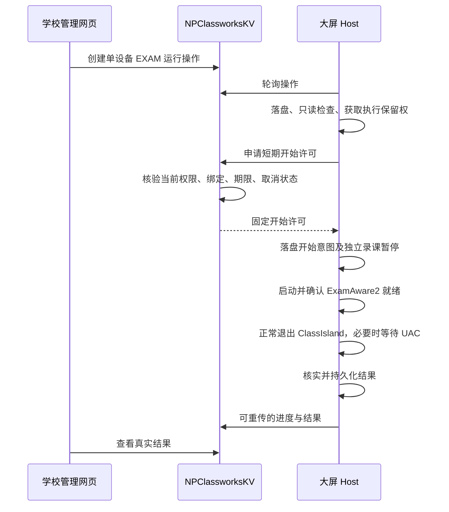

# NPEP N3：单设备远程切入考试运行环境

最新实现状态：见 [2026-09-26 本机适配与协调接入](NPEP-N3-LOCAL-ADAPTER-20260926.md)。目前只开放本机只读检查，未开放远程执行，本轮代码尚待 IDE 构建与测试。

版本：1.0；日期：2026-09-25。**产品范围定稿，首批执行内核已实现，整体尚未完成或部署。** 进展与验证边界见 [首批实现记录](NPEP-N3-KERNEL-IMPLEMENTATION-20260925.md)。两项已获用户明确确认：只切换当前运行环境、不修改 Windows 自启动；大屏首次开启一次远程控制，以后不逐次弹产品确认框。Windows UAC 仍按需由现场处理。

本文替代此前混入自启动设置的 N3 草案。接口是供双端实现的基线，逐字段 Schema、数据库迁移及正反例仍须在 N3.0 审阅后冻结，不能当作已上线 API。

依据：[最初计划](../NPEP-FOUNDATION-PLAN.md)、[本地课堂模式](../CLASSROOM-MODES.md)、[即时切换](../CLASSROOM-RUNTIME-SWITCH.md)、[异常验收](../CLASSROOM-EXCEPTION-ACCEPTANCE.md)、[N1 契约](NPEP-N1-CONTRACT.md)、[N2 投递](NPEP-N2-DELIVERY-REPORT.md)及本轮实际读取的 Host 源码。

工作区路径已由用户更正为 `D:/CodeProjects/NPEduTools`；本文已从 C 盘工作副本同步回该仓库。协作仓库为 `D:/CodeProjects/NPClassworks` 与 `D:/CodeProjects/NPClassworksKV`，三个目录均已核实可访问。

## 1. 第一版做什么

学校管理员在 NPClassworks 选择一台已配对大屏，点击 **“切入考试运行环境”**。设备检查后执行：

1. 阻止后续自动录课启动，保留原启用设置、所有计划和执行历史。
2. 正常启动已配置并配对的 ExamAware2，确认指定进程及桥接就绪。
3. 目标就绪后，正常退出指定 ClassIsland 实例。
4. 读回核实运行结果，向网页报告。

N3 不发送自启动写请求，不修改 ClassIsland 计划任务的 Enabled 属性，不修改 ExamAware2 登录自启动登记，不创建、删除或重建自启动任务。正常启动软件时，软件自身可能依原配置维护启动登记；若发现外部变化，单独报告，不擅自纠正。

**切换当前软件就是本次操作本身**，因此没有“同时切换软件”可选框，也没有“下次开机进入考试”的隐含效果。Windows 重启后的软件启动服从原有设置。

| 项目 | N3 范围 |
| --- | --- |
| 发起人 | 当前学校有效 OWNER / ADMIN |
| 设备 | 一次一台已配对大屏 |
| 目标 | 固定 EXAM，作用域固定 CURRENT_RUNTIME |
| 已有录制 | 手动/自动录制、暂停中、启动中或保存中均拒绝，不结束录制 |
| 软件操作 | 正常启动/退出；不强杀进程、不自动开始考试放映、不修改考试内容 |
| 返回日常 | 现场处理软件及结束 N3 状态；不开放远程返回、恢复或重试部分执行 |
| 不包含 | 批量切换、定时执行、自启动设置、通用远程执行、录屏/文件传输 |
| 网络 | 设备主动 HTTPS HTTP 轮询，无入站端口，不要求网页常驻 |
| 通知 | N2 接收继续；不从通知正文执行操作 |

## 2. 运行环境、自启动模式和录课暂停分开

现有 ClassroomModeState.Mode 的 Daily/Exam 与自启动配置绑定。N3 不直接把它改为 Exam，也不调用会先改自启动的 classroom.set。新增独立运行状态、修订与账本，例如 runtimeMode、runtimePhase、runtimeRevision、operationId、observedAt、remoteExamPause。

网页、主窗口及侧边栏区分显示：

- 当前运行环境：考试，最近核实于某时刻。
- Windows 自启动：本次未修改。
- 自动录课：因远程考试操作暂停。

调度暂停取所有原因的并集：原课堂模式暂停、N3 暂停和原有保护条件，不能相互覆盖。解除 N3 暂停不解除其他暂停，也不启用用户已关闭的录制。

### 重启与现场结束

- N3 暂停持久化并先于调度器加载，避免 Host 崩溃后突然录课。
- Host/Windows 重启只核实当前运行状态，不重新启动/退出软件，不重放远程操作。不能核实时显示“待核实”，保留 N3 暂停。
- 提供现场“结束远程考试状态”入口，现场先处理需要关闭/启动的软件；入口本身只解除 N3 暂停，不改自启动、不关闭编辑器。
- 存在进行中、UNKNOWN 或 PARTIAL 时，先展示并核实实际状态，不能直接抹去账本。
- 移除 N3 暂停后，若用户原来启用了录课且其他条件满足，既有调度可能开始当前剩余课时；界面明确说明，沿用原去重和截止规则。
- 旧“日常/考试模式”保留原功能，但注明其会修改自启动，不能作为 N3 的唯一退出方式。

## 3. 现场首次开启与权限

采用用户已确认的方式：大屏首次开启“允许本校管理员远程切入考试运行环境”，以后有效请求直接进入检查，不重复弹产品确认；UAC 仍正常处理。

- 默认关闭，升级不自动开启；沿用现有配对，不要求重新配对。
- 开启时展示学校、班级、大屏及明确动作，说明不会修改 Windows 自启动。
- 本地许可绑定 origin、serverInstanceId、deploymentEpoch、deviceId、bindingRevision、credentialGeneration；重新配对、撤销或代际变化后失效。
- 每次开关变化生成并持久化新的 consentId，包括关闭后重新开启；旧许可的请求不复活。
- 服务器只保存本地许可镜像，网页不能替大屏打开开关。关闭立即本地生效，离线同步失败不影响阻止新执行。
- 创建操作和批准开始时，均核验发起人当前有效账号会话、学校角色及设备/班级绑定；历史配对审批不代替本次授权。
- N1 0.1 的严格字段及 device.status 授权结构保持兼容；N3 支持及本地许可走独立 0.3 数据。N2 通知仍连接即接收，不增加通知许可。
- 暂停互联阻止开始新命令。恢复先核验；已接收但未开始的旧任务不跨本地暂停自动执行。

## 4. 网页与执行流程

### 管理员执行上下文

启动时已经取得管理员权限的执行进程，可以复用该权限启动需要管理员权限的子进程，通常不必逐次弹 UAC。因此“UAC 按需现场处理”不表示每次切换都必定弹出授权。N3 应核验实际执行的 Host/辅助组件权限，不能只根据前台是否为管理员判断；已存在的普通权限 Host 不会因重新以管理员打开前台而自动提权。

当前主程序 manifest 为 asInvoker，具体采用整体管理员运行还是受限的管理员组件，仍需在 N3.0 确定并验证。此次仅记录设计澄清，未改权限 manifest 或 Windows 启动设置。产品首次允许学校控制与 Windows 取得管理员权限是两个独立步骤。

### 管理页面

设备详情显示最近在线/采样时间、N3 支持、本地许可、当前运行环境、录制状态和未解决任务。旧客户端、离线、许可关闭或状态不足时不能发起。

确认页展示学校/班级/设备，以及“启动 ExamAware2、正常退出 ClassIsland、暂停自动录课、不会修改 Windows 自启动”。不增加自启动或任意程序参数。

HTTP 200/202、IPC Accepted 和进程启动请求成功都不能当作运行环境已就绪。必须确认指定 ExamAware2 进程/桥接就绪、指定 ClassIsland 已退出、N3 暂停生效。

网页关闭不取消任务，可按同一 operationId 重新查看。仅尚未批准开始的请求可网页取消；已经获开始许可后返回取消冲突，不伪报撤销成功。

## 5. 前置检查、互斥和动作边界

前置检查无副作用：

- 身份、绑定、consentId、本地开关及活动会话有效，未暂停、未过期。
- 有可交互 Windows 桌面，锁屏或安全桌面不开始新操作。
- 录制确认为空闲；自动/手动、暂停、启动、保存及未知状态均拒绝。
- 无其他模式操作、未处理恢复记录、配置漂移或存储故障。
- 核验程序位置、配置修订和 ExamAware2 配对，不能通过预先启动它来完成“只读检查”。
- ClassIsland 在运行且正常退出依赖管理员组件时，核验实例、辅助程序和所需任务指纹；缺配置要求现场处理，不创建/启用任务，也不要求其自启动 Enabled 为考试值。
- 只要求运行操作所需权限，不将 ExamAware2 自启动写权限作为 N3 前置条件。
- expectedRuntimeRevision 与 expectedModeRevision 一致，冲突则刷新重新提交。
- 若 N2 通知/遮罩已打开，拒绝开始并提示先手动关闭，避免遮挡授权，不替用户自动关闭。

本地/远程模式、录制启动及相关软件启动/退出/配置写入共享协调边界。检查空闲与建立执行保留权要原子化，消除“检查通过后恰好开始录课”的竞态。只读状态和通知接收不阻塞。

网络及 UAC 等待不长期持有数据库事务，也不能占住 NpepRuntime 网络工作门；进展和状态仍可上报。

执行顺序：

1. 首次副作用前保存 operationId、配置修订、原运行状态、原 N3 暂停值及开始意图；落盘失败即停止。
2. 在录制空闲保留权内建立 N3 暂停；不走会停止录制的旧 PauseForClassroomModeAsync。
3. ExamAware2 未运行则正常启动，已运行则核实指定进程及桥接；不重复启动、不换路径。
4. 目标就绪后再请求 ClassIsland 正常退出，已退出则跳过。请求 UAC 前先落盘/发布等待现场进度。
5. 读回核实运行目标、暂停及配置修订，保存结果，释放临时保留权；失败保留真实保护状态及账本。

自启动读回仅作辅助证据，不是目标值；验收重点是 N3 从未发送自启动写入、任务创建/删除等请求。外部变化单独报告，不自动反向修改。

执行期间新 N2 通知继续入箱并记 RECEIVED，弹窗等操作结束后展示，未展示不记 DISPLAYED。包括紧急通知也遵守此互斥，界面提示“切换进行中，通知待展示”，不承诺 UAC 等待期间即时弹出。

## 6. 状态与失败恢复

| 状态 | 含义 |
| --- | --- |
| QUEUED / RECEIVED | 服务端保存 / 设备持久接收；未执行 |
| CHECKING | 只读检查与取得保留权 |
| START_AUTHORIZED | 已获固定短期许可，网页不可取消 |
| RUNNING | 附 PauseRecording / PrepareExam / CloseClassIsland / Verify 步骤 |
| WAITING_LOCAL | 等待 UAC 等现场处理，仍是同一任务 |
| SUCCEEDED | 全部目标读回通过；已满足可标 alreadySatisfied，不重复副作用 |
| REJECTED | 前置条件或权限不通过，无副作用 |
| FAILED | 已尝试但能确认无变更，附阶段/原因 |
| PARTIAL | 已发生或可能发生部分变更，需现场核实，不自动补做或回滚 |
| CANCELLED / EXPIRED | 开始前明确取消/过期且无副作用 |
| UNKNOWN | 是否执行/完成不明，仅核实原任务，不盲目重放 |

UNKNOWN 可由同一操作后续证据澄清；其他结果终态不被旧事件倒退。现场后续修复另记，不把历史失败改写为成功。

N3 暂停已保存但软件启动失败，也应报告暂停仍存在；ExamAware2 已启动但 UAC 被拒绝，应报告两款软件仍并存及暂停保留。不能自动退出 ExamAware2 回滚，避免关闭现场刚打开的考试内容。现场通过“核实状态／结束远程考试状态”处理独立暂停。

N3 账本固定关联 operationId 和许可代际，不能只依赖现有 RecentRequests 最近 64 项。重启后开始过或开始与否不明的请求只核实、不续跑；充分证据证明本任务满足目标才能补记成功。

UAC 拒绝保留结构化 UAC_CANCELLED，不靠中文异常猜测。现有 AdminClient 70 秒超时开始于 Process.Start 返回后，不包含停留在 UAC 上的时间；不能宣称 70 秒必定结束。等待时不重复弹授权，仍上报等待状态。

N3 不开放远程返回日常，不发送 ExamWorkSaved，也不处理远程关闭 ExamAware2 编辑器；已知编辑器退出缺陷仍保留记录。

## 7. 时效、并发、取消与断线

- 单设备最多一个未解决运行操作，两个管理员并发由数据库约束/事务仲裁。PARTIAL/UNKNOWN 未处理不能覆盖。
- 默认创建后 5 分钟内开始，不开放未来定时；创建时要求最近状态在 60 秒内，正式执行仍现场复核。
- 开始许可绑定 operationId、身份代际、consentId、runId/statusEpoch；最晚首次副作用时间取原 expiresAt 与服务器现在 + 30 秒的较早者。响应丢失查询/重传原许可，不无限续签。
- 开始时限不用于中途强杀 UAC 或进程。使用服务端 UTC 与设备单调时钟，保守扣除网络往返，不使用 ClassIsland 学校时间。重启不复用上个 runId 的许可。
- 取消与批准开始锁同一记录：取消先提交则不授权，授权先提交则取消冲突。
- 同 requestId、同内容返回原 operationId；同 ID 不同内容 409。事件固定 eventId 与递增 sequence，重传不重复副作用，拒绝同序号异内容和旧状态覆盖。
- 开始前断线，未核实在线权限则不执行；已开始按本地安全收尾完成已派发动作/核实，结果落盘待补报。
- 已观察到撤销/本地关闭则停止后续步骤，UAC 返回后派发前复核中止标志。无法在线观察到的撤销不能瞬时收回已发许可，更不能逆转已发生的动作。
- 60 秒无进展显示失联/结果待确认，不能据此判失败、释放未知任务或重复派发。

## 8. 源码复用与必须修改之处

| 实际源码 | N3 修改边界 |
| --- | --- |
| ClassroomModeService.set 会先改自启动 | 新增独立运行服务/入口，不直接调用 classroom.set |
| RuntimeIntent/Store 假定目标自启动已匹配 | 分离运行状态、配置身份与账本，不伪造 startup 快照 |
| ObserveAsync(true) 可能启动软件 | 分离只读预检查与获许可后的 PrepareExam |
| ValidateAsync/Ready 依赖自启动状态与写权限 | 纯运行适配器去掉无关自启动前置条件 |
| PauseForClassroomModeAsync 会停止自动录制 | 新增空闲保留权和独立暂停，只阻止新录制 |
| 调度器读取旧模式 AutomaticPaused | 新增持久 N3 暂停，取并集；结束只解除本来源 |
| 模式/录制/软件管理并发边界分散 | 共享协调覆盖本地/远程按钮及自动录制竞态 |
| N1 mode/modeRevision 来自旧模式记录 | N3 独立运行状态另传，界面区分，N1 字段不改含义 |
| AdminClient 有 Cancelled/Unknown，effects 多抛中文异常 | 保留结构化原因、阶段和副作用 |
| N2 遮罩及 NpepRuntime 网络工作门 | 交互互斥；UAC 不能阻塞状态及回执传输 |

可复用现有身份核验、正常启动/退出、管理员辅助组件及原子落盘机制，但需拆开上述自启动假设。本节是定稿时的源码核查结论；后续内核实现与验证边界另见首批实现记录，尚无生产 N3 验收。

## 9. 接口基线（N3.0 冻结）

新增接口使用 X-NPEP-Version: 0.3，前缀 `/api/v2/npep`；N1 保持 0.1，N2 保持 0.2。沿用现有认证、TLS、禁止重定向、身份/代际核验、no-store 和严格字段解析。

| 路由草案 | 作用 |
| --- | --- |
| POST /device/runtime-control-policy | 同步本地开关、consentId、支持能力，不替本机开许可 |
| POST /device/runtime-status | 独立运行状态、runtimeRevision、N3 暂停及观测时间；沿用会话/单调序号防旧值覆盖 |
| POST /schools/{schoolId}/devices/{deviceId}/runtime-operations | 创建单设备操作 |
| GET /schools/{schoolId}/devices/{deviceId}/runtime-operations | 分页历史；设备详情读独立运行状态 |
| GET /schools/{schoolId}/devices/{deviceId}/runtime-operations/{operationId} | 进度及分项结果 |
| POST /schools/{schoolId}/devices/{deviceId}/runtime-operations/{operationId}/cancel | 取消未批准开始的请求 |
| GET /device/runtime-operations | 本设备待处理/未解决任务，GET 不授予执行许可 |
| POST /device/runtime-operations/{operationId}/start | 固定短期开始许可 |
| POST /device/runtime-operation-events | 幂等进度/结果事件 |

创建业务字段：requestId、target=EXAM、expectedRuntimeRevision、expectedModeRevision、consentId。**不提供 switchRunning、AutoStartEnabled、ExamWorkSaved、程序路径或任意 Host 能力名。** operationId、发起人、目标绑定和期限由服务端产生/核验。

命令固定 scope=CURRENT_RUNTIME，携带操作/绑定/许可代际、目标、发起人显示信息及时间，名称按纯文本显示。结果分别报告 ExamAware2 就绪、ClassIsland 退出、N3 暂停，自启动为 NOT_REQUESTED，不用自启动目标值判断成功。

不上传凭据、完整路径、任意堆栈、截图或考试内容。原因码覆盖 CONTROL_DISABLED、POLICY_CHANGED、CLIENT_UNSUPPORTED、DEVICE_OFFLINE、DESKTOP_UNAVAILABLE、NOTICE_OPEN、RECORDING_BUSY、STATE_CHANGED、OPERATION_BUSY、RECOVERY_REQUIRED、CONFIGURATION_DRIFT、EXAMAWARE_NOT_READY、CLASSISLAND_EXIT_UNAVAILABLE、UAC_CANCELLED、STORAGE_UNAVAILABLE、EXPIRED、AUTH_REVOKED。

空闲轮询约 10 秒、活动任务可缩至 2 秒，网络失败退避；UI 关闭不影响。保留期限、批量事件上限、字段长度、游标、数据库锁顺序和 Schema 正反例在 N3.0 双端共同冻结；尚未对端审阅，不把草案路由视为已实现。

## 10. 必须通过的验收

1. 许可关闭、旧客户端、跨学校/非管理员、过期/撤销拒绝，无副作用。
2. 正常切换先目标就绪再退出 ClassIsland，全程零自启动写入、零任务创建/删除。
3. 已满足目标时不重复启动；路径/配置修订变化拒绝旧意图。
4. 所有活动录制及未知状态拒绝；开始录制与切换竞态只有一方获得保留权。
5. 原启用设置、计划及其他暂停保留；结束 N3 不解除其他暂停、不误开启录制。
6. 双管理员、本地/远程、双击及回执重传无重复副作用。
7. UAC 允许/拒绝/长等待真实显示，网络不阻塞；拒绝退出不强杀。
8. 已写暂停或已启动软件后失败如实 PARTIAL，不自动关闭考试内容回滚。
9. 创建/开始/结果响应丢失、取消/撤销竞态、过期和断线结果一致，不重放未知操作。
10. Host/Windows 重启不自动重新切换；暂停先加载，原自启动继续生效。
11. N2 既有遮罩阻止新切换；切换中新通知入箱待展示，不伪报 DISPLAYED。
12. 当前运行环境与自启动配置分开显示，不产生“未改自启动却判断 N3 模式不符”的假错误。

## 11. 下一步顺序

1. **N3.0 契约**：双方审阅本文，补齐 Schema、状态转移及数据库设计。
2. **N3.1 本地边界**：独立运行入口/状态/暂停、共享保留权、现场结束入口；隔离 actions 验证零自启动写入。
3. **N3.2 双端联调**：KV 队列/许可/事件与网页进度，使用测试学校和隔离数据库。
4. **N3.3 真机验收**：单台 Windows 测 UAC、软件、录制竞态及恢复，区分夹具与实机证据。
5. **N3.4 发布试点**：服务升级但默认关闭控制，现场开启一台设备验收，再进入 N4。

定稿时仅交付文档；随后已开始 N3.0 契约审阅与 N3.1 内核实现，详见首批实现记录。尚未开放产品远程入口、启动真实软件、修改自启动、推送 main 或部署服务。
